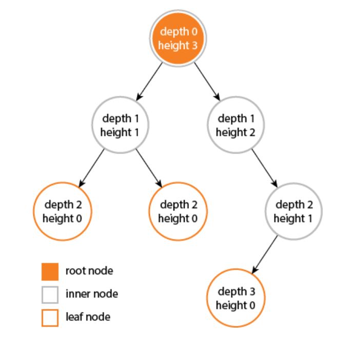
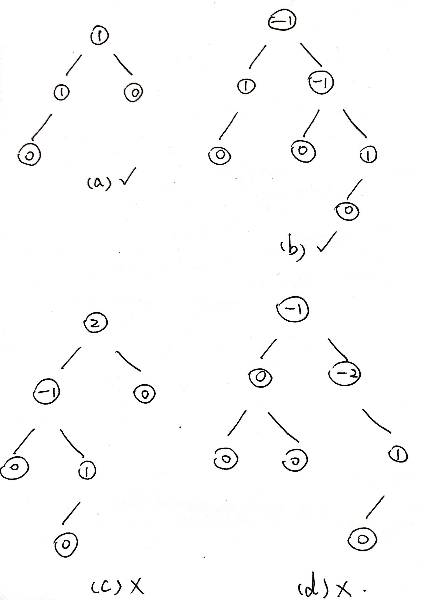
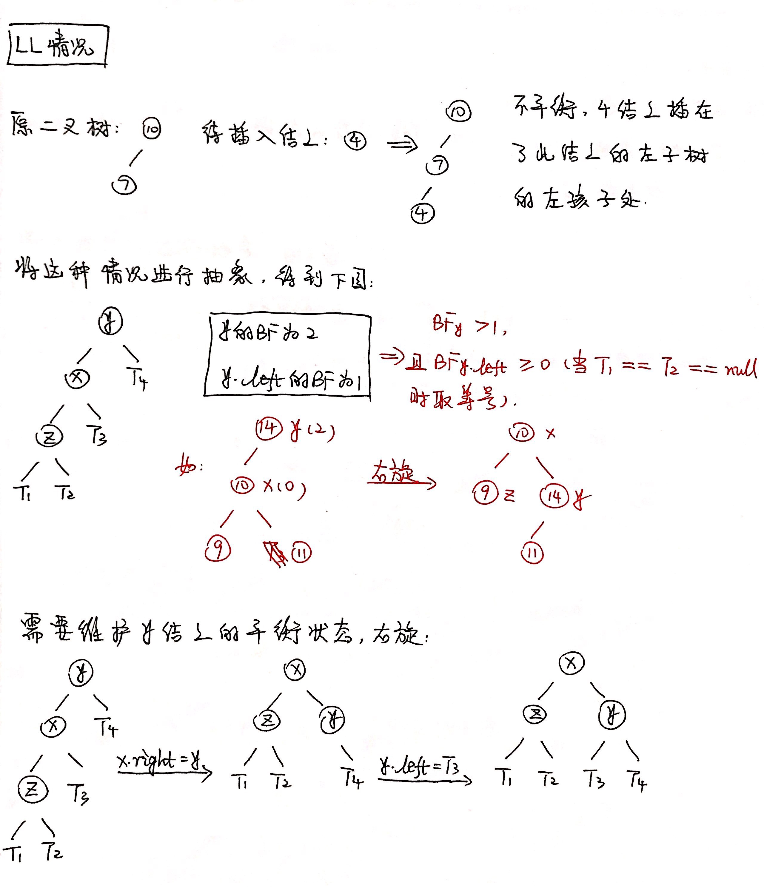
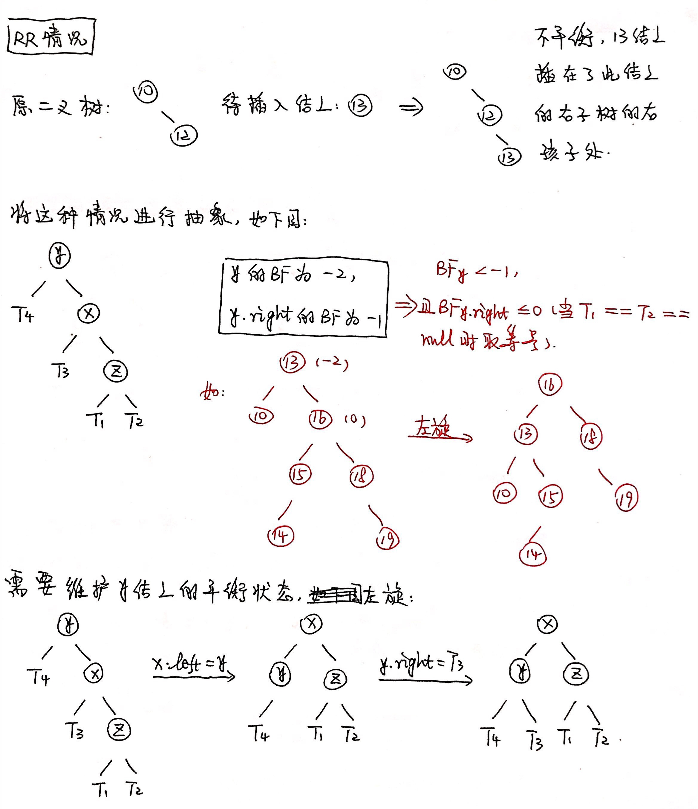
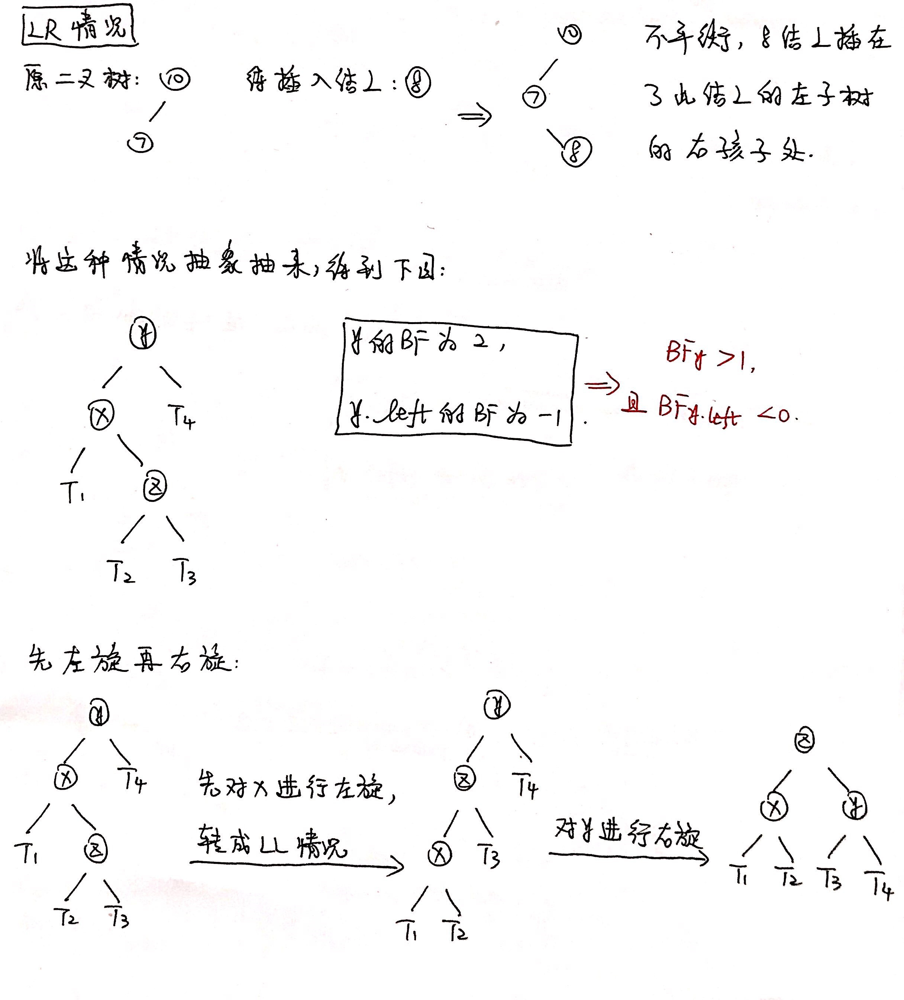
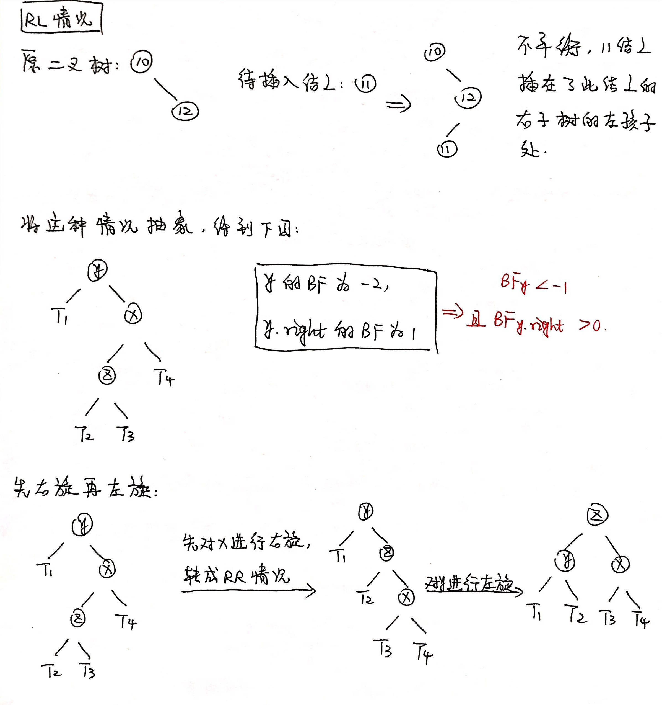

# 平衡二叉搜索树(AVL树)

# 1 平衡因子

某结点的左子树与右子树的高度(深度)差即为该结点的平衡因子(BF, Balance Factor)。平衡二叉搜索树上所有结点的平衡因子只可能是-1, 0或1。如果某一结点的平衡因子绝对值大于1，则说明此树不是平衡二叉搜索树。

树的高度和深度之间的关系(来源：维基百科和StackOverFlow)：

- **深度**：对于任意结点n，n的深度为从根到n的唯一路径长，根的深度为0；
- **高度**：对于任意结点n，n的高度为从n到一片树叶的最长路径长，所有树叶的高度为0。

PS. 为统一，下面都采用高度进行演示。

# 2 概念

在构成**二叉搜索树**的过程中进行"平衡化"处理，可得到平衡二叉搜索树。平衡二叉搜索树(AVL树)，具有以下性质：在树非空时，它的左子树和右子树都是平衡二叉搜索树，且左子树和右子树的高度差的绝对值不超过1。

**平衡二叉搜索树本质上是一棵二叉搜索树，需要满足二叉搜索树的性质：左结点关键字小于父结点关键字，右结点关键字大于父结点关键字。**

下图(a)和(b)为平衡二叉搜索树，(c)和(d)不是平衡二叉搜索树，且结点中的值为该结点的平衡因子。

# 3 调整结点至平衡

往平衡二叉搜索树中添加结点很可能会导致二叉树失去平衡，所以我们需要在每次插入结点后进行平衡的维护操作。插入结点破坏平衡性及其调整有如下四种情况：

## 3.1 LL，需要右旋

LL的意思是，向左子树(L)的左孩子(L)插入新结点后，导致树不平衡。此时需要右旋操作。

## 3.2 RR，需要左旋

RR的意思是，向右子树(R)的右孩子(R)插入新结点后，导致树不平衡。此时需要左旋操作。

## 3.3 LR，需要先左旋，后右旋

LR的意思是，向左子树(L)的右孩子(R)插入新结点后，导致树不平衡。此时需要先左旋，后右旋操作。

## 3.4 RL，需要先右旋，后左旋

RL的意思是，向右子树(R)的左孩子(L)插入新结点后，导致树不平衡。此时需要先右旋，后左旋操作。

# 4 添加结点

在平衡的二叉排序树BBST上插入一个新的元素的递归算法可描述如下：

1. 若待插入元素的关键字和树中结点的关键字相等， 则不进行插入；
2. 和普通二叉排序树一样，如果待插入元素的关键字小于当前递归到的结点的关键字，就往左走，否则往右走；
3. 当递归到空结点时，在此处创建新结点，并更新树的高度；
4. 对于插入结点后的新树，计算平衡因子，并进行LL/RR/LR/RL状况的分析，并进行相应的旋转处理。

# 5 删除结点

在平衡的二叉排序树BBST上删除一个元素的递归算法可描述如下：

1. 和普通二叉排序树一样，如果待插入元素的关键字小于当前递归到的结点的关键字，就往左走，否则往右走；
2. 当待删除元素的关键字和当前递归到的结点的关键字相等时，表示找到了需要删除的结点；
3. 根据待删除结点是否为：只有左结点/只有右结点/左右结点均有，这三种情况的一种，对结点进行删除并维护二叉搜索树的性质(左结点关键字小于父结点关键字，右结点关键字大于父结点关键字)，并更新树的高度；
4. 对于删除结点后的新树，计算平衡因子，并进行LL/RR/LR/RL状况的分析，并进行相应的旋转处理。

# 参考资料

[AVL树图解及其实现](https://blog.csdn.net/qq_25343557/article/details/89110319)