# 1 树

## 1.1 概念

一棵树由根(root)结点r和0个或多个非空的子树(subtree)组成，这些子树中每一棵的根都来自于根r的一条有向的边(edge)所连结。

每一棵子树的根叫做根r的儿子(child)，而r为每一棵子树的根的父亲(parent)。

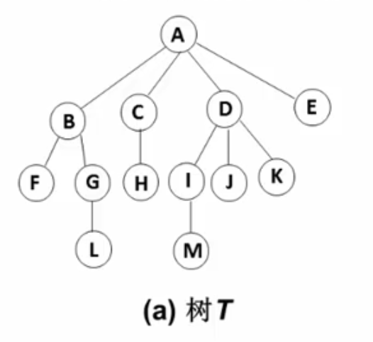


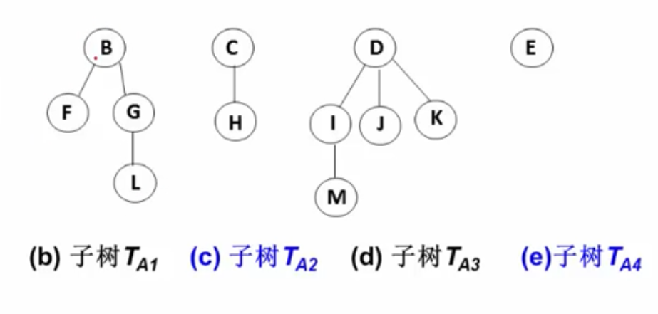

除了根结点外，每个结点有且仅有一个父结点。由树的递归性可知，一个N个结点的树有N-1条边，其中最上方的结点叫做根。

## 1.2 术语


- 根(root)：A；

- 结点的度(degree)：某一个结点的子树个数；

- 树的度：树的所有结点中最大的度的值；

- 叶结点(leaf)：没有儿子的结点称为树叶，即度为0的结点，如上图B、C、H、I、P、Q、K、L、M、N；

- 父结点(parent)：有子树的结点是其子树的根结点的父结点；

- 子结点(child)：若A结点是B结点的父结点，则称B结点是A结点的子结点。子结点也称为孩子结点；

- 兄弟结点(siblings)：具有同一父结点的各个结点之间彼此是兄弟结点，如I、J之间，P、Q之间等等；

- 路径和路径长度：从结点n<sub>1</sub>到n<sub>k</sub>的路径为一个结点序列n<sub>1</sub>, n<sub>2</sub>, ... , n<sub>k</sub>，其中n<sub>i</sub>为n<sub>i+1</sub>的父结点。路径包含的边的个数为路径的长度；

- 祖先结点(ancestor)：沿树根到某一结点路径上的所有结点都是这个结点的祖先结点；

- 子孙结点(descendant)：某一结点的子树中的所有结点是这个结点的子孙；

- 结点的层次(level)：规定根结点在第1层，其他任一结点的层数是其父结点的层数+1；

- 树的深度(depth)和高度(height)：树的根到n<sub>i</sub>的唯一路径的长，故根的深度为0。从n<sub>i</sub>到一片树叶的最长路径的长，故所有树叶的高均为0。一棵树的高等于它的根的高。如上图中，E的深度为1、高为2，F的深度为1、高为1，该树的高度为3。一棵树的深度等于它最深的树叶的深度，该深度等于这棵树的高。

- 深度、高度、层：

  

# 2 二叉树

## 2.1 概念

二叉树(binary tree)为一棵树，其中每个结点的子结点≤2。

二叉树有五种基本形态，从左到右分别为：空树，只有一个结点，只有左子树，只有右子树，有左右子树。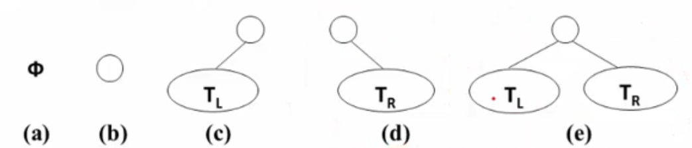

## 2.2 特殊形态

1. 斜二叉树：该二叉树深度为N-1。

   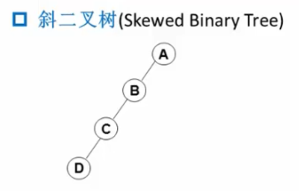

2. 完全二叉树：有n个结点的二叉树，对树中结点按照从上至下、从左到右的顺序进行编号。

   

3. 完美二叉树/满二叉树：如果一个二叉树的层数为k，且结点总数是2<sup>k</sup> -1，则它就是满二叉树。

   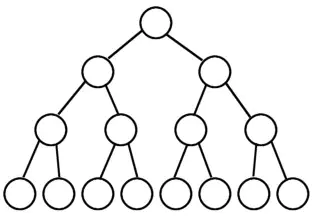

## 2.3 重要性质

1. 一个二叉树第i层的最大结点数为2<sup>i-1</sup>，i≥1；
2. 深度为k的二叉树的最大结点数为2<sup>k</sup> -1，k≥1。

## 2.4 遍历

### 2.4.1 先序遍历

1. 访问根结点；
2. 遍历左结点；
3. 遍历右结点。

递归思想，遍历结束条件为：遍历到空结点时返回。

未触碰结束条件时，按照访问根结点 - 递归遍历左结点 - 递归遍历右结点的顺序进行遍历。

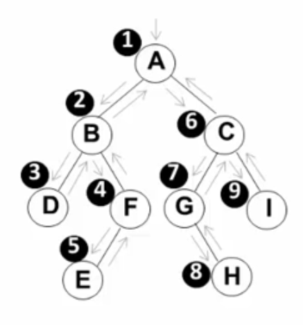

上图中，注意递归顺序为：根 - 左 - 右，所以遍历顺序为：

A -> B  -> D  -> F -> E -> C -> G -> H -> I。

核心程序：

```
if (curr == null) {
    return;
}

System.out.println(curr.key + "=" + curr.value);
preOrderTraversal(curr.left);
preOrderTraversal(curr.right);
```

### 2.4.2 中序遍历

1. 访问左结点；
2. 遍历根结点；
3. 遍历右结点。

递归思想，遍历结束条件为：遍历到空结点时返回。

未触碰结束条件时，按照访问左结点 - 递归遍历根结点 - 递归遍历右结点的顺序进行遍历。

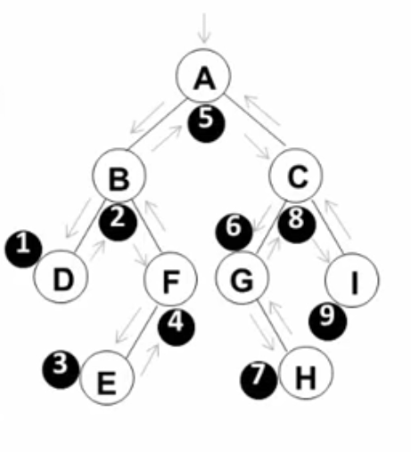

上图中，注意递归顺序为：左 - 根 - 右，所以遍历顺序为：

D -> B  -> E  -> F -> A -> G -> H -> C -> I。

核心程序：

```
if (curr == null) {
    return;
}

inOrderTraversal(curr.left);
System.out.println(curr.key + "=" + curr.value);
inOrderTraversal(curr.right);
```

### 2.4.3 后序遍历

1. 访问左结点；
2. 遍历右结点；
3. 遍历根结点。

递归思想，遍历结束条件为：遍历到空结点时返回。

未触碰结束条件时，按照访问左结点 - 递归遍历右结点 - 递归遍历根结点的顺序进行遍历。

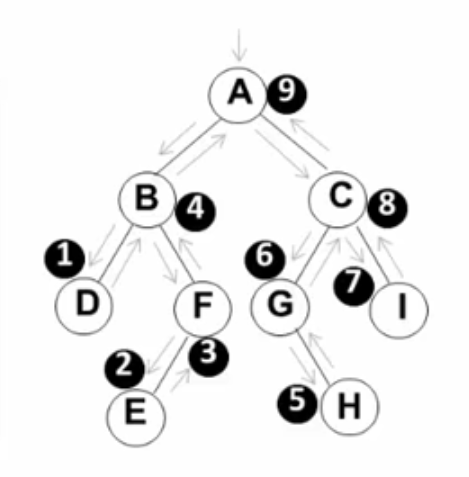

上图中，注意递归顺序为：左 - 右 - 根，所以遍历顺序为：

D -> E -> F  -> B -> H -> G -> I -> C -> A。

核心程序：

```
if (curr == null) {
    return;
}

postOrderTraversal(curr.left);
postOrderTraversal(curr.right);
System.out.println(curr.key + "=" + curr.value);
```

### 2.4.4 层序遍历

按照每一层的结点进行遍历，借助队列完成。具体过程：

1. 当前层的根结点入队；

2. 访问时，该结点出队；

3. 该结点的左儿子入队；

4. 该结点的右儿子入队；

5. 循环往复上述过程，直至队列为空。

   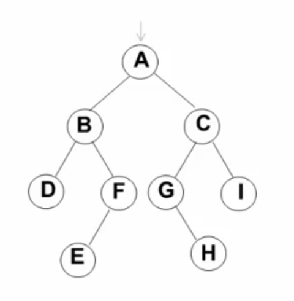

对于上述二叉树，层序遍历具体过程图解为：

1. 初始状态下，队列为空：

   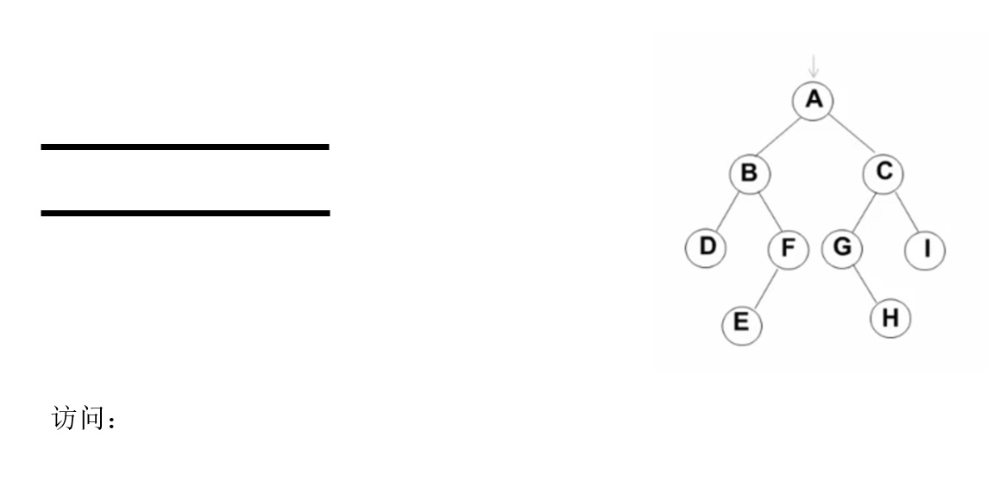

2. A入队：

   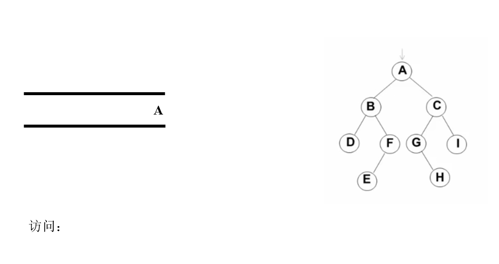

3. A被访问，A出队；B、C为左右儿子，入队：

   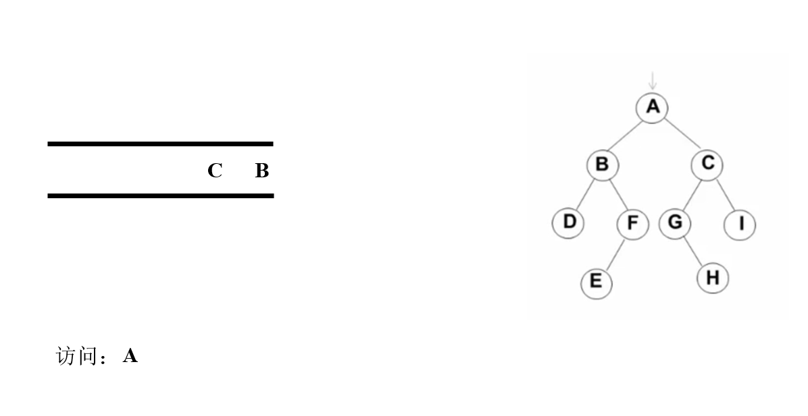

4. B被访问，出队；D、F为左右儿子，入队：

   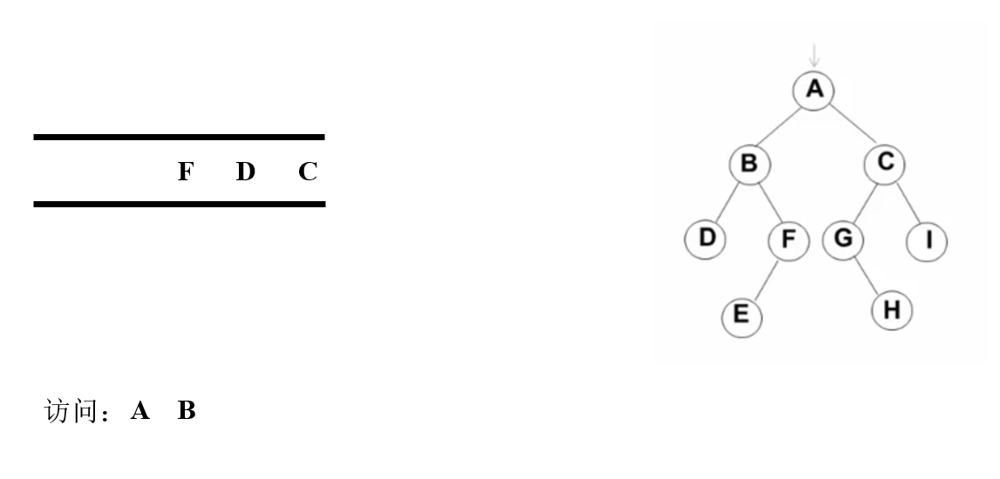

5. C被访问，出队；G、I为左右儿子，入队：

   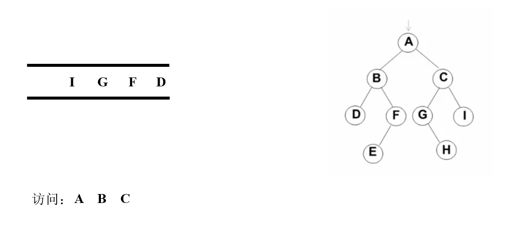

6. D被访问，出队；无儿子入队：

   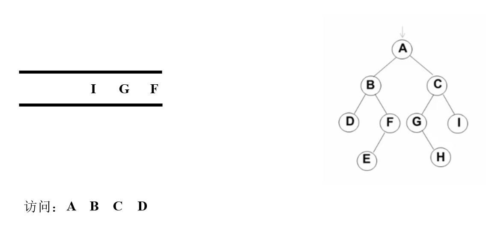

7. F被访问，出队；E为左儿子，入队：

   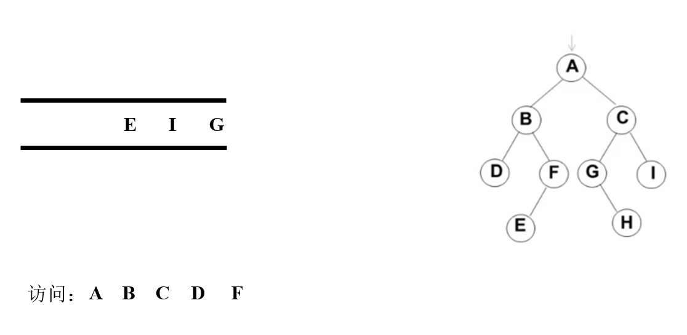

8. G被访问，出队；H为右儿子，入队：

   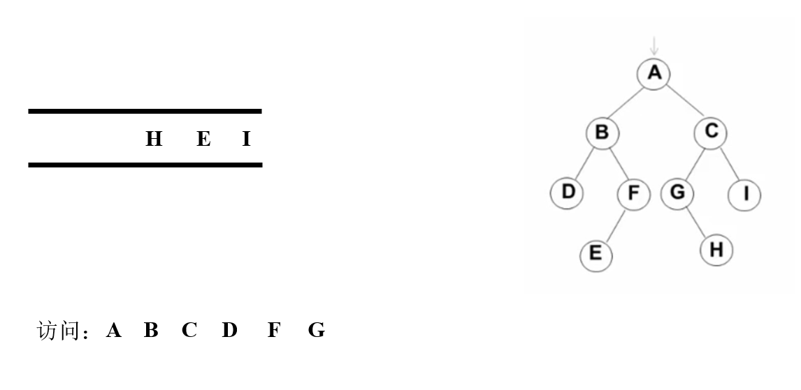

9. I被访问，出队；无儿子入队：

   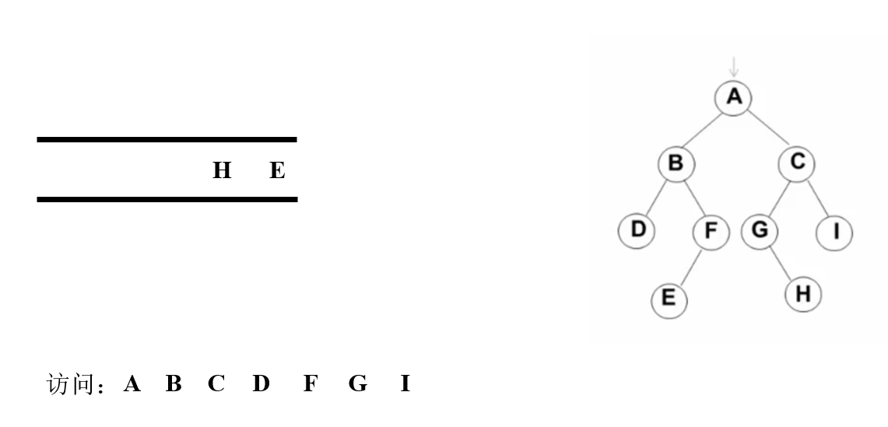

10. E被访问，出队；无儿子入队：

    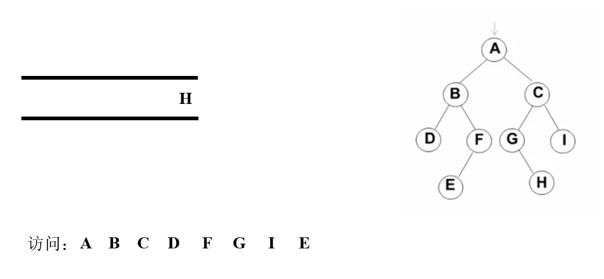

11. H被访问，出队；无儿子入队：

    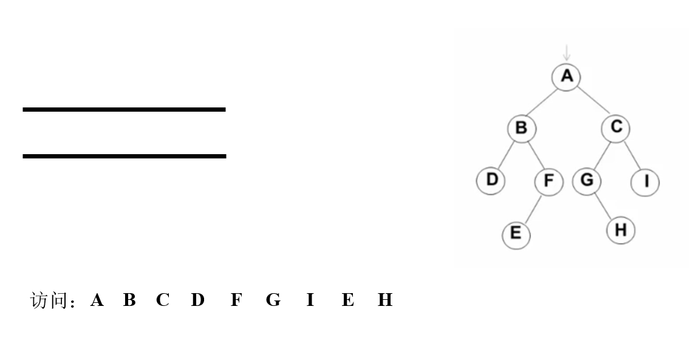

12. 队列空，遍历结束。

### 2.4.5 前中后序遍历的特点

1. 前序遍历：在第一次遍历到结点时就执行操作，一般只是想遍历执行操作(或输出结果)可选用前序遍历；

2. 中序遍历：对于二叉查找树，中序遍历的操作顺序(或输出结果顺序)是符合从小到大顺序的，故要遍历输出排序好的结果需要使用中序遍历。如下图：按照关键字排序输出：

   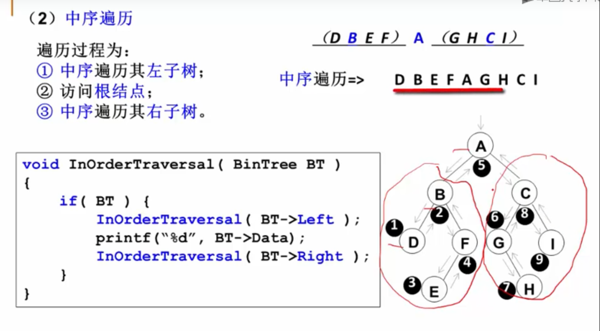

3. 后序遍历：后续遍历的特点是执行操作时，肯定已经遍历过该结点的左右子结点，故删除所有结点，或判断树中是否存在相同子树，或计算一个结点的高度(首先需要知道它的子树的高度)。

## 2.5 找到叶子结点

递归思想，遍历结束条件为：如果遍历到的结点既没有左结点也没有右结点，那么说明它就是叶子结点。

未触碰结束条件时，判断当前结点有无左子结点，有则递归从下一个左子结点开始找；判断当前结点有无右子结点，有则递归从下一个右子结点开始找。

核心程序：

```
    if (curr.left == null && curr.right == null) {
        System.out.println("叶子结点为：" + curr.key);
    }

    if (curr.left != null) {
        findLeaf(curr.left);
    }

    if (curr.right != null) {
        findLeaf(curr.right);
    }
}
```

## 2.6 计算最大深度


一棵树的最大深度，等于其左子树的最大深度和右子树的最大深度中的较大者，再加1。规定根结点的深度为0。

递归思想，遍历结束条件为：对于递归左子树时，如果它的左子结点为空，则已经找到左子树的最深结点；对于递归右子树时，如果它的右子结点为空，则已经找到右子树的最深结点。

未触碰结束条件时，递归寻找下一个左/右子结点的深度，找到最大深度后，比较左右最大深度，再加1。

核心程序：

```
// 结束条件：当递归遍历到的子结点为空时，说明该树是空树，则返回0
if (curr == null) {
    return 0;
}

int maxDepthLeft = maxDepth(curr.left);
int maxDepthRight = maxDepth(curr.right);

// 根据树的深度的定义，需要+1
return maxDepthLeft > maxDepthRight ? maxDepthLeft + 1 : maxDepthRight + 1;
```

**时间复杂度：**
我们每个结点只访问一次，因此时间复杂度为O(n)，其中n是结点的数量。
**空间复杂度：**
在最糟糕的情况下，树是完全不平衡的，例如每个结点只剩下左子结点，递归将会被调用n次(树的高度)，因此保持调用栈的存储将是O(n)。但在最好的情况下(树是完全平衡的)，树的高度将是log(n)。因此，在这种情况下的空间复杂度将是O(log(n))。

# 3 二叉搜索树(二叉查找树)

使二叉树成为二叉搜索树的条件为：

- 对于树中的每个结点X，它的左子树中所有项的值都小于X中的项，它的右子树中所有项的值都大于X中的项；
- X的左右子树都是二叉搜索树；
- 相同元素的值不纳入考虑。

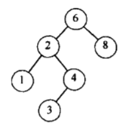

如上图所示，左子结点元素的值都比其父结点小，右子结点元素的值都比其父结点大。

二叉搜索树的操作基本上会用到递归，而二叉搜索树的平均深度为O(log(n))，所以一般不担心栈空间被用尽。

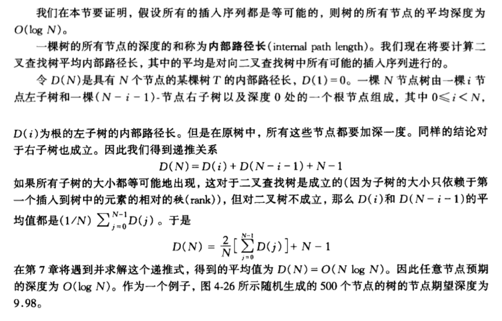

### 3.1 添加元素

**要求：根据传入的元素的关键字，将元素插入二叉搜索树。**

根据二叉搜索树的特性，左子结点的关键字小于父结点的关键字，右子结点的关键字大于父结点的关键字。故，如果新元素的关键字比当前遍历到的元素的关键字小，则往左走；如果新元素的关键字比当前遍历到的元素的关键字大，则往右走。

采取递归思想，结束条件为：当递归遍历到的结点为空时，表示新元素根据大小规则已经找到合适的插入位置，则在该位置创建结点，并使新结点的左右子结点为空，然后返回。

递归过程中，

- 如果新元素的关键字比当前遍历到的结点的元素的关键字小，则递归寻找下一棵左子树，并让当前结点的左子结点成为下一轮递归的父结点；
- 如果新元素的关键字比当前遍历到的结点的元素的关键字大，则递归寻找下一棵右子树，并让当前结点的右子结点成为下一轮递归的父结点；
- 直到找到空结点时，递归结束，返回。

### 3.2 删除元素

**要求：根据传入的元素的关键字，删除对应的结点。**

采取递归思想，结束条件为：当递归遍历到的结点为空时，表示找不到待删除元素的关键字所对应的结点，则返回空。

由于删除结点之后，会破坏原二叉搜索树的平衡，因此需要重新调整其他结点的位置，以保证二叉搜索树"左子 ＜ 父， 右子 > 父"的特性。

待删除结点的左右子树结点的特点：

1. 待删除结点的左子树中的元素都小于待删除结点；
2. 待删除结点的右子树中的元素都大于待删除结点；
3. 所以替换的结点也需要满足上述两条性质，那么替换结点可选为待删除结点的右子树中的最小结点(或左子树中的最大结点)。

故可得删除结点的执行过程：

1. 根据关键字的大小进行判断，如果传入的关键字大于递归遍历到的结点，则往右走，让右子结点成为下一轮递归的父结点，反之往左走；
2. 当传入的关键字等于当前遍历到的结点的关键字时，说明找到待删除结点；
3. 判断当前结点有无右子树：
   1. 如果只有右子树没有左子树，则直接将待删除结点替换为右子结点，即将待删除结点的右子结点返回，其余保持不变即可；

   2. 如果只有左子树没有右子树，则直接将待删除结点替换为左子结点，即将待删除结点的左子结点返回，其余保持不变即可；

   3. 如果既没有左子树也没有右子树，即删除的是叶子结点，其实已经包含在1、2情况当中；

      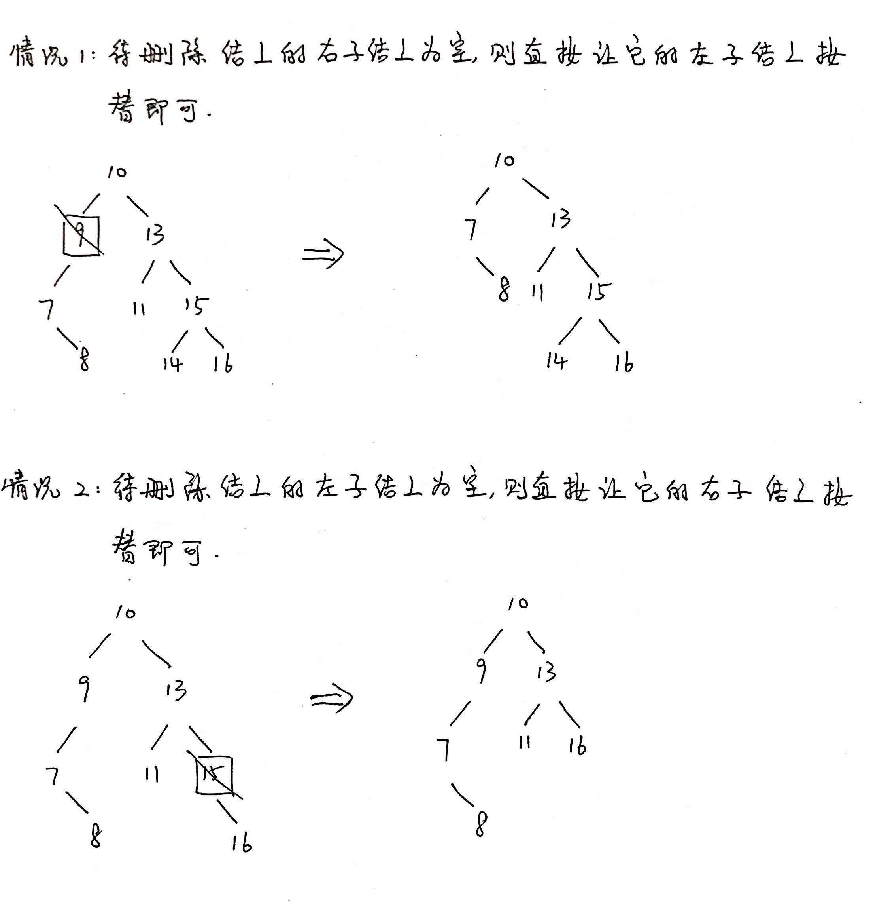

   4. 如果有左右子树，则找到右子树的最小结点进行替换：

      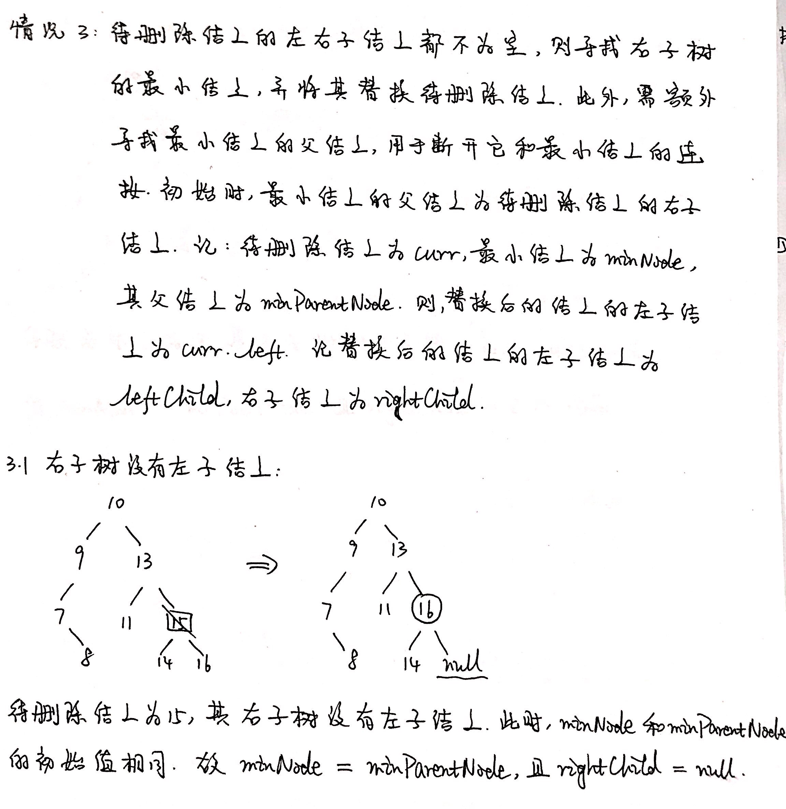

      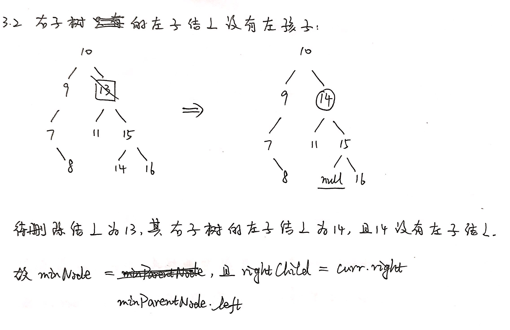

      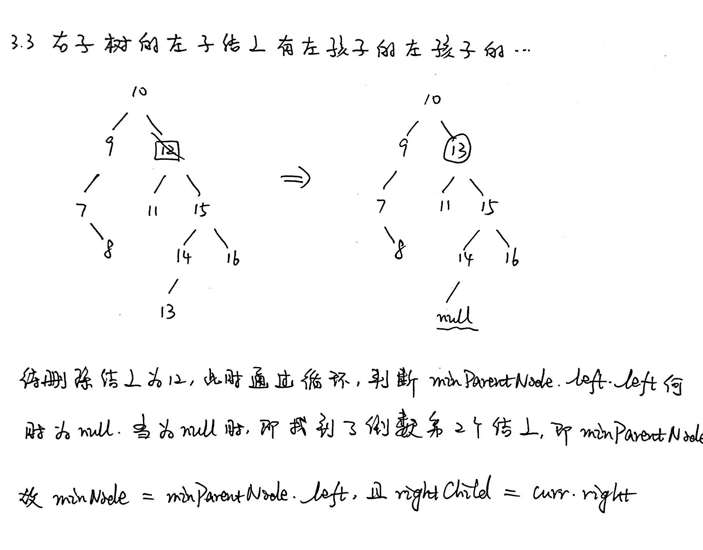

### 3.4 查找树中最小关键字的结点

根据二叉搜索树的特性，左子结点的关键字小于父结点的关键字。故二叉搜索树中最小关键字的结点一定出现在最左边。

采取递归思想，结束条件为：当递归遍历到的结点没有左子结点时，表示已经找到最小的关键字所对应的结点，直接返回该结点即可。如果仍未找到，则传入当前结点的左子结点继续递归即可。

### 3.5 查找树中最大关键字的结点

根据二叉搜索树的特性，右子结点的关键字大于父结点的关键字。故二叉搜索树中最大的键一定出现在最右边。

采取递归思想，结束条件为：当递归遍历到的结点没有右子结点时，表示已经找到最大的关键字所对应的结点，直接返回该结点即可。如果仍未找到，则传入当前结点的右子结点继续递归即可。

# 参考资料

[二叉树前中后序遍历的作用](https://www.zhihu.com/question/22031935/answer/153859490)