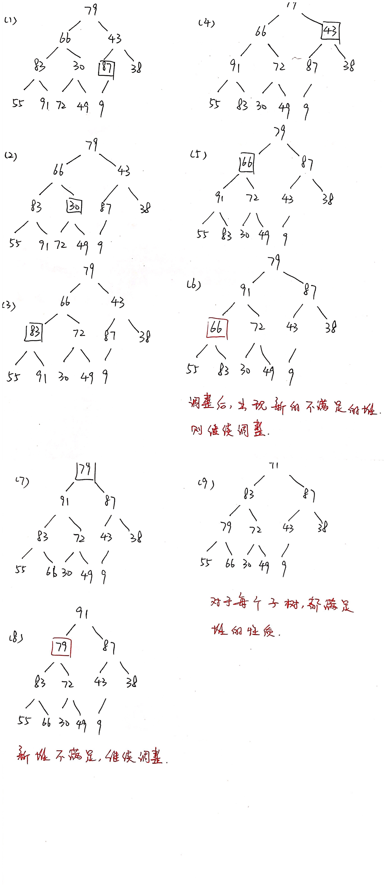
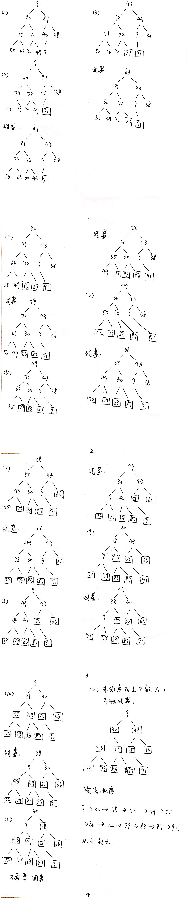

# 1 堆排序

## 1.1 拷贝数组

拿到一个待排序的数组，首先需要将它拷贝到一个堆数组中，堆数组的索引从0开始，而无需像实现堆结构时从1号开始存储结点。这是因为，在实现堆结构时，0号位置会放入一个元素作为哨兵。但在实际排序问题中，不会像实现最大堆类一样需要保留一个位置用做哨兵，所以拷贝到堆数组时索引从0开始即可，那么相应的索引规律等规则需要进行相应调整：对于位置为i的结点，其左子结点的索引为2i + 1，右子结点的索引为2i + 2。

## 1.2 构建最大堆

### 1.2.1 过程

在最大堆中，每个父结点的值都大于其左右子结点的值，所以大顶堆构建完毕后，根结点的值一定最大。此后排序时，将根结点和最后一个结点交换位置，那么末尾结点此时就是最大结点。

对于拷贝到堆数组中的元素，进行最大堆调整，具体过程如下：

1. 从最后一个非叶子结点开始(叶结点自然不用调整)，第一个非叶子结点的索引为arr.length / 2 - 1，从右到左、从下至上对每个堆进行调整。调整时，从当前索引位置处的结点一直到堆的末尾进行调整；
2. 对于不满足最大堆特性的堆，进行调整。检查结果，有可能产生新的不满足堆特性的堆，则需要继续往下进行调整，直到调整完毕后，再进行第1步中从右到左、从下至上的调整过程。

演示过程：

### 1.2.2 时间复杂度

如果仅从代码上直观观察，会得出构造二叉堆的时间复杂度为O(n㏒n)的结果，这个结果是错的，虽然该算法外层套一个n次循环，而内层套一个分治策略下的㏒n复杂度的循环，但是该思考方法犯了一个原则性错误，那就是构建二叉堆是自下而上的构建，每一层的最大纵深总是小于等于树的深度的。因此，该问题是叠加问题，而非递归问题。

那么换个方式，假如我们自上而下建立二叉堆，那么插入每个结点都和树的深度有关，并且都是不断把树折半来实现插入，因此是典型的递归，而非叠加。

假设建立堆的顺序为自下而上：

1. 具有n个元素的平衡二叉树，树高为㏒n，设这个变量为h；
2. 最下层非叶结点的元素，只需做一次线性运算便可以确定大根，而这一层具有2^(h-1)个元素。假定O(1)=1，那么这一层元素所需时间为2^(h-1) × 1；
3. 由于是bottom-top建立堆，因此在调整上层元素的时候，并不需要同下层所有元素做比较，只需要同其中之一个分支(子结点中的较大者)作比较，而作比较次数则是树的高度减去当前结点的高度。因此，第x层元素的计算量为2^(x) × (h-x)；
4. 由以上通项公式可得知，构造树高为h的二叉堆的精确时间复杂度为：
   S = 2^(h-1) × 1 + 2^(h-2) × 2 + …… +1 × (h-1) ①

通过观察第四步得出的公式可知，该求和公式为等差数列和等比数列的乘积，因此用错位想减发求解，给公式左右两侧同时乘以2，可知：

2S = 2^h × 1 + 2^(h-1) × 2+ …… +2 × (h-1) ②

用②减去①可知： S =2^h × 1 - h +1 ③

将h = ㏒n 带入③，得出如下结论：

S = n - ㏒n +1 = O(n)

结论：构造二叉堆的时间复杂度为线性得证。

## 1.3 排序

1. 交换根结点和最后一个结点，即将最大元素放到数组末端；
2. 将参与调整为最大堆的元素个数-1，即，放到数组末端的元素无需参与该过程；
3. 其余元素通过下滤方法，调整为最大堆；
4. 循环上述过程，直到未排序结点个数为2时，单独调整，通过判断大小进行结点元素的交换。

演示过程：

# 参考资料

[建立堆的时间复杂度求解](https://blog.csdn.net/leosha/article/details/46116959)

[哨兵](https://blog.csdn.net/Jinxiaoyu886/article/details/95043826?utm_medium=distribute.pc_relevant.none-task-blog-BlogCommendFromMachineLearnPai2-1.control&depth_1-utm_source=distribute.pc_relevant.none-task-blog-BlogCommendFromMachineLearnPai2-1.control)

