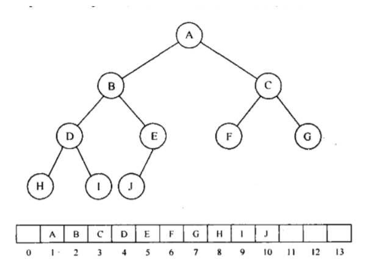
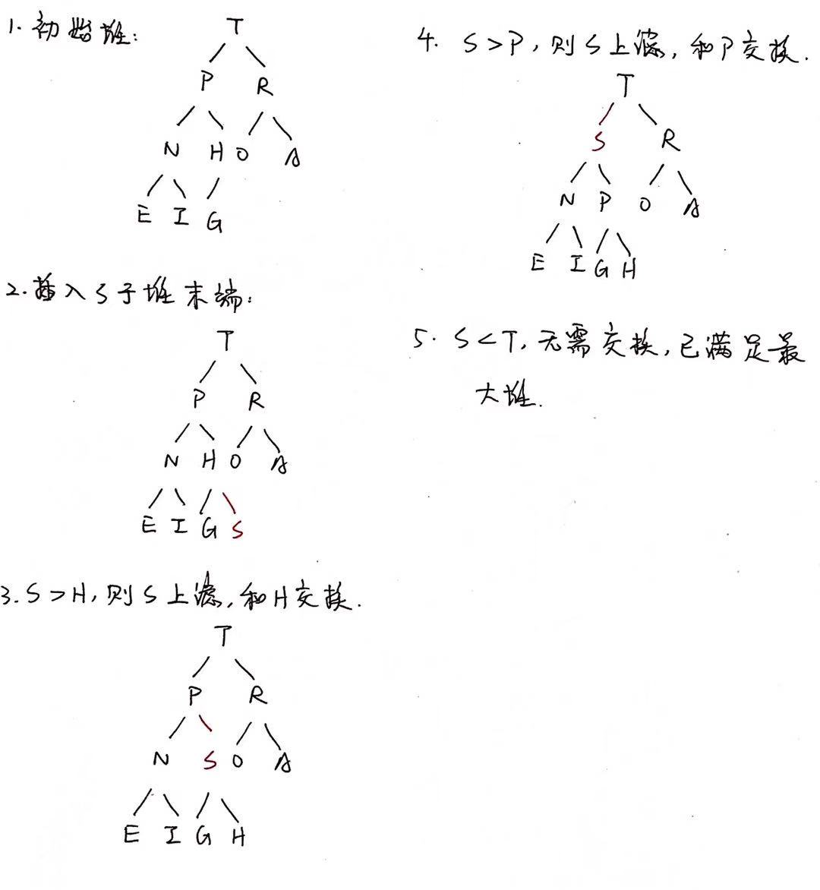
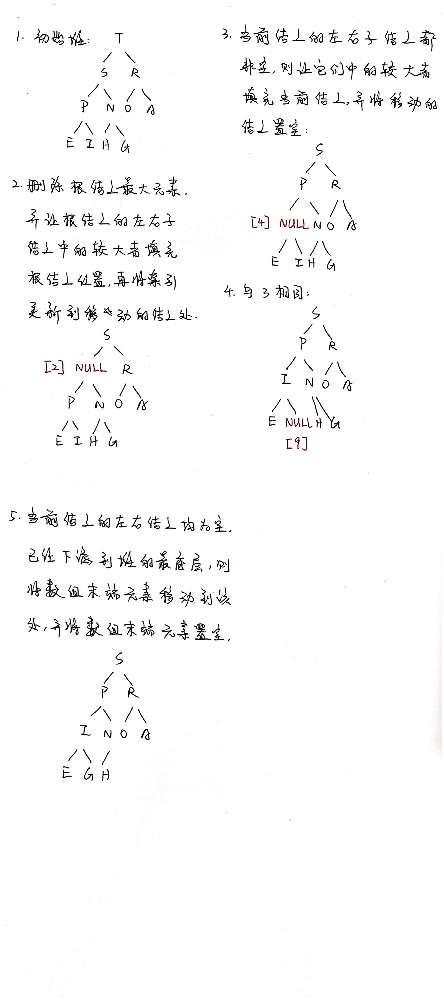

# 1 引入 - 优先队列

优先队列是队列的一种。普通队列：先进先出，后进后出，是一种FIFO模型；优先队列：入队顺序和出队顺序无关，和队列中元素的优先级相关。

借用浙江大学何钦铭教授的一个很形象的例子，大致意思是这样子："一个机器控制一个核反应堆的过程，此时有两个任务：一个进行核心的调度，一个是打印一张纸。显然，涉及到核心调度的任务需要先进行，需要按照优先级管理一种队列。"

# 2 堆(二叉堆)

## 2.1 概念

如果用二叉搜索树来实现优先队列，则每次需要弹出优先级最大的元素时，需要不断删除树最右端的元素。在删除多次后，左边的结点保持不动，而右边的结点可能所剩不多，那么树的高度就不再是log(n)，导致树的平衡性被破坏。

而我们关注的问题是，如果使用二叉树进行存储，希望把最大的元素一直放在树根处，删除后将其他元素进行调整，使新树仍然保持最大的元素处于根结点位置。

二叉堆的使用对于优先队列的实现相当普遍，所以一般把二叉堆叫做堆(heap)。堆是一棵完全二叉树，高为O(log(n))。而因为完全二叉树的规律性，故可以用一个数组表示它，而不需要采取链表的方式进行实现。

完全二叉树和堆的对应：

0号结点为“哨兵”。对于数组中位置为i的结点，其左子结点在位置2i处，右子结点在位置2i + 1处，其父结点在位置i / 2处。 

## 2.2 特性

1. 结构性：用数组表示完全二叉树；
2. 有序性：
   1. 最大堆(大顶堆)，Max Heap：任一结点的值大于其左右子结点的值，根位置处总为数组的最大值；
   2. 最小堆(小顶堆)，Min Heap：任一结点的值小于其左右子结点的值，根位置处总为数组的最小值。

## 2.3 插入元素

PS. 以最大堆为例说明。

1. 将新结点放至数组的末端，即堆的末端；
2. 根据新结点所在的堆，调整所在堆元素的大小顺序，以使插入新结点后的堆仍然保持有序，即父结点大于左右结点。每个结点的父结点的索引为i / 2，将新结点和索引为i / 2的结点不断进行比较。若新结点大于父结点，则将父结点和新结点进行位置交换，反之，已满足最大堆特性；
3. 在该过程中，新插入的结点从堆的末端不断往上冒，直至新结点所在堆满足最大堆特性为止，该过程称为**“上滤”(Percolate Up)**。上滤时，终点为数组的1号结点，因为0号结点是哨兵，不参与计算。

演示过程：

## 2.4 删除最大元

PS. 以最大堆为例说明，根据《数据结构与算法分析——Java语言描述》第160页进行实现。

由于最大堆的设计目的为，每次弹出的元素均为最大值，即优先级最高的元素，因此每次删除的最大元都为堆顶部的元素。

1. 弹出顶端最大元素，并在原根结点的左右子结点中找到较大者，填充原来的顶端位置，并将进行移动的结点置空，再将判断当前结点的索引进行更新为所移动的结点处；
2. 继续往下进行判断：
   1. 若当前结点的左右子结点都非空，则找到它们中的较大者，填充该处空结点，并将进行移动的结点置空；
   2. 若当前结点的左右子结点中有一个为空，则找到它们中非空的结点，填充该处空结点，并将进行移动的结点置空；
   3. 上述过程称为**“下滤”(Percolate Down)**；
3. 重复上述第2步的过程，直到当前结点的左右子结点均为空时，说明已经下滤到堆的最底层，此时将数组末端结点对该空结点进行填充，并将数组末端结点置空。

演示过程：

e.g. 1

e.g. 2

