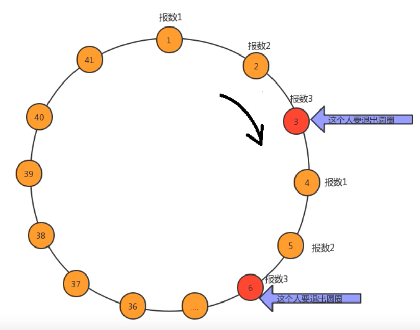

# 链表

## 1 基本概念

链表是一种物理存储单元上非连续、非顺序的存储结构，数据元素的逻辑顺序是通过链表中的指针链接次序实现的。
链表中每一个元素称为结点(node)，链表由一系列结点组成，这些结点不必在内存中相连，且结点可以在运行时动态生成。每一个结点均含有表元素和包含该元素后继元的结点的链(link)，称为next链。每个结点包括两个部分：一个是存储数据元素的数据域(data)，另一个是存储下一个结点地址的指针域(next)。next的值实际上就是下一个结点的地址，当前结点为末结点时，next的值设为空指针null。
由于不必须按顺序存储，链表在插入的时候可以达到O(1)的复杂度，比线性表、顺序表快得多，但是查找一个结点或者访问特定编号的结点则需要O(n)的时间，而线性表和顺序表相应的时间复杂度分别是O(logn)和O(1)。

## 2 头结点、第一个结点、尾结点

- 头结点：在链表的存放元素的第一个结点之前附加的一个结点。头结点的数据域一般无意义，不存放有效数据，有些情况下也可以存放链表的长度等信息；指针域用于指向存放数据的第一个结点。若头结点的指针域为空(null)，表明链表是空表；
- 第一个结点：也称首元结点，链表中存储第一个元素的结点，是头结点后面的第一个结点；
- 尾结点：指链表中最后一个结点，即存储最后一个元素的结点。

头结点的优点：减少了单链表添加删除时特殊情况的判断，减少了程序的复杂性，主要是添加和删除在第一个有元素的结点(首元结点)上有区别。如果链表没有头结点，则添加或删除时都得需要判断一次首元结点，有了头结点以后，首元结点实际为链表的第二个结点，使得所有的元素结点的添加删除更具有统一性。

## 3 分类

链表主要分为单链表和双链表：

- 单链表只有指向下一个结点的指针，即next；
- 双链表既有指向下一个结点的指针，即next，也有指向上一个结点的指针，即prev。


注意：

1. 链表在初始化时，会将头结点(head)的数据域和指针域设置为null，即不放入数据。但此时头结点已经成为一个结点(node)，并不是说数据域和指针域存放的是null，就变成头结点本身是null。头结点在初始化后，本身就是一个实际的node！所以即使head中放入的数据和指针都是null的话，它同样可以拥有next、prev等属性；
2. 单链表和双链表的最后一个结点的next域都指向的是null，即最后一个结点后面已经没有node，已经到达了该链表的终点；
3. 双链表的头结点head的prev域指向null。

## 4 单链表和双链表的优缺点

1. 在时间复杂度方面：双向链表的插入与删除操作比单链表的时间要快很多。
   1. 在最末尾插入结点时，单链表需要找到待插入位置的前一个结点，故需要遍历整个链表，时间复杂度为O(n)。而双向链表只需要找到tail，就可以得到最后一个结点的位置，然后就可以进行插入操作，时间复杂度为O(1)；
   2. 在删除操作方面，单链表需要遍历到需要删除的结点的前一个结点，双向链表需要遍历到需要删除的结点，时间复杂度同为O(n)；
   3. 在查找元素时，我们可以借用二分法的思路，从head(头结点)向后查找操作和tail(尾结点)向前查找操作同步进行，这样双链表的效率可以提高一倍。
2. 在空间利用率方面：每个双链表的结点要比单链表的结点多一个指针，而链表长度为n的话，就需要多n * length(这个指针的length在32位系统中是4字节，在64位系统中是8个字节)的空间，占用空间大于单链表所占用的空间。这时设计者就会采用以时间换空间的做法，这是一种工程总体上的衡量；
3. 在实现复杂度方面：双向链表由于多了一个前向指针，所以需要维护的状态比单链表多一个，所以实现起来稍微复杂一点；
4. 在扩展能力和维护性方面：基于单链表的实现很容易扩展到双向链表，而一旦代码中引入了对双向链表特定功能的使用，那么在迁移回单链表的时候就需要重写该功能的逻辑。

## 5 单链表相关操作

### 5.1 插入

#### 5.1.1 在末端插入结点

1. 创建待插入结点，数据域为给定值，并作为链表中的最后一个结点，next域指向null；
2. 原链表中的最后一个结点的next域指向新插入的结点。

#### 5.1.2 在指定位置i处插入结点

1. 判断传入位置索引是否越界，要注意索引可以恰好等于链表长度，此时代表插入元素位于链表末端，且next指向null；
3. 找到原来i - 1处和i处的结点；
4. 创建待插入结点，数据域为给定值，next域指向原来第i处的结点；
5. 将原来i - 1处的结点的next指向新结点。

### 5.2 删除

#### 5.2.1 删除末端结点

1. 如果原来的链表为空表，则无法删除，返回空；
2. 如果原来的链表非空表，因为单链表只有一个指针域，即只有next没有prev，因此要先找到原来链表中的倒数第二个结点才能实现删除；
3. 找到倒数第二个结点后，将倒数第二个结点指向null。

#### 5.2.2 删除指定位置i处的结点

1. 判断传入位置索引是否越界；
3. 找到原来i - 1处和i处的结点，将i - 1处的结点的next指向i + 1处的结点。

### 5.3 修改

1. 判断传入位置索引是否越界；
2. 遍历找到对应位置的结点，并将该结点的数据域set为新值。

### 5.4 查看结点

#### 5.4.1 头结点

直接返回head即可。

#### 5.4.2 中间结点

1. 快慢指针法：定义两个指针，分别指向链表头部，然后同时向后遍历，均指向链表头部，然后同时向后遍历，快指针一次步进两个结点，慢指针一次步进一个结点；

2. 在同样的时间下，快指针走的路程为慢指针的两倍，那么当快指针走到链表的最后一个结点时，慢指针刚好处于中间结点位置处，返回慢指针处结点即可。

#### 5.4.3 尾结点

遍历直到结点的next域为null时，该结点即为尾结点。

#### 5.4.4 指定位置i处的结点

1. 判断传入位置索引是否越界；
2. 遍历找到该结点并返回。

#### 5.4.5 倒数第k个结点

1. 判断k是否越界，不得小于等于0(不符合实际意义)；

2. 先后指针：使用两个指针，一个快指针，一个慢指针，开始两个指针指向头结点head；

3. 之后快指针先移动k个结点，此时两个指针之间的距离为k；
4. 此后两个指针同时向前以相同间隔步进，当快指针指向的结点为null的时候，慢指针所指的结点即为倒数第k个结点。
#### 5.4.6 反向输出链表

1. 通过递归调用函数的方法进行打印；
2. 如果链表结构为head -> null，则不打印，直接结束程序；如果链表结构为head -> 1 -> null，则打印1；
3. 所以传入参数为第一个结点，而非头结点；
4. 结束条件：当链表只有一个结点时，也会打印，而没有结点时则不打印。所以判断条件就判断是否为空表即可，不关心是否只有一个结点。

### 5.5 反转链表

#### 5.5.1 描述

- 输入: 1->2->3->4->5->NULL
- 输出: 5->4->3->2->1->NULL


#### 5.5.2 原地反转

一次对一个结点进行反转，直至最后一个结点。

##### 5.5.2.1 演示

记：

- node：传入的参数，从哪个地方开始反转；
- PS. 为使推导更具有一般性，故传入参数不为head，而以第一个结点为node举例。


##### 5.5.2.2 过程推导

记：

- curr：需要反转的结点；
- pre：curr的前一个结点；
- curr.next：curr的后一个结点。


1. 初始状态为1 -> 2 -> 3 -> 4 -> 5 -> null；

2. 当进行第一次反转时，目标是1 -> 3 -> 2 -> 4 -> 5 -> null，即需要反转的结点对应元素为3，设其为curr；

3. 对反转目标上的元素进行标记，即确定反转结果中，原来的元素在新链表上的位置，也就是确定新链表上旧元素的“身份”——标上curr、pre、curr.next；

4. 通过反转目标可知，在新链表中，“前一个结点”pre要指向“后一个结点”curr.next，“当前要反转的结点”curr要指向node.next(因为每一次反转都需要插入到node的后方一个位置)，node的next要指向curr；

5. 所以可得到上述三个过程的关键程序为：

   ```
   pre.next = curr.next; 
   curr.next = node.next; 
   node.next = curr;
   ```
   
6. 该次反转完成后，需要将之前的下一个结点curr.next作为新的反转对象，则程序为：

   ```
   curr = pre.next;
   ```

####  5.5.3 递归反转[难理解]

通过递归调用函数的方式，每次传入下一个结点，逐级完成两个结点之间的反转。递归每次都是处理两个node，第一次处理原来的倒数第一个和原来的倒数第二个node，返回新的倒数第一个node；这两个处理好了的node看做一个新的node然后和倒数第三个node完成反转，此时返回值依旧是倒数第一个node。每次处理好了的链表看做一个新的node，与前一个node完成反转。

PS. 为使推导更具有一般性，故以第一个结点之后的结点进行反转举例。

每次进行两个结点之间的反转，具体过程为：


1. 递归调用完毕后，首先处理倒数第一个和倒数第二个node。对于需要反转的结点，让它的下一个结点的next指向它，再在完成反转后，将它的next指向null，关键程序为：

   ```
   node.next.next = node;
   node.next = null;
   ```

2. 完成该次操作后，把当前的node进行反转，以此类推；

3. 由于最后返回的是新链表的第一个结点，所以要让原链表的第一个结点指向它，程序为：

   ```
   list.getHead().getNext().setNext(list.reverseRecursion(list.getHead().getNext().getNext()));
   ```

### 5.6 是否有环

在链表中，最后一个结点并不指向null，而指向自身链表的其他结点，这种现象称为链表存在环。


#### 5.6.1 快慢指针

1. 快慢指针法：定义两个指针，分别指向链表头部，然后同时向后遍历，快指针一次步进两个结点，慢指针一次步进一个结点；
2. 快指针的速度比慢指针快，相似于追及问题。如果快指针遍历到了链表的最后一个结点，则链表一定不存在环；而如果快指针和慢指针在某处相遇，类似于环形跑道中跑得快的选手追上了跑得慢的选手，则说明链表中存在环。

#### 5.6.2 寻找有环链表的环入口

求环的入口点：

记：

- 慢时间走过的路程为s；
- 环的长度为L；
- 快慢指针相遇时，在某一时刻快指针比慢指针多走过了n(n >= 1)圈；
- 链表起点到环入口的距离为x；
- 快慢指针相遇点到环入口的距离为y；
- 环入口到快慢指针相遇点的距离为z。


则有：


即，定义一个新指针从链表的头结点出发，此时慢指针也从快慢指针相遇点出发，两指针都以步长为1遍历链表，那么在快慢指针相遇点处出发的指针在多走了n-1圈之后与从链表头结点处出发的指针在环入口处相遇。此时，两个指针指向同一个结点，这个结点就是环的入口点。

### 5.7 是否相交

如果两个单链表有共同的结点，那么从第一个共同结点开始，后面的结点都会重叠，直到链表结束。因为两个链表中如果出现一个共同结点，则这个结点里的指针域指向的下一个结点地址一样，所以下一个结点也会相交，依次类推。

注意：结点相同是指两结点的数据域、地址域完全相同，因为重合部分的地址相同，代表完全是同一个结点。

#### 5.7.1 基本状态

1. 当一个链表有环，一个链表无环：

   两链表相交之后，链表肯定有部分共用，若其中一个链表有环，则两相交链表都会带环，而且环的长度一样，相交点也是环的入口处。由于相交链表部分结点完全相同，如果其中一个链表有环、另一个链表无环的话，无环的链表必不可能与有环链表相交。所以两链表必须同时无环或同时有环！

2. 当两个链表都无环：

   

3. 当两个链表都有环：

   1. 相交于环外：

      

   2. 相交于环内：

      

      通过上图发现，按顺时针看环的走向，如果把环看成链表1的，则链表2在B点处插入；反过来如果把环看出链表2的，则链表1在A点处插入。所以所看到的A处和B处，只是视觉上的，如果环是两个链表的，则两环相交于任意一个环的入口上。

#### 5.7.2 两无环链表

##### 5.7.2.1 长度相减法求交点

1. 若两无环链表相交，则两个链表最后的一个结点必定相同；
2. 遍历两个链表至最后一个结点，同时记录链表的长度。如果最后一个结点相同，则无环链表相交；
3. 如果两无环链表相交，则分别取两链表的长度。设较长的链表长度为len1，短的链表长度为len2。先让较长的链表向后移动(len1 - len2)个长度。然后从当前位置同时遍历两个链表，当遍历到两链表出现相同结点时，该结点为就是两无环链表相交的交点。

##### 5.7.2.2 首尾相连法求交点

1. 先遍历第一个链表到它的尾部，然后将尾部的next指针指向第二个链表的头结点(尾部指针的next本来指向的是null)。这样，两个链表就合成了一个新链表；
2. 若该新链表有环，则原两个链表一定相交；否则，不相交。因为如果两无环链表相交，第二个链表中的部分元素会和第一个链表完全相同，则在新链表中会形成环；
3. 新链表的环入口即为两链表的相交点。


#### 5.7.3 两有环链表

##### 5.7.3.1  比较两环入口 - 判断交于环内/环外- 判断是否相交 - 求交点

1. 无论两有环链表相交于环外还是环内，均需要首先分别找到各自的环入口点；
2. 在得到环入口点之后，判断两链表的环入口点是否相同；
3. 如果入口点相同，则两有环链表相交于环外，环入口点即为交点；
4. 如果两链表的环入口不相同，说明相交点在环内，也可能不相交。
   1. 从某个链表的环入口结点开始循环一周，当循环过程中遇到相同结点即为循环满一周，此时可停下；
   2. 判断在循环一周的过程中是否有结点等于另一个链表的环入口结点，如果有，则两有环链表相交；如果没有，则两有环链表不相交；
   3. 如果两有环链表相交，则返回任意一个链表的环入口即可，因为本质上它们的环入口点都是相同的。

附图：两有环链表相交于环内


#### 5.7.4 约瑟夫问题

##### 5.7.4.1 描述

n个人(编号1 ~ n)围成一圈，从编号为k的人开始报数，报到m的退出，剩下的人继续从1开始报数。求每次退出的人的编号，及幸存者的编号。 

##### 5.7.4.2 遍历法



1. 创建循环链表，定义curr指针和prev指针，prev指针在curr指针之前一个结点；
2. 先让两指针走k步，即实现从编号为k的人开始报数；
3. 计数器开始计数，当计到约定的报数数字时，将prev的next指向curr.next，即删除curr结点；
4. 将计数器归1，并更新当前结点。

##### 5.7.4.3 递归法[待学]

## 6 双链表相关操作

### 6.1 插入

#### 6.1.1 在末端插入结点

1. 创建待插入结点，数据域为给定值，并作为链表中的尾结点，next域指向null；
2. 如果原来的链表为空表，需要单独处理，因为需要让头结点的next指向它，并让新结点成为尾结点；
3. 如果原来的链表非空表，则找到原来链表中的尾结点，让原来的尾结点的next指向它，并让新结点成为尾结点。

#### 6.1.2 在指定位置i处插入结点

1. 判断传入位置索引是否越界，要注意索引可以恰好等于链表长度，此时代表插入元素位于链表末端，且next指向null；
2. 找到原来链表中i - 1处和i处的结点，创建新结点，prev指向原来i - 1处的结点，next指向原来i处的结点；
3. 原来i - 1处的结点的next指向新结点；
4. 如果插入的位置恰好为链表末端，说明i处的结点为null，null没有指针，不需要处理prev。但需要将新结点设置为尾结点；
5. 如果插入的位置不是链表末端，则将原来i处的结点的prev指向新结点。

### 6.2 删除

#### 6.2.1 删除末端结点

1. 如果原来的链表为空表，则无法删除，返回空；
2. 让原来的链表中的尾结点的前一个结点的next指向null；
3. 让原来的链表中的尾结点的前一个结点作为新的尾结点。

#### 6.2.2 删除指定位置i处的结点

1. 判断传入位置索引是否越界；
2. 找到需要删除位置的结点，将前一个结点的next指向后一个结点；
3. 如果删除位置i处的结点的后一个结点不为null，即待删除的结点不为尾结点，则将后一个结点的prev指向前一个结点；
4. 如果删除位置i处的结点的后一个结点为null，即待删除的结点为尾结点，则不需处理后一个结点的prev，但需要将前一个结点作为新链表中的尾结点。

### 6.3 修改

1. 判断传入位置索引是否越界；
2. 遍历找到对应位置的结点，并将该结点的数据域set为新值。

### 6.4 查看结点

#### 6.4.1 头结点

直接返回head即可。

#### 6.4.2 尾结点

直接返回tail即可。

#### 6.4.3 指定位置i处的结点

1. 判断传入位置索引是否越界；
2. 遍历找到该结点并返回。

## 7 编程小技巧

当需要将某结点的next指向另一个元素时，直接node.next = xxx即可。例如将head的next指向node，则程序为：

```
head.next = node;
```

同理，当需要将某结点的prev指向另一个元素时，直接node.prev = xxx即可。例如将node的prev指向head，则程序为：

```
node.prev = head;
```

# 参考资料

[Java实现单链表常见操作](https://www.cnblogs.com/xkzhangsanx/p/11000958.html)

[原地反转和新建链表反转单链表](https://www.cnblogs.com/byrhuangqiang/p/4311336.html)

[递归理解 - 1](https://www.zhihu.com/question/31412436/answer/683820765)

[递归理解 - 2](https://www.zhihu.com/question/31412436/answer/875577623)

[递归反转链表 - 1](https://blog.csdn.net/kuihan8061/article/details/107940617)

[递归反转链表 - 2](https://zhuanlan.zhihu.com/p/147171393) 

[新指针出发求环入口原理](https://www.cnblogs.com/likeio/p/3593686.html)

[链表交点在环内或环外理解](https://www.cnblogs.com/guohai-stronger/p/9266004.html)

[关注无环单链表是否相交及求交点问题](https://blog.csdn.net/fengxinlinux/article/details/78885764)

[关注有环单链表是否相交及求交点问题 - 1](https://www.cnblogs.com/mukekeheart/p/5664321.html)

[关注有环单链表是否相交及求交点问题 - 2](https://blog.csdn.net/dhaibo1986/article/details/107203976/)

[约瑟夫问题 - 递归1](https://blog.csdn.net/wuzhekai1985/article/details/6628491?utm_medium=distribute.pc_relevant.none-task-blog-BlogCommendFromMachineLearnPai2-2.compare&depth_1-utm_source=distribute.pc_relevant.none-task-blog-BlogCommendFromMachineLearnPai2-2.compare)

[约瑟夫问题 - 递归2](https://blog.csdn.net/a_forever_dream/article/details/100769164)


