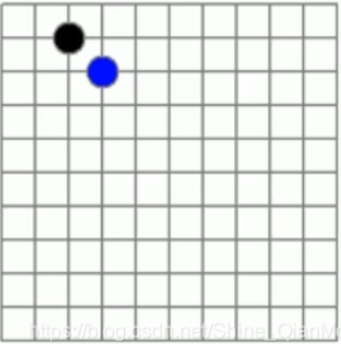
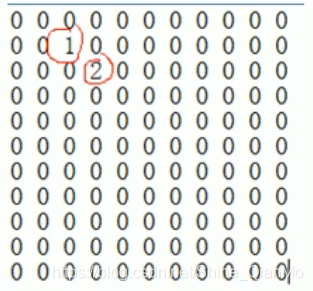

# 稀疏数组

## 1 引入：五子棋



如图为一个五子棋盘，有黑色、蓝色两种颜色的棋子。

假如用1表示黑子，2表示蓝子，其余处用0表示，则该棋盘可以用以下二维数组表示：



如果说非0数据为有效数据，0为无效数据，那么上述数组中，无效数据量远大于有效数据量。如果存取这种数组的话，会占据大量的存储空间，真正有用的数据却少之又少。因此，可以尝试将数组进行压缩，采用“稀疏数组”的方式。压缩存储可以节省存储空间以避免资源的不必要的浪费，在数据序列化到磁盘时，压缩存储可以提高IO效率。

## 2 原始数组 - > 稀疏数组

用一个[行数, 3]的数组存放上述数组信息，规则如下：

1. 首行依次存放原始数组的行数、列数和有效数据（非0数据）的个数；
2. 剩下每行依次存放每个有效数据在原始数组中的行位置、列位置和它本身的值。

形如：

```
    rows cols n
    r1   c1   val1
    r2   c2   val2
    .    .     .
    .    .     .
    rn   cn   valn

```

所以将上述原始数组转化为稀疏数组：

| 11   | 11   | 2    |
| ---- | ---- | ---- |
| 1    | 2    | 1    |
| 2    | 3    | 2    |

一下子数组就减轻了非常多。

## 3 稀疏数组 -> 原始数组

步骤：

1. 首先根据[0] [0] 和 [0] [1]两个数字，确定原始数组的行数、列数；
2. 从第二行开始，遍历稀疏数组，根据每一行的[i] [0] 和 [i] [1]，确定原始数组中非0数据的位置，并根据[i] [2]进行赋值；
3. 其余地方默认填充0。

## 4 稀疏数组存储到磁盘

通过指定路径创建将数组写入的文件，再通过IO流的方式，用FileWriter将数组遍历、换行写入，后将该流关闭。

## 5 从磁盘中读取稀疏数组

1. 首先通过FileReader和BufferedReader读取数组文件，遍历文件中的行数后，获得稀疏数组的总行数，后将该流关闭；
2. 再次通过FileReader和BufferedReader读取数组文件，创建一个[稀疏数组总行数, 3]的新数组。PS.重新读取文件是因为发现如果在同一个流下，分别进行遍历获得总行数和重新取数组对应值的操作，在第二次遍历的时候readLine()指示会发生冲突（读行的“指针”一直是null，导致数组越界），甚至抛出"Stream Closed"的异常。【这个问题目前还没找到原因...】；
3. 遍历数组文件，将数组文件中数组的值分别对应写入新数组，后将该流关闭。