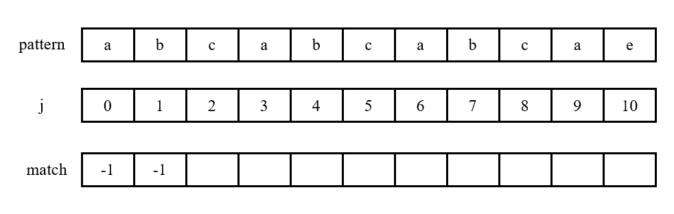

# 串

## 1 概念

串(string)，或字符串，是由零个或多个字符组成的有限序列，一般记为s = 'a1a2…an'。ai可以是字母、数字或其他字符；串必须用引号括起来，但引号本身不属于串，它的作用只是为了避免与变量名或数的常量混淆。

串中字符的数目n称为串的**长度**；零个字符的串称为**空串**，它的长度为0；字符在序列中的序号为该字符在串中的**位置**。由一个或多个**空格**组成的串称为**空格串**，注意，空格串不是空串。

串的逻辑结构和线性表极为相似，区别仅仅在于串的数据对象约束为**字符集**。

串可用顺序存储结构进行存储。类似于线性表的顺序存储结构，用一组**地址连续的存储单元**存储串的字符序列。

## 2 模式匹配

### 2.1 概念

串中任意个**连续**的字符组成的子序列称为该串的**子串**，包含子串的串称为**主串**。寻找子串在主串中的起始位置操作称为**模式匹配**，称待寻找的子串为**模式串**。

记主串字符个数为n，模式串字符个数为m。

### 2.2 暴力破解法

一种简单的方法为暴力破解法(Brute Force)，即从主串的第一个字符开始，和模式串的字符一一匹配。如果两字符相同，则主串和模式串的指针都步进；如果出现不同字符，就**回溯**主串的指针至下一个字符，**回溯**模式串的指针至模式串开头，再和模式串字符一一匹配。

这种方法需要扫描主串的n个字符，且在最坏情况下，对于主串的每个字符，都需要扫描模式串的全部m个字符。因此，最坏情况下时间复杂度为**O(n • m)**。

### 2.3 KMP算法

为了降低时间复杂度，思路是**减少回溯指针的次数，最后的改进方法为仅回溯模式串指针，而不回溯主串指针**。该方法称为**KMP算法**，由Knuth、Morris、Pratt三人提出。

#### 2.3.1 前后缀

对于一个字符串，其前缀表示**从整个字符串的开头字符往后的连续字符组合而成的串组合，但不包括字符串最后一个字符**，后缀表示**从整个字符串的结尾字符往前的连续字符组合而成的串组合，但不包括字符串第一个字符**。

如字符串"ABCDE"，其**真前缀**有A、AB、ABC、ABCD，**真后缀**有E、DE、CDE、BCDE。

#### 2.3.2 思路

由于KMP算法不回溯主串指针，因此为了比较主串和模式串，**只能移动模式串**。而在移动模式串时，KMP算法利用了字符串的前后缀的特征：当模式串的子串的**某个前缀等于后缀**时，在移动模式串时直接**将前缀移动到之前模式串位置的后缀处**。这样做既可以不回溯主串指针，也可以让模式串指针不必再从模式串开头开始扫描。

如下图：

当主串和模式串指针所指字符不同时，需要移动模式串。而指针前面的abcab字符中，前缀ab和后缀ab相等，因此直接将模式串移动至后缀位置。此时能够保证指针前面的子串是上下匹配的：

通俗地用自己的理解解释这样做的原因：因为KMP算法不想回溯主串指针，因此解决办法只能是移动模式串。而要保证移动模式串之后主串指针可以不回溯一直往下匹配，就必须让移动模式串以后主串指针之前的连续子串是能够成功匹配的，所以**将前缀移动到后缀**。因为在移动模式串之前，后缀和主串是匹配的，又因为前缀 == 后缀，那么移动之后必定和主串相匹配。如果在移动模式串之后，主串指针前的子串能够相互匹配的话，那么就可以直接从**当前指针继续往后比较**，而已经不用再去管前面的子串是否能匹配了，从而达到主串指针不动、节省时间的目的。更通俗地说，要让主串指针"没有后顾之忧"——如果前面的都没搞定，那比较后面的还有什么意义呢？

#### 2.3.3 创建match数组

要记录和每个子串相等的前缀，就需要创建一个数组用于记录一个子串的前缀的位置，通常叫next数组，也可理解为match数组(记录前缀匹配信息)。因此，match数组的定义为(记每个字符为pi)：

match[j] = 满足p0p1...pi == pj-i...pj的**最大**i (i ＜ j以确保真后缀).

如果找不到这样的i，则match[j] = -1。取最大的i是为了记录前缀的最后一个字符的位置，即找到**最长相等前后缀**的位置。。

为了计算match[j]，就必须先算match[j - 1]，因为前缀是一个**连续**的串，所以需要保证前面的字符**都能够**匹配到，即根据递归思想，只有n - 1能匹配到前缀，计算n的匹配才有意义。故对每一个字符计算它的前缀下标的思路如下：

1. 初始时，第0个字符没有前缀，单独处理，将它的match值记为-1；
2. 对于扫描到的下标为j的字符：
   1. 记录它的前一个字符的match值i = match[j - 1]；
   2. 如果当前字符j就是前一个字符j - 1的前缀的下一位，则不需回溯，match[j] = i  + 1；
   3. 如果当前字符不是前一个字符的前缀的下一位，就进入回溯：
      1. 指针i在每次回溯时，根据前缀的位置进行回退，即i = match[i]；
      2. 结束条件有两种情况：
         1. 回溯到某个前缀，其下一位等于当前字符，说明找到了该字符的前缀，则match[j] = i  + 1；
         2. 回溯到了没有前缀的字符，且该字符的下一位不等于当前字符，说明根本找不到该字符的前缀，则match[j] = -1。
      3. 如果还没触碰结束条件，则不断迭代。

##### 2.3.3.1 案例1 - 回溯至无前缀且下一个字符与其不相等处

以模式串为"abcabcabcae"为例：

1. j = 0单独处理，a没有前一个字符，故记a的前缀的下标为-1：

   

2. j = 1，i = match[j - 1] = -1，b的前一个字符的前缀的后一位下标为0，和当前字符不相等，匹配失败，进入回溯。此时i = -1且i + 1处a ≠ b，说明根本找不到该字符的前缀，回溯结束。故记b的前缀的下标为-1：

   

3. j = 2，i = match[j - 1] = -1，c的前一个字符的前缀的后一位下标为0，和当前字符不相等，匹配失败，进入回溯。此时i = -1且i + 1处a ≠ c，说明根本找不到该字符的前缀，回溯结束。故记c的前缀的下标为-1：：

   

4. j = 3，i = match[j - 1] = -1，a的前一个字符的前缀的后一位下标为0，和当前字符相等，匹配成功，不需回溯。故记a的前缀的下标为0：

   

5. j = 4，i = match[j - 1] = 0，b的前一个字符的前缀的后一位下标为1，和当前字符相等，匹配成功，不需回溯。故记b的前缀的下标为1：

   

6. j = 5，i = match[j - 1] = 1，c的前一个字符的前缀的后一位下标为2，和当前字符相等，匹配成功，不需回溯。故记c的前缀的下标为2：

   

7. j = 6，i = match[j - 1] = 2，a的前一个字符的前缀的后一位下标为3，和当前字符相等，匹配成功，不需回溯。故记a的前缀的下标为3：

   

8. j = 7，i = match[j - 1] = 3，b的前一个字符的前缀的后一位下标为4，和当前字符相等，匹配成功，不需回溯。故记b的前缀的下标为4：

   

9. j = 8，i = match[j - 1] = 4，b的前一个字符的前缀的后一位下标为5，和当前字符相等，匹配成功，不需回溯。故记c的前缀的下标为5：

   

10. j = 9，i = match[j - 1] = 5，a的前一个字符的前缀的后一位下标为6，和当前字符相等，匹配成功，不需回溯。故记a的前缀的下标为6：

    

11. **(重点)** j = 10，i = match[j - 1] = 6，e的前一个字符的前缀的后一位下标为7，和当前字符不相等，匹配失败，进入回溯。第一次回溯至i = match[i] = 3处，i + 1处b ≠ e，继续回溯；第二次回溯至i = match[i] = 0处，i + 1处b ≠ e，继续回溯；第三次回溯至i = match[i] = -1处，此时i = -1且i + 1处a ≠ e，说明根本找不到该字符的前缀，回溯结束。故记e的前缀的下标为-1：

    

##### 2.3.3.2 案例2 - 回溯至下一个字符与其相等处

以模式串为"abcabae"为例：

1. j = 0，a没有前一个字符，故记a的前缀的下标为-1：

   

2. j = 1，i = match[j - 1] = -1，b的前一个字符的前缀的后一位下标为0，和当前字符不相等，匹配失败，进入回溯。此时i = -1且i + 1处a ≠ b，说明根本找不到该字符的前缀，回溯结束。故记b的前缀的下标为-1：

   

3. j = 2，i = match[j - 1] = -1，c的前一个字符的前缀的后一位下标为0，和当前字符不相等，匹配失败，进入回溯。此时i = -1且i + 1处a ≠ c，说明根本找不到该字符的前缀，回溯结束。故记c的前缀的下标为-1：

   

4. j = 3，i = match[j - 1] = -1，a的前一个字符的前缀的后一位下标为0，和当前字符相等，匹配成功，不需回溯。故记a的前缀的下标为0：

   

5. j = 4，i = match[j - 1] = 0，a的前一个字符的前缀的后一位下标为1，和当前字符相等，匹配成功，不需回溯。故记b的前缀的下标为1：

   

6. **(重点)** j =5，i = match[j - 1] = 1，a的前一个字符的前缀的后一位下标为2，和当前字符不相等，匹配失败，进入回溯。第一次回溯至i = match[i] = -1处，此时i = -1但i + 1处a == a，说明找到了该字符的前缀，回溯结束。故记a的前缀的下标为0：

   

7. j = 6，i = match[j - 1] = 0，e的前一个字符的前缀的后一位下标为1，和当前字符不相等，匹配失败，进入回溯。第一次回溯至i = match[i] = -1处，此时i = -1且i + 1处a ≠ e，说明根本找不到该字符的前缀，回溯结束。故记e的前缀的下标为-1：

   

#### 2.3.4 匹配模式串

对每个字符计算它的最长相等前缀位置，即建立match数组完毕后，进入主串和模式串的扫描以及模式串的匹配。

1. 定义两个指针，一个指向主串当前字符记为ptrString，一个指向模式串当前字符ptrPattern；

2. 当两个指针都没有指向各自串的末尾时，表示匹配仍在进行中：

   1. 如果ptrString所指字符 == ptrPattern所指字符，表示当前扫描到的模式串字符能够和主串匹配，则两个指针都步进；

   2. 如果ptrString所指字符 ≠ ptrPattern所指字符，表示当前扫描到的模式串字符不能和主串匹配，则回溯ptrPattern移动模式串，让模式串当前字符的前一个字符的前缀移动到后缀处。假如模式串移动之后ptrPattern指向模式串的第一个字符，说明模式串当前字符已没有前缀，则保持ptrPattern不动，让ptrString步进和模式串进行匹配。

      注意：移动字符串并不是真正意义上的"移动"，而是让ptrPattern回溯到当前匹配失败的字符的前一个字符的前缀的后一位，从ptrPattern回溯后的下一位继续进行比较。即：ptrPattern = match[ptrPattern - 1] + 1.

3. 循环结束时，如果ptrPattern所指下标恰好等于模式串的长度，说明该模式串为主串的子串，匹配成功。此时模式串在主串中的位置为ptrString - ptrPattern。如果匹配不成功，则位置返回-1。

以主串为"abcabxyabcabaexy"、模式串为"abcabae"为例：

1. 初始时两个指针都指向串的开端：

   

2. 模式串字符和主串字符一直匹配，直到主串字符为x时停下：

   

3. 出现字符不相等的情况，回溯ptrPattern移动模式串，将前缀ab移动至后缀ab处：

   

4. 出现字符不相等的情况，回溯ptrPattern移动模式串，由于b没有前缀，因此ptrPattern指向模式串的第一个字符：

   

5. ptrPattern已经指向模式串的第一个字符，说明模式串当前字符已没有前缀，则保持ptrPattern不动，让ptrString步进和模式串进行匹配：

   

6. 模式串字符和主串字符一直匹配，当模式串每个字符都成功匹配时结束，此时主串还未扫描结束：

   

   故模式串在主串中的位置为ptrString减去模式串的长度：

   

#### 2.3.5 时间复杂度

设主串的字符个数为n，模式串的字符个数为m。

1. 建立match数组时：
   1. 要扫描模式串的每个字符之前，需要知道模式串的终点，因此首先需要计算模式串的长度，花费**O(m)**；
   2. 扫描模式串的每个字符并计算其最长相等前缀的位置这一步中：
      1. 扫描模式串每个字符共花费**O(m)**；
      2. 对每个扫描到的字符，当当前字符不等于其前一个字符的前缀的下一位时，需要回溯指针。在最坏情况下， 指针会一步步回溯直到模式串的起点，但无论如何**指针回溯的次数不会超过match值增加的次数**，因为只有match值增加过才会不断往前回溯。而每扫描一个字符，match值最多只有1次增加，否则为-1。因此，扫描m个字符，指针回溯的**总次数不会超过m**。
2. 显然，对模式串的字符和主串的字符进行匹配时，扫描主串花费**O(n)**。

因此，KMP算法总时间复杂度为**O(m + n)**。