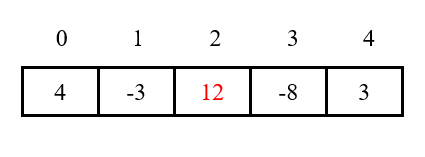
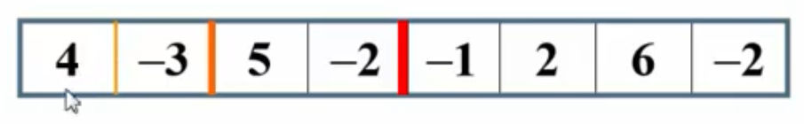
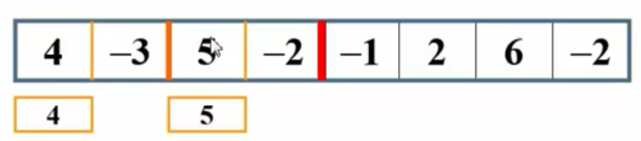
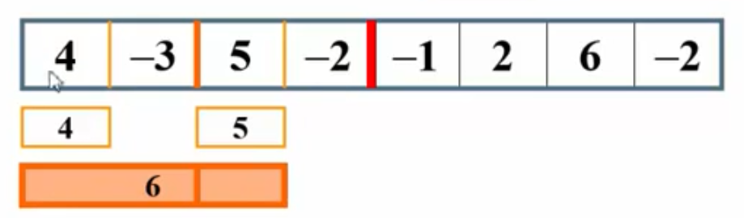
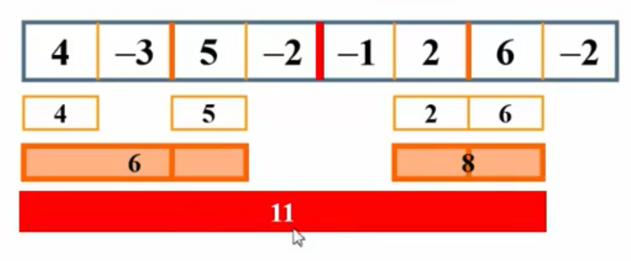
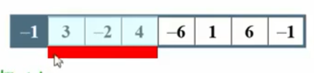
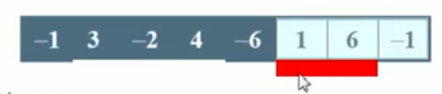

# 最大连续子序列和问题

## 1 题目

给定含有负数的整数序列A1、A2、A3 ... Ai，求∑(k=i~j)Ak的最大值。

如：对于输入{4, -3, 5, -2, -1, 2, 6, -2}，最大连续子序列和为7(从1到6)。

## 2 解决

### 2.1 递归

#### 2.1.1 分析

对于一个序列，其最大连续子序列和可能出现在3处：①左子序列的最大和；②右子序列的最大和；③横跨左右子序列的边界线的子序列和。如下图：

分界线下标为(0 + 4) / 2 = 2，即以12为分界线。对于左边的序列(不含分界线)，最大和为4；最于右边的序列(含分界线)，最大和为12；而整个序列的最大和，为横跨左右序列的13(4，-3，12)。

因此，对于该问题，可采取递归的方式，分别递归求左子序列的最大和，右子序列的最大和，以及从分界线向左右扩张后合并在一起的和，之后在三者中取最大者即为最大子序列和。这种思想为**分治法**，分而治之。

1. 先一分为二，再对左边不断一分为二，直到只剩下一个元素为止：

   

2. 对于{4, -3}这个子序列，其左子序列最大和为4，右子序列最大和为-3，跨越边界线的和为1。因此，子序列{4, -3}的最大连续子序列和为4。类似地，对于{5, -2}这个子序列，其最大连续子序列和为5：

   

3. 对于{4, -3, 5, -2}这个子序列，左子序列最大和为4，右子序列最大和为5，跨越边界线的和为6。因此，子序列{4, -3, 5, -2}的最大连续子序列和为6：

   

4. 最终结果如下：

   

如何实现求左子序列的最大和、右子序列的最大和，以及横跨边界线的和？

1. 对于左子序列和右子序列的最大和：当递归到最后一层时，如果当前元素大于0，则返回它本身，如果小于0，则返回0。这样就能求解出左右子序列的最大和；
2. 对于横跨边界线的和：从分界线开始向左不断累加当前元素，如果发现更大的和，则更新最大和；向右边也如此。然后将两部分相加。

**这是递归，不要太过纠结每个过程堆栈的状态，记不住的。理解推进的中间过程，理解base case，才是关键！**

#### 2.1.2 时间复杂度

求横跨边界线的最大和时，需要从分界线开始，向左边扫描，再向右边扫描。因此，每个元素都被扫描了一遍，花费O(n)时间，而当只有1个元素时只花费常数时间。故：

T(n) = 2 * T(n / 2) + n.

由

T(1) = 1，

T(2) = 2 * 1 + 2 = 2 + 2 = 4，

T(4) = 2 * 4 + 4 = 8 + 4 = 12，

T(8) = 2 * 12 + 8 = 24 + 8 = 32...

因此可得，当n = 2k时，T(n) = nlogn + n = **O(nlogn)**.

### 2.2 动态规划

#### 2.2.1 分析

从左到右扫描数组，累加当前元素，并记录当前的子序列和。如果当前的子序列和为负数，则将它清空为0，因为负数如果加上后面的正数，必定小于后面的正数，故一定无法让子序列和最大；如果当前子序列和大于已求得的最大和，则更新最大和。

该算法的一个附带优点是：它只对数组进行一次扫描，一旦arr[i]被读入并被处理，它就不再需要被记忆和使用。因此，如果数组在磁盘上或者互联网上传送，它就可以被顺序读入，在主存中不必存储数组的任何部分。在任意时刻，算法都能对它已经读入的数据给出相应子序列问题的正确答案，因此，具有这种特性的算法叫做**联机算法**。

1. 对于{-1, 3, -2 4, -6, 1, 6, -1}，扫描到-1时，子序列和为负数，则抛弃子序列和，前往扫描下一个元素；

2. 扫描到3时，子序列和为3，更新最大和；

3. 扫描到-2时，子序列和为1，不更新最大和；

4. 扫描到4时，子序列和为5，更新最大和：

   

5. 扫描到-6时，子序列和为-1，抛弃子序列和，前往扫描下一个元素；

6. 扫描到1时，子序列和为1，更新最大和；

7. 扫描到6时，子序列和为7，更新最大和；

8. 扫描到-1时，子序列和为6，不更新最大和：

   

故最大连续子序列和为7。

#### 2.2.2 时间复杂度

每个元素只扫描一次就能得到答案，故时间复杂度仅为**O(n)**。