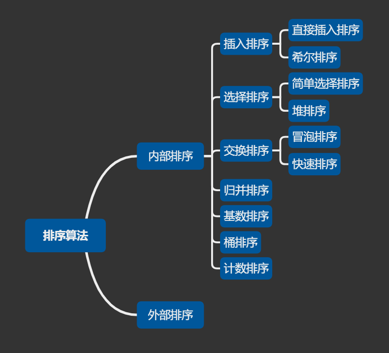
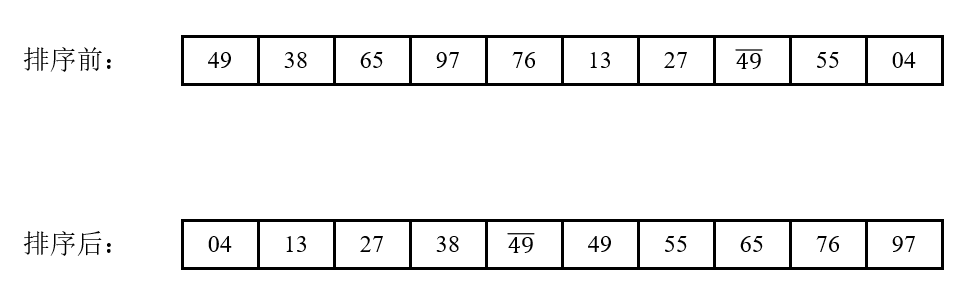
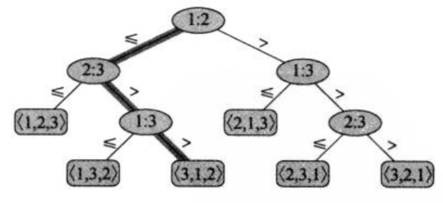
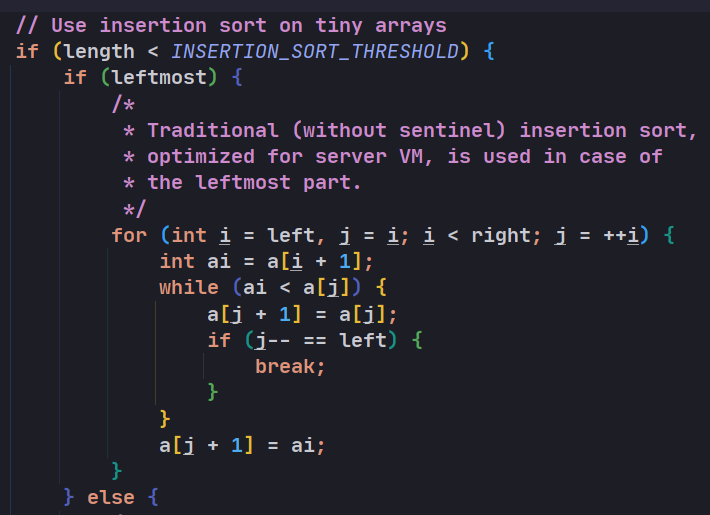

# 排序

## 1 分类

由于待排序的记录数量不同，使得排序过程中涉及的存储器不同，可将排序方法分为两大类：一类是**内部排序**，指的是待排序记录存放在计算机**随机存储器**中进行的排序过程；另一类是**外部排序**，指的是待排序记录的数量很大，以致内存一次不能容纳全部记录，在排序过程中尚需对**外存**进行访问的排序过程。

## 2 内部排序

### 2.1 分类

在内部排序中，借助**插入**操作的排序分为直接插入排序和希尔排序；借助**选择**操作的排序分为简单选择排序和堆排序；借助**交换**操作的排序分为冒泡排序和快速排序。

### 2.2 稳定性

#### 2.2.1 概念

假设两个元素的关键字相等，即Ki = Kj，且在原序列中元素Ri领先于Rj(即i ＜ j)。如果在排序之后的序列中，Ri仍然领先于Rj，则称采用的排序算法是**稳定**的；反之，如果**可能**使得排序之后的序列中，Rj领先于Ri，则称采用的排序算法是**不稳定**的。

注意："可能"是指，不稳定的排序算法也可以使排序之后Ri仍然领先于Rj，但对于不稳定的排序算法，只要举出一组关键字的实例证明它的不稳定性即可。即：**只要找到一组**关键字证明，当排序前Ri领先于Rj，而排序后Rj领先于Ri，即可证明排序算法的不稳定性。

如上图中，关键字均为49的两个元素，以横线进行区分。原来处于靠后位置的49在排序之后占到了靠前位置，证明这种排序算法是不稳定的。

#### 2.2.2 意义

如果要排序的内容是一个复杂对象的**多个**数字属性，且其原本的初始顺序存在意义，那么我们需要具有使用到稳定性的算法，在二次排序的基础上保持原有排序的意义。例如要排序的内容是一组原本按照价格高低排序的对象，如今需要按照销量高低排序，使用稳定性算法，可以使得相同销量的对象依旧保持着价格高低的排序展现，只有销量不同的才会重新排序。

#### 2.2.3 不稳定算法

**快速排序**、**希尔排序**、**简单选择排序**、**堆排序**不是稳定的排序算法，而**基数排序**、**冒泡排序**、**直接插入排序**、**归并排序**是稳定的排序算法。

口诀：(不稳定算法)"**快些选队**" —— (快)快速排序、(些)希尔排序、(选)简单选择排序、(队)堆排序，为不稳定排序算法，其余算法均稳定。

### 2.3 排序算法对比

|   排序算法   |     最好情况时间复杂度      |     最坏情况时间复杂度      |            平均时间复杂度             |          空间复杂度          | **稳定性** |
| :----------: | :-------------------------: | :-------------------------: | :-----------------------------------: | :--------------------------: | :--------: |
| 简单选择排序 |      O(n2)       |      O(n2)       |           O(n2)            |             O(1)             |   不稳定   |
| 直接插入排序 |            O(n)             |      O(n2)       |           O(n2)            |             O(1)             |    稳定    |
|   冒泡排序   |            O(n)             |      O(n2)       |           O(n2)            |             O(1)             |    稳定    |
|   希尔排序   |            O(n)             |      O(n2)       | O(nd) (与增量序列有关)  |             O(1)             |   不稳定   |
|   归并排序   |          O(nlogn)           |          O(nlogn)           |               O(nlogn)                |             O(n)             |    稳定    |
|   快速排序   |          O(nlogn)           |      O(n2)       |               O(nlogn)                |    最好O(logn)，最差O(n)     |   不稳定   |
|    堆排序    |          O(nlogn)           |          O(nlogn)           |               O(nlogn)                |             O(1)             |   不稳定   |
|   基数排序   |            O(n)             |      O(n2)       |   O(D*(n+R)) (D是位数，R是基数)   |     O(n+R) (R是基数)     |    稳定    |
|    桶排序    |            O(n)             |          O(nlogn)           | O(n + nlogn - nlogm) (m为桶的个数) |  O(n + m) (m为桶的个数)  |    稳定    |
|   计数排序   | O(n + k) (k为数组最大值) | O(n + k) (k为数组最大值) |      O(n + k) (k为数组最大值)      | O(n + k) (k为数组最大值) |    稳定    |

#### 2.3.1 基于比较的排序算法

##### 2.3.1.1 决策树

基于比较的排序算法有：简单选择排序、直接插入排序、冒泡排序、希尔排序、归并排序、快速排序、堆排序。在比较排序算法中，只使用元素之间的**比较**来获得输入序列中元素之间次序的信息，而不能用其他方法观察元素的值或它们之间的次序信息。

比较排序可以抽象为一棵**决策树**。决策树是一棵完全二叉树，可以表示在给定输入规模下，某一比较排序算法对所有元素之间的比较操作。

对于每个结点i : j，表示元素ai和aj之间的比较。叶子结点<1, 2, 3...>表示排列所得顺序a1 ≤ a2 ≤ a3 ≤ ...

以a1 = 6，a2 = 8，a3 = 5为例，所得决策树如下图所示(其中阴影表示做出的决策)：

比较过程为：a1 ≤ a2，往左走；a2 ＞ a3，往右走；a1 ＞ a3，往右走。最终所得结果为：

a3 == 5 ＜ a1 == 6 ＜ a2 == 8. 

对于n个输入元素，共有n!种排列方案，则这n!种可能的排列都应该出现在决策树的叶子结点上。而且，每一个叶结点都必须是可以从根结点经过某条路径到达的，该路径对应于排序的一次实际执行过程，称这种叶结点为**可达**的。

##### 2.3.1.2 最坏情况时间复杂度下界

在决策树中，从根结点到任意一个可达的叶结点之间最长的简单路径的长度，表示排序算法中对应的最坏情况下的比较次数。因此，比较排序算法中**最坏情况比较次数等于决策树的高度**。同时，当决策树中每种排列都是以可达的叶结点的形式出现时，该**决策树高度的下界即为比较排序算法运行时间的下界**。下证：

考虑一棵高度为h、具有l个可达叶结点的决策树，对应n个元素的比较排序。因为输入数据的n!种可能的排列都是叶结点，所以n! ≤ l(**难道存在不可达的排列结果？还不明白...**)。又因为在一棵高度为h的二叉树中，叶结点的数目不多于2h，因此有：

n! ≤ l ≤ 2h.

取对数，得：

h ≥ log(n!) 

   = log(n • (n - 1) … 1) 

   = log(n) + log(n - 1) + … + log(1) 

   ≥ log(n) + log(n - 1) + … + log(n/2) [舍去后n/2项]

   ≥ log(n/2) + log(n/2) + … + log(n/2) [每一项都缩小到n/2]

   ≥ (n/2)log(n/2).

   = nlogn.

所以h = Ω(nlogn).

即，基于比较的排序算法的时间复杂度下界为**Ω(nlogn)**。也就是说，基于比较的排序算法的时间复杂度至少要大于nlogn，即**最快也只能是nlogn**。

#### 2.3.2 非基于比较的排序算法

桶排序是通过某一个映射函数，计算元素应该落到哪个桶中，从而实现的排序；基数排序是通过关键字的优先级进行桶的分配、排序和收集；而计数排序是计算小于等于某元素的个数，从而让该元素落入到正确的位置。这些排序算法完全**没有输入元素之间的比较操作**。

基数排序、桶排序、计数排序不基于元素之间的比较，因此当脱离了比较排序模型的时候，Ω(nlogn)的下界也不再适用。而在某些情况下，这三种算法能达到**线性的时间复杂度O(n)**。

##### 2.3.2.1 桶排序应用场景

桶排序适合使用在**外部排序**的场景中，外部排序就是指外部磁盘数据量大，而内存有限相对较小，无法将数据一次性读入内存中的情况。

例如，有日志数据10G大小，内存200M，需要将日志数据排序，这种情况就适合使用桶排序。可以先扫描日志数据的数据范围，按日志时间拆分为多个连续范围，例如20190601，20190602...，以此类推，并将相应范围的文件按先后顺序编号，再将日志数据分配到相应范围的文件内，对文件内数据进行快排，再按文件顺序读入输出到同一文件中。虽然对大规模数据进行了拆分，但是数据分配肯定有不均匀的情况，导致某些文件依然过大，无法读入内存中，这样的文件可以依照之前的方式再次进行拆分，直到所有的文件大小都可以被读入内存中。

##### 2.3.2.2 计数排序应用场景

计数排序可以认为是桶排序的特殊情况，当**数据范围不大**时可以考虑使用计数排序。

例如，高考时要计算考生排名，高考分数范围为0 ~ 900。先创建901个桶，将相同分数的考生数据进行计数，在完成遍历后对计数进行顺序累计，再对高考数据进行遍历，按累计数据放入数组相应位置，完成后数组就为排序完成的高考成绩。

##### 2.3.2.3 基数排序应用场景

当数据可以**按位分割比较**，且**位与位之间有递进关系**，每位的数据范围比较有限，就是适合基数排序应用的场景。

例如，对手机号码进行排序。因为手机号码有11位，数据范围比较大，使用桶排序或计数排序不太理想，但手机号码的比较有个特点，我们通常对手机号码从左至右进行比较，当数字相同就比较下一位，但数字有大小之别就不用继续比较后面的数字。

其实手机号码的排序就可以先排序最后一位，再按倒数第二位重新排序，以此类推，每位的排序使用稳定线性排序算法，如果使用非稳定的排序算法会导致只顾当前位排序大小，而忽略了其他位的排序，在当前位相同情况下其他位的排序会出现错乱情况。

#### 2.3.3 比较型排序算法 vs. 非比较型排序算法

从整体上来说，计数排序的时间复杂度主要依赖于**数据的范围**；桶排序依赖于空间的开销和**数据的分布**；基数排序是一种对**多元组**排序的有效方法，具体实现要用到桶排序。

相对于快速排序、堆排序等基于比较的排序算法，计数排序、桶排序和基数排序限制较多，**不如快速排序、堆排序等算法灵活性好**。但反过来讲，这三种线性排序算法之所以能够达到线性时间，是因为**充分利用了待排序数据的特性**。如果生硬地使用快速排序、堆排序等算法，很可能浪费了数据的特性，因而达不到更高的效率。线性排序算法使用最重要的是，**充分利用数据特殊的性质，以达到最佳效果**。

#### 2.3.4 堆排序 vs. 快速排序

对于非基于比较的排序算法来说，从表上来看，堆排序在最好、最坏还是平均情况下，时间复杂度都是O(nlogn)，而且还不像快排和归并排序那样占空间，但为什么说**快速排序**是最好的算法呢？

原因：**因为在堆排序下，数据读取的开销变大**。

在计算机进行运算的时候，数据不一定会从内存读取出来，而是从一种叫cache的存储单位读取。原因是，cache相比内存，读取速度非常快，所以cache会把一部分我们经常读取的数据暂时储存起来，以便下一次读取的时候，可以不必跑到内存去读，而是直接在cache里面找。一般认为读取数据遵从两个原则：temporal locality，也就是不久前读取过的一个数据，在之后很可能还会被读取一遍；另一个叫spatial locality，也就是说读取一个数据，在它**周围内存地址**存储的数据也很有可能被读取到。因此，在读取一个单位的数据(比如1个word)之后，不光单个word会被存入cache，与之内存地址相邻的几个word，都会以一个block为单位存入cache中。另外，cache相比内存小得多，当cache满了之后，会将旧的数据剔除，将新的数据覆盖上去。

在进行堆排序时，由于需要比较父结点和子结点的关键字大小，虽然计算下标会很快完成，但是**在大规模的数据中对数组指针寻址也需要一定的时间**，而**快速排序只需要将数组指针移动到相邻的区域即可**。堆排序的过程中，需要有效的**随机存取**。当堆排序的数组比较长的时候，父结点和子结点的数据相隔比较远，这就导致了经常**在cache里面找不到**要读取的数据，需要从内存中读出来，而当cache满了之后，以前读取的数据又要被剔除。在堆排序中，会大量地**随机存取**数据；而在快速排序中，只会大量地**顺序存取**数据(顺序读写：文件指针只能从头移动到尾；随机读写：文件指针可以根据需要随意移动)。

磁盘读写最慢的地方在于寻道，根据kafka官网，寻道时间大概10ms，寻道之后磁头顺序读取信息的速度是很快的，6个7200转的磁盘组成raid5，**顺序读写的速度能达到600MB/s，而随机读写速度仅为100KB/s**。顺序读写有时候比内存的随机读取还要快。

此外，在堆排序时，每次总是将最大堆中最大的元素移除，然后将最后的元素放到堆顶，再进行调整。这样一来，有很多比较将是被浪费的，因为被拿到堆顶的元素几乎是**比较小**的，而靠近堆顶的元素又几乎是**比较大**的，所以被拿到堆顶的元素能留在堆顶的可能性微乎其微，被拿到堆顶的元素很有可能最终**再被移动到底部及附近**，这样一来，从元素被交换到堆顶，之后又一直下滤回去，就会做**很多无用功**。在堆排序里面有大量这种近乎无效的比较。

简而言之，快速排序和堆排序读取arr[i]这个元素的平均时间是不一样的，快速排序会**节省很多读取时间，以及比堆排序少了很多比较的时间**。

### 2.4 简单的比较排序算法 vs. 先进的比较排序算法

#### 2.4.1 与数据规模有关

2.4节已说明了比较排序算法中**快速排序**占优。而快速排序一般是用**递归**实现的，如果待排序序列的规模比较小，那么递归的副作用就会凸显出来——递归的实现是通过调用函数本身，函数调用的时候，每次调用时要做**地址保存，参数传递**等，这是通过一个递归工作栈实现的。具体是每次调用函数本身要保存的内容包括：**局部变量、形参、调用函数地址、返回值**。那么，如果递归调用n次，就要分配n个局部变量、n个形参、n个调用函数地址、n个返回值，这势必是影响效率的，同时，这也是内存溢出的原因，因为积累了大量的中间变量无法释放。因此，当数据规模比较小的时候，基于递归的快速排序效率**甚至还不如简单的排序算法高**。

#### 2.4.2 直接插入排序 vs. 冒泡排序

简单的排序算法有直接插入排序、希尔排序、冒泡排序、简单选择排序。这四种算法中，简单选择排序和希尔排序不稳定，因此用得最广泛的就是**直接插入排序和冒泡排序**。下面说明为什么直接插入排序会比冒泡排序更加出色。

分析冒泡排序和直接插入排序：冒泡排序不管怎么优化，元素交换的次数是一个固定值，是原始数据的逆序度。直接插入排序也一样，不管怎么优化，元素移动的次数也等于原始数据的逆序度。但是，从代码实现上来看，**冒泡排序的数据交换要比直接插入排序的数据移动要复杂**，冒泡排序需要3个赋值操作，而直接插入排序只需要1个。将执行一个赋值语句的时间粗略地计为单位时间(unit_time)，然后分别用冒泡排序和直接插入排序对同一个逆序度是K的数组进行排序。如果使用冒泡排序，需要K次交换操作，每次需要3个赋值语句，所以交换操作总耗时就是3*K个单位时间；而直接插入排序中数据移动操作只需要K个单位时间。

所以，虽然冒泡排序和插入排序在时间复杂度上是一样的，都是**O(n2)**，但是如果希望把性能优化做到极致，首选**直接插入排序**。

#### 2.4.3 比较排序算法选择

综上所述，一般的做法是：先考虑待排序序列的元素个数，如果元素个数**较少**，则采用**直接插入排序**；如果元素个数**充分多**，则采用**快速排序**。如JDK 8源码中Arrays.sort方法对于基本类型的排序：在元素个数较少(阈值为47)时，选择采用直接插入排序。当超过阈值时，进入快排：

## 3 外部排序

待更新...

## 参考资料

[排序算法稳定性的意义](https://blog.csdn.net/serena_0916/article/details/53893070)

[快速排序优于堆排序的原因 - 1](https://blog.csdn.net/qq_36770641/article/details/82669788)

[快速排序优于堆排序的原因 - 2](https://www.zhihu.com/question/23873747/answer/327295185)

[比较型排序 vs. 非比较型排序](https://www.cnblogs.com/tham/p/6827406.html)

[非比较型排序应用](https://blog.csdn.net/u011476390/article/details/91347312)

[插入排序 vs. 冒泡排序](https://www.jianshu.com/p/4d65992dc493)