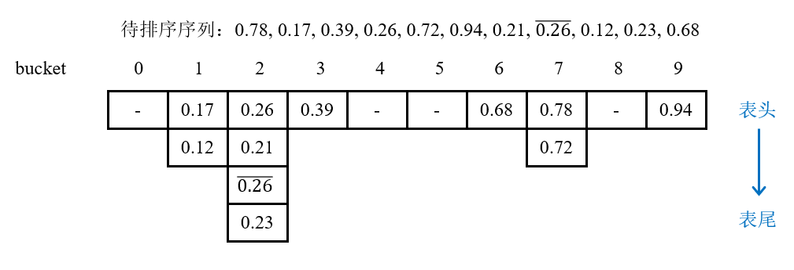
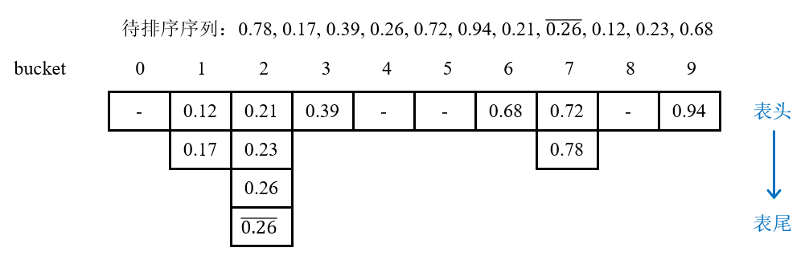

# 桶排序

## 1 思路

如果已知n个元素的关键字的取值范围在0 ~ m - 1之间，且n不会远小于m，则桶排序先根据每个元素的可能取值建立一个**桶(bucket)**，即总共建立m个桶；在扫描n个元素的关键字时，将每个关键字根据规则放入相应的桶中。此后，分别**对每个桶中的元素进行排序**，最后将每个桶中的元素依次倒回原数组即可。因此，桶排序的效率比一般的排序算法效率高，但是需要的**额外条件**是需要已知关键字的取值范围。

如：某门选修课共有1500个学生选修，他们的成绩为分布于[0, 100]之间的整数，现需要将学生名单按照他们的成绩从低到高顺序打印出来。

分析：如果将学生名单按成绩先排序再打印，那么至少需要**O(nlogn)**的时间(排序算法下界)。而如果使用桶排序，可为每一个分数建立一个桶，则共建立101个桶，每个桶都是一个**链表**，所以可定义一个**链表指针数组bucket[101]**。扫描学生名单，如果ta的成绩为i，则将他的记录放到bucket[i]中的**链表尾部**。最后扫描每个桶，将链表中的学生名单逐一打即可。

## 2 演示

假设有一个包含n个元素的数组A：

{0.78, 0.17, 0.39, 0.26, 0.72, 0.94, 0.21, 0.26-, 0.12, 0.23, 0.68}，对其进行桶排序。

1. 每个元素A[i]满足0 ＜ A[i] ＜ 1，则可根据这些元素的取值范围按每0.1为间隔分为10个桶；

2. **按顺序扫描**数组中的元素，按每个元素的十分位将每个元素放到对应的桶中，如0.78放到bucket[7]中。如果两个元素的十分位相同，则在同一个桶中用**尾插法插入到链表尾端**。如果两个元素的关键字相等，则**根据扫描的先后顺序**在同一个桶中用**尾插法插入到链表尾端**。P.S. 若采用头插法会改变相同关键字的元素插入到链表中的相对位置，在之后排序时如果使用稳定的排序算法，则最终会改变相同关键字的元素在排序之后的前后顺序，导致整个桶排序算法不稳定：

   

3. 对每个桶的链表中的所有结点进行排序(为了确保桶排序的稳定性，使用**稳定**的排序方法，如归并排序)：

   

4. 最后遍历每个桶，将链表中每个元素**按顺序**覆盖到原来的数组中即可。

## 3 稳定性

对于关键字相等的元素，桶排序按照这些元素的**先后出现顺序插入到链表尾端**。并且，对桶链表中的结点进行排序时，一般会采用**稳定**的排序算法(如归并排序等)。同时，在最后将桶内元素倒回数组时也**根据链表从头到尾**遍历，所以不会打乱它们之间的相对顺序。因此，桶排序是**稳定**的。

## 3 复杂度

### 3.1 时间复杂度

对n个关键字进行桶排序的时间复杂度分为两个部分：

1. 循环计算每个关键字的桶映射函数f(k)，这部分的时间复杂度是O(n)；
2. 利用先进的比较排序算法对每个桶内的所有数据进行排序，其时间复杂度为∑ O(ni * logni) 。其中ni为第i个桶的元素个数。

很显然，第2部分是桶排序性能好坏的决定因素。尽量减少桶内数据的数量是提高效率的唯一办法，因为基于比较排序的最好平均时间复杂度只能达到O(nlogn)。因此，需要尽量做到下面两点：

1. 映射函数f(k)能够将n个数据平均地分配到m个桶中，这样每个桶就有(n/m)个元素；
2. 尽量增大桶的数量。最好情况下每个桶内存放一个数据，这样就完全避开了桶内数据的比较排序操作。 当然，做到这一点很不容易，数据量巨大的情况下，桶数量也会变得很大，导致空间浪费严重。这就是时间代价和空间代价的权衡问题。

因此，桶排序的时间复杂度分析：

1. 平均情况：对于n个待排数据，m个桶，平均每个桶中的元素个数为k = n/m。而由于**每个桶**中进行归并排序的时间复杂度为O(k • logk)，即O((n/m) • log(n/m))，那么**m个桶**都进行排序的时间复杂度就等于O(m • (n/m) • log(n/m)) = O(nlog(n/m))。加上扫描每个元素并计算其映射到哪个桶所花费的时间共O(n)，则总共的平均时间复杂度为O(n) + O(nlog(n/m)) = O(n + n(logn - logm)) = **O(n + nlogn - nlogm)**；
2. 最好情况：当桶的个数**m接近数据个数n**时，即每个桶中只有一个数据，那么不需要进行桶内元素的比较排序，因此时间复杂度为扫描每个元素并计算其映射到哪个桶所花费的时间，共**O(n)**；
3. 最坏情况：极端情况下，所有的元素n个都分在同一个桶里，此时m = 1，那么时间复杂度就退化成O(n + nlogn) = **O(nlogn)**。

### 3.2 空间复杂度

桶排序需要开辟一个大小为m的数组用于放置m个桶，且对于n个元素，需要额外使用n个指针用于连接桶链表中的结点，因此，桶排序的空间复杂度为**O(n + m)**。

## 参考资料

[桶排序复杂度分析](https://baike.baidu.com/item/%E6%A1%B6%E6%8E%92%E5%BA%8F/4973777?fr=kg_qa#3)