# 计数排序

## 1 思路

对于每一个输入元素x，计数排序通过确定**小于x的元素个数**，将x放到它在输出数组中的正确位置。比如，如果有17个元素小于x，则x应该放在第18个输出位置上。

计数排序的步骤：

1. 先确定待排序序列A中元素的关键字的**最大值k**；
2. 开辟一个**和A等长**的数组B用于存放排序的输出(P.S. 不能在原数组上覆盖的原因是：如果最后计算输出时直接覆盖到原数组上，那么从原数组中从后往前取值时候会取到新的输出值，而不是原始值，最终导致数组被**污染**)；
3. 开辟一个[0, 1, 2 ... k]的辅助数组C，数组的下标为原始数组中元素的值。该数组用于计算对于一个元素i，有多少元素小于等于i。

## 2 演示

1. 原始数组：

   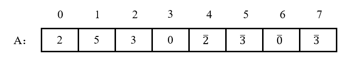

   原始数组中的最大值为5，则开辟一个[0, 1, 2 ... 5]的辅助数组C，即原始数组中共出现0 ~ 5中的全部或部分的值；

2. 扫描原始数组，如果某个元素的关键字第一次出现，则在数组C中对应下标的值为1；如果第二次出现，数组C对应下标的值为2，以此类推：

   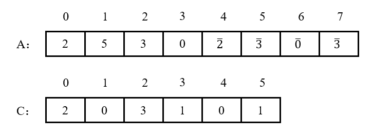

   如上图中数组C表示，在原始序列中，等于0的元素出现过2次，等于1的元素出现过0次，等于2的元素出现过2次，等于3的元素出现过3次，等于4的元素出现过0次，等于5的元素出现过1次；

3. 从数组C的始端开始，当前下标的值 = 自身 + 前一个下标的值，即可计算得出小于等于下标对应的元素的个数：

   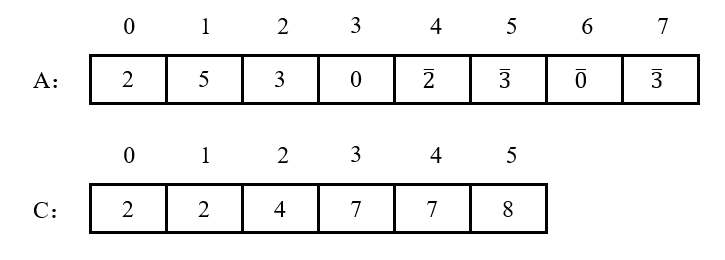

   如上图中数组C表示，在原始序列中，小于等于0的元素共有2个，小于等于1的元素共有2个，小于等于2的元素共有4个，小于等于3的元素共有7个，小于等于4的元素共有7个，小于等于5的元素共有8个；

4. 从原始数组A的末端开始扫描，取出一个数之后，到数组C中查询小于等于它的关键字的个数m，然后把它放在输出数组B的m - 1位置处，同时，数组C中小于等于该关键字的个数需要减1。P.S. 从原始数组A的末端开始扫描是因为，取出一个数后需要查询到C中的值，然后输出到B中。而C中的值是**逐渐递减**的，意味着取出一个元素之后是按照**从后往前**的顺序输出到数组B的。而从后往前扫描数组A并按照从后往前的顺序输出到B，才可以维护排序的稳定性：

   1. 取出A中下标为7的3-，在C中下标3对应的值为7，则将其输出到B的下标6处，且C中下标3对应的值减1：

      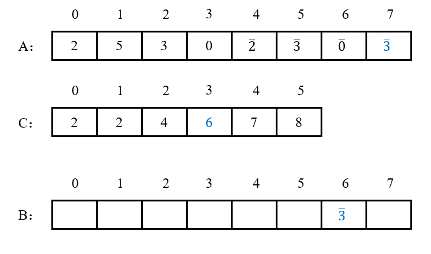

   2. 取出A中下标为6的0-，在C中下标0对应的值为2，则将其输出到B的下标1处，且C中下标0对应的值减1：

      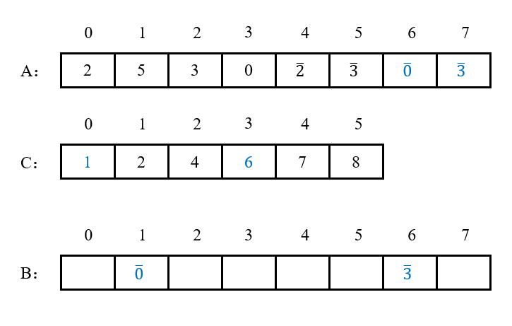

   3. 取出A中下标为5的3-，在C中下标3对应的值为6，则将其输出到B的下标5处，且C中下标3对应的值减1：

      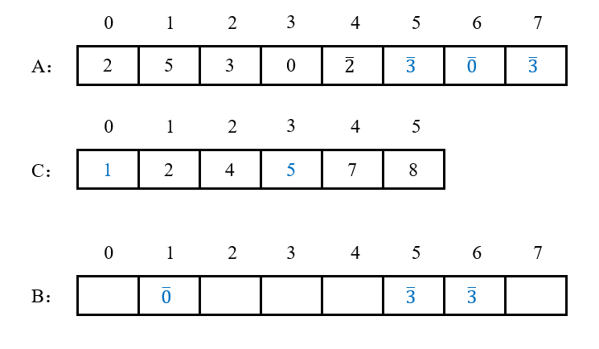

   4. 取出A中下标为4的2-，在C中下标2对应的值为4，则将其输出到B的下标3处，且C中下标2对应的值减1：

      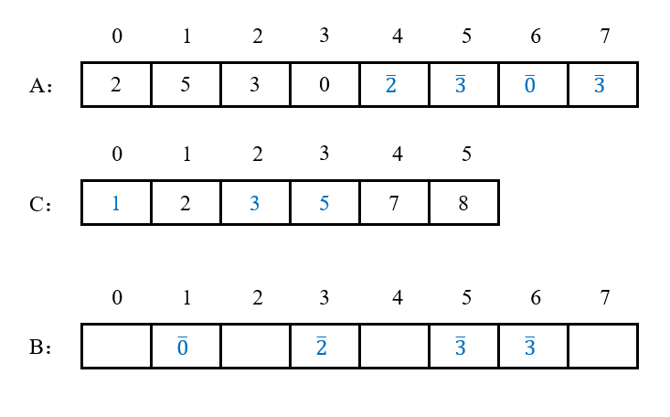

   5. 取出A中下标为3的0，在C中下标0对应的值为1，则将其输出到B的下标0处，且C中下标2对应的值减1：

      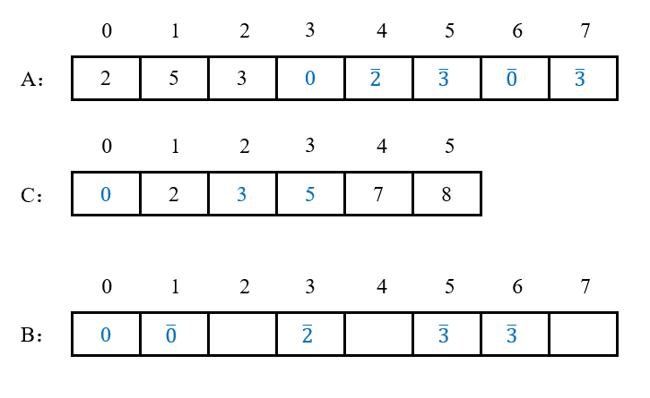

   6. 取出A中下标为2的3，在C中下标3对应的值为5，则将其输出到B的下标4处，且C中下标3对应的值减1：

      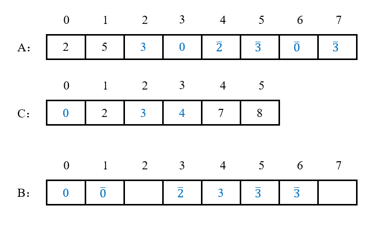

   7. 取出A中下标为1的5，在C中下标5对应的值为8，则将其输出到B的下标7处，且C中下标5对应的值减1：

      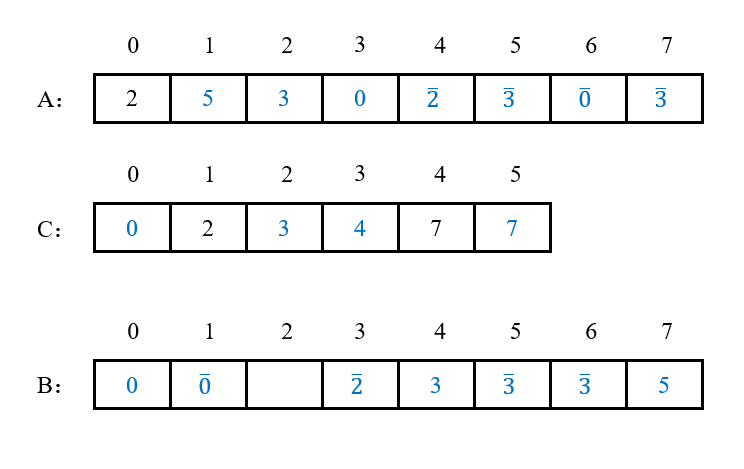

   8. 取出A中下标为0的2，在C中下标2对应的值为3，则将其输出到B的下标2处，且C中下标2对应的值减1：

      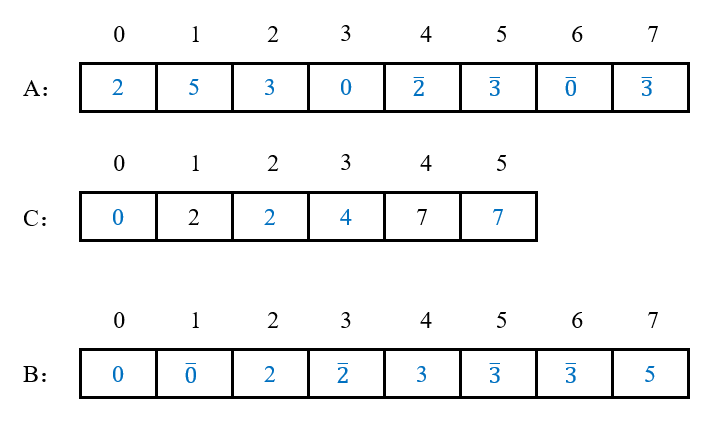

   9. 至此已经全部排序完毕，数组C中下标为1和4的两个值没有被更新过，表示原数组根本没有1和4。

## 3 稳定性

由于最终排序时，从原始数组中取出元素，采取**从后往前**扫描的方式，且从C中取值并放到数组B时按照下标大小**从后往前**放置，因此关键字相等的元素在排序前后的相对位置顺序没有发生改变。故计数排序是**稳定**的。

## 4 复杂度

### 4.1 时间复杂度

扫描原始数组A并在C中计数，这一步需要扫描n个元素，花费**O(n)**；在C中计算小于等于当前下标的元素个数需要扫描整个数组C，花费**O(k)**；最终从后往前扫描数组A，并在C中取值，最后输出到数组B，这一步这一步需要扫描n个元素，花费**O(n)**。因此，计数排序的最好情况、最坏情况、平均情况的时间复杂度均为**O(n + k)**。

### 4.2 空间复杂度

计数排序需要开辟一个和原数组等长的输出数组，和一个长度为k的辅助数组用于记录小于等于每个值的元素个数，因此，计数排序的空间复杂度为**O(n + k)**。

## 5 缺点

当最大值最小值差距过大时，会浪费很多空间和扫描时间，因此不适用计数排序；

当关键字不是整数值时，无法以关键字的取值作为下标创建辅助数组，因此不能用计数排序。