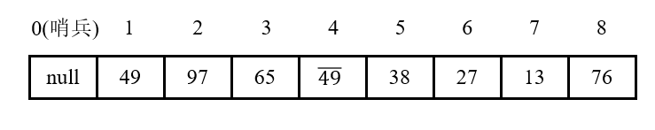
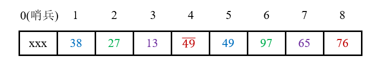
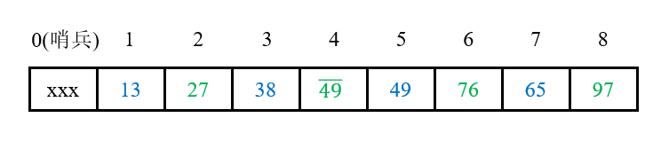
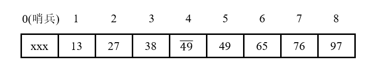

# 希尔排序

## 1 思路

简单插入排序效率不高的一个重要原因就是每次只交换**相邻**的两个元素，而希尔排序对直接插入排序进行改进，通过每次交换**相隔一定距离**的元素，达到排序效率的提升。

希尔排序的基本原理：将待排序的一组元素按一定间隔分为若干个序列，分别进行插入排序。开始时设置的**间隔**比较大，在每一轮排序中将间隔逐步减小，直到间隔等于1时，此时相当于直接插入排序。

希尔排序将间隔定义为一组**增量序列**，用来分割待排序序列，即将位置之差等于当前增量的各个元素归属于同一个**子序列**，在每一个子序列中进行直接插入排序。在当前增量下的各个序列都完成排序之后，更新增量，划分子序列再次分别排序，直到最后增量为1。

## 2 演示

选取增量序列为{N / 2, N / 22, N / 23, ..., 1}，N为待排序序列中元素个数。

1. 原始数组：

   

2. gap = 8 / 2 = 4，则1号元素、5号元素为一组，2号元素、6号元素为一组，3号元素、7号元素为一组，4号元素、8号元素为一组。分别对这三组进行直接插入排序，每一组都已有序：

   

3. gap = 4 / 2 = 2，则1号元素、3号元素、5号元素、7号元素为一组，2号元素、4号元素、6号元素、8号元素为一组。分别对这两组进行直接插入排序，每一组都已有序：

   

4. gap = 2 / 2 = 1，对整个数组进行直接插入排序：

   

## 3 稳定性

一次直接插入排序是稳定的，不会改变相同元素的相对顺序。但由于增量的关系，关键字相同的元素可能被划分到不同的子序列，而不同的子序列中进行插入排序的过程是"独立分开"的。所以，关键字相同的元素在**不同子序列**中会发生移动，最后导致稳定性被打乱。故希尔排序是**不稳定**的。

## 4 复杂度

### 4.1 时间复杂度

1. 最好情况：希尔排序本质上也属于插入排序，因此，和直接插入排序相同，如果对已经排好序的序列进行排序，则在每一个子序列中都不需要进行后续的元素移动操作，故最好情况下的时间复杂度为**O(n)**；
2. 最坏情况：当选取增量序列为{N / 2, N / 22, N / 23, ..., 1}，N为待排序序列中元素个数时，对子序列中每一个取出的元素，都需要进行从子序列末端到子序列始端的比较和移动，故最坏情况下的时间复杂度为**O(n2)**；

3. 平均情况：和增量序列的选取有关，选取不同增量序列会产生各种目前处于猜想阶段的平均时间复杂度，故平均情况下的时间复杂度为**O(nd)** (d ＜ 2)。

### 4.2 空间复杂度

和直接插入排序一样，希尔排序仅需要**常数**个额外空间用于保存中间变量，因此空间复杂度为**O(1)**。

## 参考资料

[希尔排序图解](https://blog.csdn.net/bjweimengshu/article/details/100681410)