# 直接插入排序

## 1 引入

以斗地主为例：第一张牌取到J；第二张牌取到K，因为K比J大，所以把K放在J的后面；第三张牌取到A，因为A比K大，所以把A放在K的后面；第四张牌取到Q，将Q和K、A比较，都比它们小，所以将K、A后移，而Q大于J，所以将Q插入在此处；第五张牌取到10，由于10比前四张牌都小，所以要将这四张牌都后移，然后将10插入在第一个位置。

1. 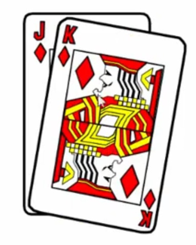

2. 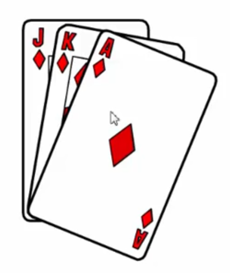

3. 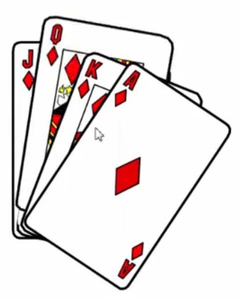

4. 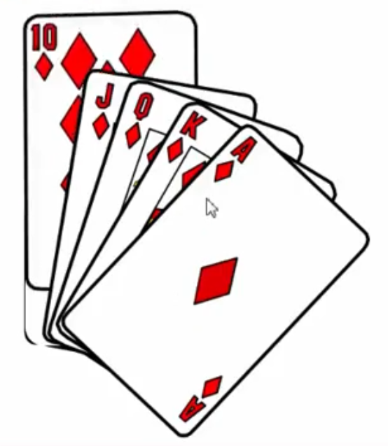

## 2 思路

1. 由于取出元素后，要当前位置从后往前扫描、比较，直到找到合适的插入位置，因此，在每一次比较、移动元素后，都要检查当前元素**下标是否为0**以免减到负数造成越界。因此，为了减少比较的这一步，可以在数组的0号位置添加一个**哨兵**，哨兵的元素即为取出的待插入元素；
2. 在数组中，认为第1个元素本身有序，故从第2个元素开始按顺序取出每一个元素i，如果取出的元素i比在数组中的前一个元素i - 1小：
   1. 将待插入元素i拷贝到哨兵位置处，并将前一个元素i - 1后移；
   2. 从前一个元素的前一个元素j = i - 2开始，每次都比较当前元素和哨兵元素的大小，如果哨兵**小于**当前元素，说明待插入元素**小于**当前元素，则将当前元素后移。之后j自减，继续比较；
   3. 直到哨兵**大于等于**当前元素时，有两种可能：
      1. 像第1节插入Q时的情况，还没比较到数组最始端时就找到了插入位置；
      2. 像第1节插入10时的情况，比较到了数组的最始端，说明待插入元素为整个子序列的最小元素，此时将待插入放在数组的1号下标处即可。

## 3 演示

1. 原始数组：

   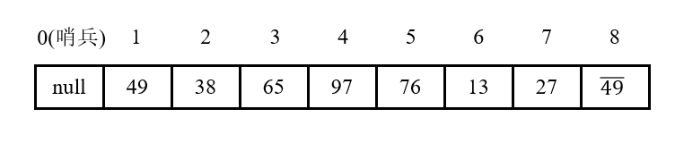

2. i = 2，取出38，38 < 49，将38拷贝到哨兵处，并将49后移1位。从第0个元素38开始比较，此时哨兵等于第0个元素，则将38插入到数组第1位：

   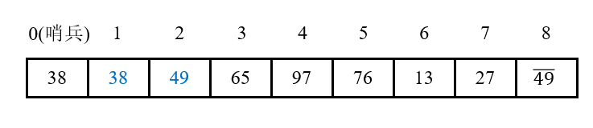

3. i = 3，取出65，65 > 49，将元素插入到数组第3位：

   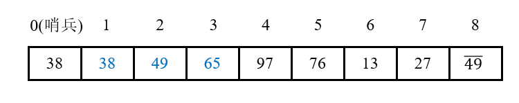

4. i = 4，取出97，97 > 49，将元素插入到数组第4位：

   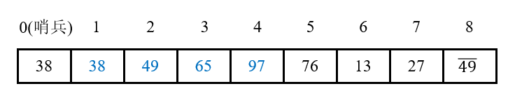

5. i = 5，取出76，76 < 49，将76拷贝到哨兵处，并将97后移1位。从第3个元素65开始比较，此时哨兵大于第3个元素，则将76插入到数组第4位：

   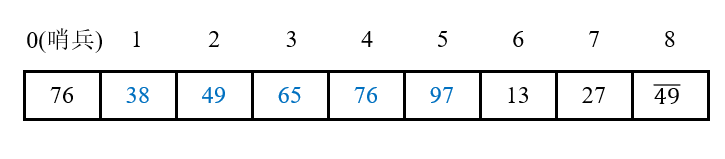

6. i = 6，取出13，13 < 97，将13拷贝到哨兵处，并将97后移1位。从第4个元素76开始比较，此时哨兵小于第4个元素，将76后移1位；往前比较，哨兵小于第3个元素65，将65后移1位；往前比较，哨兵小于第2个元素49，将49后移1位；往前比较，哨兵小于第1个元素38，将38后移1位；往前比较，哨兵等于第0个元素38，则将13插入到数组第1位：

   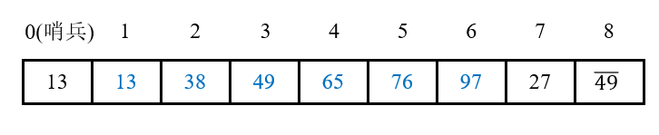

7. i = 7，取出27，27 < 97，将27拷贝到哨兵处，并将97后移1位。从第5个元素76开始比较，此时哨兵小于第5个元素，将76后移1位；往前比较，哨兵小于第4个元素65，将65后移1位；往前比较，哨兵小于第3个元素49，将49后移1位；往前比较，哨兵小于第2个元素38，将38后移1位；往前比较，哨兵大于第1个元素13，则将27插入到数组第2位：

   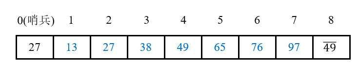

8. i = 8，取出49-，49- < 97，将49-拷贝到哨兵处，并将97后移1位。从第6个元素76开始比较，此时哨兵小于第6个元素，将76后移1位；往前比较，哨兵小于第5个元素65，将65后移1位；往前比较，哨兵等于第4个元素49，则将49-插入到数组第5位：

   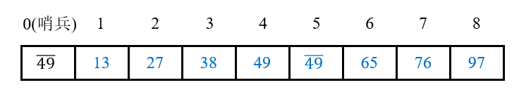

## 4 稳定性

当新插入的元素**严格小于**当前被比较的元素时，才会让被比较的元素后移。所以，相等元素的前后顺序没有改变，从原无序序列取出去的顺序就是排序后的顺序，故直接插入排序是**稳定**的。

## 5 复杂度

### 5.1 时间复杂度

1. 最好情况：对已经排好序的序列进行排序，则取出每一个元素i后都大于前一个元素，则不需要进行后续的元素移动操作，故最好情况下的时间复杂度为**O(n)**；
2. 最坏情况：对每一个取出的元素i，都需要进行i - 1次比较和移动，故最坏情况下的时间复杂度为**O(n2)**；
3. 平均情况：有两个嵌套循环，每个循环进行O(n)次比较和交换，所以平均情况下的时间复杂度为**O(n2)**。

### 5.2 空间复杂度

直接插入排序仅需要**常数**个额外空间用于保存中间变量，因此空间复杂度为**O(1)**。

## 参考资料

[插入排序哨兵 - 1](https://blog.csdn.net/k0115/article/details/78994101?utm_medium=distribute.pc_relevant_t0.none-task-blog-BlogCommendFromMachineLearnPai2-1.control&depth_1-utm_source=distribute.pc_relevant_t0.none-task-blog-BlogCommendFromMachineLearnPai2-1.control)

[插入排序哨兵 - 2](https://blog.csdn.net/limuzi13/article/details/8021038)