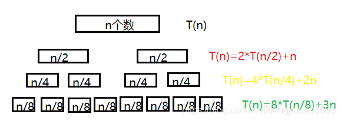

# 归并排序

## 1 归并

归并：将两个或两个以上的有序表组合成一个新的有序表。假设初始序列含有n个记录，则可看成是n个独立的有序的子序列，每个子序列的长度为1。之后**两两归并**，得到n / 2个长度为2或1的有序子序列；继续两两归并……直到得到一个长度为n的有序序列为止。这种方法称为**2-路归并排序**，如下图所示：

归并的过程如下：

1. 首先申请**额外的空间**用于存放两个子序列归并之后的结果；
2. 设置两个指针分别指向两个有序子序列的第一个位置；
3. 比较两个指针指向的元素，将**较小的元素**放到已申请的额外空间内(两元素相等时，较前的元素优先放)，并将放置元素的指针向后移动一位；
4. 重复第3步过程，直到某一个子序列的指针超出该子序列的末端；
5. 最后将另一个指针所指向的序列的**剩余元素**全部放置到额外空间内。

如上图第2趟归并之后进行第3趟归并时：

1. 先设置left指针指向12 36 44 59子序列的第一个元素，和right指针指向7 43 62 94子序列的第一个元素；
2. 7 ＜ 12，则将7放到额外空间内，且right指针向后移动一位至43；
3. 12 ＜ 43，则将12放到额外空间内，且left指针向后移动一位至36；
4. 36 ＜ 43，则将36放到额外空间内，且left指针向后移动一位至44；
5. 43 ＜ 44，则将43放到额外空间内，且right指针向后移动一位至62；
6. 44 ＜ 62，则将44放到额外空间内，且left指针向后移动一位至59；
7. 59 ＜ 62，则将59放到额外空间内，且left指针向后移动一位，此时已经超出左子序列的终点；
8. 将右子序列的剩余元素62、94都放置到额外空间内。

## 2 排序

归并排序可以用**分治法**的思想进行**自下而上**的理解，就是先将原序列划分为2个等长子序列，再**递归**地**折半划分**每个子序列，分界线center = (left + rightEnd) / 2，left为左子序列的起点，rightEnd为右子序列的终点。直到**左子序列的起点left == 右子序列的终点rightEnd**时，说明此时已经划分到了最小长度，只有一个元素，再**逐级**对[left, center]、[center + 1, rightEnd]进行归并操作并逐级返回。

注意：额外数组只有在归并的时候才会用到，但是在**调用排序函数时**已经需要创建这个额外数组，并将其作为参数传递进每一层递归的归并函数。这是因为，如果在进行归并操作时才开辟这个额外的数组，那么每一次调用归并函数，就要申请相应两子序列长度之和的额外空间，并且在归并函数调用结束时释放这个空间。每一次都要开辟、释放空间，虽然由于每一次都会进行释放使得最终额外空间复杂度仍然是**O(n)**不变，但是不断的开辟、释放、开辟、释放空间，非常不合算。因此，在调用**排序函数**时，**直接开辟O(n)的额外空间**即可。

## 3 演示

由于上面的图已经把思路讲解得很清晰，且我最怕陷进递归，所以不演示，我必须自行理解。

## 4 稳定性

在归并时，当一个元素**小于等于**另一个元素时就会被放到额外数组，所以对于关键字相等的两元素，相对位置较前的元素会先被放到额外数组，因此两元素的相对位置顺序不变。故归并排序是**稳定**的。

## 5 复杂度

### 5.1 时间复杂度

如果假设一个有n个数的序列排序时间复杂度为T(n)。如果将n个数的序列分为**两个(n/2)**的序列，让这**两个子序列分别完成各自的排序**，则T(n)=2 * T(n/2) + 合并时间。由于合并时，两个子序列已经有序，那么只需要通过while循环扫描两个有序序列，再合并成一个大的有序序列即可，while循环中有n个数需要比较，所以**合并的时间复杂度为n**。如果每个序列只有一个数，则不需要进行组内排序，时间复杂度T(1)=0。故：

T(1) = 0,

T(n) ≤ 2 * T(n/2) + n,

T(n) ≤ 2 * (2 * T(n/4) + n/2) + n = 4 * T(n/4) + 2n,  

T(n) ≤ 4 * (2 * T(n/8) + n/4) + 2n = 8 * T(n/8) + 3n,  

……  

T(n) ≤ n * T(1) + n * (logn) = O(nlogn). 

其中：n * T(1)表示每个元素自身进行排序，n个元素进行自身T(1)的排序，得到n * T(1)；logn为完全二叉树的层数-1。

故归并排序在最好情况、最坏情况、平均情况下的时间复杂度均为**O(nlogn)**。

### 5.2 空间复杂度

在调用排序函数时，需要开辟和待排序元素等数量的辅助空间，因此归并排序的空间复杂度为**O(n)**。

## 参考资料

[归并排序时间复杂度](https://blog.csdn.net/liangjiabao5555/article/details/89670082)