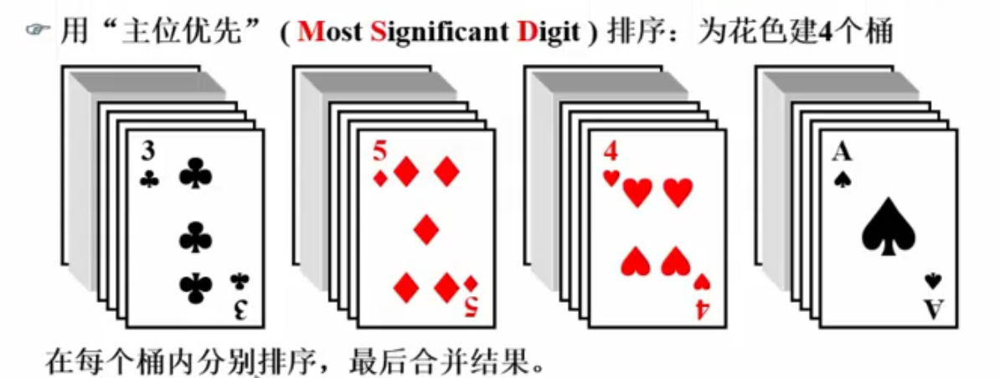
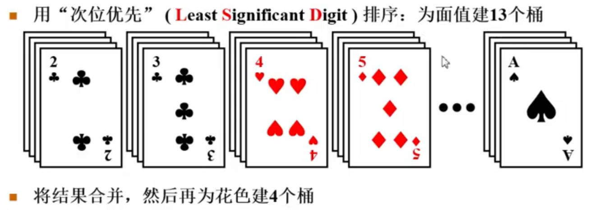
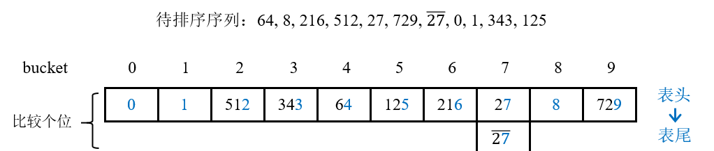
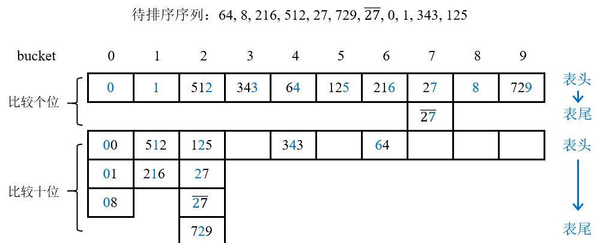
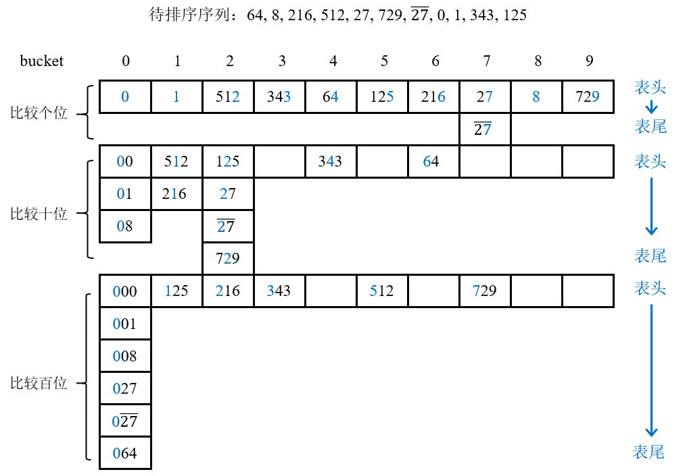

# 基数排序

## 1 基数和位数

如果一个数是10进制，则称它的**基数radix**为10。对于一个3位十进制数来说，它的**位数digit**就是3。

如：21610 —— 基数为10，位数为3；10002 —— 基数为2，位数为4。

## 2 主次位优先法

如一副扑克牌，可以按照这样排序：

一、♣2, ……, ♣A	♦2, ……, ♦A	❤2, ……, ❤A	♠2, ……, ♠A

这样子是先按照牌的花色划分为4大类(建立4个桶)，再在每一类中对13张牌的面值大小进行排序。此时称花色为最主位关键字，面值为最次位关键字。

二、也可以采用另一种方法，先按不同牌的面值大小分为13堆，再将这13堆牌按照4种花色进行排序。

第一种方法称为**主位优先法**，即先为最主位关键字(花色)建立4个桶，将牌按照花色分别放进4个桶里；之后对桶中的每张牌，再按照次位关键字(面值)进行排序；最后再将所有桶中的牌收集在一起。

第二种方法称为**次位优先法**，即先为最次位关键字(面值)建立13个桶，然后将桶中的元素收集在一起，之后再为主位关键字(花色)建立4个桶，顺序将每个收集好的元素放入对应桶中，则4个花色桶中的牌**必有序**；最后将所有桶中的牌收集在一起。

主位优先法基本上采取分治法的思路，将序列分割为子序列后，**分别排序**再合并结果；次位优先法则是将排序过程分解为了**分配**和**收集**两个步骤，并不需要分割子序列以及排序，因此一般情况下**次位优先法**效率更高一些。

## 3 演示

对于给定范围在0 ~ 999之内的10个关键字{64, 8, 216, 512, 27, 729, 0, 1, 343, 125}用基数排序进行递增排序。

可以将每个关键字看成一个**3位十进制**数，即关键字个数为3，基数为10。每个数的个位数为最次位关键字，最高位为最主位关键字。

对这10个数使用**次位优先法**进行排序：

1. 根据**基数大小为10**建立10个桶；

2. 首先对于最次位关键字(即个位)，**按顺序扫描**所有元素，将关键字按照个位数字的大小顺序放入对应桶中，即个位为1的放入桶1，个位为7的放入桶7，以此类推：

   

3. 每个桶实际上是一个**链表**，进行一趟排序后，将链表中的元素**重新收集为一个新链表**: {0, 1, 512, 343, 64, 125, 216, 27, 27-, 8, 729}；

4. 接着对于下一个次位关键字(即十位)，**按顺序扫描**所有元素，将关键字按照十位数字的大小顺序放入对应桶中，放入同一个桶中的元素应该插入到**链表尾部**(PS. 图中链表的尾结点在最下方)：

   

5. 将链表中的元素**重新收集为一个新链表**: {00, 01, 08, 512, 216, 125, 27, 27-, 729, 343, 64}；

6. 最后对于最主位关键字(即百位)，**按顺序扫描**所有元素，将关键字按照百位数字的大小顺序放入对应桶中，放入同一个桶中的元素应该插入到**链表尾部**(PS. 图中链表的尾结点在最下方)：

   

7. 将链表中的元素**重新收集为一个新链表(最终结果)**: {000, 001, 008, 027, 027-, 064, 125, 216, 343, 512, 729}。

简而言之，先只按照个位从小到大排序，然后在**之前排好的基础上**，按照十位从小到大排序，最后在**之前排好的基础上**，按照百位从小到大排序。每一次都是在已经有的某一位的大小顺序的基础上，继续按照下一位的大小顺序排序。

## 4 稳定性

对于关键字相等的元素，基数排序按照这些元素的先后出现顺序，**按顺序**地取出并分配到桶中，**按先后顺序插入到链表尾端**。同时，在收集时也**根据链表从头到尾**收集，所以不会打乱它们之间的相对顺序。因此，基数排序是**稳定**的。

## 5 复杂度

### 5.1 时间复杂度

1. 对于n个元素，在基数为R时需要先分配R个桶；
2. 之后，根据元素的关键字的最大位数D，共需要进行D趟分配和收集；
3. 在分配时，共需要扫描n个元素并计算它应该被分配到哪个桶；在收集时，需要将每个链表的尾结点指向前一个链表的头结点，相当于把每个桶都插入到用于收集的链表中，故共需要扫描R个链表；
4. 因此，平均时间复杂度为**O(D(n + R)**。

分析：

1. 最好情况：当元素个数n和桶的个数(即基数)R基本是同一数量级时，基数排序可以达到线性复杂度O(k * n)，其中k为常数。所以最好情况下时间复杂度为**O(n)**；
2. 最坏情况：对于恶意/不幸的数据集，如果要排序的关键字的位数D接近要排序的元素个数n，则基数排序在最坏情况下将**在O(n2)上**执行；
3. 平均情况：基数排序平均情况下的时间复杂度为**O(D(n + R)**。

### 5.2 空间复杂度

基数排序需要分配O(R)的额外空间用于放置R个桶，还需要O(n)的额外空间用于存放桶链表中每个结点之间的指针，因此基数排序的总空间复杂度为**O(n + R)**。