# 堆排序

## 1 下标规律

将数组以**类似于二叉树**的结构进行存放。"用户"给的无序数组下标从0开始，是因为"用户"不会像构建最大堆类时那样在下标0处留一个哨兵，所以相应的父结点和它的左右孩子结点的索引规律等规则需要进行相应调整：

对于位置为i的结点，其左子结点的索引为**2i + 1**，右子结点的索引为**2i + 2**。

在最大堆中，每个父结点的值都大于等于其左右子结点的值，因此将根据无序数组建立最大堆之后，根结点的值一定最大。此后排序时，将根结点和最后一个结点交换位置，此时末尾结点就是最大结点。

## 2 建立最大堆

### 2.1 步骤

1. 从**最后一个非叶子结点**开始到数组的末尾进行下滤调整；
2. 下标自减，从当前位置开始到数组的末尾进行下滤调整，直到将根结点调整完毕即结束。

### 2.2 演示

1. 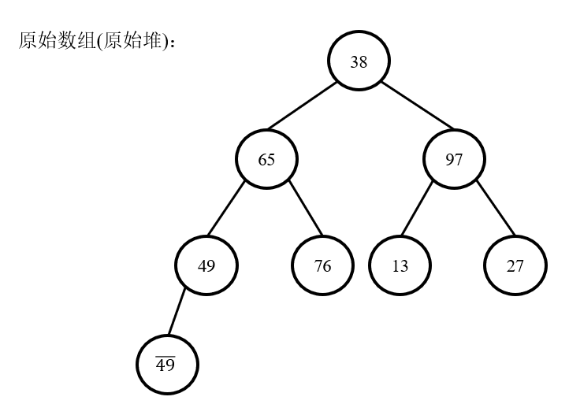
2. 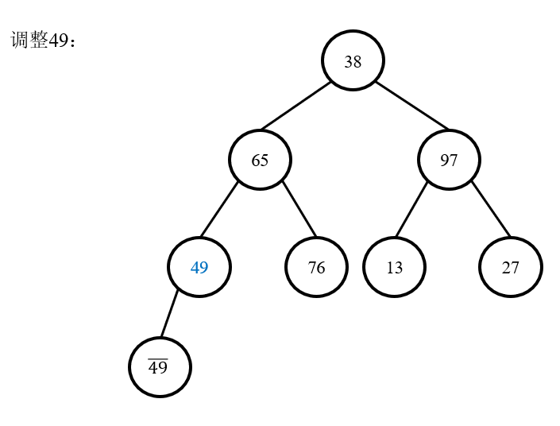
3. 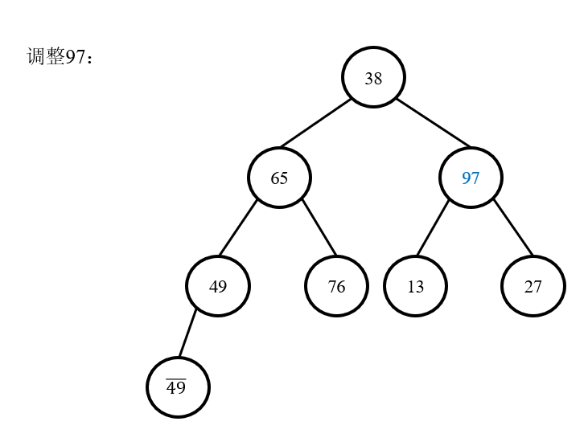
4. 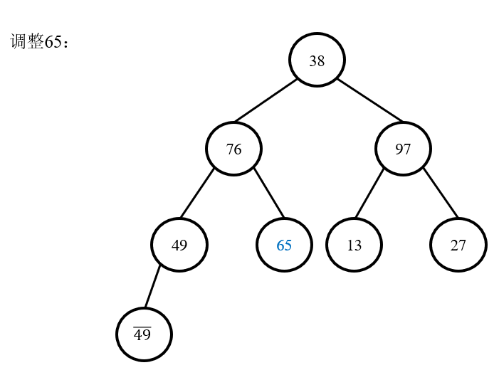
5. 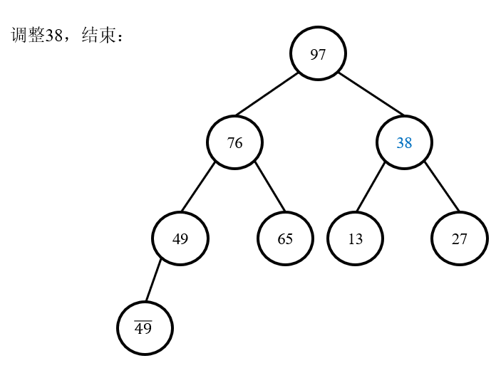

### 2.2 时间复杂度

如果仅从代码上直观观察，会得出构造二叉堆的时间复杂度为O(n㏒n)的结果，这个结果是错的，虽然该算法外层套一个n次循环，而内层套一个分治策略下的㏒n复杂度的循环，但是该思考方法犯了一个原则性错误，那就是构建二叉堆是自下而上的构建，每一层的最大纵深总是小于等于树的深度的。因此，该问题是叠加问题，而非递归问题。

那么换个方式，假如我们自上而下建立二叉堆，那么插入每个结点都和树的深度有关，并且都是不断把树折半来实现插入，因此是典型的递归，而非叠加。

假设建立堆的顺序为自下而上：

1. 具有n个元素的平衡二叉树，树高为㏒n，设这个变量为h；
2. 最下层非叶结点的元素，只需做一次线性运算便可以确定大根，而这一层具有2^(h-1)个元素。假定O(1)=1，那么这一层元素所需时间为2^(h-1) × 1；
3. 由于是bottom-top建立堆，因此在调整上层元素的时候，并不需要同下层所有元素做比较，只需要同其中之一个分支(子结点中的较大者)作比较，而作比较次数则是树的高度减去当前结点的高度。因此，第x层元素的计算量为2^(x) × (h-x)；
4. 由以上通项公式可得知，构造树高为h的二叉堆的精确时间复杂度为：
   S = 2^(h-1) × 1 + 2^(h-2) × 2 + …… +1 × (h-1) ①

通过观察第四步得出的公式可知，该求和公式为等差数列和等比数列的乘积，因此用错位想减发求解，给公式左右两侧同时乘以2，可知：

2S = 2^h × 1 + 2^(h-1) × 2+ …… +2 × (h-1) ②

用②减去①可知： S =2^h × 1 - h +1 ③

将h = ㏒n 带入③，得出如下结论：

S = n - ㏒n +1 = O(n).

结论：构造二叉堆的时间复杂度为**线性O(n)**。

## 3 排序

### 3.1 步骤

1. 交换根结点和最后一个结点，即将最大元素放到数组末端；
2. 将参与下滤的元素个数-1，即，放到**数组末端的元素无需参与**该过程；
3. 从根结点处到参与下滤的最后一个元素为止，不断进行下滤，调整为最大堆。

### 3.2 演示

1. 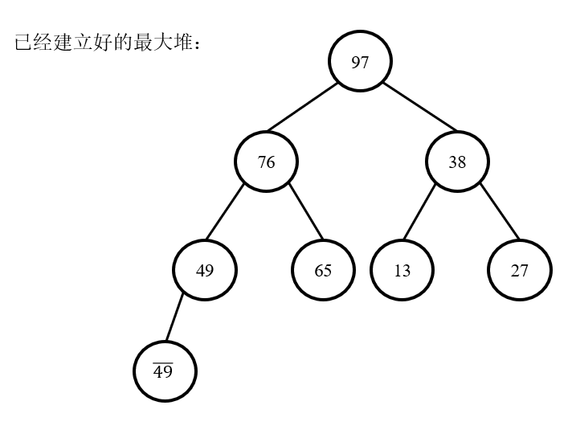
2. 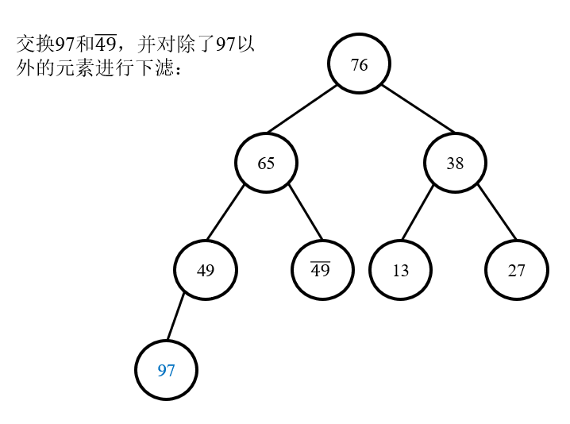
3. 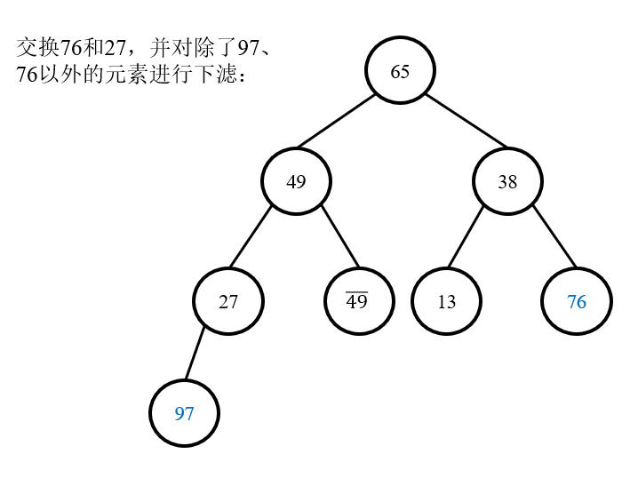
4. 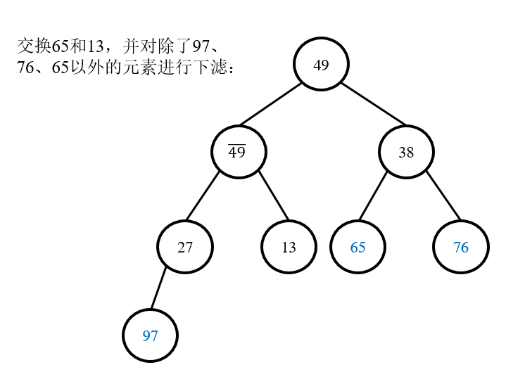
5. 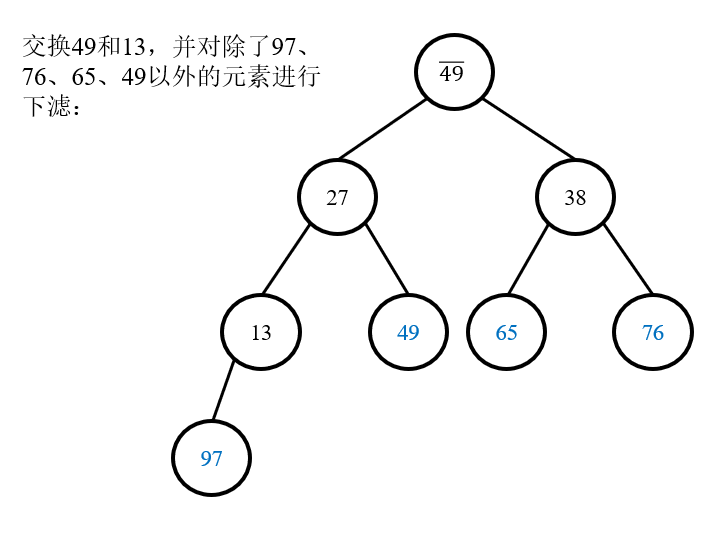
6. 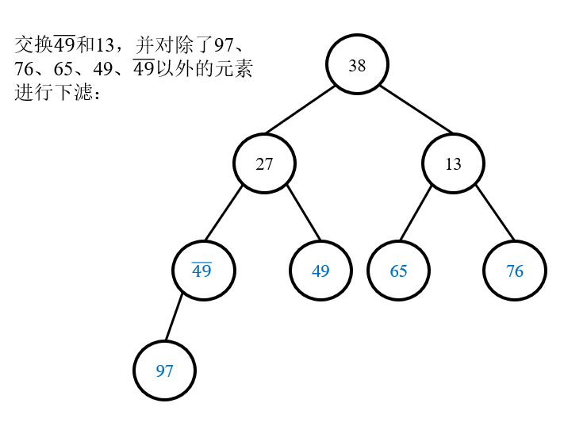
7. 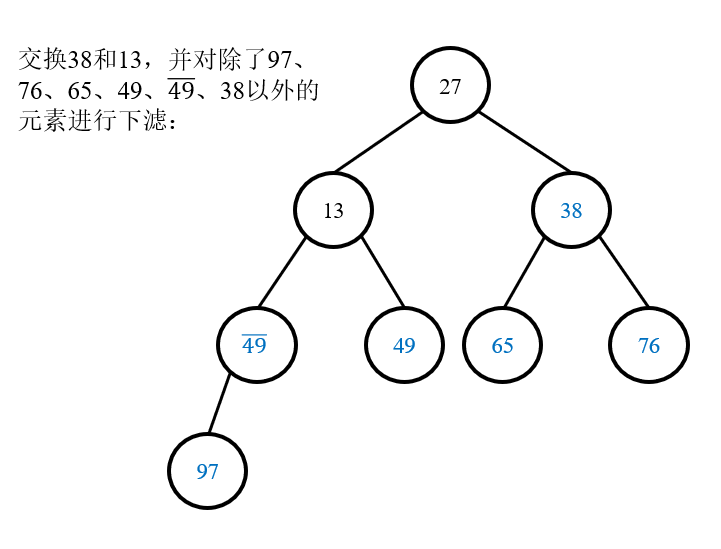
8. 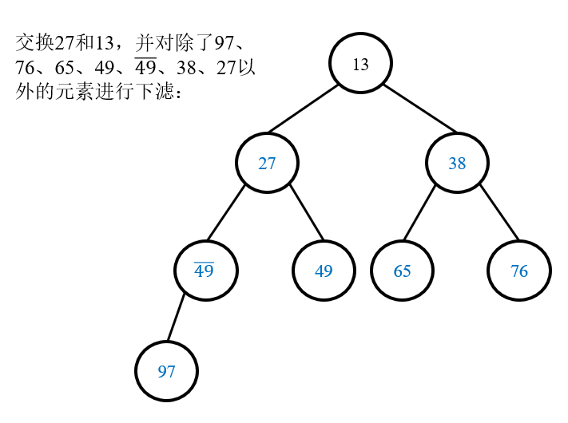
9. 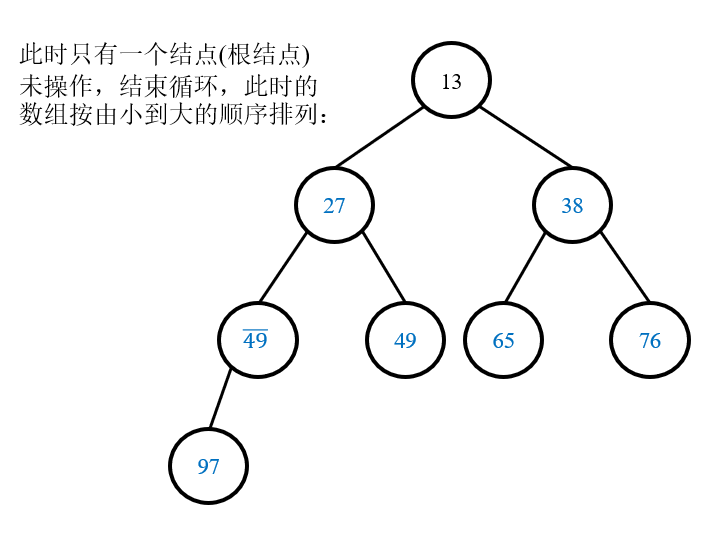

### 3.2 稳定性

最大堆中，结点i的子结点下标为2i + 1和2 * i + 2，父结点大于等于左右子结点。当在调整的过程中，有可能出现：无序数组中先出现的元素在其他元素下滤的过程中被调整到堆顶，之后**先被交换到数组末尾**，那么这2个相等的元素之间的稳定性就被破坏了(可见图示)。所以，堆排序是**不稳定**的排序算法。

### 3.3 复杂度

#### 3.3.1 时间复杂度

定理：堆排序处理n个不同元素的随机排列的平均比较次数为：

**2nlogn - O(nlog logn)**.

比O(nlogn)再小一点(因为减掉了一部分)。

由于根结点和排在最后的序号为m的叶子结点交换并进行调整，那么，

调整的操作次数 = 原来m结点所在的层数 = 堆的高度(因为m结点在堆的最后) = logm.

因为一共有n个结点，所以调整的总操作次数为：

∑(m = 1 ~ n - 1)logm = log2 + log3 + … + log(n-1) + log(n) ≈ log(n!).

可证log(n!)和nlog(n)是同阶函数，

所以堆排序的时间复杂度为**O(nlogn)**。

1. 最好情况：当所有元素都相等时，每一次交换堆顶和数组末端元素之后完全不需要再下滤，因此这种情况下时间复杂度为O(n)，但是这种情况太过特殊，所以一般还是讲**O(nlogn)**。下图来源于维基百科：

   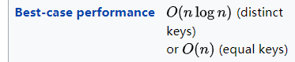

2. 由于堆排序每一次都要将堆顶元素交换到数组末端，并进行后续的下滤过程，因此最坏情况、平均情况下的时间复杂度均为**O(nlogn)**。

#### 3.3.2 空间复杂度

堆排序不需要额外的辅助数组，所以空间复杂度为**O(1)**。

## 4 用堆存放数据和堆排序的区别

- 用堆进行数据的存放时，0号下标处会留出一个位置存放无效元素，作为**哨兵**，而每一次取出的堆顶的数据都为**下标1**的数据。如构建最小生成树的Kruskal算法：每一次的目的是要弹出权重最小的边，所以使用最小堆的目的就是**存放**边和权重即可，此时会留出0号位置作为哨兵；

- 而堆排序时，由于"用户"在送过来的数组中不会留出一个位置作为哨兵，而是就像普通数组一样从**0号开始即为有效数据**，因此，0号下标对应元素就是数组本身的元素。此时，并不是要每一次都取出最大/最小的数据，而是要在原来的数组上**直接进行排序**。所以，**不能**留一个位置作为哨兵，否则就破坏了这个数组本身0号位置就是有效数据的事实。

# 参考资料

[建立堆的时间复杂度求解](https://blog.csdn.net/leosha/article/details/46116959)

[堆排序的时间复杂度求解 - 1](https://www.cnblogs.com/lylhome/p/13276081.html)

[堆排序的时间复杂度求解 - 2](https://blog.csdn.net/ndhuaerfeifei/article/details/88243762)

[堆排序最优时间复杂度讨论](https://www.nowcoder.com/discuss/85079)