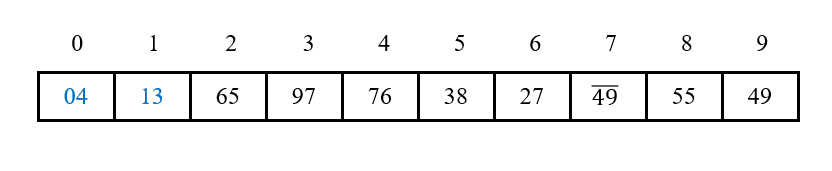

# 简单选择排序

## 1 思路

最开始在未排序的序列中，找出最小的元素，并和整个序列的第一个元素进行交换。接下来，在**剩下的**未排序序列中，再选出最小的元素，和整个序列的的第二个元素进行交换，依次类推直到第n - 1个元素。第n个元素不用进行扫描，因为就只剩下它这一个最大元素了。即从第i个元素开始往后扫描整个序列，找到最小元素后，如果最小元素下标和当前出发的第i个元素下标并不相同，则将它和第i个元素进行交换。

## 2 演示

1. 原始数组：

   

2. 从第0个元素开始往后扫描，找到整个序列的最小元素4，和第0个元素交换位置：

   

3. 从第1个元素开始往后扫描，找到整个序列的最小元素13，和第1个元素交换位置：

   

4. 从第2个元素开始往后扫描，找到整个序列的最小元素27，和第2个元素交换位置：

   

5. 从第3个元素开始往后扫描，找到整个序列的最小元素38，和第3个元素交换位置：

   

6. 从第4个元素开始往后扫描，找到整个序列的最小元素49-，和第4个元素交换位置：

   

7. 从第5个元素开始往后扫描，找到整个序列的最小元素49，和第5个元素交换位置：

   

8. 从第6个元素开始往后扫描，找到整个序列的最小元素55，和第6个元素交换位置：
   
   

9. 从第7个元素开始往后扫描，找到整个序列的最小元素65，和第7个元素交换位置：

   

10. 从第8个元素开始往后扫描，找到整个序列的最小元素76，由于最小元素的下标和当前出发的元素下标相同，因此不需要交换：

    

11. 第9个元素已经不需要扫描了，因为就只剩下这一个最大元素了：

    

## 3 稳定性

在一趟选择中，如果当前元素A的关键字比之前某一个元素B的关键字小，而当前元素A又出现在和B元素关键字相等的另一个元素C后面，那么交换后B、A之后，稳定性就被破坏了。比如：序列5 8 5 2 9，在第一遍选择中，第1个元素5会和2交换，那么原序列中两个5的相对前后顺序就被破坏了，所以选择排序是**不稳定**的排序算法。

## 4 复杂度

### 4.1 时间复杂度

在取出每一个元素i之后，都需要从i开始往后扫描整个数组，所以无论什么情况下都需要比较n * (n - 1) / 2次，因此最好情况、最坏情况、平均情况下的时间复杂度均为**O(n2)**。

### 4.2 空间复杂度

简单选择排序仅需要**常数**个额外空间用于保存中间变量，因此空间复杂度为**O(1)**。