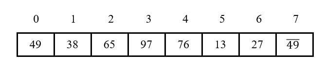
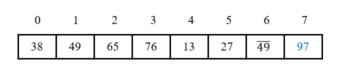
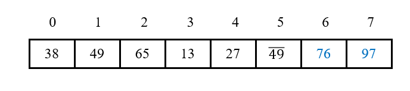
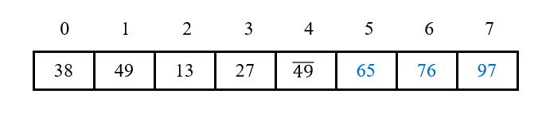
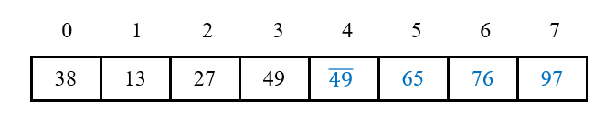
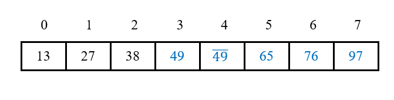
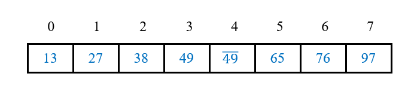

# 冒泡排序

## 1 思路

1. 首先将第1个元素的关键字和第2个元素的关键字进行比较，若为**逆序**(arr[0].key > arr[1].key)，则交换两个元素；

2. 然后将第2个元素的关键字和第3个元素的关键字进行比较，进行同样操作，以此类推，直到第n - 1个元素的关键字和第n个元素的关键字进行过比较为止。此时完成了一趟冒泡排序；
3. 之后进行第二趟冒泡排序，从第1个元素开始，进行相同的比较和交换操作，直到第n - 2个元素的关键字和第n - 1个元素的关键字进行过比较为止；
4. 一般地，第i趟冒泡排序是从arr[0]到arr[n - i]依次比较**相邻两个**元素，共比较**n - i次**，并在逆序时交换相邻元素，其结果是这n - i + 1个元素中的**最大值被交换**到数组第n - i位；
5. 判断冒泡排序结束的条件为：在一趟排序中，**没有进行过交换元素**的操作。

## 2 演示

1. 原始数组：

   

2. 第一趟排序，从0号元素到7号元素，共比较7次，97被交换到最后一位：

   

3. 第二趟排序，从0号元素到6号元素，共比较6次，76被交换到倒数第二位：

   

4. 第三趟排序，从0号元素到5号元素，共比较5次，65被交换到倒数第三位：

   

5. 第四趟排序，从0号元素到4号元素，共比较4次，49-不动：

   

6. 第五趟排序，从0号元素到3号元素，共比较3次，49不动：

   

7. 第六趟排序，从0号元素到2号元素，共比较2次，没有发生交换操作，排序已完成，跳出循环：

   

## 3 稳定性

在比较过程中，对于两个相邻的元素，如果前一个元素的关键字**严格大于**后一个元素的关键字时才会发生交换，而相等时不发生交换，因此关键字相等的元素的相对位置不发生改变。因此，冒泡排序是**稳定**的。

## 4 复杂度

### 4.1 时间复杂度

1. 最好情况：对已经排好序的序列进行排序，则一趟扫描后没有发生过交换操作，直接结束循环，故最好情况下的时间复杂度为**O(n)**；
2. 最坏情况：原始序列是逆序的，每一次比较都需要进行一次交换，故最坏情况下的时间复杂度为**O(n2)**；
3. 平均情况：有两个嵌套循环，外层循环进行n次扫描，内层循环进行n次比较(必要时进行交换)，故平均情况下的时间复杂度为**O(n2)**。

### 4.2 空间复杂度

冒泡排序仅需要**常数**个额外空间用于保存中间变量，因此空间复杂度为**O(1)**。