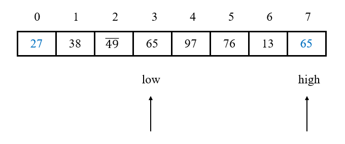
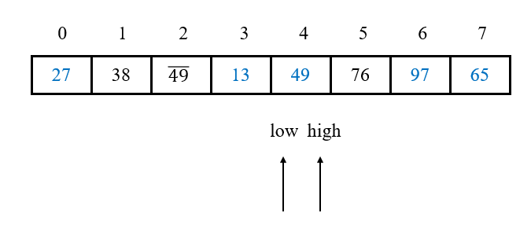

# 快速排序

## 1 思路

冒泡排序只比较相邻两个元素的顺序，而**快速排序**的原理是：将未排序元素根据一个作为基准的**枢轴(pivot)**分为左右两个子序列，其中一个子序列的关键字**均小于**枢轴，而另一个子序列的关键字**均大于**枢轴，之后再**递归**地对这两个子序列进行相同的操作。本质上，快速排序使用**分治法**，将问题的规模减小，然后再分别进行处理。

**一趟**快速排序的具体做法是：

1. 设置两个指针low和high，记录枢轴为pivot(一般选取初始时low指向的元素)；
2. 首先从high所指位置**从后往前**扫描，如果当前high所指元素大于等于pivot，则high指针自减，直到找到第一个**小于**pivot的元素，并和pivot互相交换；
3. 然后从low所指位置**从前往后**扫描，如果当前low所指元素小于等于pivot，则low指针自增，找到第一个**大于**pivot的元素，并和pivot互相交换；
4. 重复2、3两步，直到low == high为止，此时low、high所指位置即为pivot的位置。

实际上，在排序过程中对pivot的交换是多余的，因为只有在一趟排序结束，即low == high的位置才是pivot的最后位置。因此，可以做出如下改进：

- 当由high**从后往前**扫描，找到第一个**小于**pivot的元素时，将high处的值直接赋到low处(拷贝，可理解为小于pivot的元素就被换到前面)；
- 当由low**从前往后**扫描，找到第一个**大于**pivot的元素时，将low处的值直接赋到high处(拷贝，可理解为大于pivot的元素就被换到后面)；
- 当low == high时，将原先保存的pivot赋到该处即可。

当一趟排序结束后，即确定了这一趟排序的pivot及其左右子序列。之后，以0到pivot**递归**计算新的pivot，以pivot + 1到数组末端**递归**计算新的pivot。

## 2 演示

1. 原始数组：

   

2. 第一趟排序，low指向49，high指向27，pivot = arr[low] = 49。

   由high开始向前扫描，此时arr[high] = 27 < pivot，将arr[high]赋到arr[low]：

   

3. 由low开始向后扫描，arr[low] = 27 < pivot，low自增；arr[low] = 38 < pivot，low自增；arr[low] = 49- = pivot，low自增；arr[low] = 65 ＞ pivot，将arr[low]赋到arr[high]：

   

4. 由high开始向前扫描，arr[high] = 65 ＞ pivot，high自减；arr[high] = 13 < pivot，将arr[high]赋到arr[low]：

   

5. 由low开始向后扫描，arr[low] = 13 ＜ pivot，low自增；arr[low] = 97 ＞ pivot，将arr[low]赋到arr[high]：

   

6. 由high开始向前扫描，arr[high] = 97 ＞ pivot，high自减；arr[high] = 76 ＞ pivot，high自减：low == high，跳出循环，将pivot放在此处。显然，pivot(49)的左边均小于等于pivot，右边均大于pivot：

   

7. pivot(49)左边的序列为27 38 49- 13 49，对这整个子序列进行相同操作，得13 27 49- 38 49，新的pivot为27；对13、27和49- 38 49进行相同操作，得13 27 38 49- 49。

   pivot49右边的序列为76 97 65，对这整个子序列进行相同操作，得65 76 97。

   最终合并得13 27 38 49- 49 65 76 97.

## 2 稳定性

在每一次和pivot进行比较时，可能导致一个元素被交换到和它关键字相等的另一个元素之前，导致两者的相对位置发生变化，即关键字的比较和交换是跳跃进行的。因此，快速排序是**不稳定**的。

## 3 复杂度

### 3.1 时间复杂度

1. 最好情况：在最优情况下，Partition每次都划分得很均匀，如果排序n个关键字，其递归树的深度就为logn+1，类似于**一棵比较平衡的二叉树**，此时需递归logn次。

   如果递归一次需要时间为T(n)的话，第一次Partition需要对整个数组扫描一遍，做n次比较，即**扫描并交换(赋值)的时间复杂度为n**。然后，获得的枢轴将数组**一分为二**，让这两个子序列分别完成各自的排序，那么还**需要2 * T(n/2)的时间**(由于是最好情况，所以平分两半)。于是不断地划分下去，可得下面的不等式推断：

   

   T(1) = 0,

   T(n) ≤ 2 * T(n/2) + n,

   T(n) ≤ 2 * (2 * T(n/4) + n/2) + n = 4 * T(n/4) + 2n,  

   T(n) ≤ 4 * (2 * T(n/8) + n/4) + 2n = 8 * T(n/8) + 3n,  

   ……  

   T(n) ≤ n * T(1) + n * (logn) = O(nlogn).

   其中：n * T(1)表示每个元素自身进行排序，n个元素进行自身T(1)的排序，得到n * T(1)；logn为完全二叉树的层数-1。

   即在最好情况下，快速排序算法的时间复杂度为**O(nlogn)**。

2. 最坏情况：快速排序最坏的情况是初始序列已经有序，即待排序的序列为正序或者逆序，每次划分只得到一个比上一次划分少一个记录的子序列。第1趟排序经过n-1次比较后，将第1个元素仍然定在原来的位置上，并得到一个长度为n-1的子序列；第2趟排序经过n-2次比较后，将第2个元素确定在它原来的位置上，又得到一个长度为n-2的子序列；以此类推，最终总的比较次数：

   C(n) = (n-1) + (n-2) + ... + 1 = n(n-1)/2

   如：原始序列为10 20 30 40 50 60，第一趟排序确定pivot为10，划分为10和20 30 40 50 60两个子序列。分别继续进行快速排序，右边子序列结果为20 30 40 50 60，pivot = 20。继续对20和30 40 50 60进行快速排序……

   此时快速排序在第i趟排序会进行**n - i次比较**，相当于**退化到冒泡排序**，故最坏情况下时间复杂度为**O(n2)**。

3. 平均情况：设枢轴的关键字应该在第k的位置(1 ≤ k ≤ n)，那么：

   
   
   故快速排序的平均时间复杂度为**O(nlogn)**。

### 3.2 空间复杂度

空间复杂度主要由递归造成栈空间的使用。

1. 最好情况：递归树的深度为logn，其空间复杂度也即为**O(logn)**；
2. 最坏情况：如果每趟排序之后，枢轴位置均偏向于子序列的一端，则需要进行n‐1递归调用，其空间复杂度为**O(n)**；
3. 平均情况：空间复杂度为**O(logn)**。  

因此，快速排序的空间复杂度为**O(logn) ~ O(n)**。

## 参考资料

[快速排序讲解](https://developer.51cto.com/art/201403/430986.htm)

[快速排序复杂度推导](https://blog.csdn.net/weshjiness/article/details/8660583)