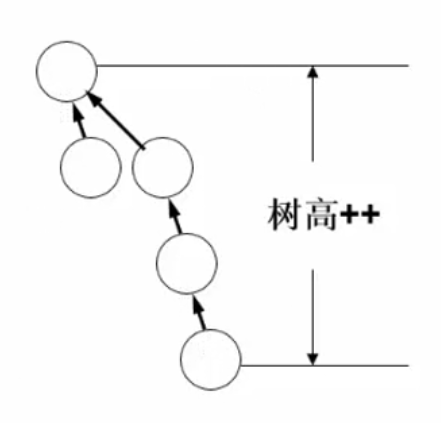

# 并查集(不相交集合)

## 1 概念

集合运算：交、并、补、差、判定一个元素是否属于某一集合。如果a和b相连，b和c相连，那么a和c也相连，即a、b、c都属于同一个集合。

**并查集(不相交集合)，Disjoint-Set**，关心集合之间的合并，和元素的查找：

- **合并**(Union)：把两个不相交的集合合并为一个集合；
- **查询**(Find)：查询某一元素属于哪个集合。

## 2 TSSN表示

可以用树形结构表示集合，树上的每一个结点代表一个元素，如下图：

采用双亲表示法进行表示，只关心每个元素的父结点，可以用数组进行存储，一共有两个域：一个是数据域，一个是父结点域，如下图：

每个元素的Parent域指向其父结点，如1号元素为2，其父结点为0号元素(即1)；8号元素为9，其父结点为5号元素(即6)；0号元素(即1)、2号元素(即3)、5号元素(即6)的父结点为-1，表示它们没有父结点，自己就是这个集合的根结点。

### 2.1 查找

当要查找某个元素所在的集合，即该集合的根结点时，首先要遍历数组，找到该元素在数组中的位置；之后根据其Parent域，不断找它的父结点，它的父结点的父结点...直到找到Parent域为-1的结点，即为待查找元素所在集合的根结点。**这样查找非常慢，最坏情况的时间复杂度为O(n2)。**

### 2.2 合并

要求：根据所给的x1、x2两个元素，合并它们所在的集合。

1. 分别查找x1、x2所在集合树的根结点；
2. 判断两个根结点是否相同，如果根结点相同，说明两个元素处于同一个集合中，则不需合并；
3. 如果两个元素的根结点不同，则将其中一个元素的根结点的Parent域设置为另一个元素的根结点的下标。

如上图所示，要合并2和5所在的集合，首先分别找到它们的根结点，即1和3。之后将3的Parent域设置为0，即结点3的父结点为结点1：

**这样做的弊端是：如果不断进行合并操作，很可能会让这棵树越来越高，导致查询结点效率低。**

鉴于查询效率慢，合并集合时可能造成树的高度越来越大的问题，这种表示方法比较TSSN(Too simple, sometimes naive.)。

## 3 简化表示

考虑到任何有限集合中的n个元素，都能被一一映射为整数0 ~ n-1，因此，可以采用将数据用**数组的下标**的形式进行存储，即数组中的每个下标就代表每一个元素，这样就不需要多开辟一个数据域，也可以提升查找效率。如下图所示：

集合中的结点2对应数组的下标[2]，结点0对应数组的下标[0]，以此类推。数组中存放的元素为每个结点的父结点：下标[0]对应结点0，其父结点为下标[6]处的结点6；下标[4]对应结点4，其父结点为下标[2]处的结点2；下标[2]对应结点2，其父结点为-1，表示它没有父结点，即它为该集合的根结点。

### 3.1 查找

查找某一元素时，传入的值为元素的值，即它在数组中的下标。根据该下标找到数组中对应存放的内容，即它的父结点。不断"向上"找父结点，直到数组中的值为-1时，表示找到了该元素对应集合的根结点，返回根结点的下标作为该元素所在集合的"名字"。

### 3.2 合并

要求：根据所给的x1、x2两个元素，合并它们所在的集合。

1. 分别查找x1、x2所在集合树的根结点；
2. 判断两个根结点是否相同，如果根结点相同，说明两个元素处于同一个集合中，则不需合并；
3. 如果两个元素的根结点不同，则将其中一个元素的根结点的Parent域设置为另一个元素的根结点的下标。

**这样做的弊端是：如果不断进行合并操作，很可能会让这棵树越来越高，导致查询结点效率低**。比如，不断合并两个集合，可能使得这棵树退化成一个单链表，如下图：

因此，还需要更好的方法进行集合的合并。

## 4 按秩归并

如下图所示，两棵树的高度分别为2和3，将它们进行合并，如果只是简单地让其中一棵树的根结点指向另一棵树的根结点，则可能会让新树的高度变成4，以此类推，会让合并后的树越来越高。

合并前：

合并后：

为了改进集合的合并过程，提出**按秩归并**，分为：**按树高合并、按规模合并**。

核心思想：**小树贴到大树上。**

### 4.1 按照树高合并

为了让合并后的树高不增加，或尽量增加得比较少，可以让树高较小的树合并到树高较大的树下面。

1. 分别查找x1、x2所在集合树的根结点；

2. 判断两个根结点是否相同，如果根结点相同，说明两个元素处于同一个集合中，则不需合并；

3. 如果两个元素的根结点不同，则分别判断两个集合的树高：

   - 如果第一个集合的树高大于第二个集合，则让第二个集合的父结点指向第一个集合。新集合的树高为原来第一个集合的树高不变；

   - 如果第二个集合的树高大于第一个集合，则让第一个集合的父结点指向第二个集合。新集合的树高为原来第二个集合的树高不变；

     

   - 如果两个集合的树高相等，则任意将第一个集合的父结点指向第二个集合，或将第二个集合的父结点指向第一个集合都可(为统一，采用前者)。新集合的树高为原来集合的树高再+1。

     

### 4.2 按照规模合并

除了可以按照树高大小进行比较后合并，也可以按照树中结点的个数进行比较再合并，即：树中结点个数较小的树，合并到树中结点个数较大的树下面。

1. 分别查找x1、x2所在集合树的根结点；

2. 判断两个根结点是否相同，如果根结点相同，说明两个元素处于同一个集合中，则不需合并；

3. 如果两个元素的根结点不同，则分别判断两个集合的规模：

   - 如果第一个集合的规模大于第二个集合，则让第二个集合的父结点指向第一个集合；

     

   - 如果第二个集合的规模大于等于第一个集合，则让第一个集合的父结点指向第二个集合。

4. 更新合并后的新集合的规模数，即将两个集合的结点个数进行相加得到新集合的结点个数。

不管是哪一种合并方式，都需要新开一个数组用于存放每棵树的根结点的大小，会**增加空间复杂度**。

### 4.3 两种方式简单比较

## 5 路径压缩

按秩归并是对于Union(合并)操作的改进，而路径压缩是对于**find**(查找)方法的修改。路径压缩在find操作期间进行，而与union操作无关。路径压缩的效果为：从结点x到根的路径上，每个结点的父结点都为根结点。如下图，左图为路径压缩前，右图为路径压缩后，能显著提升查询效率：

如果find操作需要执行很多次的话，虽然调用一次find后的执行过程比较麻烦，但是在这之后，如果还需要find这条路径上其他结点的话，就会变得很合算。

PS. 只能在基于**规模**合并的并查集上修改find函数，而不能在基于高度合并的并查集上采用这种路径压缩。因为路径压缩后根的规模不变，但高度会变，然而高度改变后又不方便重新计算。

## 6 同时使用按秩归并和路径压缩

当同时使用按秩归并和路径压缩时，最坏情况的时间复杂度为**O(m × α(n))**，其中α(n)为一个增长很慢的函数。在任何一个可以想得到的不相交集合数据结构的应用中，都有α(n) ≤ 4。

# 参考资料

[并查集图解Java实现](https://www.cnblogs.com/noKing/p/8018609.html)

[并查集图解](https://zhuanlan.zhihu.com/p/93647900/)