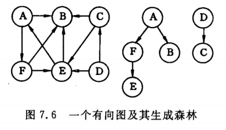
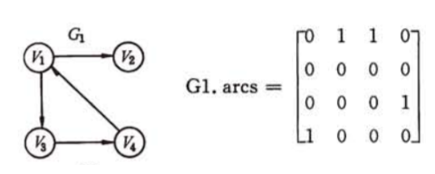
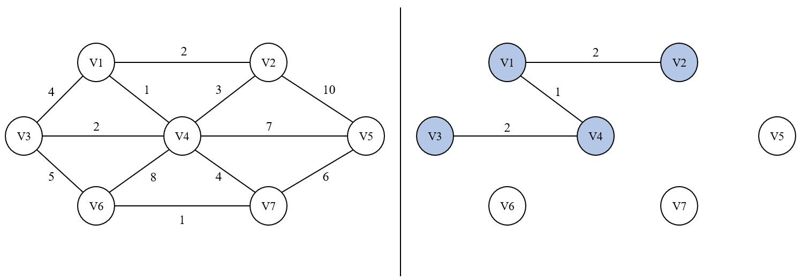
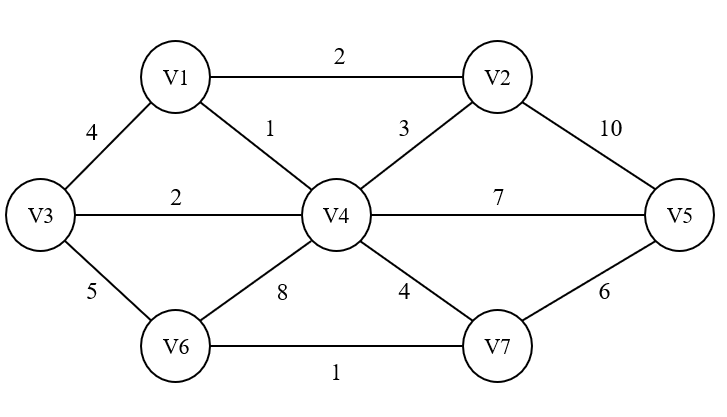
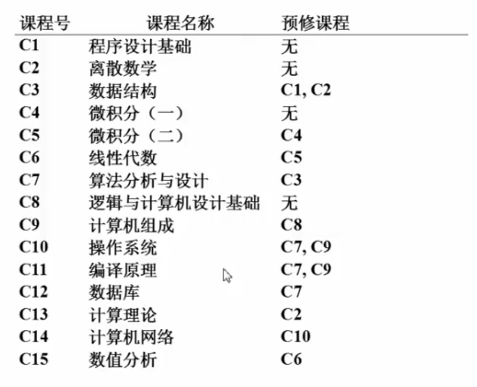
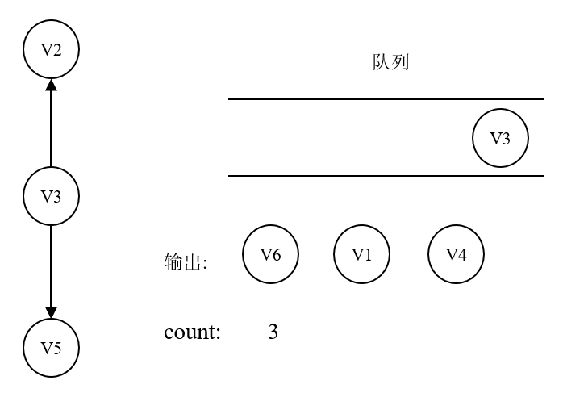
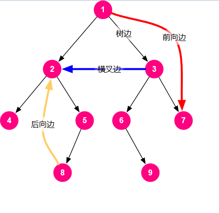
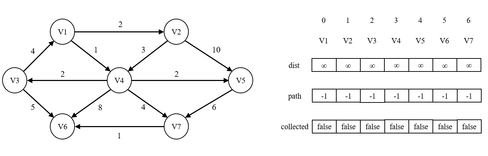

# 图

## 1 概念

### 1.1 有向图及无向图

在图中的数据元素称为**顶点(Vertex)**。V是顶点的有穷非空集合，VR是两个顶点之间的关系的集合。

1. **有向图(Digraph)**：若<v, w> ∈ VR，则<v, w>表示从顶点v到顶点w的一条**弧(Arc)**，且称顶点v为**弧尾**或**初始点**，称顶点w为**弧头**或**终端点**。此时的图称为**有向图**；

2. **无向图(Undigraph)**：若<v, w> ∈ VR必有<w, v> ∈ VR，即这条边的两头是对称的，则以无序对(v, w)表示v和w的一条**边(Edge)**。此时的图称为**无向图**。

即：有向图中称**弧**，无向图中称**边**。


下左图为有向图，下右图为无向图：


### 1.2 完全图

用n表示顶点的数目，用e表示边/弧的数目。

1. 对于无向图，e的取值范围为[0, ½ n • (n - 1)]，有½ n • (n - 1)条边的无向图称为**完全图**；
2. 对于有向图，e的取值范围为[0, n • (n - 1)]，有n • (n - 1)]条边的有向图称为**有向完全图**。

### 1.3 稀疏图和稠密图

用n表示顶点的数目，用e表示边/弧的数目。则，有很少条边或弧(如e ＜ nlogn)的图称为**稀疏图**，反之称为**稠密图**。

### 1.4 网

有时图的边/弧具有与它相关的数，这种与图的边/弧相关的数叫做**权(Weight)**。权通常可以用来表示从一个顶点到另一个顶点的距离/花费.etc，这种带权的图通常称为**网(Network)**。

### 1.5 出度与入度

如果从顶点V到顶点V'之间存在连接，那么称顶点V为顶点V'的**邻接点(Adjacent)**。

以顶点V为弧头的数目称为顶点V的**入度(Indegree)**；以顶点V为弧尾的数目称为顶点V的**出度(Outdegree)**。

即：顶点V的**入度** = **终止**于顶点V的弧的数目；顶点V的**出度**= **起始**于顶点V的弧的数目。

### 1.6 路径

无向图中，从顶点V到顶点V'的**路径**(Path)是一个由顶点组成的序列。有向图中，路径是有向的。

路径的长度 = 路径上**边/弧**的数目。

第一个顶点和最后一个顶点相同的路径称为**回路/环(Cycle)**。序列中顶点**不重复出现**的路径称为**简单路径**。除了第一个顶点和最后一个顶点以外，**其余顶点**不重复出现的路径称为**简单回路/简单环**。

### 1.7 连通

#### 1.7.1 无向图

在无向图中，如果从顶点V到顶点V'有路径，则称顶点V和顶点V'是**连通**的。如果图中**任意**两个顶点之间都是连通的，则称该无向图为**连通图(Connected Graph)**。

**连通分量(Connected Component)**指的是无向图中的**极大连通子图**。


上图共有3个连通分量：


#### 1.7.2 有向图

在有向图中，如果图中**任意**两个顶点之间都存在路径，则称该有向图为**强连通图**。有向图中的极大强连通子图称为有向图的**强连通分量**。

### 1.8 生成树

一个连通图的**生成树**是一个**极小**连通子图，它含有图中全部顶点，但只有足以构成一棵**树**的**n - 1**条边。下两图分别为一个无向图中的最大连通分量及其对应的生成树：


如果在一棵生成树上添加一条边，必定构成一个**环**。一棵有n个顶点的生成树有且仅有**n - 1**条边(因为存在一个根结点)，如果该树多于n - 1条边，则一定有环。但是，有n - 1条边的图不一定是生成树。

如果一个有向图恰有一个顶点的入度为0，其余顶点的入度为1，则它是一棵有向树。一个有向图的**生成森林**由若干棵有向树组成，含有图中全部顶点，但只有足以构成若干棵不相交的有向树的弧。



## 2 图的存储结构

注意：不允许存在自回路的边，即不允许自己指向自己。

### 2.1 邻接矩阵

用一个**二维数组**表示有n个顶点的图时，需要存放n个顶点信息和n<sup>2</sup>个弧信息的存储量。

#### 2.1.1 **无权有向图**其邻接矩阵



其中，矩阵[ 0 ] [ 1 ]处的值为1，表示存在由顶点V1指向顶点V2的边。同理，存在由顶点V1指向顶点V3的边、由顶点V3指向顶点V4的边、由顶点V4指向顶点V1的边。

#### 2.1.2 **无权无向图**其邻接矩阵


其中，矩阵[ 0 ] [ 1 ]处的值为1，表示存在由顶点V1指向顶点V2的边。由于该图为无向图，因此如果存在由顶点A指向顶点B的边，则必存在由顶点B指向顶点A的边，故无权无向图的邻接矩阵为**对称矩阵**。如：矩阵[ 0 ] [ 1 ]处和矩阵[ 1 ] [ 0 ]处的值都为1，表示在顶点V1和顶点V2之间存在一条边。同理，矩阵[ 1 ] [ 2 ]处和矩阵[ 2 ] [ 1 ]处的值都为1，表示在顶点V2和顶点V3之间存在一条边。以此类推。

#### 2.1.3 **网**及其邻接矩阵

在一个网(即带权图)中，如果顶点A和顶点B之间存在一条边/弧，且该边/弧具有权重，则在邻接矩阵中，对应位置元素的值即填为该权重。如果顶点A和顶点B之间不存在边/弧，则邻接矩阵中对应位置元素的值取为∞。


如矩阵[ 2 ] [ 0 ]处的值为8，表示存在由顶点V3指向顶点V1的权重为8的弧，矩阵[ 2 ] [ 3 ]处的值为∞，说明不存在由顶点V3指向顶点V4的弧。

#### 2.1.4 无向图的邻接矩阵的压缩

若考虑无向图的**对称性**，则可采用**压缩存储**的方式，只存入矩阵的下三角(或上三角)元素。

用一个长度为n • (n + 1) / 2 的**一维数组**，对邻接矩阵的下三角(或上三角)元素进行存储。在之前，如果要判断顶点i和顶点j之间有没有边，则可查看邻接矩阵中[ i ] [ j ]的值是否为0。而现在如果要判断顶点i和顶点j之间有没有边，即如果要找到G<sub>i</sub><sub>j</sub>的话，需要在**一维数组**中，先数一下在G<sub>i</sub><sub>j</sub>前面的元素的个数。在G<sub>i</sub><sub>j</sub>前面的元素的总个数，可以通过将**上半部分三角形的面积**，加上**最后一行的列数**求得，如下图：


则G<sub>i</sub><sub>j</sub>在压缩后的邻接"矩阵"中的下标为：i • (i + 1) / 2 + j.

#### 2.1.5 优缺点

使用邻接矩阵的优点：

1. 直观：通过矩阵中元素的值，即可判断图中两个顶点之间是否存在边/弧，及该边/弧的权重大小；
2. 便于查找任一顶点的所有**邻接点(有边相连的顶点)**：
   1. 对于无向图：沿着邻接矩阵的某一行从左向右扫描，即可查找这一行的下标对应的顶点的所有邻接点；
   2. 对于有向图：根据待查找顶点的下标，扫描邻接矩阵中对应下标的**行**和**列**，即可找到指向该顶点的其他顶点，和该顶点所指向的其他顶点。
3. 便于计算任一顶点的入度和出度：
   1. 对于无向图：沿着邻接矩阵的某一行从左向右扫描，非0元素的个数即为该顶点的度(无向图中顶点的入度和出度相等)；
   2. 对于有向图：待查找顶点下标对应行的非0元素个数为**出度**，对应列的非0元素个数为**入度**。

使用邻接矩阵的缺点：

1. 浪费空间：如果存储稀疏图(顶点很多但边很少)，就会产生大量无效元素。但对于稠密图(特别是完全图)还是很合算的；
2. 浪费时间：如果要统计图中一共有多少条边，就要逐一扫描矩阵中的所有元素，时间复杂度高。

### 2.2 邻接表

邻接表(Adjacent List)是图的一种**链式**存储结构，根据每个顶点建立一个**单链表**。

1. **头结点**：头结点由2个域组成，用于表示**顶点**相关信息：
   1. 数据域(data)：一般为**顶点的名字**或其他相关信息；
   2. 链域(firstarc)：指向单链表的**第一个结点**。

2. **链表中的结点**：表结点由3个域组成，用于表示**边/弧**相关信息：
   1. 邻接点域(adjvex)：表示与该顶点邻接的顶点，在邻接表中的下标；
   2. 链域(nextarc)：指向下一条**边/弧**；
   3. 数据域(weight)：一般存储边/弧的**权值**。

头结点通常以顺序结构的形式存储，以便访问任一顶点所在的单链表。

#### 2.2.1 无权无向图及其邻接表

下图为无权无向图及其邻接表：


如上图：邻接表中下标0处的头结点的链域指向的第一个结点，其数据域为3，表示V1的第一个邻接点为邻接表下标3处的顶点V4；邻接表中下标0处的头结点的链域指向的第二个结点，其数据域为1，表示V1的第一个邻接点为邻接表下标1处的顶点V2。根据邻接表中下标3处顶点V4，也可以相应找到它的各个邻接点。以此类推。

#### 2.2.2 无权有向图及其(逆)邻接表

下图为无权有向图及其邻接表和逆邻接表：邻接表.png)

在有向图的邻接表中，只能表示顶点指向的其他顶点，即只能计算**出度**。若要计算指向顶点的其他顶点，即计算顶点的**入度**，则可建立**逆邻接表**。

如上图：邻接表中下标0处的头结点的链域指向的第一个结点，其数据域为2，表示V1指向的第一个邻接点为V3。而在逆邻接表中，逆邻接表中下标0处的头结点的链域指向的第一个结点，其数据域为3，表示指向V1的一个顶点为V4。同理，逆邻接表中下标2处的头结点的链域指向的第一个结点，其数据域为0，表示指向V3的一个顶点为V1。

**即：求出度用邻接表，求入度用逆邻接表**。

#### 2.2.3 带权无向图及其邻接表

下图为带权无向图：


下图为带权无向图的邻接表，其中，链表中的每个结点表示一条边，由3个域组成：①该边指向的顶点在邻接表中的下标；②该边的权重；③指向的下一条边。


#### 2.2.4 建立邻接表

在建立邻接表或逆邻接表时，若输入的顶点信息就是顶点的编号，则建立邻接表的时间复杂度为O(V + E)，其中V为顶点个数，E为边的个数。因为只需要依次根据传进来的顶点信息，逐条边进行搜索即可。否则，需要首先找到每个顶点在图中的位置，再依次根据每一条边建立邻接表，此时建立邻接表的时间复杂度为**O(V • E)**。

如果要判定任意两个顶点V<sub>i</sub>和V<sub>j</sub>之间是否存在边/弧，则需搜索第i个链表或第j个链表，不如邻接矩阵方便。

## 3 图的遍历

从某一顶点出发，遍历图中其余顶点时，我们期望每一个顶点仅被访问一次。这一过程叫做**图的遍历(Traversing Graph)**。但是图的遍历比树的遍历复杂得多，因为图的任一顶点都可能和其余的顶点相邻，所以在访问了某个顶点之后，可能沿着某条路径搜索之后，又回到了该顶点上。例如下图中，沿着V1 -> V2 -> V3 -> V4的路径访问过后，可能还没访问到V5的时候，就沿着V4 -> V1的路径回去了，此时V1就被访问了两遍。


因此，为了避免同一顶点被访问多次，在遍历图的过程中，必须记下每个**已访问过的顶点**。为此，可以增设一个**辅助数组visited[0, 1, ... n - 1]**，数组中每个元素初始值都为false。一旦访问过顶点V<sub>i</sub>，就将visited[i]**置为true**。在之后的搜索过程中，如果遇到visited[j]的顶点，就跳过，遍历其他顶点。

### 3.1 深度优先搜索

深度优先搜索(Depth First Search)类似于树的**前序遍历**。

从图中某个顶点V出发，访问该顶点，之后依次从V的未被访问的邻接点出发遍历图，再根据当前遍历到的顶点，依次遍历它的邻接点。这是一个**递归**的过程。


以上图为例：从V1出发，将V1标记为已被访问。V1有两个邻接点，先选择V2进行遍历。遍历到V2时，将它标记为已访问，此时V2又有两个邻接点，先选择V4进行遍历，并将V4标记为已访问。V4又有邻接点，则遍历V8，并将V8标记为已访问。之后遍历V5，并将V5标记为已访问。此时V5的邻接点V2、V8均已被访问，则回到V8，再回到V4，最后走到V3，将V3标记为已访问。以此类推，得到的访问序列为：

V1 -> V2 -> V4 -> V8 -> V5 -> V3 -> V6 -> V7.  

**复杂度分析**：在深度优先搜索图时，对图中的每个顶点至多调用一次dfs函数，因为一旦某个顶点被访问，在下一次搜索时就不访问它。因此，深度优先搜索实质上是查找每个顶点的邻接点的过程，耗费的时间取决于图的存储结构：

1. 当用邻接矩阵表示时，查找一个顶点花费时间为O(1)，查找一个顶点的邻接点花费时间为O(V)，查找V个顶点的邻接点花费时间为**O(V<sup>2</sup>)**；
2. 当用邻接表表示时，查找一个顶点花费时间为O(1)，查找V个顶点花费时间为O(V)，查找V个顶点的邻接点即相当于查找图中所有的edge，故查找V个顶点的邻接点共花费时间为O(E)。所以，总时间复杂度为**O(V + E)**。

### 3.2 广度优先搜索

广度优先搜索(Breadth First Search)类似于树的**层序遍历**。

从某个顶点V出发，访问完它的所有邻接点之后，再依次访问刚才访问过的每个邻接点的所有邻接点。


除了设置辅助数组以外，还需要设置一个队列，用于存放之后访问的顶点。当队列中的顶点出队时，让其各个邻接点入队。

以上图为例：从V1出发，V1入队。访问V1，V1出队，V2、V3入队；访问V2，V2出队，V4、V5入队；访问V3，V3出队，V6、V7入队。以此类推，得到的访问序列为：

V1 -> V2 -> V3-> V4 -> V5 -> V6 -> V7 -> V8.  

**复杂度分析**：在广度优先搜索图时，每个顶点至多入队、出队一次，时间均为O(1)，所以V个顶点入队、出队的总时间为O(V)。查找V个顶点的邻接点即相当于查找图中所有的edge，故查找V个顶点的邻接点共花费时间为O(E)。所以，总时间复杂度为**O(V + E)**。

### 3.3 遍历不连通图

以图中的一个顶点为起点调用优先搜索函数进行遍历时，相当于把该顶点所在的连通分量遍历了一遍。如果图不连通，意味着图中存在多个连通分量。那么如果图不连通时，就分别对图中的每个顶点调用一次优先搜索函数。如果该顶点被访问过，就跳过；否则，说明该顶点属于新的连通分量，则以它为起点进行遍历，即遍历它所在的连通分量。

如下图，该图不连通，存在3个连通分量：


如果要遍历整个图，则需分别遍历这3个连通分量：


对A调用优先搜索函数，即遍历了A、C、F、L、J、M、B，并将它们都标记为已访问；

对B调用优先搜索函数，由于它已经被访问过，则跳过；

对C调用优先搜索函数，由于它已经被访问过，则跳过；

对D调用优先搜索函数，由于它没有被访问过，因此说明D属于另一个连通分量，则以它为起点进行遍历。遍历D、E并将它们都标记为已访问；

对E调用优先搜索函数，由于它已经被访问过，则跳过；

以此类推。

## 4 最小生成树

### 4.1 引入

假设要在n个城市之间建立通信联络网，则连通n个城市最多需要 n • (n + 1) / 2 条线路，最少只需要**n - 1**条线路。并且，每条线路都有相应的花费(即边的权值)，则需要优化的问题是：如何在最节省经费的前提下建立这个通信网。

用连通网表示n个城市及它们之间可能设置的通信线路，其中，网的顶点表示各个城市，网的边表示两个城市之间的线路，边的权值表示线路的花费。对于n个顶点的连通网，可以建立许多不同的生成树，每一棵生成树即有n - 1条边，故每棵生成树都可以是一个通信网。则上述问题转化为：构造连通网的最小代价生成树(Minimum Cost Spanning Tree)，简称**最小生成树(Minimum Spanning Tree)**。

最小生成树特点：

1. 是一棵**树**：
   1. 没有回路；
   2. V个顶点，一定有V - 1条边。
2. 是**生成**树：
   1. 包含图中的全部顶点；
   2. V - 1条边都在原始的图里。
3. 边的**权重和**最小。

例如，对于下图所示的无向图：


它可以有多棵最小生成树：


注意：在最小生成树中，任加一条边都会构成回路。

**最小生成树存在 <=> 图连通**

### 4.2 贪心算法

求解最小生成树的算法有多种，都可以归结为**贪心算法**。

贪心算法(又称贪婪算法)是指，在对问题求解时，总是做出在当前看来是最好的选择。也就是说，不从整体最优上加以考虑，算法得到的是在某种意义上的局部最优解。
贪心算法一般按如下步骤进行：

1. 建立数学模型来描述问题；
2. 把求解的问题分成若干个子问题；
3. 对每个子问题求解，得到子问题的局部最优解；
4. 把子问题的解局部最优解合成原来解问题的一个解。

贪心策略适用的前提是：**局部最优策略能导致产生全局最优解**。

在贪心算法解决最小生成树问题的过程中：

1. "贪"：每一步都要最好的；
2. "好"：每一次都要选出**权重最小**的边。

约束条件：

1. 只能用图里有的边；
2. 如果图中有V个顶点，那么最小生成树需要正好用掉V - 1条边；
3. 不能有回路。

#### 4.2.1 Prim算法 - 让一棵小树长大

##### 4.2.1.1 基本思想

选中图中的一个顶点作为起点，从它开始，将它作为最小生成树的根结点。之后，让这棵树慢慢"长大"，每一次都根据树中的结点，找到**树以外**的权重最小的边，将这条边和它对应的顶点收录进生成树中。直到这棵树全部收录完了图中的所有顶点，此时的树即为最小生成树。

##### 4.2.1.2 演示

Prim(普利姆)算法构建最小生成树的步骤如下图所示：

1. 原始图：

   

2. 将图拆分为各个单独的顶点，选取V1作为起点：

   

3. 与V1相邻接的权重最小的边为V1 --- V4，则将V4收录进最小生成树：

   

4. 与V1、V4相邻接的权重最小的边为V3 --- V4或V1 --- V2，先选择V1 --- V2，则将V2收录进最小生成树：

   

5. 与V1、V2、V4相邻接的权重最小的边为V3 --- V4，则将V3收录进最小生成树：

   

6. 与V1、V2、V3、V4相邻接的权重最小的边为V4 --- V2，但如果将这条边收录进生成树，会构成回路！所以只能选择另外的边。V1 --- V3也不可以，也会构成回路。最终选择V4 --- V7，将V7收录进最小生成树：

   

7. 与V1、V2、V3、V4、V7相邻接的权重最小的边为V6 --- V7，则将V6收录进最小生成树：

   

8. 与V1、V2、V3、V4、V7、V6相邻接的权重最小的边为V7 --- V5，则将V5收录进最小生成树：

   

9. 此时最小生成树中已收录进了V个顶点，正好有V - 1条边，此时的树即为最小生成树。

##### 4.2.1.3 执行过程

1. 创建一个dist数组用于记录生成树以外的顶点到生成树中的顶点的距离；
2. 创建一个parent数组，借用并查集思路，用于记录生成树中的顶点之间的父结点关系；
3. 初始化时，dist数组中的元素全部为∞，因为此时还未选择生成树的根结点，所以每个顶点到这棵生成树的距离都为∞。同时，parent数组中的元素全部为-1，代表每个顶点各自形成一棵树，没有父结点；
4. 选择图中的一个顶点作为树的根结点，则它在dist中的值更新为0，表示它已经被收录进生成树中，到生成树的距离即为0；
5. 之后执行一个死循环：
   1. 每一次都找到dist数组中最小的非0元素所在下标(**判断非0的目的就是防止回路，因为生成树中的顶点到生成树的距离为0**)，根据邻接表即可找到这个顶点，这个顶点即为**取得最小的到生成树的距离**的顶点，记为V。将V收录进生成树，即dist[V] = 0；
   2. 扫描V的每个邻接点W，如果W没有被收录进生成树(即dist[W] != 0)，则进行一次比较：比较V到W的距离是否小于W到生成树的距离。如果是，则将W到生成树的距离更新为V到W的距离，并让V成为W的父结点，即parent[W] = V；
   3. 直到这样的V不存在，即dist中元素全为0，或dist中元素不是0就是∞，说明生成树外的顶点要么都被收录，要么都没有办法和生成树中的结点产生联系。此时，死循环结束。
6. 判断此时dist数组中的元素情况：
   1. 如果数组中0的个数恰好等于图的顶点个数，**即生成树已经收录了图的**全部顶点，生成树的结点个数 = 图的顶点个数，说明此时的生成树即为最小生成树；
   2. 如果数组中0的个数小于图的顶点个数，即生成树没有将全部顶点都收录，但也**没有办法更新**生成树外的顶点到生成树的距离，说明这部分生成树外的顶点和生成树中的结点**没有边进行联系**，则图不连通，生成树不存在。

整个过程的伪代码如下：

```
void prim() {
    // 初始化
    dist[0, 1, 2, ..., V - 1] = ∞;
    parent[0, 1, 2, ..., V - 1] = -1;

    // 选择一个顶点作为生成树的起点
    dist[start] = 0;

    while (true) {
        V = 未收录顶点中dist的最小者;

        if (这样的V不存在) {
            break;
        }

        // 生成树外的顶点没有全部被收录，且和生成树中的结点存在边连接
        // 并且找到了未收录顶点中dist的最小者
        将V收录进生成树MST：dist[V] = 0;

        for (V的每个邻接点W) {
            if (dist[W] != 0) {
                if (E<V, W> < dist[W]) {
                    dist[W] = E<V, W>;
                    parent[W] = V;
                }
            }
        }
    }

    if (MST中收录的顶点不到V个) {
        Error("图不连通，生成树不存在！")
    }
}
```

##### 4.2.1.4 时间复杂度

Prim算法的时间复杂度取决于如何找到**未收录顶点中dist的最小者**。如果使用暴力搜索的方法，每一次找最小者，需要O(V)。共有V - 1个顶点需要循环，就需要找V - 1次dist最小者，故总的时间复杂度为**O(V<sup>2</sup>)**。这种方法对于**稠密图**来说比较合算，因为边多的话也不影响时间复杂度。

#### 4.2.2 Kruskal算法 - 将森林合并成树

##### 4.2.2.1 基本思想

直接了当的"贪心"：初始状况下，每一个顶点都是一棵树。此后，**每次**都在图中找**权重最小**的边，构建一个由权重最小的边的各棵树组成的**森林**。再将森林中的各棵树相互合并，最终形成最小生成树。

##### 4.2.2.2 演示

Kruskal(克鲁斯卡尔)算法构建最小生成树的步骤如下图所示：

1. 原始图：

   

2. 将图拆分为各个单独的顶点，每个顶点都是一棵树：

   

3. 找到权重最小的边V1 --- V4，让顶点V1和顶点V4合并：

   

4. 找到权重最小的边V6 --- V7，让顶点V6和顶点V7合并：

   

5. 找到权重最小的边V3 --- V4，让顶点V3和顶点V4合并：

   

6. 找到权重最小的边V1 --- V2，让顶点V1和顶点V2合并：

   

7. 找到权重最小的边V4 --- V2，但会构成回路。再找到权重最小的边V1 --- V3，也会构成回路。所以最终选择V4 --- V7，让顶点V4和顶点V7合并：

   

8. 找到权重最小的边V3 --- V6，但会构成回路。找到权重最小的边V7 --- V5，让顶点V7和顶点V5合并：

   

9. 此时最小生成树中已收录进了V个顶点，正好有V - 1条边，此时的树即为最小生成树。

##### 4.2.1.3 执行过程

1. 创建一个parent数组，借用并查集思路，用于记录生成森林中的每棵树的顶点之间的父结点关系；
2. 初始化时，parent数组中的元素全部为-1，代表每个顶点各自形成一棵树，没有父结点；
3. 之后执行一个死循环：
   1. 每一次都弹出图中**权重最小**的边，并将这条边从原始图中的边集合删除，以免下次弹出同样的边；
   2. 如果这条边**不会**让生成树构成回路，则将这条权重最小的边收录进森林，并在parent数组中合并这条边指向的两棵树；
   3. 当生成树中还未收录满V个顶点，且仍然有权重最小的边可以弹出时，继续执行该循环。

4. 当跳出循环后，判断此时parent数组中的元素情况：如果生成树中不到V个结点(即parent数组中不等于-1的元素个数 + 等于-1的一个根结点的总个数小于V)，说明生成树还没收满的时候，边就已经删完了，证明图不连通。

关键点在于：

1. 如何每次都弹出图中权重最小的边：将所有边(两个顶点)及边的权重，根据权重大小存入一个**最小堆**，每次弹出最小堆顶端元素时，即弹出权重最小的边，以及它所指向的两个顶点。

   要注意，在构建最小堆时，对于**无向图**，同一条边指向的两个顶点，**不可以存放两次**！例如(0, 2)这条边已经被存过，那么(2, 0)这条边和(0, 2)其实是同一条边，不能再存一遍。所以每次存放一条边的时候，都要对最小堆中的元素根据起始点、终端点进行扫描。如果扫描到同一条边，就不添加；由于最小堆是顺序存储，所以如果扫描到空元素，说明这条边没有被添加过，则将它添加到最小堆中。

2. 如何防止回路：使用并查集，当要收录一条边(即合并两棵树)的时候，先判断这条边所指向的两个顶点**所在集合的根结点是否相同**。如果相同，说明它们属于同一个集合，如果相连的话就会构成回路。

整个过程的伪代码如下：

```
void kruskal() {
    // 初始化
    parent[0, 1, 2, ..., V - 1] = -1;

    // 将边根据权重构建一个最小堆
    createMinBinaryHeap(Graph);

    while (生成树MST中还未收录V个顶点 && 最小堆中还有边) {
        E<V, W> = minBinaryHeap.deleteMin(); // 最小堆

        if (E<V, W>中V和W不属于同一个集合，合并V、W不会使生成树构成回路) { 
            合并V、W，将E<V, W>收录进MST; // 并查集
        }
    }

    if (MST中收录的顶点不到V个) {
        Error("图不连通，生成树不存在！")
    }
}
```

##### 4.2.1.4 时间复杂度

1. 构建最小堆：自底向上的方式，插入每条边花费O(1)的平均时间和O(logE)的最坏情形时间，因此总运行时间为**O(E)**；
2. 删除顶端元素：进行一次删除顶端元素后，其他元素需要上滤调整，花费O(logE)。删除E条边，共花费**O(ElogE)**；
3. 并查集查询：共花费**O(V • α(n))**，其中α(n)为一个增长缓慢的函数，α(n) ≤ 4。

因此，总的时间复杂度为**O(ElogE)**，对于**稀疏图**来说比较合算，因为边少的话，时间复杂度就低。

## 5 拓扑排序

### 5.1 引入

拓扑排序(Topological Sort)，就是由某个集合上的一个**偏序**得到该集合上的一个**全序**。

- 偏序：集合中仅有**部分**成员可以相互比较；
- 全序：集合中**全体**成员之间均可比较。

如下图，图(a)表示偏序，图(b)表示全序。


即：图(a)中并不是任意两个顶点之间都有联系，而图(b)中任意两个顶点之间都有弧。

如果在图(a)中增加一条V2指向V3的弧，那么图(a)也成为全序，且这个全序成为**拓扑有序**。由偏序得到拓扑有序的操作称为**拓扑排序**。拓扑序：如果图中顶点V到顶点W有一条有向路径，那么V一定排在W之前。满足此条件的顶点序列称为一个拓扑序，获得一个拓扑序的过程就是拓扑排序。

### 5.2 应用

案例1：Makefile 管理 target 之间依赖时，比如生成 A 依赖 B、C，生成 C 依赖 B、D。此时要先用 B、D 生成 C，再用  B、 C 生成 A。这种依赖关系一旦复杂时，不可能靠人工指定顺序，而要靠拓扑排序自动生成有向无环图。

案例2：一个完整的项目往往会包含很多代码源文件。编译器在编译整个项目的时候，需要按照依赖关系，依次编译每个源文件。比如，A.cpp 依赖 B.cpp，那在编译的时候，编译器需要先编译 B.cpp，才能编译 A.cpp。


我们可以把源文件与源文件之间的依赖关系，抽象成一个有向图。每个源文件对应图中的一个顶点，源文件之间的依赖关系就是顶点之间的边。如果 a 先于 b 执行，也就是说 b 依赖于 a，那么就在顶点 a 和顶点 b 之间，构建一条从 a 指向 b 的边。而且，这个图不仅要是有向图，还要是一个**有向无环图**，也就是不能存在像 a->b->c->a 这样的循环依赖关系。将源文件进行拓扑排序，即可得到正确的编译顺序。

### 5.3 零入度算法实现拓扑排序

#### 5.3.1 步骤

例如，学习计算机专业的学生的课程安排如下。



其中有些课程是基础课，独立于其他课程，如《微积分(一)》；而有些课程必须在学完作为它的基础的先修课程之后才能开始，如在《程序设计基础》和《离散数学》学完之前不能开始学习《数据结构》。这些先决条件定义了课程之间的优先关系。该优先关系可以使用有向图表示，顶点表示课程，有向边(弧)表示先决条件。这种用顶点表示活动，用弧表示活动之间的优先关系的**有向图**称为**顶点表示活动的网(Activity On Vertex Network，简称AOV网)**。在网中，如果顶点i到顶点j有一条有向路径，即存在i指向j的弧，则称i是j的前驱，j是i的后继。


如果AOV网有合理的拓扑序，那么AOV网一定是一个**有向无环图(Directed Acyclic Graph, DAG)**。因为，在AOV网中，**不允许存在有向环**，因为存在环意味着某项活动要以自己作为先决条件，即V要在V开始前结束，这是不可能的，其实就是出现了**死循环**。


在上述计算机专业学习课程图中，可以按照下面的方式进行排课：

第一学期安排没有预修课程的课：C1、C2、C8、C4。


第二学期，由于已经在第一学期学完了C1、C2、C8、C4四门课，因此可以安排以这四门课为预修课程的课：C3、C13、C9、C5。这些课在这学期是**没有前驱**的。


第三学期，同理，可以安排：C7、C6。这些课在这学期是**没有前驱**的。


最后，排课顺序为：


上述过程就是拓扑排序，具体步骤分为以下两步：

1. 在有向图中，选择一个没有前驱(即入度为0)的顶点，输出该顶点；
2. 从图中删除这个顶点，以及以它为起始点(弧尾)的弧。

注意到，每一次输出的顶点都是没有前驱的顶点。而在有向图中，每个顶点存在两个度：出度和入度。因此，**没有前驱 <=> 入度为0**。而在图中删除以这个顶点为起始点的弧时，其实就是把这条弧指向的顶点的**入度都减1**。

具体实现：

1. 对于每个顶点的头结点，除了存放顶点名字、指向第一个邻接点的链域以外，还要新开一个域用于存放顶点的**入度**；
2. 找到入度为0的顶点，输出之，并将它的邻接点的入度都减1。

注意：在查找入度为0的顶点的过程中，如果使用暴力搜索，那么每一次都要花费O(V)的时间，那么V个顶点就要花费O(V<sup>2</sup>)的时间，非常慢！

因此，**解决方法**为：用空间换时间。在每一步都将入度为0的顶点放到一个**容器**里(如队列)，那么当下次要输出一个入度为0的顶点时，就不用再去扫描所有的顶点，而是将容器里的元素弹出即可。当容器**非空**时，就将顶点弹出。将顶点弹出后，将该顶点的邻接点的入度都减1。如果某个顶点的入度减1之后，入度也恰好**变为0**，那么也要让这个顶点**进入到容器中**。同时，需要一个计数器对输出顶点的个数进行统计。每输出一个顶点，计数器的值就加1。当容器为空时，表明已经容器中没有顶点可以输出。如果计数器的值不等于图中顶点的个数，说明还未进入容器的顶点入度都不为0，说明**图存在回路**，无法进行拓扑排序。

#### 5.3.2 演示

##### 5.3.2.1 无环图

对下图进行拓扑排序，选择队列进行入度为0的顶点的存放和输出：


1. 初始时V1、V6没有前驱，即它们的入度为0，则先让V6入队、再让V1入队：

   

2. V6出队，在图中删除V6向外指的弧，V6的邻接点的入度都减1：

   

3. V1出队，在图中删除V1向外指的弧，V1的邻接点的入度都减1。注意到此时V3、V4的入度恰好变为0，则先让V4入队，再让V3入队：

   

4. V4出队，在图中删除V4向外指的弧，V4的邻接点的入度都减1：

   

5. V3出队，在图中删除V3向外指的弧，V3的邻接点的入度都减1。注意到此时V2、V5的入度恰好变为0，则先让V2入队，再让V5入队：

   

6. 图中V2、V5出度已经没有向外指的弧，则依次让V2、V5出队即可：

   

此时输出顶点的个数恰好**等于**图中顶点的个数，则该图为无环图，拓扑排序成功。

##### 5.3.2.2 有环图(无法进行拓扑排序)

对上图制造环：


1. 初始时V6没有前驱，即V6的入度为0，则让V6入队：

   

2. V6出队，在图中删除V6向外指的弧，V6的邻接点的入度都减1：

   

此时的队列已经空，但图中已经没有入度为0的顶点可以入队，说明还未入队的顶点的入度都不为0，计数器的值也不等于图中顶点的个数，证明图中**存在回路**，无法进行拓扑排序。

#### 5.3.3 时间复杂度

1. 初始时，建立存放入度为0的顶点的队列，需要扫描V个顶点，花费**O(V)**；
2. 每个顶点入队、出队各一次，花费O(1)，V个顶点共花费**O(V)**；
3. 顶点出队后，要更新邻接点的入度，所以每条边都被扫描了一次，共花费**O(E)**。

因此，总的时间复杂度为**O(V + E)**。

### 5.4 深度优先搜索实现拓扑排序

#### 5.4.1 思路

当**有向图**中无环时，也可以利用深度优先搜索进行拓扑排序。由图中某点出发进行深度优先搜索时，最先退出dfs函数的即为**出度为0**的顶点，即拓扑排序的**最后一个**顶点。因此，按照退出dfs函数的先后顺序记录下来的顶点序列，即为逆拓扑有序序列。所以，每次找到出度为0的顶点时，将其插入到一个链表的**最前端**，遍历该链表时即为拓扑有序序列。

#### 5.4.2 颜色与时间戳

深度优先搜索总是对最近发现的顶点V的出发边进行探索，直到该顶点的所有出发边都被发现为止。一旦顶点V的所有出发边都被发现，搜索则**回溯**到该顶点的前驱顶点，进而搜索前驱顶点的出发边。

在搜索过程中，对顶点进行涂色来表示顶点的状态：

1. 每个顶点的初始颜色都为白色，即顶点未被访问时为**白色**；
2. 顶点被发现后变为**灰色**；
3. 当顶点的所有邻接点都扫描完毕后，顶点变为**黑色**。

此外，深度优先搜索算法还为每个顶点盖上一个**时间戳**：

1. V.d记录顶点V第一次被发现的时间，即被**涂上灰色**时的时间；
2. V.f记录顶点V的所有邻接点都扫描完毕的时间，即被**涂上黑色**时的时间。

#### 5.4.3 边的分类

1. 树边：如果顶点V是由于搜索有向边E<U, V>时而被发现的，则E<U, V>是一条树边；
2. **后向边**：如果有向边E<U, V>指向的顶点V反而是顶点U的祖先顶点，说明图中存在环，此时有向边E<U, V>称为后向边，如下图中的顶点8 --> 顶点2；
3. 前向边：如果顶点U指向深度优先树的一个后代顶点V，则称有向边E<U, V>为前向边；
4. 横向边：横向边可以连接同一棵深度优先树的不同顶点(只要其中一个顶点不是另一个顶点的祖先)，也可以连接不同深度优先树的两个顶点。



#### 5.4.4 步骤

1. 初始时将所有顶点都**涂上白色**，且每个顶点第一次被发现的时间都为0；
2. 由于有向图不一定是强连通图，因此要遍历每一个连通分量：
   1. 对于顶点的每一个邻接点，如果为白色，说明还没被发现过，就以它为起点进行深度优先搜索：
      1. 首先将它**涂上灰色**，表示它已经被发现，并将它的**第一次被发现的时间加1**；
      2. 再对它的邻接点**递归**进行重复上述过程；
      3. 当递归搜索的顶点没有向外出发的边时，将该顶点**涂上黑色**，表示已经扫描完它所有的邻接点，同时将它的**扫描完毕邻接点的时间加1**；
      4. 将当前涂上黑色的顶点插入到一个链表的**最前端**。
   2. 对于顶点的每一个邻接点，如果为黑色，说明该顶点的邻接点已经完成搜索，则前往下一个邻接点进行搜索；
   3. 对于顶点的每一个邻接点，如果为灰色，说明该顶点的邻接点在之前已经被访问过，证明图中**存在后向边**，即图中有回路，**无法进行拓扑排序**！

伪代码如下：

```
time; // 全局变量

dfs(Graph):
	for (每一个顶点V) {
		V.color = WHITE; // 未被发现
	}
	
	time = 0;
	
	for (每一个顶点V) {
		if (V.color == WHITE) {
			dfsVisit(Graph, V);
		}
	}

dfsVisit(Graph, V) {
	time++;
	
	V.d = time;
	
	V.color = GREY; // 被发现
	
	for (V的每个邻接点W) {
		if (W.color == WHITE) {
			dfsVisit(Graph, W);
		} else if (W.color == GREY) {
			Error("存在后向边");
		}
	}
	
	V.color = BLACK; // 扫描完所有邻接点
	
	time++;
	
	V.f = time;
	
	将V插入到链表最前端;
}
	
```

#### 5.4.5 演示

##### 5.4.5.1 无环图

1. 初始时，所有顶点均为白色：

   

2. 从V1开始搜索，V1由白色变为灰色。V1的邻接点有V2、V3、V4。先搜索V2，V2由白色变为灰色：

   

3. V2已没有向外出发的边，即已经扫描完V2的所有邻接点，将V2涂上黑色，并插入到链表最前端：

   

4. 回溯到V1，搜索V1的下一个邻接点V3，V3由白色变为灰色：

   

4. V3的邻接点有V2、V5。V2已无需搜索，则搜索V5，V5由白色变为灰色：

   

6. V5已没有向外出发的边，即已经扫描完V5的所有邻接点，将V5涂上黑色，并插入到链表最前端：

   

7. 回溯到V3，V3的邻接点都已经被涂上黑色，则将V3也涂上黑色，并插入到链表最前端：

   

8. 回溯到V1，搜索V1的下一个邻接点V4，V4由白色变为灰色：

   

9. V4已没有向外出发的边，即已经扫描完V4的所有邻接点，将V4涂上黑色，并插入到链表最前端：

   

10. 回溯到V1，V1已没有向外出发的边，即已经扫描完V1的所有邻接点，将V1涂上黑色，并插入到链表最前端：

    

11. 找到下一个未被访问过的连通分量，即V6，将V6涂上灰色。V6的邻接点有V4、V5，它们已无需搜索，即已经扫描完V6的所有邻接点，将V6涂上黑色，并插入到链表最前端：

    

12. 此时链表的结点顺序满足拓扑有序序列。

##### 5.4.5.2 有环图(无法进行拓扑排序)

对上图制造环：


1. 从V1开始搜索，V1由白色变为灰色。V1的邻接点有V3、V4。先搜索V3，V3由白色变为灰色：

   

2. V3的邻接点有V2、V5。先搜索V2，V2由白色变为灰色：

   

3. V2的邻接点有V1，而V1已经被涂上灰色，说明V2指向的下一个顶点已经被发现过，即V2指向的下一个顶点反而是V2的祖先顶点。故图中存在后向边，即图中有回路，无法进行拓扑排序！

## 6 关键路径

### 6.1 引入

与AOV网相对应的是**AOE网(Activity On Edge)**，即边表示活动的网。AOE网是一个**带权有向无环图**，其中，顶点表示事件，弧表示活动，权重表示活动持续的时间。

如下图所示：


V1表示工程开始；V9表示工程结束；V5表示V2、V3分别花费了1天的时间后已经完成，可以开始向V7、V8目标开展。有向边上的权重表示完成一个活动需要花费多少时间，即持续时间。

由于一个工程只有一个开始点和一个完成点，因此在正常(无环)情况下，网中只有一个入度为0的点，称为**源点**，和一个出度为0的点，称为**汇点**。

### 6.2 关键路径

由于在AOE网中，有些活动是可以**并行**着进行的，因此，完成某项活动/整个工程的最短时间，是由开始点到完成点的最长路径的长度决定的(此处最长路径表示为路径上各个**持续时间之和**，与之前的定义不同)。路径长度最长的路径称为**关键路径(Critical Path)**。

#### 6.2.1 最早开始时间

假设开始点为V<sub>1</sub>，则从事件V<sub>1</sub>到事件V<sub>i</sub>的**最长**路径长度称为事件V<sub>i</sub>的最早发生时间，这个时间决定了所有以事件V<sub>i</sub>为起始点的活动的**最早开始时间**。

如下图，V5需要**等齐**V2、V3、V6都完成之后，才能继续去开展V7、V8。


由V1 --> V2 --> V5需要花费6 + 1 = 7天的时间；

由V1 --> V3 --> V5需要花费4 + 1 = 5天的时间；

由V1 --> V4 --> V6 --> V5需要花费5 + 2  + 0 = 7天的时间。

因此，V5得等这三条路**都完成**了之后，才能开展后续工作。虽然V1 --> V3 --> V5最先完成，但是V5得等另外两部分工作都完成了之后，才能往下进行。

**注意一个词：等齐，比较通俗的理解。**

#### 6.2.2 最迟开始时间

在**不耽误**整个工程的情况下，活动a<sub>i</sub>最迟必须开始进行的时间，称为**最迟开始时间**。

e.g.1 如下图，根据最长路径(即花费时间最长的路径)，可以计算得出完成整个工程需要花费的时间为18天。


倒推回去，事件V8 --> V9需要花费4天的时间，那么V8**最晚**需要在第14天的时候开工，否则如果晚于第14天开工，那么经过4天后，就过了期限了！即V8的**最迟开始时间**为16。

同理，事件V7 --> V9需要花费2天的时间，那么V7**最晚**需要在第16天的时候开工，否则如果晚于第16天开工，那么经过4天后，也就过了期限。即V7的**最迟开始时间**为16。

为了**不耽误**V7在第16天开工，且**不耽误**V8在第14天的时候开工，V5**最晚**要在第7天的时候开工。

对于V6，V6 --> V8本来在第10天的时候开工就足够了，这样就不会耽误V8。但是！V5得一起等V6完成后，才能开展后续工作，而V6 --> V5花费0天的时间，所以为了**不耽误**V5和V5的后续工作，V6最迟要在第7天的时候开工。


对于V3，V3 --> V6本来在第5天的时候开始就足够了，这样就不会耽误V6。但是！V4最迟得在第6天的时候开始，不然会耽误V6。所以，为了**不耽误**V4和V4的后续工作，V3最迟要在第2天的时候开始。

同样，对于V1，V1 --> V3本来在第2天的时候开工就足够了，这样就不会耽误V3。但是！V2最迟得在第6天的时候开工，且V4最迟得在第5天的时候开工。所以，为了**不耽误**V2和V4的后续工作，V1最迟要在第0天的时候开工。

**注意一个词：不耽误，比较通俗的理解。**

#### 6.2.3 关键活动

最早开始时间 == 最迟开始时间的活动称为**关键活动**。

求解每个活动的最早开始时间的步骤：

1. 初始时，设源点为0，即earliest[0] = 0；

2. 对于每个活动V<sub>j</sub>，其最早开始时间

   earliest[j] = max { earliest[i] + E<i, j> }.

   即：每个活动的最早开始时间，由它前面的每个相邻活动，加上它们之间的持续时间得到。如果有多个相邻活动，则取每个活动和持续时间之和的最大值。

   

   例如上图中的V5：

   earliest[V5] = max { earliest[V2] + 1, earliest[V3] + 1, earliest[V6] + 0 }

   ​				   = max { 6 + 1, 4 + 1, 7 + 0 }

   ​				   = max { 7, 5, 7 }

   ​				   = 7.

求解每个活动的最迟开始时间的步骤：

1. 初始时，设汇点为最长路径的长度，即latest[V - 1] = maxTime；

2. 对于每个活动V<sub>i</sub>，其最迟开始时间

   latest[i] = min { latest[j] - E<i, j> }.

   即：每个活动的最迟开始时间，由它后面的每个相邻活动，减去它们之间的持续时间得到。如果有多个相邻活动，则取每个活动和持续时间之差的最小值。

   

   例如上图中的V6：

   latest[V6] = min { latest[V8] - 4, latest[V5] - 0 }

   ​				= min { 14 - 4, 7 - 0 }

   ​				= min { 10, 7 }

   ​				= 7.

   例如上图中的V1：

   latest[V1] = min { latest[V2] - 6, latest[V3] - 4, latest[V4] - 5 }

   ​				= min { 6 - 6, 6 - 4, 5 - 5 }

   ​				= min { 0, 2, 0 }

   ​				= 0.

如果一个活动的**最早开始时间 == 最迟开始时间**，则为**关键活动**。关键路径上的活动都是关键活动，且关键路径不唯一。

如下图，共有2条关键路径，长度都为18：

V1 --> V2 --> V5 --> V7 --> V9 & V1 --> V2 --> V5 --> V8 --> V9


#### 6.2.4 编程实现

##### 6.2.4.1 求解最早开始时间

1. 初始化时，将所有顶点的时间都置为**0**；
2. 为了实现earliest[j] = max { earliest[i] + E<i, j> }，从第一个顶点开始，如果自身时间 + 持续时间 > 指向的下一个顶点的时间，就更新指向的下一个顶点的时间。

##### 6.2.4.2 求解最迟开始时间

1. 由于最迟开始时间需要**从后往前推**，因此得先根据求解最早开始时间的拓扑序列，将每个顶点压入**栈**中，制造**逆拓扑有序序列**。

   即，**在拓扑排序算法中，增设一个栈以记录拓扑有序序列，那么，在计算每个顶点的最早开始时间后，从栈顶至栈底，即为逆拓扑有序序列**。

2. 初始化时，将所有顶点的时间都置为**最长路径长度**；

3. 从逆拓扑有序序列中，按从后往前的顺序弹出顶点。为了实现latest[i] = min { latest[j] - E<i, j> }，从倒数第二个顶点开始，如果指向的下一个点的时间 - 持续时间 < 自身时间，就更新自身时间。

如果最早开始时间 == 最迟开始时间，就将该顶点标注*号，说明该顶点为关键活动。

## 7 最短路径

### 7.1 负值圈

求解最短路径时，不能出现**负值圈**。如下图：如果V2到V5的权重为负值，那么当要求顶点V5到顶点V4的最短距离时，并不是从V5直接走向V4，而是不断地绕圈V5 ---V4 --- V2 --- V5 ---V4 --- V2 ...，因为这样走的话，得到的权重和会越来越小。如果出现这样的负值圈，基本所有算法都失效，所以，带权有向图中不可以出现负值圈的情况。


### 7.2 从某个顶点到另一个顶点的最短路径

求解**带权有向图**中，从一个顶点出发(起点)，到另一个顶点(终点)的最短路径的方法，可以采用**Dijkstra(迪杰斯特拉)算法**。这个问题也称为**单源最短路径问题**。

#### 7.2.1 执行

Dijkstra算法步骤：

1. 定义三个数组：

   1. dist数组：用于记录起点到其他顶点的最短路径长度；
   2. path数组：用于记录最短路径上的顶点的上一个点(并查集思路)；
   3. collected数组：用于记录该顶点是否已被收录进最短路径中。

2. 初始化：

   1. dist数组中的元素全部为∞；
   2. path数组中的元素全部为-1；
   3. collected数组中的元素全部为false。

3. 选定一个起点start后，将dist置为0，即dist[start] = 0，起点到该顶点(起点)的最短距离必定为0；

4. 进入死循环：

   1. 每一次都找dist中最小者，记为V；

   2. 将V收录进最短路径(贪心)，即collected[V] = true；

   3. 对于V的每个邻接点W，如果W没有被收录过，就计算 

      [ 起点到顶点V的距离 ] + [ V和W之间的距离 ].

      如果这个值小于 [ 起点到顶点W的距离 ]，

      就更新 [ 起点到顶点W的距离 ] 为 [ 起点到顶点V的距离 ] + [ V和W之间的距离 ]，并将W的上一个点记为V。

   4. 直到终点被收录进最短路径时，说明已经找到最短路径，跳出即可。

整个过程的伪代码如下：

```
void dijkstra() {
    // 初始化
    dist[0, 1, 2, ..., V - 1] = ∞;
    path[0, 1, 2, ..., V - 1] = -1;
    collected[0, 1, 2, ..., V - 1] = false;

    // 选择一个顶点作为起点，则起点到该顶点的最短路径为0
    dist[start] = 0;

    while (true) {
        V = 未收录顶点中dist的最小者;

        if (collected[end] == true) {
            break;
        }

        collected[V] = true;

        for (V的每个邻接点W) {
            if (collected[W] == false) {
                if (dist[V] + E<V, W> < dist[W]) {
                    dist[W] = dist[V] + E<V, W>;
                    path[W] = V;
                }
            }
        }
    }
}
```

#### 7.2.2 演示

1. 初始图：

   

2. 设V1为起点start，V6为终点end。

   选择V1作为起点，dist[start] = 0。V = 未收录顶点dist中最小者 = V1，将V1收录。V的邻接点有V2、V4。

   1. 对于V2：dist[V1] + E<V1, V2> 

      ​           = 0 + 2 

      ​           < dist[V2] = ∞

      => dist[V2] = 2, path[V2] = V1.

   2. 对于V4：dist[V1] + E<V1, V4> 

      ​           = 0 + 1 

      ​           < dist[V4] = ∞

      => dist[V4] = 1, path[V4] = V1.

   

3. V = 未收录顶点中dist最小者 = V4，将V4收录。V的邻接点有V3、V5、V6、V7。

   1. 对于V3：dist[V4] + E<V4, V3> 

      ​           = 1 + 2 

      ​           < dist[V3] = ∞

      => dist[V3] = 3, path[V3] = V4.

   2. 对于V6：dist[V4] + E<V4, V6> 

      ​           = 1 + 8 

      ​           < dist[V6] = ∞

      => dist[V6] = 9, path[V6] = V4.

   3. 对于V5：dist[V4] + E<V4, V5> 

      ​           = 1 + 2 

      ​           < dist[V5] = ∞

      => dist[V5] = 3, path[V5] = V4.

   4. 对于V7：dist[V4] + E<V4, V7> 

      ​           = 1 + 4 

      ​           < dist[V3] = ∞

      => dist[V7] = 5, path[V7] = V4.

   

4. V = 未收录顶点中dist最小者 = V2，将V2收录。V的邻接点有V4、V5。

   1. 对于V4：dist[V2] + E<V2, V4> 

      ​           = 2 + 3 

      ​           ＞ dist[V4] = 1

      跳过.

   2. 对于V5：dist[V2] + E<V2, V5> 

      ​           = 2 + 10 

      ​           ＞ dist[V5] = 3

      跳过.

   

5. V = 未收录顶点中dist最小者 = V3，将V3收录。V的邻接点有V6。

   1. 对于V6：dist[V3] + E<V3, V6> 

      ​           = 3 + 5 

      ​           < dist[V6] = 9

      => dist[V6] = 8, path[V6] = V3.

   

6. V = 未收录顶点中dist最小者 = V5，将V5收录。V的邻接点有V7。

   1. 对于V7：dist[V5] + E<V5, V7> 

      ​           = 3 + 6 

      ​           ＞ dist[V7] = 5

      跳过.

   

7. V = 未收录顶点中dist最小者 = V7，将V7收录。V的邻接点有V6。

   1. 对于V6：dist[V7] + E<V7, V6> 

      ​           = 5 + 1 

      ​           < dist[V6] = 8

      => dist[V6] = 6, path[V6] = V7.

   

8. V = 未收录顶点中dist最小者 = V6，将V6收录。V没有邻接点。

   

9. 终点V6已经被收录，结束。

10. 如果要打印最短路径上的顶点，就从终点出发，一步一步找它的父结点，和并查集一样。在上图中，终点为V6，其父结点下标为6，即顶点V7；V7的父结点下标为3，即顶点V4；V4的父结点下标为0，即顶点V1；V1的父结点下标为-1，表示V1为根结点。

    所以最短路径为：V1 --> V4 --> V7 --> V6.

#### 7.2.3 时间复杂度

整个算法的时间复杂度，取决于每一步怎么找到dist中的最小者：

- 方法1：每一次扫描所有未被收录进最短路径的顶点时，暴力搜索直接遍历。
  1. 遍历一次花费O(V)，V次花费**O(V<sup>2</sup>)**；
  2. 同时，还要遍历V的每个邻接点，故扫描邻接点这一步总共花费**O(E)**；
  3. 而在后面的更新dist[W]这一步中，每一次就直接赋值，只花费**O(1)**；
  4. 所以，这种方法的时间复杂度为**O(V<sup>2</sup> + E)**。这种方法对于**稠密图**效果比较好。
- 方法2：要想每次都很快地找到一个dist最小值，可将每个顶点的dist存放在一个最小堆中。
  1. 每次要拿到dist最小值，就把根结点弹出，其他元素进行上滤调整，一次花费O(logV)，V次花费**O(VlogV)**；
  2. 同时，还要遍历V的每个邻接点，故扫描邻接点这一步总共花费**O(E)**；
  3. 在后面的更新dist[W]这一步中，每一次更新都需要上滤调整花费**O(logV)**；
  4. 所以，这种方法的时间复杂度为**O(VlogV + ElogV)**。通常情况下，认为E比V大，因为要保证图能连通。所以时间复杂度可以近似认为是**O(ElogV)**。这种方法对于**稀疏图**效果比较好。

### 7.3 任意两个顶点之间的最短路径

求解**带权有向图**中，任意两个顶点之间的最短路径和最短距离，可以采用**Floyd(弗洛伊德)算法**，并使用**邻接矩阵**进行图的存储。这个问题也称为**多源最短路径问题**。

#### 7.3.1 演示

某人准备去一些城市旅游，有些城市之间有公路，有些城市之间则没有，如下图。ta希望在出发之前知道**任意两个城市之间**的最短路程。下图中有4个城市8条公路，公路上的数字表示这条公路的长短，且这些公路都是有向的。


使用一个邻接矩阵存储图的信息，则初始时邻接矩阵如下：


如果要让任意两点(例如从顶点a点到顶点b)之间的路程变短，只能引入**第三个点**(顶点k)，并通过这个顶点k**中转**，即a --> k --> b，才可能缩短原来从顶点a到顶点b的路程。

那么，这个中转的顶点k是顶点1~n中的哪个点？有时候，甚至不止通过一个点，而是经过两个点或者更多点进行中转，能让两个顶点之间的距离更短，即a --> k1 -->k2 --> b等等。

如上图中：

1. 从V4到V3的路程原本是12。如果只通过V1中转(V4 --> V1 --> V3)，路程将缩短为11；
2. 同理，V1到V3也可以通过V2中转(V1 --> V2 --> V3)，使得V1到V3的路程由6缩短为5；
3. 此外，如果同时经过V1和V2两个城市中转的话(V4 --> V1 --> V2 --> V3)，从V4到V3的路程会进一步缩短为10。通过这个例子，可以发现，每个顶点都有可能使得另外两个顶点之间的路程变短。 

记floydMatrix为F，顶点个数为n。

一、假如现在只允许经过V1，如何求任意两点之间的最短路程？只需判断F[ i ] [ 0 ] + F[ 0 ] [ j ]是否比F[ i ] [ j ]小，其中F[ i ] [ j ]表示的是从顶点i到顶点j之间的路程。F[ i ] [ 0 ] + F[ 0 ] [ j ]表示的是从Vi先到顶点V1，再从顶点V1到Vj的路程之和。伪代码如下：

```
for (i = 0; i < n; i++) {
	for (j = 0; j < n; j++) {
		if (F[i][0] + F[0][j] < F[i][j) {
			F[i][j] = F[i][0] + F[0][j];
		}
	}
}
```

在只允许经过V1的情况下，任意两点之间的最短路程更新为：

通过上图发现：在只通过V1中转的情况下：

V3 --> V2的路程由∞，变为V3 --> V1 --> V2的9；

V4 --> V2的路程由∞，变为V4 --> V1 --> V2的7；

V4 --> V3的路程由12，变为V4 --> V1 --> V3的11。

二、接下来继续求在只允许经过V1和V2两个顶点的情况下，任意两点之间的最短路程。因此，需要在只允许经过V1时任意两点的最短路程的结果下，再判断如果经过V2是否可以使得Vi到Vj之间的路程变得更短。即判断F[ i ] [ 2 ] + F[ 2 ] [ j ]是否比F[ i ] [ j ]小。伪代码如下：

```
//经过V1
for (i = 0; i < n; i++) {
	for (j = 0; j < n; j++) {
		if (F[i][0] + F[0][j] < F[i][j) {
			F[i][j] = F[i][0] + F[0][j];
		}
	}
}

//经过V2
for (i = 0; i < n; i++) {
	for (j = 0; j < n; j++) {
		if (F[i][1] + F[1][j] < F[i][j) {
			F[i][j] = F[i][1] + F[1][j];
		}
	}
}
```

在只允许经过V1和V2的情况下，任意两点之间的最短路程更新为：


通过上图得知，在相比只允许通过V1进行中转的情况下，当允许通过V1和V2进行中转时：

V4 --> V1 --> V3的路程由11，变为V4 --> V1 --> V2 --> V3的10；

V1 --> V3的路程由6，变为V1 --> V2 --> V3的5。

三、同理，继续在允许经过V1、V2和V3进行中转的情况下，求任意两点之间的最短路程。任意两点之间的最短路程更新为：


四、最后允许通过所有顶点作为中转，求任意两点之间的最短路程。任意两点之间最终的最短路程为：


五、将上述过程进行程序抽象：

```
for (k = 0; k < n; k++) {
	for (i = 0; i < n; i++) {
		for (j = 0; j < n; j++) {
			if (F[i][k] + F[k][j] < F[i][j) {
				F[i][j] = F[i][k] + F[k][j];
			}
		}
	}
}
```

这段程序的基本思想为：最开始只允许经过V1进行中转，接下来允许经过V1和V2进行中转，然后允许经过V1、V2和V3进行中转……直到允许经过V1 ~ Vn全部顶点进行中转，求任意两点之间的最短路程。

#### 7.3.2 记录途中顶点

为了记录两个顶点之间最短路径上的其他顶点，可以增加一个path矩阵用于记录，初始时，矩阵元素都为-1，表示顶点之间没有经过任何中转点。


一、当k = 0，即只允许经过V1顶点进行中转时：

V3 --> V2的距离缩短为V3 --> V1 --> V2，故path[ 2 ] [ 1 ] = 0，表示V3和V2之间经过V1中转；

V4 --> V2的距离缩短为V4 --> V1 --> V2，故path[ 3 ] [ 1 ] = 0，表示V4和V2之间经过V1中转；

V4 --> V3的距离缩短为V4 --> V1 --> V3，故path[ 3 ] [ 2 ] = 0，表示V4和V3之间经过V1中转。


二、当k = 1，即允许经过V1、V2两个顶点进行中转时：

V4 --> V1 --> V3的距离缩短为V4 --> V1 --> V2 --> V3，故path[ 3 ] [ 2 ] = 1，表示V4和V3之间经过V1、V2中转；

V1 --> V3的距离缩短为V1 --> V2 --> V3，故path[ 0 ] [ 2 ] = 1，表示V1和V3之间经过V2中转。

三、当k = 3，即允许经过V1、V2、V3进行中转时：

V2 --> V1的距离缩短为V2 --> V3 --> V1，故path[ 1 ] [ 0 ] = 2，表示V2和V1之间经过V3中转；

V2 --> V4的距离缩短为V2 --> V3 --> V1，故path[ 1 ] [ 3 ] = 2，表示V2和V4之间经过V3中转。


四、当k = 4，即允许经过V1、V2、V3、V4进行中转时：

V2 --> V3 --> V1的距离缩短为V2 --> V3 --> V4 --> V1，故path[ 1 ] [ 0 ] = 3，表示V2和V1之间经过V3、V4中转；

V3 --> V1的距离缩短为V3 --> V4 --> V1，故path[ 2 ] [ 0 ] = 3，表示V3和V1之间经过V4中转；

V3 --> V1 --> V2的距离缩短为V3 --> V4 --> V1 --> V2，故path[ 2 ] [ 1 ] = 3，表示V3和V1之间经过V4、V1中转。

五、若要记录途中顶点，则Floyd算法伪代码更新为：

```
for (k = 0; k < n; k++) {
	for (i = 0; i < n; i++) {
		for (j = 0; j < n; j++) {
			if (F[i][k] + F[k][j] < F[i][j) {
				F[i][j] = F[i][k] + F[k][j];
				path[i][j] = k;
			}
		}
	}
}
```

六、当要根据path矩阵打印中途经过的顶点时，如：

V3到V2的最短路径为：V3 --> V4 --> V1 -->V2.

在path矩阵中，path[ 2 ] [ 1 ] = 3，path[ 3 ] [ 1 ] = 0，path[ 0 ] [ 1 ] = -1.

表示V3到V2先经过V4中转，再经过V1中转，而V1到V2之间不经过其他顶点。

所以，可以采取循环的思路：输入要查询的路径的起点和终点。当path矩阵中某一位置的元素**值为-1**时，表示已经**找不到中转顶点**，说明已经查询到结尾。而在每一步循环时，都将起点**更新为path矩阵中查到的值**，伪代码如下：

```
System.out.print(start + "-->");

while (path[start][end] != -1) {
	System.out.print(path[start][end] + "-->");

	start = path[start][end];
}

System.out.println(end);
```

#### 7.3.3 时间复杂度

```
for (k = 0; k < V; k++) {
	for (i = 0; i < V; i++) {
		for (j = 0; j < V; j++) {
			if (F[i][k] + F[k][j] < F[i][j) {
				F[i][j] = F[i][k] + F[k][j];
				path[i][j] = k;
			}
		}
	}
}
```

三重for循环，时间复杂度为**O(V<sup>3</sup>)**，V为顶点个数。

## 参考资料

[Floyd算法图解](https://www.cnblogs.com/wangyuliang/p/9216365.html)

[拓扑排序应用 - 1](https://blog.csdn.net/weixin_40805079/article/details/89338441?ops_request_misc=%257B%2522request%255Fid%2522%253A%2522159306936019724846445573%2522%252C%2522scm%2522%253A%252220140713.130102334.pc%255Fall.%2522%257D&request_id=159306936019724846445573&biz_id=0&utm_medium=distribute.pc_search_result.none-task-blog-2~all~first_rank_v2~rank_v25-3-89338441.first_rank_v2_rank_v25&utm_term=43%7C%E6%8B%93%E6%89%91%E6%8E%92%E5%BA%8F%EF%BC%9A%E5%A6%82%E4%BD%95%E7%A1%AE%E5%AE%9A%E4%BB%A3%E7%A0%81%E6%BA%90%E6%96%87%E4%BB%B6%E7%9A%84%E7%BC%96%E8%AF%91%E4%BE%9D%E8%B5%96%E5%85%B3%E7%B3%BB%EF%BC%9F)

[拓扑排序应用 - 2](https://www.zhihu.com/question/39748146)

[后向边及其他边](https://blog.csdn.net/u014665013/article/details/51351371)