# 哈希表

## 1 概念

在线性表、树等结构中，查找记录时，需要经过一系列**比较**，查找的效率依赖于查找过程中的比较次数。而理想的情况是希望**不经过任何比较**，一次存取便能得到所查记录，那么，就需要在记录的存储位置和关键字之间建立一个确定的**对应关系f**，使每个关键字和结构中唯一的存储位置相对应。因此，在查找时，只需要根据对应关系f，找到给定值key的映射(像)——**f(key)**。

因此，通过这种方式，不需要进行比较便可直接取得所查记录。称对应关系f为**哈希函数(Hash，或散列函数)**，由哈希函数所计算出来的值(即哈希表中关键字的存储位置)称为**哈希地址**或**散列地址**，按这个思路建立的表为**哈希表(散列表)**。

## 2 举例

需求：存储4个元素：13、7、14、11，且需要查找元素11是否存在。

### 2.1 方法1：使用数组进行存储

使用数组存储这4个元素，则a[0] = 13, a[1] = 7, a[2] = 14, a[3] = 11.

在数组中查找11是否存在，需要经过**4次**for循环比较。

### 2.2 方法2：使用哈希表进行存储

设哈希函数H(key) = key % 5(先忽略为什么这样子选择)，则：

H(13) = 13 % 5 = 3, H(7) = 7 % 5 = 2, H(14) = 14 % 5 = 4, H(11) = 11 % 5 = 1.

故在哈希表中：

HashTable[3] = 13, HashTable[2] = 7, HashTable[4] = 14, HashTable[1] = 11.

在数组中查找11是否存在，首先通过哈希函数计算哈希值，即11 % 5 = 1。其次在哈希表中，HashTable[1] = 11恰好成立，则只经过了**1次**比较。

在该例子中，使用数组需要经过**4次**比较，而使用哈希表只需要**1次**比较(在无哈希冲突的情况下)，显然，这就是哈希表的好处。

## 3 哈希冲突

例如，取标识符在计算机中的二进制为它的关键字(标识符中每个字母均用两位八进制数表示)，然后对64取模得到哈希地址。那么其中，

a1 = 01618 = 11310 mod 64 = 49,

i1 = 11618 = 62510 mod 64 = 49,

cp1 = 0320618 = 1336110 mod 64 = 49.

可以看出，关键字a1、i1、cp1产生了相同的哈希地址，意味着哈希表中，同一个地址会放下这三个不同的关键字，这不符合构建哈希表时**一一映射**的原则。这种现象就是**哈希冲突**。

在一般情况下，哈希冲突只能尽可能减少，而不能完全避免，因为哈希函数是一个**压缩映像**，它可能照顾不到每一个关键字，让它们的哈希地址都一一不同。

所以，在构建哈希表时，不仅要设定一个"好"的**哈希函数**，还要设定一种**处理哈希冲突**的方法。如果无哈希冲突，在哈希表中，T插入 = T删除 = T查找 = O(1)。

## 4 构造哈希函数

### 4.1 直接定址法

取关键字或关键字的某个线性函数值为哈希地址，即：

H(key) = key 或 H(key) = a • key + b.

假设某应用要用到一个动态集合，其中每个元素都取自于**全域**U = {0, 1, 2, ... m - 1}中的一个关键字，全域中的每个关键字称为**槽**。

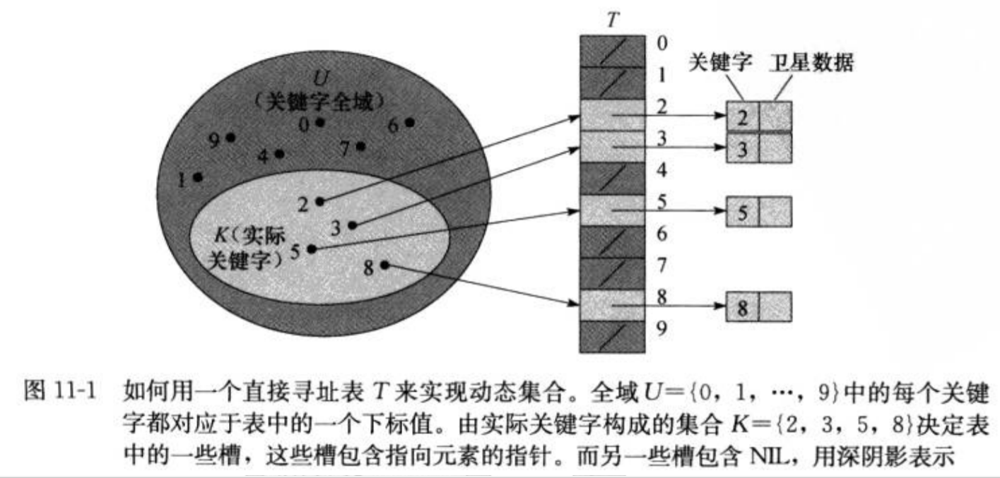

P.S. 卫星数据：指的是一条记录(一个对象中)中除了关键字key以外的其他辅助数据。例如在排序算法中，参与排序的数据称做关键字key，而该对象附带的其他数据则称做卫星数据。

而如果全域U很大，实际存储的关键字集合K相对于它来说很小，这样会造成分配给哈希表的大部分空间都将浪费掉。所以即使直接定址法对于不同的关键字不会造成冲突，但实际中的应用很少。

### 4.2 数字分析法

假如有80个记录，其关键字为8位十进制数，取两位十进制数作为哈希地址。假设这80个关键字中的一部分如下：

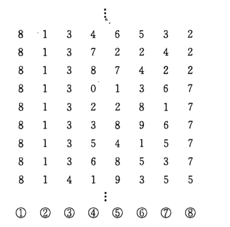

对关键字分析其数字特点可发现：第①②位都是"8 1"，第③位取"3"或"4"，第⑧位取

"2""5"或"7"。因此，这四位随机性太低，都不可取。而由于中间四位可看成是近乎随机的，所以可以取其中任意两位，或取其中两位和另外两位的叠加求和后舍去进位作为哈希地址。

这种分析关键字数字特点的方法称为**数字分析法**。

### 4.3 平方取中法

通常在选定哈希函数时不一定能知道关键字的全部情况，取其中哪几位也不一定合适，而一个数平方后的中间几位数和数的每一位都相关，由此使随机分布的关键字得到的哈希地址也是随机的。如下图，每个字符都用八进制数字表示，取它平方后的中间三位作为哈希地址。

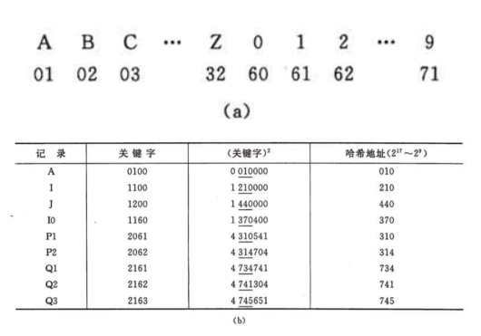

### 4.4 折叠法

将关键字分割成位数相同的几部分，然后取这几部分的叠加和作为哈希地址。关键字位数很多，且关键字中的每一位数字分布大致均匀时，可以采用折叠法得到哈希地址。

例如，每一种图书都有一个国际标准图书编号(ISBN)，它是一个10位的十进制数字，若要以它作为关键字建立一个哈希表，当书的种类不到10000时，可采用折叠法构造一个四位数的哈希函数。在折叠法中，数位叠加可以有移位叠加和间界叠加两种方法。移位叠加是将分割后的每一部分的最低位对齐，然后相加；间界叠加是从一端向另一端沿分割界限来回折叠，然后相加。如ISBN号为0-442-20586-4，两种方法的哈希地址如下：

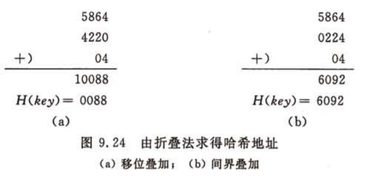

### 4.5 随机数法

选择一个随机函数，取关键字的随机函数值为它的哈希地址，即：

H(key) = random(key)，其中random为随机函数。

通常，当关键字长度不等时，采用该方法。

### 4.6 除留余数法

除留余数法为**最常用的方法**。

取关键字被某个不大于哈希表表长m的数p除后所得余数作为哈希地址，即：

H(key) = key mod p，其中p ≤ m.

对p的选择很重要，一般选p为**素数**(质数)或不包含小于20的质因数的合数。

## 5 处理哈希冲突

### 5.1 开放定址法(封闭式哈希)

在**开放定址法**中，所有元素都放在散列表里，这种方法也称为**封闭式哈希**。

#### 5.1.1 探测序列

Hi = (H(key) + di) mod m, i = 1, 2, 3, ... k (k ≤ m - 1).

其中，H(key)为哈希函数，m为哈希表表长，di为增量序列，有以下三种取法：

1. di = 1, 2, 3, ... m - 1，称为**线性探测再散列**；

2. di = ±i2 = 12, -12, 22 -22, 32, -32 ... ±k2 (k ≤ m / 2)，称为**二次探测再散列**；

3. di = i • h2(key)，其中h2(key)为另一个散列函数。故探测序列为：

   h2(key), 2h2(key), 3h2(key) ... 

   一般选择h2(key) = p - (key mod p)比较好，其中p＜m，且p、m都为素数。

   这种探测序列称为**双散列**。

例如，在长度为11的哈希表中，哈希函数H(key) = key mod 11。插入17、60、29时，均不发生哈希冲突，所得哈希值分别为6、5、7。所以插入这三个关键字后，哈希表为：

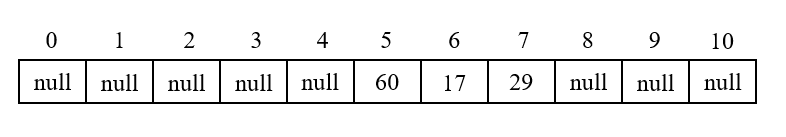

下一个待插入关键字为38，其哈希地址为5，而哈希表中5号位置已有元素，故发生哈希冲突。

1. 若采用线性探测再散列的方法进行处理：

   (5 + 1) mod 11 = 6 (×)

   (5 + 2) mod 11 = 7 (×)

   (5 + 3) mod 11 = 8 (√)

   在哈希表中，6、7号位置均已经有元素占用，而8号位置无元素占用，故将待插入关键字插入到8号位置，所得哈希表为：

   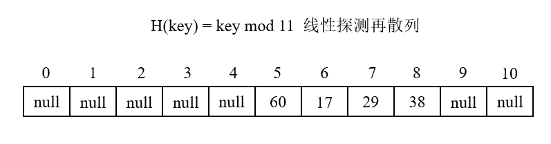

2. 若采用二次探测再散列的方法进行处理：

   (5 + 12) mod 11 = 6 (×)

   (5 - 12) mod 11 = 4 (√)

   在哈希表中，6号位置已经有元素占用，而4号位置无元素占用，故将待插入关键字插入到4号位置。

   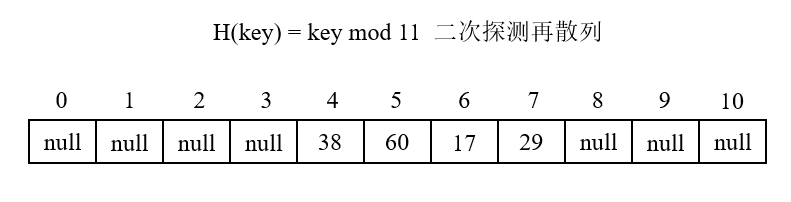

#### 5.1.2 一次聚集

在上述过程中可以发现，在使用**线性探测再散列**时，当哈希表中5、6、7位置上已填入元素时，下一个哈希地址为5、6、7、8的记录都将填入8号位置。这种在处理冲突过程中发生的两个第一个哈希地址不同的记录争夺**同一个**后继哈希地址的现象称为"**一次聚集**(一次群集，primary clustering)"，因此平均查找时间会越来越长。
如下图，H(key) = key mod 11，当哈希值在7附近发生冲突时，在这个位置处会发生"聚集"，即在这个位置发生的冲突会**越来越多**。

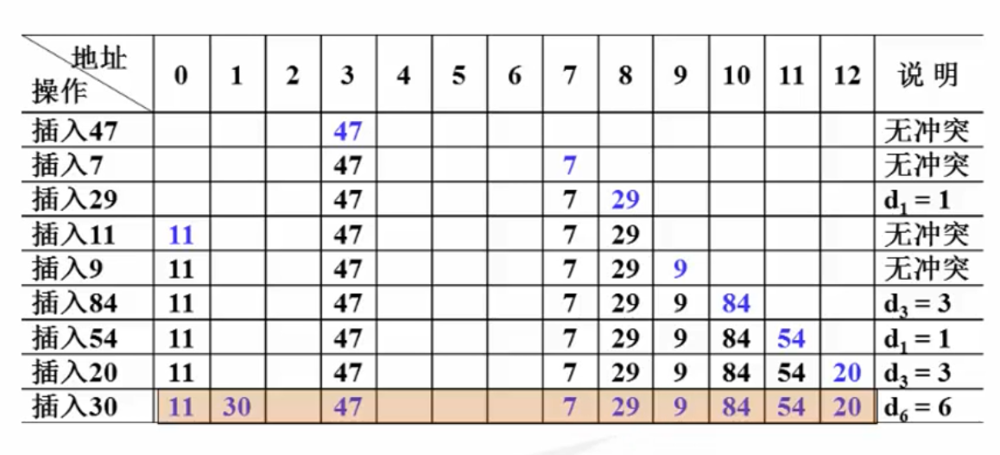

#### 5.1.3 二次聚集

使用**二次探测再散列**时，会出现一个问题：是否只要哈希表中有空余位置，二次探测再散列就一定能够找到空位将元素插入？

如下图，H(key) = key mod 5，哈希表中已经在0、1、2下标处存有元素5、6、7。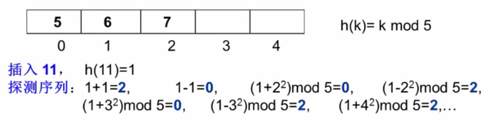

待插入关键字为11，计算它的哈希值，为1，产生冲突。此时用二次探测再散列进行冲突处理，计算得到的哈希地址一直都是在**0和2**之间来回跳，一直没有办法找到新的空位将元素插入。

二次探测再散列固然也会带来"**二次聚集**(二次群集，secondary clustering)"问题，但它**缓解**了线性探测再散列的一次聚集问题。然而，它带来的问题是，可能探测后的哈希值会在某几个值之间来回跳，而没有办法进入新的哈希值。

#### 5.1.4 线性探测和二次探测的比较

使用**线性探测再散列**可以保证做到：只要哈希表未满，总能找到一个不发生冲突的地址，即一定能找到空位；

而使用**二次探测再散列**需要满足特定条件，即：当哈希表长满足形如**4j + 3**(其中，j为正整数)形式的**素数**时，才能一定找到空位。

### 5.2 再哈希法

哈希表的**装填因子**定义为：α = 哈希表中填入的记录数 / 哈希表的长度.

当散列表元素太多时(即装填因子太大)，查找效率会降低。如原哈希表长度为11，已经填入了9个元素，此时的α太大，产生的哈希冲突可能会很多。

因此，可以考虑把哈希表扩大一倍，即将表的容量增加到23。而将表扩大一倍后，原来的表中的元素不是简单地copy到新表中，而是使用新的一个哈希函数，扫描原表，对原表中的元素计算新的哈希地址，再将它们插入到新的哈希表中。一般地，当0.5 ≤ α ≤ 0.85时比较好。

当α过大时，扩大哈希表，并计算新的哈希地址，以解决哈希冲突的操作，称为**再散列法**：Hi = R(Hi(key))，其中R和Hi是不同的哈希函数。

例如，在原来的哈希表中，表长为7，H(key) = key mod 7，使用**线性探测再散列**处理哈希冲突。将13、15、24和6插入到该表中，得：

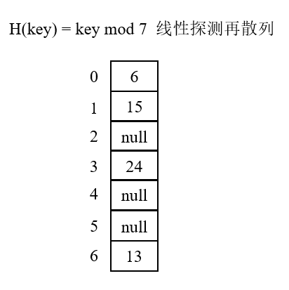

如果此时再将23插入到该表中，得：

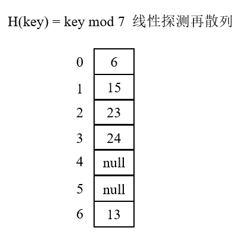

此时α ＞ 0.7，表中将有超过70%的单元是满的。因此，考虑将哈希表容量扩大到17，选择17是因为17是原表大小7的两倍后的**第一个素数**。并且，新的哈希函数为H(key) = key mod 17。扫描原来的表，并将6、15、23、24和13插入到新表中，得：

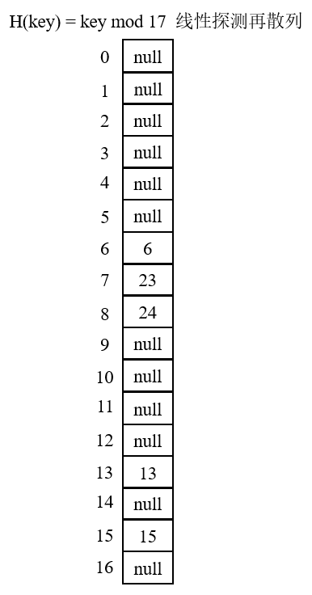

这种方法增加了计算的时间，运行时间为O(n)，因为有n个元素需要进行再散列进入新表中。

### 5.3 链地址法(开放式哈希)

将经哈希函数计算过后的具有**相同哈希地址**的关键字放到同一个链表中，而链表作为哈希表中的元素，这种处理哈希冲突的方法称为**链地址法，也称开放式哈希**。

初始时，哈希表中元素都为**空(null)**。在关键字计算所得的哈希地址处，将元素作为**结点**插入到哈希表中的对应位置处。如果有多个关键字计算所得的哈希地址都相同，就都将它们作为结点，插入到该哈希地址对应位置的一个**链表**中。结点在链表中的插入位置可以在**表头或表尾**，也可以按关键字**排序**后插入。

如，哈希函数H(key) = key mod 13，待插入关键字为19、14、23、01、68、20、84、27、55、11、10、79。按照哈希函数计算哈希地址且根据链表法按关键字从小到大排序过后的哈希表如下图：

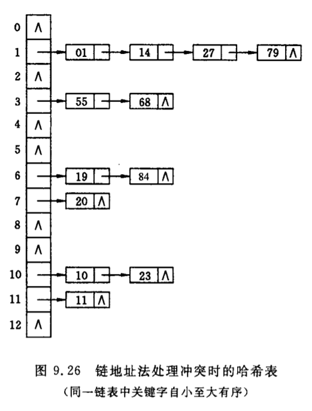

## 6 插入元素

根据构建哈希表时所设定的**哈希函数**以及**处理哈希冲突**的方法，将元素插入即可。

## 7 查找元素

要求：查找元素并返回元素在哈希表中的下标。

1. 给定元素关键字key，根据构建哈希表时所设定的哈希函数计算其哈希地址；
2. 如果哈希表中该哈希地址对应位置处没有元素(null)，则查找不成功，返回-1；
3. 否则，比较哈希表中元素和待查找元素的关键字是否相同：
   1. 如果关键字相同，则查找成功，直接返回该哈希地址；
   2. 如果关键字不同，说明发生哈希冲突，则根据构建哈希表时所设定的**处理哈希冲突**的方法继续寻找下一个哈希地址处的元素。直到哈希表中某个位置为**空**时，说明待查找元素不在哈希表中，返回-1；或者直到某个位置处元素的关键字和待查找元素的关键字相同，说明找到待查找元素在哈希表中的位置，返回该处下标即可。

## 8 删除元素

### 8.1 处理哈希冲突时使用开放定址法和再哈希法

如果要在**非链地址法**处理冲突的哈希表中删除一个记录，则需要在该记录的位置上填上一个**特殊符号DELETED(可选择一个取不到的数)**，而不能直接置空。这种删除元素的方法称为**懒惰删除法**。

记待删除元素为k，在待删除元素后新插入的元素为m。使用懒惰删除法是因为，在插入元素构建哈希表时，有可能m恰好因为在k处遇到了哈希冲突，而插入到了哈希表中的其他位置，所以m的下标**依赖于**k。而如果删除k时，仅仅将k位置处置空，在这之后会导致以下结果：

1. 对新元素的插入不会造成影响：插入新元素时，某一时刻计算得到的哈希地址恰好为k的下标，而此时该位置为null，则直接插入元素即可，所以并不会造成影响；
2. 对m的查找会造成影响：查找m时，某一时刻计算得到的哈希地址恰好为k的下标，而此时该位置为null，会被认为该处没有元素，则直接返回-1。而实际上，该处需要有一个元素进行**占位**(即使它已被删除)，告诉别人这里有冲突，要根据处理哈希冲突的方法往后继续找m。

因此，当删除k时，在k位置处放置一个**特殊符号DELETED**非常重要！当插入元素时，遇到DELETED符号，**直接插入**；当查找元素时，遇到DELETED符号，则当做**有元素占位**，继续往后查找。

如下图：哈希函数H(key) = key mod 11，使用线性探测再散列处理哈希冲突。 表中已有60、17两个元素。

插入29：H(29) = 29 mod 11 = 7

插入38：H(38) = 38 mod 11 = 5 (×) 

​			  H(38) = (38 + 1) mod 11 = 6 (×) 

​			  H(38) = (38 + 2) mod 11 = 7 (×) 

​			  H(38) = (38 + 3) mod 11 = 8 (√) 

则可以说，38的插入"依赖于"29。

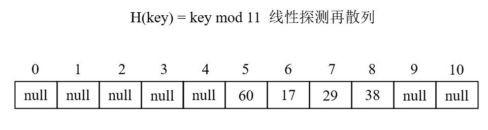

**(1) wrong case:** 如果当删除29时，将29置为null。那么之后当查找38时：

H(38) = 38 mod 11 = 5 (已有60，不等于38，处理冲突，继续往后找) 

H(38) = (38 + 1)  mod 11 = 6 (已有17，不等于38，处理冲突，继续往后找) 

H(38) = (38 + 2)  mod 11 = 7 (为null，说明待查找元素不在哈希表中) **错误**！！！

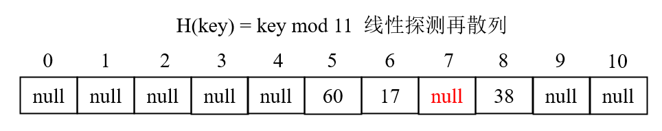

**(2) correct case:** 如果当删除29时，将29置为**DELETED符号**(在整数情况下可取一个不可能碰到的数)。那么之后当查找38时：

H(38) = 38 mod 11 = 5 (已有60，不等于38，处理冲突，继续往后找) 

H(38) = (38 + 1)  mod 11 = 6 (已有17，不等于38，处理冲突，继续往后找) 

H(38) = (38 + 2)  mod 11 = 7 (已有DELETED符号-777，**不等于38**，处理冲突，继续往          			  后找) 

H(38) = (38 + 3)  mod 11 = 8 (恰好为38，找到)  **正确**！ 

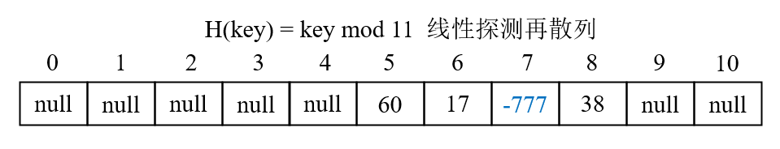

### 8.2 处理哈希冲突时使用链地址法

当使用链地址法处理哈希冲突时，若要删除一个元素，直接找到其哈希地址，在链表中找到待删除元素和它的前驱结点。将前驱结点的next域指向待删除结点的后继结点，即完成删除该元素的操作。如果后续查找其他元素也不受影响，因为具有相同哈希地址的元素都处于同一个链表中，遍历该链表即可，并不会出现像**8.1节**类似的"依赖"关系。

如下图：哈希函数H(key) = key mod 11，使用链地址法处理哈希冲突。 表中已有60、17两个元素。

插入29：H(29) = 29 mod 11 = 7

插入40：H(40) = 40 mod 11 = 7

29和40具有相同的哈希地址，则将它们放入同一个链表中。

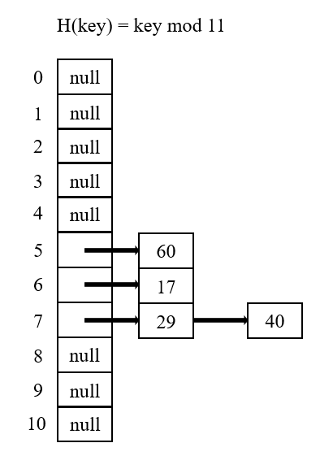

当删除29时，计算其哈希地址为7，找到哈希表中7号下标的链表，遍历该链表，将29删除。

此后查找40时，计算其哈希地址为7，找到哈希表中7号下标的链表，遍历该链表，直到找到数据域为40的结点，即为查找成功。

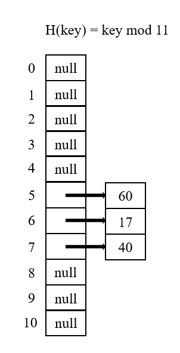

## 9 平均查找长度

虽然哈希表在关键字与记录的存储位置之间建立了直接映像，但由于**冲突**的产生，使得哈希表的查找过程仍然是一个给定值和关键字之间进行比较的过程。因此，仍需以**平均查找长度**作为衡量哈希表查找效率的量度。此外，平均查找长度**是装填因子α的函数，不是哈希表元素个数n的函数**。

e.g. 将acos、define、float、exp、char、atan、ceil、floor放入表长为26的哈希表中。H(key) = key[0] – 'a'，使用**线性探测再散列**处理哈希冲突。哈希表如下图：

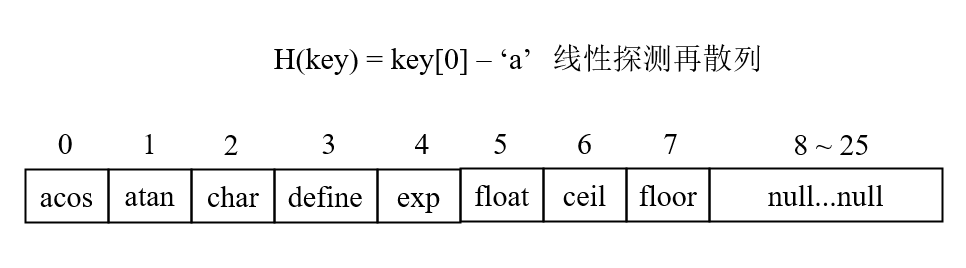

### 9.1 成功平均查找长度

成功平均查找长度：在表中的关键字的平均查找次数。

对于acos：首字母 - 'a' = 0，0号元素恰为acos --> 1次；

对于atan：首字母 - 'a' = 0，0号元素为acos，往后查找1位得atan，命中 --> 2次；

对于char：首字母 - 'a' = 2，2号元素恰为char --> 1次；

对于define：首字母 - 'a' = 3，3号元素恰为define --> 1次；

对于exp：首字母 - 'a' = 4，4号元素恰为exp --> 1次；

对于float：首字母 - 'a' = 5，5号元素恰为exp --> 1次；

对于ceil：首字母 - 'a' = 2，2号元素为char，往后查找1位得define，往后查找1位得exp，往后查找1位得float，往后查找1位得ceil，命中 --> 5次；

对于floor：首字母 - 'a' = 5，5号元素为float，往后查找1位得ceil，往后查找1位得floor，命中 --> 3次。

故，成功平均查找长度 ASLs = (1 + 2 + 1 + 1 + 1 + 1 + 5 + 3) / 8 = 1.87

### 9.2 不成功平均查找长度

不成功平均查找长度：不在表中的关键字的平均查找次数。

每个单词的首字母共有26种情况，且a ~ z开头的单词都是等概率的。找到有空位的时候，即为该单词没有在这张表里的时候。

对于a开头，但不在这张表里的单词，需要查9次才能断定有空位；

(比如apple，apple - 'a' = 0，需要从0号位置出发，走9次才能碰到null，才能知道	          apple不是这张表里的单词)

对于b开头，但不在这张表里的单词，需要查8次才能断定有空位；

对于c开头，但不在这张表里的单词，需要查7次才能断定有空位；

...

对于h开头，但不在这张表里的单词，需要查2次才能断定有空位；

...

对于i ~ z开头，但不在这张表里的单词，都只需要查1次就能断定有空位。

故，不成功平均查找长度 ASLu = (9 + 8 + 7 + 6 + 5 + 4 + 3 + 2 + 1 * 18) / 26 = 2.38

