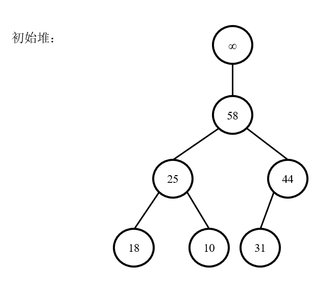

# 1 引入 - 优先队列

优先队列是队列的一种。普通队列：先进先出，后进后出，是一种FIFO模型；优先队列：入队顺序和出队顺序无关，和队列中元素的优先级相关。

借用浙江大学何钦铭教授的一个很形象的例子，大致意思是这样子："一个机器控制一个核反应堆的过程，此时有两个任务：一个进行核心的调度，一个是打印一张纸。显然，涉及到核心调度的任务需要先进行，需要按照优先级管理一种队列。"

# 2 堆(二叉堆)

## 2.1 概念

如果用二叉搜索树来实现优先队列，则每次需要弹出优先级最大的元素时，需要不断删除树最右端的元素。在删除多次后，左边的结点保持不动，而右边的结点可能所剩不多，那么树的高度就不再是log(n)，导致树的平衡性被破坏。

而我们关注的问题是，如果使用二叉树进行存储，希望把最大的元素一直放在树根处，删除后将其他元素进行调整，使新树仍然保持最大的元素处于根结点位置。

二叉堆的使用对于优先队列的实现相当普遍，所以一般把**二叉堆叫做堆**(heap)。堆是一棵完全二叉树，高为O(log(n))。而因为完全二叉树的规律性，故可以用一个数组表示它，而不需要采取链表的方式进行实现。

完全二叉树和堆的对应：


0号结点为“哨兵”。对于数组中位置为i的结点，其左子结点在位置2i处，右子结点在位置2i + 1处，其父结点在位置i / 2处。 哨兵的作用在2.4节阐述。

## 2.2 特性

1. 结构性：用数组表示完全二叉树；
2. 有序性：
   1. 最大堆(大顶堆)，Max Heap：任一结点的值大于其左右子结点的值，根位置处总为数组的最大值；
   2. 最小堆(小顶堆)，Min Heap：任一结点的值小于其左右子结点的值，根位置处总为数组的最小值。

## 2.3 插入元素

PS. 以最大堆为例说明。

1. 将新结点放至数组的末端，即堆的末端；
2. 根据新结点所在的堆，调整所在堆元素的大小顺序，以使插入新结点后的堆仍然保持有序，即父结点大于左右结点。每个结点的父结点的索引为i / 2，将新结点和索引为i / 2的结点不断进行比较。若新结点大于父结点，则将父结点和新结点进行位置交换，反之，已满足最大堆特性；
3. 在该过程中，新插入的结点从堆的末端不断往上冒，直至新结点所在堆满足最大堆特性为止，该过程称为**“上滤”(Percolate Up)**。上滤时，终点为数组的1号结点，因为0号结点是哨兵，不参与计算。

演示过程：


## 2.4 哨兵

### 2.4.1 引入

假设某个漆黑的夜晚，在海岸的悬崖边上玩一个游戏。站在距悬崖边缘100米的地方，地上每隔1米就任意放1件物品。请找出这些物品中有没有苹果。
由于每前进1米就要捡起地上的物品，检查是否拿到了苹果，**同时还要检查**有没有到达悬崖的边缘(不检查的话就有可能掉到海里)，也就是说要对这两种检查反复若干次。
如果使用哨兵，就先在悬崖的边缘放置一个苹果，再把起点挪到距悬崖边缘101米的地方。这个苹果就是哨兵，通过放置哨兵，就一定能找到苹果。每前进1米只需检查捡到的物品是不是苹果就可以了。发现是苹果以后，只需站在原地再检查一步开外的情况。如果还没有到达悬崖边缘，就意味着找到了真正要找的苹果。如果已经达到了悬崖边缘，则说明现在手中的苹果是哨兵，而没有找到真正要找的苹果。

### 2.4.2 红黑树的哨兵

红黑树有一个性质是：叶结点的左右两边必须为黑色。

非红黑树的情况下，叶结点如果没有左右孩子的话，直接将它的左右孩子置为NULL即可。但红黑色居然要求叶子结点的左右孩子都为黑色，意味着需要新分配两块内存空间，不存放任何有效数据，**仅仅是为了给它涂上黑色**，然后挂到叶结点的left、right。当叶结点多起来时，**非常浪费内存空间**。理想的二叉树结构是为了让我们保存数据(key)，而不是为了保存颜色！
所以哨兵这个外援就发挥作用了。申请一块内存命名为哨兵，然后把**这块内存涂上黑色**，之后所有叶结点的left、right都指向这个已涂上黑色的哨兵。这样就节省了很多空间。

### 2.4.3 查找元素时的哨兵

假设有一个乱序数组，需要查找一个元素是否在该数组中，此时需要用到顺序查找，即遍历数组。

一般情况下，会编写如下程序：

```
int search(int *arr, int n, int key) {    
    for(int i = 0; i < n; i++) {  
        if(arr[i] == key) {
        	return i;
        }
    }  
    
    return 0; // 查找失败  
}
```

在这种情况下，除了每一次要判断当前元素是否为待查找元素以外，还要判断遍历的数组元素的下标是否大于数组长度-1，即要判断下标会不会在遍历的过程中越界。所以，要进行**两次判断**。

如果将数组进行处理，即留出0号位置存放哨兵，其他有效元素放在1 ~ n位置中，则程序改写如下：

```
int search(int *arr, int n, int key) {    
    arr[0] = key; // 哨兵
    
    int i = n;
    
    while(arr[i] != key) {
    	i--;
    }
    
    return i; // 返回0就是查找失败
}
```

在查找方向的尽头设置哨兵元素，免去了查找过程中每次比较后都要判断查找位置**是否越界**，看似与原先差别不大，但是总数据较多时，效率提高很明显。

### 2.4.4 堆中的哨兵

由于在元素自底向上进行上滤时，每一次都需要判断是否已经上滤到根结点，即，每做一个子堆的上滤操作后，都需要判断上滤后的结点的下标是否为根结点下标。如果下标为0则意味着调整结束，跳出上滤循环。在0号结点不存放"哨兵"，即0号结点即为数组有效元素的情况下，上滤时不止需要判断当前结点和它的父结点之间的**大小关系**，还要判断下标是否**碰到了根结点**，因此需要**两次比较**。

而如果0号结点存放"哨兵"，即放置一个**大于堆中所有元素**的值(可设为正无穷)，则可减少判断下标是否为0这一步操作。因为在上滤时，只需要判断当前结点和父结点的大小关系。如果上滤结束，有两种情况：

1. 还没有调整到根结点时，就已经满足了最大堆的特性；
2. 调整到了堆的根结点，即堆顶，和哨兵元素相比，一定小于哨兵(因为哨兵取最大)，此时整个堆已经满足最大堆的特性。

当设置哨兵后，就不需要每一次再多去判断下标是否碰到0，**只需要比较结点的大小即可**，节省时间。

## 2.5 删除最大元

由于最大堆的设计目的为，每次弹出的元素均为最大值，即优先级最高的元素，因此每次删除的最大元都为堆顶部的元素。

1. 弹出顶端最大元素，并在原根结点的左右子结点中找到较大者，填充原来的顶端位置，并将进行移动的结点置空，再将判断当前结点的索引进行更新为所移动的结点处；
2. 继续往下进行判断：
   1. 若当前结点的左右子结点都非空，则找到它们中的较大者，填充该处空结点，并将进行移动的结点置空；
   2. 若当前结点的左右子结点中有一个为空，则找到它们中非空的结点，填充该处空结点，并将进行移动的结点置空；
   3. 上述过程称为**“下滤”(Percolate Down)**；
3. 重复上述第2步的过程，直到当前结点的左右子结点均为空时，说明已经下滤到堆的最底层，此时将数组末端结点对该空结点进行填充，并将数组末端结点置空。

演示过程：

e.g. 1



e.g. 2


# 参考资料

[红黑树中的哨兵](https://www.zhihu.com/question/27155932)

[查找元素时的哨兵](https://blog.csdn.net/Jinxiaoyu886/article/details/95043826?utm_medium=distribute.pc_relevant.none-task-blog-BlogCommendFromMachineLearnPai2-1.control&depth_1-utm_source=distribute.pc_relevant.none-task-blog-BlogCommendFromMachineLearnPai2-1.control)

[堆中的哨兵](https://blog.csdn.net/L_T_W_Y/article/details/108425030)

