# 队列

## 1 概念

队列是一种**先进先出**(First in First Out)的线性表，简称FIFO。它只允许在表的**前端(front)**进行删除操作，而在表的**后端(rear)**进行插入操作。进行插入操作的一端称为**队尾**，进行删除操作的一端称为**队头**。

## 2 数组模拟队列
### 2.1 用数组模拟普通队列

#### 2.1.1 基本属性

- 队头(front)：

  删除数据的一端，可理解为“指针”，指向队列第一个元素的【前一个】位置的变量。

- 队尾(rear)：

  插入数据的一端，可理解为“指针”，指向队列最后一个元素的变量。

- 入队(enqueue)：

  在队尾插入元素。

- 出队(dequeue)：

  在队头删除元素。

- 队列满(Full)：

  队列中元素个数已达到队列的最大容量，rear指向数组最大长度对应的索引，即rear == maxSize - 1。

- 队列空(Empty)：

  队列中无元素，rear和front相等，即rear == front。

- 队列长度(size，有效数据个数)：

  rear与front之间的差，即rear - front。

#### 2.1.2 图解演示

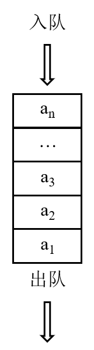

PS. 以数组长度(maxSize)为5，最大索引为4，举例演示说明。

1. 初始状态：

   front和rear都指向-1位置，队列为空。

   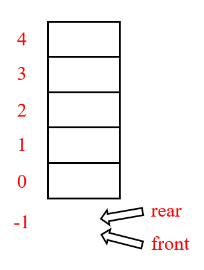
   
2. 元素入队，队列未满：
   
   front仍然指向-1，rear自增至指向3。rear ≠ maxSize - 1，队列未满；队列长度为rear - front，等于4。

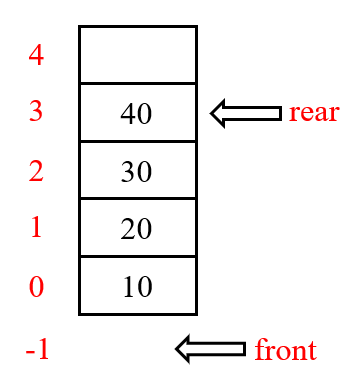

3. 元素入队，队列已满：

   front仍然指向-1，rear自增至指向4(maxSize - 1)。rear == maxSize - 1，队列已满；队列长度为rear - front，等于5。

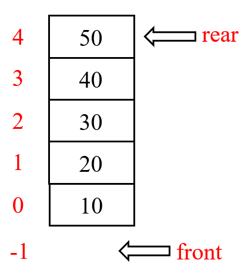

​        rear已指向maxSize - 1，队列已满，如果rear再增加就会产生数组越界问题。

4. 元素出队，队列仍然满： 

   rear不变，弹出队头元素，front自增。rear == maxSize - 1，队列仍然为满；队列长度为rear - front，等于4。

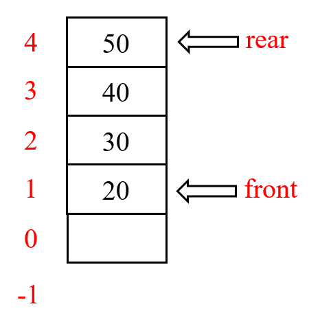

- 注意事项：

   在每次入队前，需要判断当前队列是否已满。如果队列未满，再进行入队操作；

   在每次出队前，需要判断当前队列是否已空。如果队列未空，再进行出队操作。
#### 2.1.3 部分程序思路注解

1. 判断队列是否空：

   布尔类型，返回rear == front的结果。

2. 判断队列是否满：

   布尔类型，返回rear == maxSize - 1的结果。

3. 入队：

   1. 首先判断队列是否满，如果返回值为false，表明队列无元素可入队；

   2. 如果队列未满，则先将rear指针+1，使之指向队列后一个位置，再将元素放进该位置；

   3. 程序为
       ```
       rear++;
       arr[rear] = num;
       ```
   
4. 出队：

   1. 首先判断队列是否空，如果返回值为false，表明队列无元素可出队；
   
   2. 如果队列未空，则先将front指针+1，因为front指针指向的是队头的前一个位置，所以需要先自增才能指向队头元素；
   
   3. 将自增后的front指针指向的元素弹出；
   
   4. 程序为
   
      ```
      front++;
      return arr[front];
      ```
   
5. 查看队列元素：
   1. 首先判断队列是否空，如果返回值为false，表明队列无元素可查看；
   
   2. 按顺序从索引值front + 1处遍历至队列末端rear处；
   
   3. 程序为
      ```
      for (int i = front + 1; i <= rear; i++) {
      	System.out.printf("arr[%d] = %d\n", i, arr[i]);
      }
      ```
   
6. 查看队头元素：
   
   1. 首先判断队列是否空，如果返回值为false，表明队列无法查看队头元素；
   
   2. 由于front变量指向队头元素的前一个位置，因此需要返回(front +1)位置上的元素，即
   
      ```
      return arr[front + 1];
      ```
   

但是切记不能有单独的语句把front加1，因为这样会导致整个队列的front发生变化，而我们要做的只是查看而已。

### 2.2 用数组模拟循环队列
#### 2.2.1 假溢出与循环队列

在下图所示情况中，rear已指向队列末端元素，此时队头已有元素弹出，留出空位。但如果此时再有元素想入队，则会因为队列已满(rear == maxSize - 1)的原因导致失败。那么，在顺序队列中，当尾指针已经到了数组的上界，不能再有入队操作，但其实数组中还有空位置，这就叫“假溢出”。这样导致的问题是，每个空间域只能利用一次，造成空间极度浪费，并且非常容易越界。

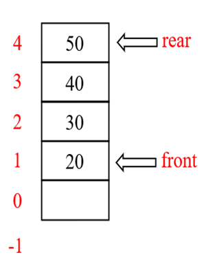

解决假溢出的方法——采用循环队列。将无法放置于队列顶端的元素，放置于队列中其他空位，得到一个头尾相接的循环，我们把队列的这种**头尾相接的顺序存储结构称为循环队列**。

#### 2.2.2 取模运算

计算规则：一个数n ÷ p = m......r，其中m为商，r为余数，则该运算可以记为n % p = r。在取模运算后，余数r的范围是**[0, p]**。 

意义：假如我们想让一个数在[0, p]范围中，就使用n % p，得到的结果是就是在[0, p]区间内。

例如，53 % 18得到余数的范围一定在[0,18]之间。

由于循环队列指针特性，不断累加时会可能会产生数组越界问题。因此，对于循环队列问题，为了使rear和front变量的值能够在数组索引的范围内，故引入取模运算进行变量范围的限制。

#### 2.2.3 基本属性

- 队头(front)：

  删除数据的一端，可理解为“指针”，指向队列第一个元素。

- 队尾(rear)：

  插入数据的一端，可理解为“指针”，指向队列最后一个元素的【后一个】位置，目的是为了留出一个空间，用于实现循环队列。

- 入队(enqueue)：

  在队尾插入元素。

- 出队(dequeue)：

  在队头删除元素。

- 队列满(Full)：

  由于rear可能比front大，也可能比front小。当队列满时，它们可能只相差一个位置，也可能是它们相差整整一圈。在这种情况下，队列即满。所以队列满的条件为：(rear + 1) % maxSize == front。

- 队列空(Empty)：

  队列中无元素，rear和front相等。
  
- 队列长度(size，有效数据个数)：

  当rear > front时，队列的长度为rear - front；当rear < front时，队列长度分为两端：上面一端的长度是maxSize - front，下面一端的长度就是rear，加在一起，队列长度为rear - front + maxSize。因此，通用的队列长度公式为：

  （rear - front + maxSize）% maxSize

#### 2.2.4 图解演示

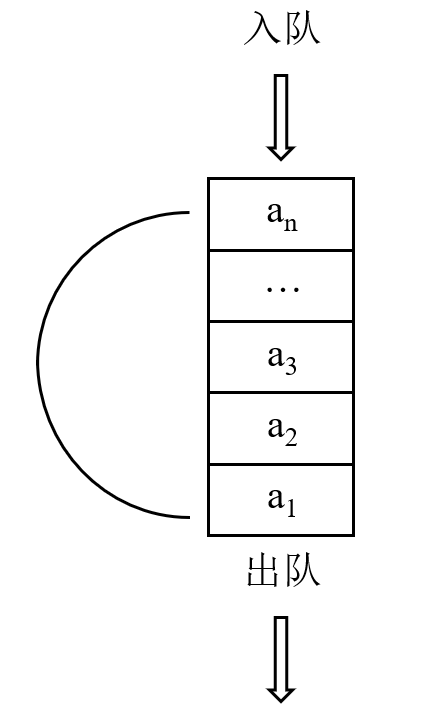

PS. 以数组长度(maxSize)为5，最大索引为4，举例演示说明。

BTW，习惯于这种画图方式，而没有参考网上的环状模型。

1. [rear = front]初始状态：

   front和rear都指向0位置，队列为空。
   
   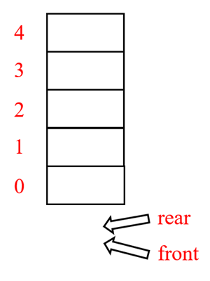
   
2. [rear > front]元素入队，未有元素出队，队列未满：

   front仍然指向0，rear自增至指向3。(rear  + 1) % maxSize ≠ front，队列未满；队列长度为(rear - front + maxSize) % maxSize，等于3。

   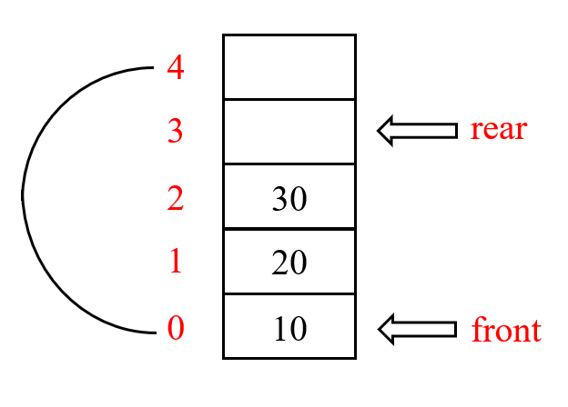

3. [rear > front]元素入队，未有元素出队，队列已满：

   front仍然指向0，rear自增至指向4。由于循环队列会留出一个空间，因此此时队列已满。(rear  + 1) % maxSize == front ，队列已满；队列长度为(rear - front + maxSize) % maxSize，等于4。

   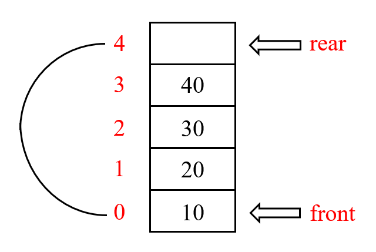

4. [rear > front]元素出队，队列未满：

   弹出队头元素，front自增指向1，rear仍然指向4。由于循环队列只会留出一个空间，而此时空出位置有2个，因此此时队列未满。(rear  + 1) % maxSize ≠ front ，队列未满；队列长度为(rear - front + maxSize) % maxSize，等于3。

   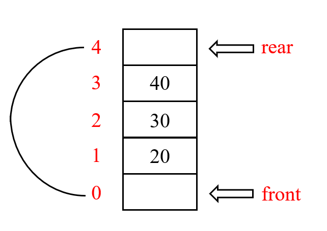

6. [rear ＜ front]元素入队，寻找空余位置：

   之前：

   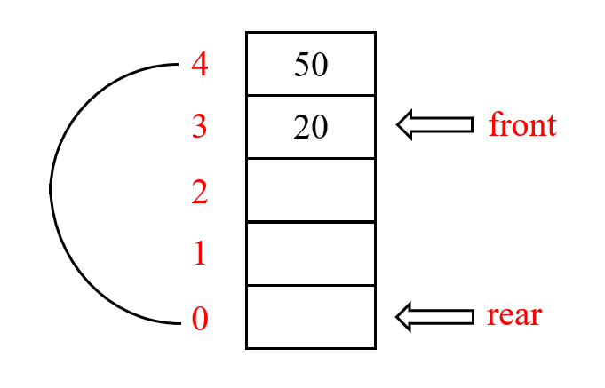

   此时如果有元素入队，队列索引最顶端已不能添加元素，则会循环从队列索引底部重新寻找空余位置进行元素添加。

   之后：

   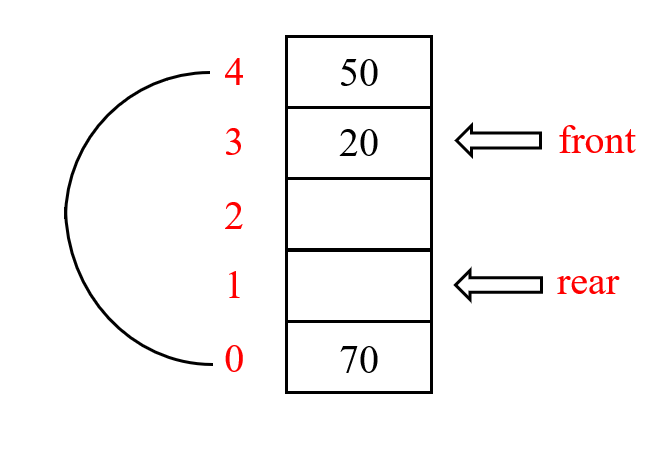

#### 2.2.5 部分程序思路讲解

1. 判断队列是否空：

   布尔类型，返回rear == front的结果。

2. 判断队列是否满：

   布尔类型，返回(rear + 1) % maxSize == front的结果。

3. 入队：

   1. 首先判断队列是否满，如果返回值为false，表明队列无元素可入队；

   2. 如果队列未满，则将元素放进该位置；

   3. 考虑到循环，rear变量的自增表达式为：(rear + 1) % maxSize；

   4. 程序为

      ```
      arr[rear] = num;
      rear = (rear + 1) % maxSize;
      ```

4. 出队：

   1. 首先判断队列是否空，如果返回值为false，表明队列无元素可出队；

   2. 如果队列未空，则将front指针指向的元素用临时变量接收；

   3. 考虑到循环，front变量的自增表达式为：(front + 1) % maxSize；

   4. 再返回临时变量的值，即将原先队头元素弹出；

   5. 程序为

      ```
      int num = arr[front];
      front = (front + 1) % maxSize;
      return num;
      ```

5. 查看队列元素：

   1. 首先判断队列是否空，如果返回值为false，表明队列无元素可查看；

   2. 从front开始遍历，遍历结束终点为(front + 队列长度)的前一个值；

   3. 队列的遍历索引值为(i % maxSize)；

   4. 程序为
   	
      ```
      for (int i = front; i < front + size(); i++) {
            System.out.printf("arr[%d] = %d\n", i % maxSize, arr[i % maxSize]);
   }
      
   	int size() { return (rear - front + maxSize) % maxSize; }
   	```

6. 查看队头元素：

   1. 首先判断队列是否空，如果返回值为false，表明队列无法查看队头元素；

   2. 由于front变量指向队头元素，因此只需要返回front位置上的元素，即
      ```
      return arr[front];
      ```
### 2.3 用数组模拟普通队列和循环队列时的比较

|                        |                           普通队列                           |                           循环队列                           |
| :--------------------: | :----------------------------------------------------------: | :----------------------------------------------------------: |
|          原理          | 入队时，插入元素时只能往队尾添加，如果元素索引已经到达[数组最大容量 - 1]的时候，那么队列就为满。即便此时，或在入队过程中，有元素出队，也仍然无法添加新元素进队列。 | 当元素出队时，会产生队列空余位置。如果队列索引值较大处已经无法再让元素入队，就会寻找队列的空余位置，从前面**重新开始**存放元素，所以称为“循环”。 |
|   rear & front的位置   | rear指向队列最后一个元素；<br>front指向队列第一个元素的**前一个**位置 | rear指向队列最后一个元素的**后一个**位置，以留出一个空间；<br>front指向队列的第一个元素 |
|  rear & front初始状态  |                    rear = -1; front = -1                     |                     rear = 0; front = 0                      |
|       队列是否空       |                    return rear == front;                     |                    return rear == front;                     |
|       队列是否满       |                 return rear == maxSize - 1;                  |          return **(rear + 1) % maxSize == front**;           |
|          入队          | 1. 判断队列是否满；<br>2. 由于rear指向队尾元素当前位置，因此需要先将rear向后移动一个位置，才能添加元素至队尾；<br>3. front++;<br>4. return arr[front]; | 1. 判断队列是否满；<br>2. 由于rear指向队尾元素的下一个位置，因此先将新添加的元素放入rear所指向的位置，再将rear进行移动，之后rear就指向入队元素的后一个位置；<br>3. arr[rear] = num;<br>4. **rear = (rear + 1) % maxSize**; |
|          出队          | 1. 判断队列是否空；<br>2. 由于front指向队头元素的前一个位置，因此需要先将front向后移动一个位置，才能弹出队头元素，之后front就指向出队元素的后一个元素的前一个位置；<br>3. front++;<br>4. return arr[front]; | 1. 判断队列是否空；<br>2. 由于front指向队头元素当前位置，因此先将队头元素用临时变量接收，再将front移动，最后弹出临时变量；<br>3. int num = arr[front];<br>4. **front = (front + 1) % maxSize**;<br>3. return arr[num]; |
| 队列长度(有效数据个数) |                         rear - front                         |            **(rear - front + maxSize) % maxSize**            |
|        遍历查看        | 1. 判断队列是否空；<br>2. for (int i = front + 1; i <= rear; i++)<br>3. 索引为i | 1. 判断队列是否空；<br>2. for (int i = front; i < front + size(); i++)<br>3. int size() { return (rear - front + maxSize) % maxSize; }<br>4. 索引为i % maxSize |
|      查看队头元素      |       1. 判断队列是否空；<br>2. return arr[front + 1];       |         1. 判断队列是否空；<br>2. return arr[front];         |

# 参考资料

[循环队列简介](https://www.cnblogs.com/Actexpler-S/p/7498617.html)

[循环队列表达式推导](https://www.cnblogs.com/TimVerion/p/11194552.html)

