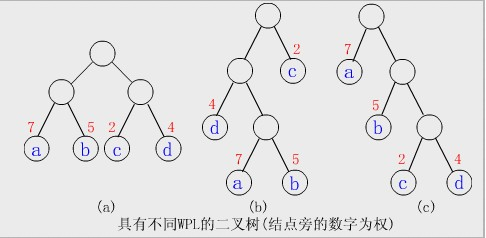
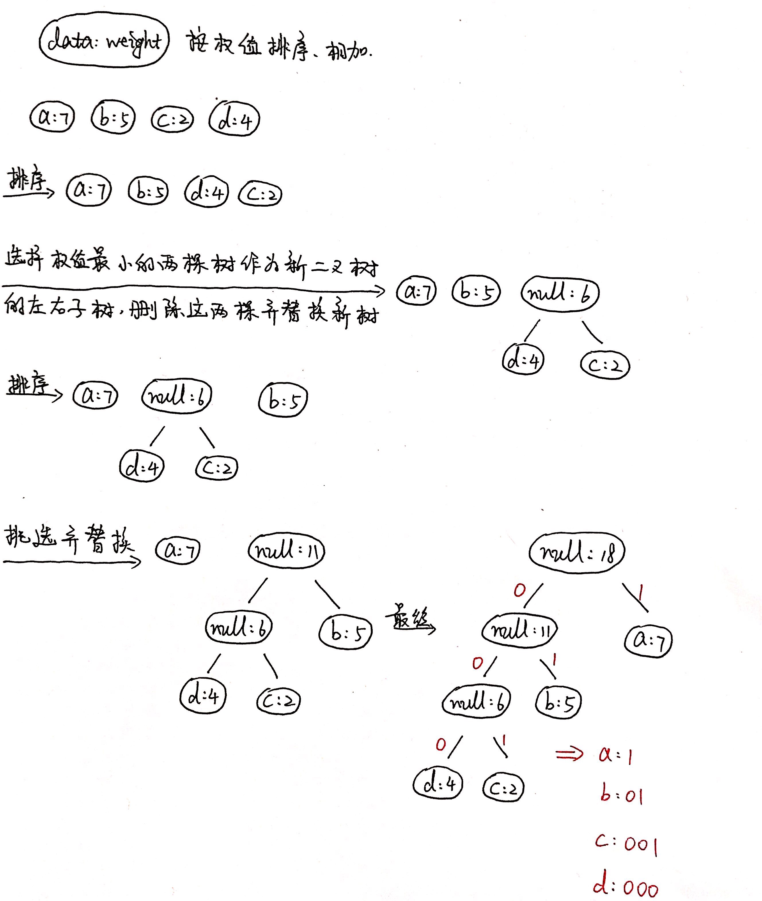

# 1. 树的转化

## 1.1 树 -> 二叉树

步骤：

1. 加线。在所有兄弟结点之间加一条连线；
2. 去线。树中的每个结点，只保留它与第一个孩子结点的连线，删除它与其它孩子结点之间的连线；
3. 层次调整。以树的根结点为轴心，将整棵树顺时针旋转一定角度，调整结构。当前的结点的左子结点为原来的结点的左子结点，当前的结点的右子结点为通过连线产生的子结点。

## 1.2 森林 -> 二叉树

**森林：互不相交的树的集合**

步骤：

1. 把每棵树转换为二叉树；
2. 第一棵二叉树不动，从第二棵二叉树开始，依次把后一棵二叉树的根结点作为前一棵二叉树的根结点的右子树，再连接。

## 1.3 二叉树 -> 树

步骤：

1. 加线。若某结点X的左子结点存在，则将这个左子结点的右子结点、右子结点的右子结点、右子结点的右子结点的右子结点…，都作为结点X的子结点。将结点X与这些右子结点连接起来；
2. 去线。删除原二叉树中所有结点与其右子结点的连线；
3. 层次调整。

## 1.4 二叉树 -> 森林

假如一棵二叉树的根结点有右子结点，则这棵二叉树能够转换为森林，否则将转换为一棵树。

步骤：

1. 从根结点开始，若右子结点存在，则把与右子结点的连线删除。再查看分离后的二叉树，若其根结点的右子结点存在，则删除连线；如果根结点不存在右子结点，则停下，查看下一棵树。直到所有根结点与右孩子的连线都删除时为止；
2. 将每棵分离后的二叉树转换为树。

# 2. 哈夫曼树

## 2.1 相关概念

1. 路径长度：从树中的一个结点到另一个结点之间的分支构成两个结点之间的路径，路径上的分支数目成为**路径长度**；

2. 树的路径长度：从**树根**到每一个结点的路径长度**之和**；

3. 结点的权：在一些应用中，赋予树中结点的一个有某种意义的实数；

4. 结点的带权路径长度：从该结点到**树根**之间的路径长度与结点上的**权**的乘积；

5. 树的带权路径长度：树中所有**叶子**结点的带权路径长度之和，记为Weighted Path Length of Tree: WPL。

   **Sigma(根 -> 叶子结点i 的路径长度) * w**

## 2.2 定义

如果一篇文章由10000个字符构成，如果采用等长的方式对每个字符进行8位编码，那么需要80000位。而实际上每个字符出现的频率不一样，如果将频率高的字符进行较短编码，频率低的字符进行较长编码，那么存储效率则能够提高。

**最优二叉树/哈夫曼树：**假设有n个权值，试构造一棵有n个**叶子结点**的二叉树。则，其中带权路径长度WPL最短的二叉树称为最优二叉树/哈夫曼树。根据结点的个数，权值的不同，最优二叉树的形状也各不相同。它们的共同点是：**带权值的结点都是叶子结点。权值越小的结点，其到根结点的路径越长。**

如，给定4个叶子结点a、b、c和d，分别带权7、5、2和4。构造如下图所示的三棵二叉树，它们的带权路径长度分别为：

1. WPL = 7 * 2 + 5 * 2 + 2 * 2 + 4 * 2 = 36；
2. WPL = 4 * 2 + 7 * 3 + 5 * 3 + 2 * 1 = 46；
3. WPL = 7 * 1 + 5 * 2 + 2 * 3 + 4 * 3 = 35.

可以验证，树(c)为哈夫曼树。

PS.

1. 叶子上的权值均相同时，完全二叉树一定是最优二叉树，否则完全二叉树不一定是最优二叉树；
2. 最优二叉树中，权越大的叶子结点离根越近；
3. 对同一组权值，有可能产生不同构的哈夫曼树，即形态不唯一，但WPL都相同。

## 2.3 构造哈夫曼树

1. 根据给定的n个权值｛w1, w2, w3, w4 …… wn｝构成n棵二叉树的森林 F=｛T1, T2,  T3 …… Tn｝，其中每棵二叉树只有一个权值为wi的根结点，其左右子树都为空。即，将每一个权值都分别构建一棵只有一个结点的二叉树；
2. 对F中权值进行**排序**，在森林F中选择两棵根结点的权值最小的二叉树，作为一棵新的二叉树的左右子树，且令新的二叉树的根结点的权值为其左右子树的权值之和；
3. 从F中删除被选中的权值最小的那两棵子树，并且把构成的新的二叉树加到F森林中；
4. 重复2、3步骤，直到森林只含有一棵二叉树为止，此时得到的这棵二叉树就是哈夫曼树。

PS. 哈夫曼树任意非叶子结点的左右子树交换后，仍然为哈夫曼树。因为构造哈夫曼树时就是通过合并得来，且并无强调合并时的左右顺序。

## 2.4 哈夫曼编码

### 2.4.1 思路

假设，当传送电文时，希望总长尽可能短。如果对每个字符设计长度不等的编码，且让电文中出现次数**较多**的字符采用尽可能**短**的编码，则传送电文的**总长**便可减少。如果设计A、B、C、D的编码分别为0、00、1、01，则"ABACCDA"字符串可转为"000011010"。但是，这样的电文会产生**二义性**。比如前四个编码"0000"可以译为"AAAA"或"ABA"或"BB"等等。因此，必须保证任意一个字符的编码都**不是**另一个字符的编码的**前缀**。这种编码成为**前缀编码**。

当编码的数据都为二叉树的**叶子结点**时，一定满足前缀编码。所以需要用二叉树避免编码的二义性，且权值都是叶子结点。

1. 对于输入的字符串，先统计每个字符出现的频率，根据(字符 - 频率)构建一个表用于存储；
2. 根据字符和频率，创建data:weight的结点，并根据这些结点构建一棵哈夫曼树，这些存放data:weight的结点都是**叶子结点**；
3. 对于每个叶子结点，从根出发，**向左走时树边标记0，向右走时树边标记1**，将经过的分支编码进行拼接，则可得到每一个叶子结点的编码，即将每个字符转为对应的哈夫曼编码格式。

### 2.4.2 实现

#### 2.4.2.1 层序遍历

和二叉树的层序遍历相同，从根结点处开始，循环进行结点入队 --> 访问出队 --> 它的子结点入队。

每个结点添加一个code属性用于记录自身编码，根结点的code为空。当左子结点入队时，左子结点的code为它的父结点的code加"0"；当右子结点入队时，左子结点的code为它的父结点的code加"1"。

结点出队时，如果它既没有左子结点也没有右子结点，说明它是哈夫曼树的叶子结点，将它的data和code记录进表即可。

#### 2.4.2.2 递归

如果当前结点的左子结点不为空，则左子结点的code为它的父结点的code加"0"，传入左子结点递归调用计算哈夫曼编码的函数；如果当前结点的右子结点不为空，则右子结点的code为它的父结点的code加"1"，传入右子结点递归调用计算哈夫曼编码的函数。

结束条件：当递归到既没有左子结点也没有右子结点的结点时，说明该结点是哈夫曼树的叶子结点，将它的data和code记录进表即可。