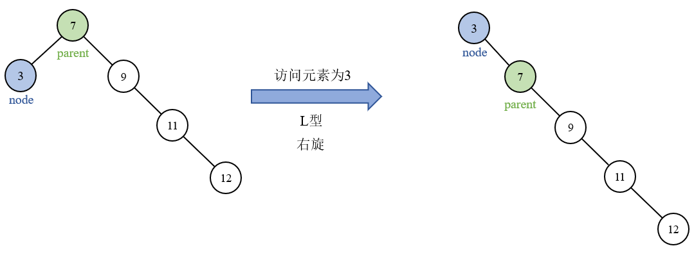
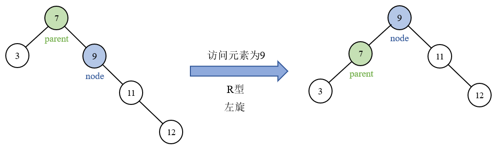
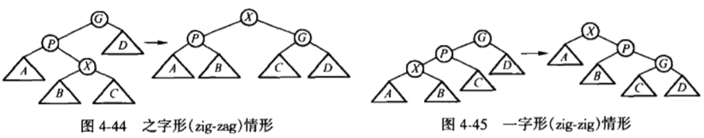
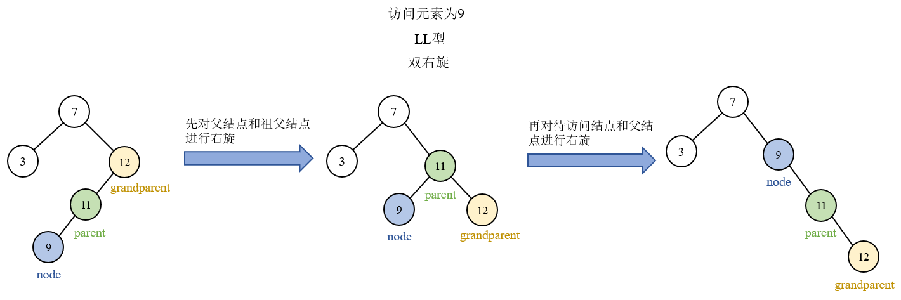
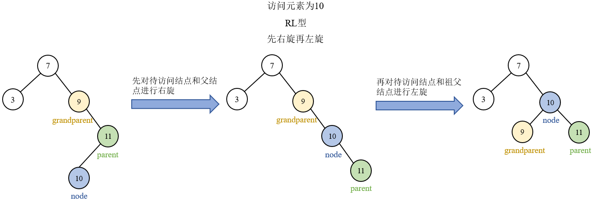
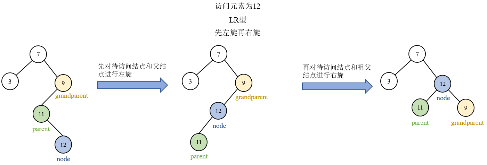
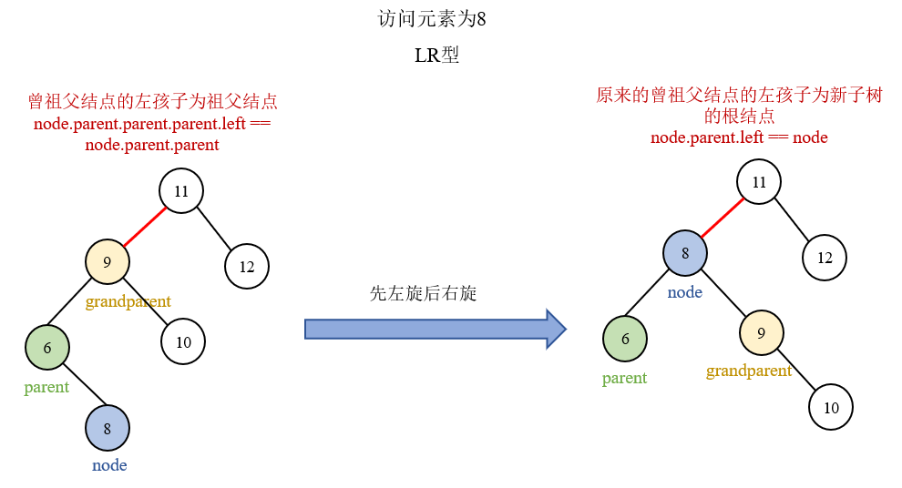
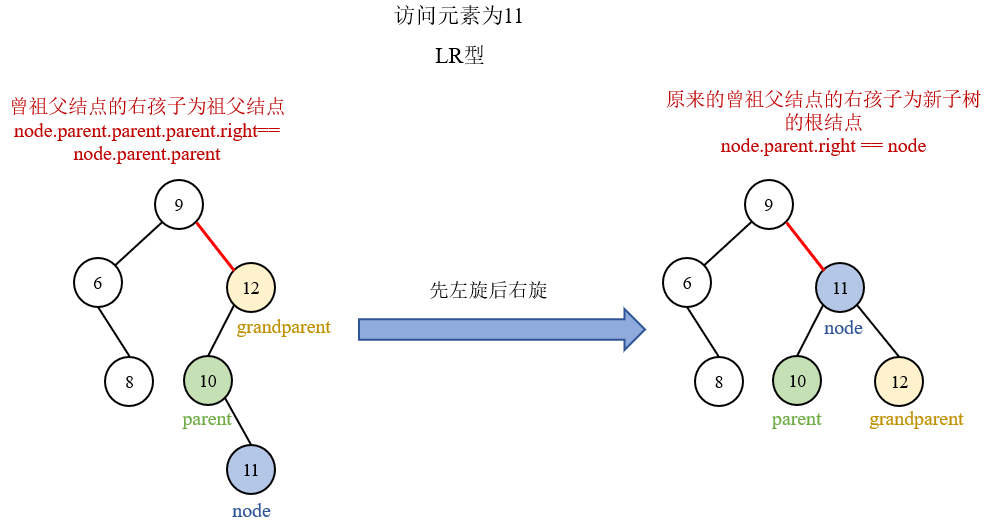
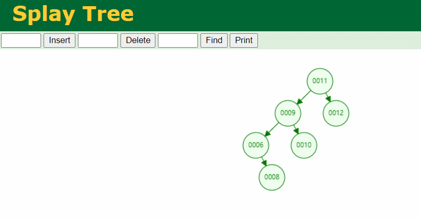

# 伸展树

## 1 概念

对于二叉查找树来说，每次查找的最坏时间为O(n)。如果一直访问最深的结点，且这个结点被访问后一直不改变位置，所以每次访问都会花费O(n)，则m次访问会花费O(m × n)的时间。

故考虑到局部性原理(刚被访问的内容下次可能仍会被访问，查找次数多的内容可能下一次会被访问)，为了减少多次操作的时间复杂度，**伸展树**的基本想法为：当一个结点被访问后，这个结点就要经过一系列类似于AVL树的旋转被推到**根结点**上。这种自调整形式的二叉查找树就是伸展树。每次对伸展树进行操作后，它均会通过旋转的方法把被访问结点旋转到**树根**的位置。注意，如果一个结点很深，那么在其路径上就存在许多也相对较深的结点，通过重新构造这棵树可以减少对**所有这些**结点的进一步访问所花费的时间。在许多应用中，当一个结点被访问后，它很可能不久之后又再被访问，所以将被访问到的结点推到合适的位置处(即根处)很重要。

## 2 优缺点及应用

### 2.1 优点

1. 时间复杂度低，伸展树的各种基本操作的**平摊(摊还)**复杂度都是O(log n)的。在树状数据结构中，无疑是非常优秀的；

2. 空间要求不高。与红黑树需要记录每个结点的颜色、AVL树需要记录平衡因子不同，伸展树可以维护更少的结点额外信息，空间性能更优，不需要记录任何信息以保持树的平衡；
3. 在很多情况下，对于查找操作，后面的查询和之前的查询有很大的相关性。这样每次查询操作将被查到的结点旋转到树的根结点位置，这样下次查询操作可以很快的完成。

### 2.2 缺点

1. 伸展树需要更多的局部调整，尤其是在**查找**期间。很多其它数据结构仅需在更新期间进行调整，查找期间则不用；

2. 一系列查找操作中的某一个可能会耗时较长，这在实时应用程序中可能是个不足之处；

3. 伸展树有可能会变成一条链。这种情况可能发生在以非降顺序访问n个元素之后。然而均摊的最坏情况是对数级的——O(log n)。

### 2.3 应用

伸展树的特点：对于经常用的数据，访问频率越高，访问速度越快。因此，输入法的候选框就可以用伸展树来实现，即输入法词表中用的次数越多的词的次序会被提前。如下图：

1. 在输入法中输入"sjjg"，出现如下候选栏：

   

2. 在后面几页中找到"实际结果"并按下回车，在第二次输入"sjjg"的时候，候选栏的第一位已经变成了"实际结果"：

   

3. 找到"时间间隔"并按下回车，在第二次输入"sjjg"的时候，候选栏的第一位已经变成了"时间间隔"：

   

4. 找到"数据结构"并按下回车，在第二次输入"sjjg"的时候，候选栏的第一位已经变成了"数据结构"：

   

## 3 展开(splay)

访问某个结点时，当找到该结点后，按**自底向上**的方式将该结点旋转到树根。

由于旋转过程中除待访问结点外，需要根据其父结点和祖父结点之间的关系自底向上进行调整，因此二叉树需要采用**三叉链表存储结构**，即一个结点除了数据域以外，还要有指向**左子结点、右子结点、父结点**的指针，比一般的二叉树多了**父结点**指针。虽然增加了空间开销，但是提升了调整的效率。

旋转过程参考AVL树的旋转：[AVL平衡二叉搜索树](https://github.com/YihaoChan/DataStructureAndAlgorithms/tree/main/BasisPractice/src/datastructure/tree/avltree)。但额外需要注意的是，由于增加了父结点指针，因此在旋转过后，需要重新调整父结点的指向，即更新新树中的结点的父结点指向关系。

### 3.1 zig、zig-zig和zig-zag

在该结点进行旋转的过程中，如果该结点的父结点为树根，则只需旋转该结点和根结点，即进行单旋转，这也是该结点沿着访问路径旋转过程的**最后的旋转**，称为**zig**型。

而如果该结点的父结点不是树根，则该结点有**父结点parent**和**祖父结点grandparent。**总体来说，分为**zig-zig**型和**zig-zag**型。

### 3.2 zig型，进行单旋转

当待访问结点的父结点为树的根结点时，只需要进行一次旋转即可将待访问结点调整至根的位置，调整到根之后，伸展操作即完成。根据待访问结点和其父结点parent之间的关系，分为**L型**和**R型。**

#### 3.2.1 L型，需要右旋

待访问结点为③，其父结点⑦为根结点，且根结点的**左孩子**为待访问结点，故称为**L型。**即：node.parent.parent == null，node.parent.left == node。此时对待访问结点和它的父结点进行**右旋**即可：

#### 3.2.2 R型，需要左旋

待访问结点为⑨，其父结点⑦为根结点，且根结点的**右孩子**为待访问结点，故称为**R型。**即：node.parent.parent == null，node.parent.right == node。此时对待访问结点和它的父结点进行**左旋**即可：

### 3.3 zig-zag和zig-zig型，进行双旋转

当待访问结点的父结点不为树的根结点时，需要进行两次旋转，才能将待访问结点调整至根的位置，调整到根之后，伸展操作即完成。根据待访问结点和其父结点parent与祖父结点grandparent之间的关系，分为**zig-zag型**和**zig-zig型。**

具体来讲，zig-zig型分为**LL型**和**RR型，**zig-zag型分为**RL型**和**LR型。**

P.S. 在进行双旋转之后，可能还需要有后续不断的调整，才能真正将待访问结点伸展到**根结点**处。所以这是一个循环，直到旋转过程中触碰到了树的根结点，并完成单旋转之后，才算真正的完成伸展。

#### 3.3.1 LL型，需要双右旋

待访问结点为⑨，其父结点为⑪，祖父结点为⑫，且祖父结点的**左孩子**为父结点，父结点的**左孩子**为待访问结点，故称为**LL型。**即：node.parent.parent.left == node.parent，node.parent.left == node。此时先对父结点和祖父结点进行**右旋**，再对待访问结点和父结点进行**右旋**，即完成了局部调整。此后再对新子树进行后续伸展。

#### 3.3.2 RR型，需要双左旋

待访问结点为⑫，其父结点为⑪，祖父结点为⑨，且祖父结点的**右孩子**为父结点，父结点的**右孩子**为待访问结点，故称为**RR型。**即：node.parent.parent.right== node.parent，node.parent.right== node。此时先对父结点和祖父结点进行**左旋**，再对待访问结点和父结点进行**左旋**，即完成了局部调整。此后再对新子树进行后续伸展。

#### 3.3.3 RL型，需要先右旋后左旋

待访问结点为⑩，其父结点为⑪，祖父结点为⑨，且祖父结点的**右孩子**为父结点，父结点的**左孩子**为待访问结点，故称为**RL型。**即：node.parent.parent.right == node.parent，node.parent.left == node。此时先对待访问结点和父结点进行**右旋**，再对待访问结点和祖父结点进行**左旋**，即完成了局部调整。此后再对新子树进行后续伸展。

#### 3.3.4 LR型，需要先左旋后右旋

待访问结点为⑫，其父结点为⑪，祖父结点为⑨，且祖父结点的**左孩子**为父结点，父结点的**右孩子**为待访问结点，故称为**LR型。**即：node.parent.parent.left == node.parent，node.parent.right == node。此时先对待访问结点和父结点进行**左旋**，再对待访问结点和祖父结点进行**右旋**，即完成了局部调整。此后再对新子树进行后续伸展。

#### 3.3.5 新子树根结点的父结点的指向问题

更需要注意，也是很容易忽略的一点是，在完成局部伸展结点后，需要更新新子树根结点的父结点的指向，但是父结点的指向也需要分情况讨论。如下两张图所示：

两张图所示情况都为LR型，但将待访问结点进行初步伸展后得到的新子树，分别为其父结点的左孩子和右孩子。所以在完成初步伸展之后，要根据原先的待访问结点的**曾祖父结点**和**祖父结点**之间的关系，更新**新子树根结点的父结点**和**它本身**之间的关系。

## 4 插入结点

由于伸展树由二叉查找树演变而来，因此它本质上也是一棵二叉查找树。所以和二叉查找树相同，当待插入结点的关键字小于递归遍历到的结点的关键字时，往左走；当待插入结点的关键字大于递归遍历到的结点的关键字时，往右走；当待插入结点的关键字等于递归遍历到的结点的关键字时，说明待插入结点已经存在于这棵树中，则不插入，直接返回当前树即可。

当递归到空结点null时，说明已经根据关键字之间的大小关系，初步找到待插入结点的插入位置。在此处根据关键字创建一个新结点，并将左右子结点设置为null，父结点设置为递归到的上一个结点。

如果待插入结点恰好为这棵树的根结点，即待插入结点为这棵树的第一个结点，则直接将这个结点返回。否则，将新创建的结点通过伸展(splay)的方式，调整到根结点处，再返回这棵树即完成插入结点操作。

## 5 查找结点

由于伸展树由二叉查找树演变而来，因此它本质上也是一棵二叉查找树。所以和二叉查找树相同，当待查找结点的关键字小于递归遍历到的结点的关键字时，往左走；当待查找结点的关键字大于递归遍历到的结点的关键字时，往右走；当待查找结点的关键字等于递归遍历到的结点的关键字时，说明已经找到待查找结点，将该结点伸展到这棵树的根结点位置，并返回这棵树。

## 6 删除结点

伸展树中删除结点的基本思路为：通过访问待删除结点来对结点进行删除操作。

1. 找到待删除结点，并将其推到根结点处；
2. 断开根结点和它的左右子树的联系，即只留下它的左右子树，相当于把待删除结点进行了删除("孤立")；
3. 如果得到的左子树为空，则右子树直接成为完整的树；
4. 如果得到的左子树不为空，则找到左子树中的最大值结点。之后，将该最大值结点推向根处，此时的新左子树的根结点没有右孩子(因为原来的最大值结点没有右孩子)；
5. 将右子树拼接成为新左子树的右孩子即可。

## 参考资料

[伸展树图解1](https://blog.csdn.net/u014634338/article/details/49586689)

[伸展树图解2](https://blog.csdn.net/u012124438/article/details/78067998)

[伸展树特点](https://blog.csdn.net/yang_yulei/article/details/45974473)

