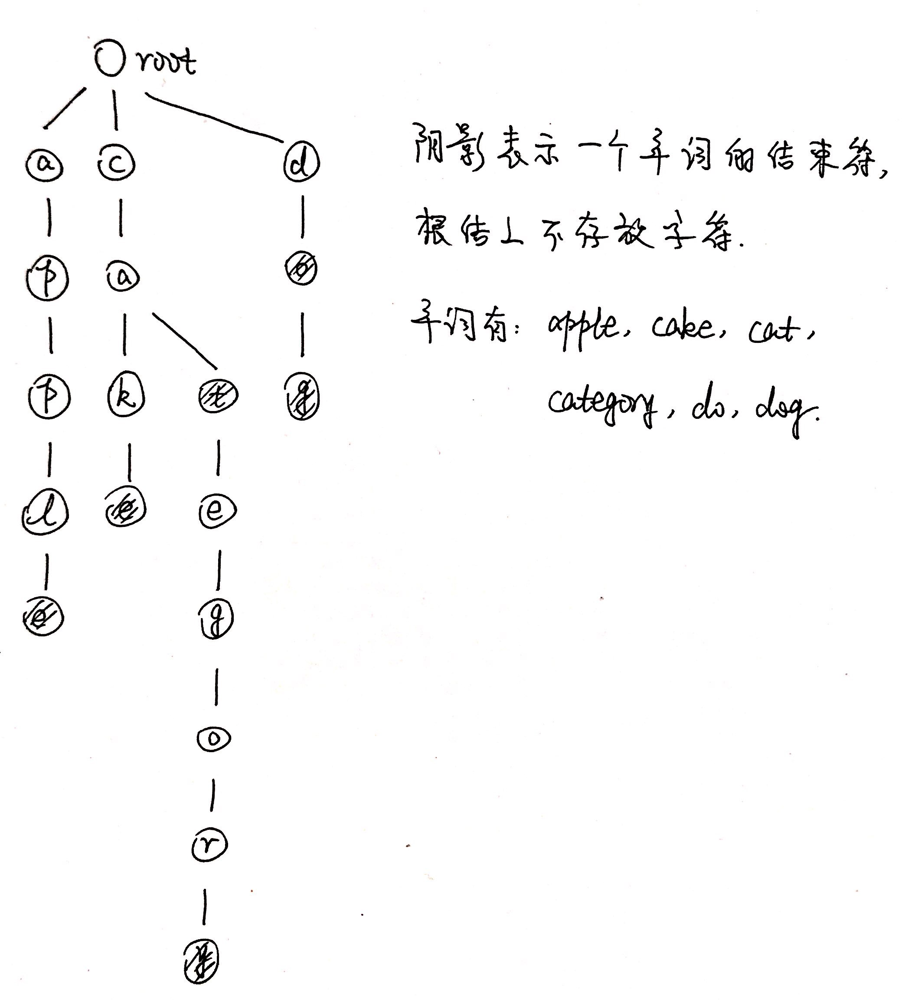
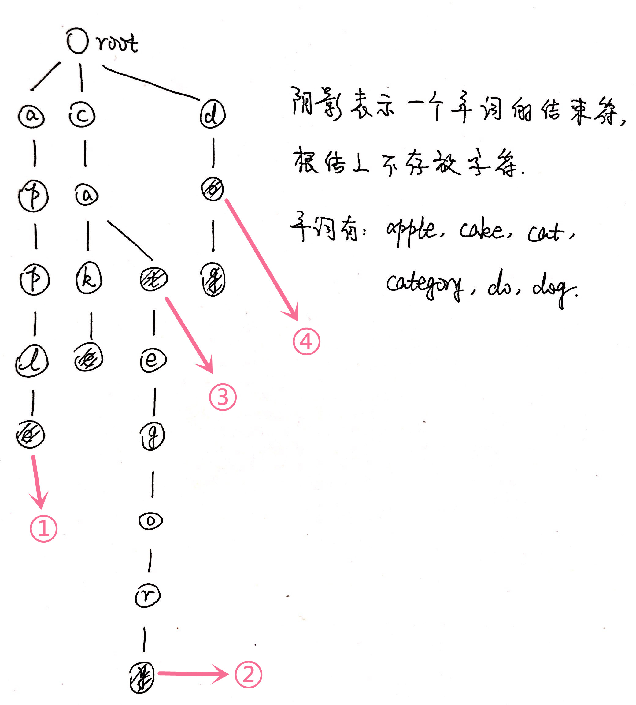

# 字典树

## 1 概念

字典树，即Trie树(取自Retrieve，检索)，又称单词查找树或键树，是一种树形结构，是哈希树的一种变种。此外，Trie树也称前缀树(因为某结点的后代存在共同的前缀，比如pan是panda的前缀)。它的key都为字符串，能做到高效查询和插入，时间复杂度为O(k)，k为字符串长度，缺点是如果大量字符串没有共同前缀时很耗内存。

## 2 应用及优缺点

字典树常用于保存关联数组，其中的键通常是字符串。一个结点的所有子孙都有相同的前缀，也就是这个结点对应的字符串，而根结点对应空字符串。它的优点是：利用字符串的公共前缀来减少查询时间，最大限度地减少无谓的字符串比较，查询效率比哈希树高。字典树一般用于统计、排序和保存大量的字符串(但不仅限于字符串)，所以经常被搜索引擎系统用于文本词频统计。

### 2.1 典型应用

1. **前缀匹配**：例如，找出一个字符串集合中所有以"五分钟"开头的字符串。我们只需要用所有字符串构造一棵Trie树，然后输出以"五−>分−>钟"开头的路径上的关键字即可。Trie树前缀匹配常用于搜索提示。如当输入一个网址，可以自动搜索出可能的选择。当没有完全匹配的搜索结果，可以返回前缀最相似的可能；
2. **字符串检索**：给出N个单词组成的熟词表，以及一篇全用小写英文书写的文章，按最早出现的顺序写出所有不在熟词表中的生词。检索/查询功能是Trie树最原始的功能。

### 2.2 优缺点

Trie树的核心思想是**以空间换时间**，利用字符串的公共前缀来降低查询时间的开销以达到提高效率的目的。假设字符的种数有m个，有若干个长度为n的字符串构成了一个 Trie树，则每个结点的出度为m(即每个结点的可能子结点数量为m)，Trie树的高度为n。很明显我们浪费了大量的空间来存储字符，此时Trie树的**最坏空间复杂度为O(m<sup>n</sup>)**。也正由于每个结点的出度为m，所以我们能够沿着树的一个个分支高效的向下逐个字符的查询，而不是遍历所有的字符串来查询，此时Trie树的**最坏时间复杂度为O(n)**。这正是空间换时间的体现，也是利用公共前缀降低查询时间开销的体现。

## 3 特点及结点构成

### 3.1 特点




通过上图，可以发现Trie树的特点：

- 根结点不包含字符，除根结点外每一个结点都只包含一个字符；
- 从根结点到某一带结束符的结点，路径上经过的字符连接起来，为组成该单词的字符串。

### 3.2 结点构成

每一个结点需要三个信息：

1. 组成单词的字符；
2. 是否为一个单词结尾的结束符标志；
3. 指向下一个结点的next域。

#### 3.2.1 设计思路①

```
public class Node{
	public char letter;
	public boolean endOfWordFlag;
	public char[26] next; 
}
```

弊端：

1. letter有些多余，因为next域已经指明下一个结点的字符为多少，所以不必要新开一个位置存放字符的值；
2. 使用数组并不是很合理，因为实际需求中有可能不止有小写字母，也可能有大写字母，或其他符号等等。所以，需要使用其他数据结构进行存放。

#### 3.2.2 设计思路②

为了查找和插入方便，约定字典树是**有序树**，即同一层中兄弟结点之间依所含符号自左至右有序。以上图的根结点为例，根结点共有三个子结点，因此它的next域必须为一个Map，才能根据所给字符选择**下一个子结点**，**判断出"走哪一条路"。**

```
public class Node{
	public boolean endOfWordFlag;
	public TreeMap<Character, Node> next;
}
```

P.S. 使用TreeMap是因为，TreeMap基于**红黑树(Red-Black tree)实现**。该映射根据**其键的自然顺序进行排序**，或者根据**创建映射时提供的Comparator进行排序**，具体取决于使用的构造方法。

curr.next.get(char) --> Node类型，取到下一个开始走的结点。

## 4 插入单词

1. 将单词拆分为一个个字符，逐个进行插入；
2. 插入前先看字母对应的结点是否存在，存在则共享该结点，不存在则根据字符创建新结点；
3. 当最后一个字符插入完毕时，将该字符加上单词结束符。


如上图，以插入category为例：

1. 在根结点处，查到next结点中含有'c'字符，则往下走；
2. 在'c'结点处查询到next结点中含有'a'字符，往下走；
3. 在'a'结点处没有查询到't'字符，则根据't'字符创建新结点；
4. 同上，一直创建新结点直到category所有字符都插入完毕；
5. 在最后一个字符'y'处，添加单词结束符标记。

如上图，以插入dog为例：

1. 在根结点处，next结点中查询不到'd'字符，则根据'd'字符直接创建结点；
2. 以此类推，根据'o'和'g'字符创建结点；
3. 在最后一个字符'g'处，添加单词结束符标记。

## 5 删除单词

删除单词共分为4种情况：



1. 待删除单词的最后一个字符为叶子结点，且途中没有其他单词；
2. 待删除单词的最后一个字符为叶子结点，且途中有其他单词；
3. 待删除单词的最后一个字符非叶子结点，且途中字符为其他单词的前缀；
4. 待删除单词的最后一个字符非叶子结点，且途中没有其他单词。

删除方法：由于需要从后往前逐个字符结点进行删除，因此可以考虑用**栈**存储途中的结点，然后逐一分析后判断并删除。

1. 对于情况1：从单词的末尾开始删除，直到全部字符都删除为止；
2. 对于情况2：从单词的末尾开始删除，直到待删除结点的前驱结点的为另一个单词的结束符(即结束符标志位为true)时，将待删除结点删除后直接跳出；
3. 对于情况3：从单词的末尾开始删除，直到待删除结点的前驱结点的next域有多于1个结点时，将待删除结点删除后直接跳出；
4. 对于情况4：将单词末尾字符的结束符标志位置为false即可。

## 6 查找单词有无在字典树中

从根结点开始查找，如果后继结点中没有所给单词的字符，则返回false，否则继续步进。当遍历到单词字符的结尾时，判断当前字符的结束符标志位：如果为true，说明待查找单词在字典树中，否则不在字典树中。

## 7 判断给定字符串是否为一个单词的前缀

从根结点开始查找，如果后继结点中没有所给字符串的字符，说明该字符串不存在于字典树中，则返回false，否则继续步进。当遍历到字符串的结尾字符时，判断当前结点的后继结点个数：(1) 如果后继结点个数大于等于1，说明该字符串**是**其他单词的前缀；(2) 如果后继结点个数为0，说明该字符串是一个存在于字典树中的完整单词，这种情况**不算**前缀。

## 参考资料

[字典树介绍](https://www.zhihu.com/question/22069841)

[字典树图解及实现](https://catwing.blog.csdn.net/article/details/88797312)

