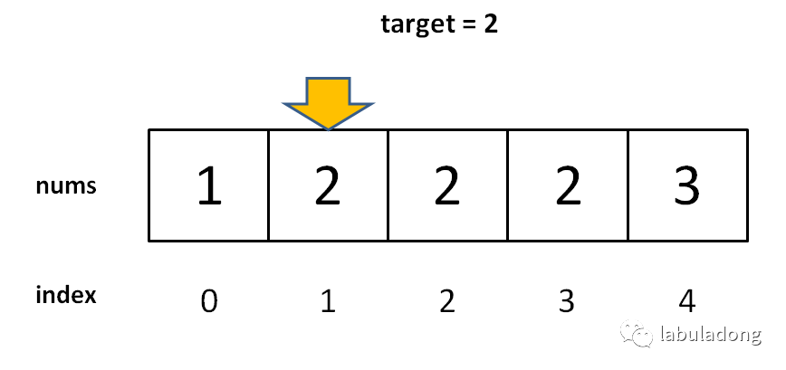
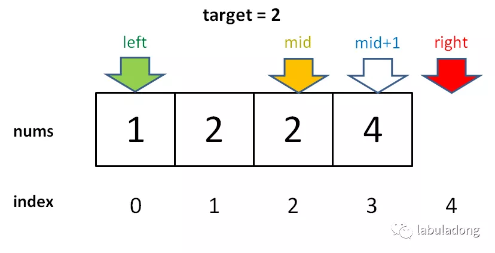

# 二分查找及其变种

## 1 原始二分查找

在有序数组中，搜索一个数，如果存在，返回其索引，否则返回-1。

```
int binarySearch(int[] nums, int target) {
	if (nums.length == 0) return -1;
	
    int left = 0; 
    int right = nums.length - 1; // (1)

    while (left <= right) { // (2)
        int mid = left + (right - left) / 2; (3)
        
        if(nums[mid] == target)
            return mid; 
        else if (nums[mid] < target)
            left = mid + 1; // (4)
        else if (nums[mid] > target)
            right = mid - 1; // (5)
        }
        
    return -1;
}
```

1. 注意(1)处为length - 1；
2. 因为(1)处为length - 1，故**搜索区间为[left, right]**，即可以包含左右边界。而(2)处while (left <= right)的结束条件为left == right + 1，代入区间为[right + 1, right]，确实应该跳出，所以while中可取等号；
3. (3)处不直接写(left + right) / 2而采用**left + (right - left) / 2**，是为了防止left + right太大造成溢出；
4. 当搜索不命中时，需要分为左右两个子区间，都是闭区间：**[left, mid - 1]**和**[mid + 1, right]**。故(4)(5)两处表达式如上。

## 2 寻找左侧边界的二分搜索

当有多个待搜索值相等时，找到它们的左侧边界。



```
int left_bound(int[] nums, int target) {
    if (nums.length == 0) return -1;
    
    int left = 0;
    int right = nums.length; // (1)

    while (left < right) { // (2)
        int mid = left + (right - left) / 2;
        
        if (nums[mid] == target) {
            right = mid; // (3)
        } else if (nums[mid] < target) {
            left = mid + 1; // (4)
        } else if (nums[mid] > target) {
            right = mid; // (5)
        }
    }
    
    if (left == nums.length) return -1; // (6)
    
    return nums[left] == target ? left : -1; // (7)
}
```

1. 注意(1)处为length；
2. 因为(1)处为length，故**搜索区间为[left, right)**，即不可以包含右边界。而(2)处while (left < right)的结束条件为left == right ，代入区间为[right, right)，此时就应该跳出来了，所以while中不取等号；
3. 当搜索不命中时，需要分为左右两个子区间，都是左闭右开区间：**[left, mid)**和**[mid + 1, right)**。故(4)(5)两处表达式如上；
4. (3)表示当命中第一个和target相等的元素时，不要停下来，接着往左搜索；
5. (6)处表示target比数组中所有值都大；
6. (7)处表示，当left处元素等于target时，说明找不到该元素，返回-1。否则，返回left；
7. Trick：因为不断往右搜索，而且left左区间是**闭区间**，所以返回时返回left即可。而如果**left == length，会越界**，所以要单独分类left为length的情况。

## 3 寻找右侧边界的二分搜索

当有多个待搜索值相等时，找到它们的右侧边界。



```
int right_bound(int[] nums, int target) {
    if (nums.length == 0) return -1;
    
    int left = 0;
    int right = nums.length; // (1)

    while (left < right) { // (2)
        int mid = left + (right - left) / 2;
        
        if (nums[mid] == target) {
            left = mid + 1; // (3)
        } else if (nums[mid] < target) {
            left = mid + 1; // (4)
        } else if (nums[mid] > target) {
            right = mid; // (5)
        }
    }
    
    if (right == 0) return -1; // (6)
    
    return nums[right - 1] == target ? right - 1 : -1; // (7)
}
```

1. 注意(1)处为length；
2. 因为(1)处为length，故**搜索区间为[left, right)**，即不可以包含右边界。而(2)处while (left < right)的结束条件为left == right ，代入区间为[right, right)，此时就应该跳出来了，所以while中不取等号；
3. 当搜索不命中时，需要分为左右两个子区间，都是左闭右开区间：**[left, mid)**和**[mid + 1, right)**。故(4)(5)两处表达式如上；
4. (3)表示当命中第一个和target相等的元素时，不要停下来，接着**往右搜索**；
5. (6)处表示target比数组中所有值都小；
6. (7)处表示，当right - 1处元素等于target时，说明找不到该元素，返回-1。否则，返回left；
7. Trick：因为不断往右搜索，而且right右区间是**开区间**，所以right会比较大，故返回时要返回**right - 1**。而如果**right - 1== -1，会越界**，所以要单独分类right为0的情况。

## 4 复杂度分析

1. 时间复杂度：二分查找在最坏的情况下依次是n/2, n/4, n/8...，直到1为止。假设循环x次后查找到目标数。可以观察到分母是每次都乘以1/2，分子不变，所以可以根据题意列出下面等式：

   n * (1/2)<sup>x</sup> = 1.

   变换可得x = log<sub>2</sub>n = logn.

   故二分查找时间复杂度为**O(logn)**。

2. 空间复杂度：只用到常数个额外空间，所以空间复杂度为**O(1)**。

## 5 典型例题

看到有序数组，肯定不能只是顺序扫描，这样就浪费了**有序**这个条件。所以要首先想到二分查找。

| 题目                                                         | 描述                   | 解答                                                         |
| ------------------------------------------------------------ | ---------------------- | ------------------------------------------------------------ |
| [704. 二分查找](https://leetcode-cn.com/problems/binary-search/) | 二分查找数组           | [704_Binary_Search](https://github.com/YihaoChan/DataStructureAndAlgorithms/blob/main/leetcode/solution/704_Binary_Search.md) |
| [35. 搜索插入位置](https://leetcode-cn.com/problems/search-insert-position/) | 二分查找数组           | [35_Search_Insert](https://github.com/YihaoChan/DataStructureAndAlgorithms/blob/main/leetcode/solution/35_Search_Insert.md) |
| [278. 第一个错误的版本](https://leetcode-cn.com/problems/first-bad-version/) | 二分查找序列           | [278_First_Bad_Version](https://github.com/YihaoChan/DataStructureAndAlgorithms/blob/main/leetcode/solution/278_First_Bad_Version.md) |
| [34. 在排序数组中查找元素的第一个和最后一个位置](https://leetcode-cn.com/problems/find-first-and-last-position-of-element-in-sorted-array/) | 数组左侧边界与右侧边界 | [34_Search_Range](https://github.com/YihaoChan/DataStructureAndAlgorithms/blob/main/leetcode/solution/34_Search_Range.md) |

