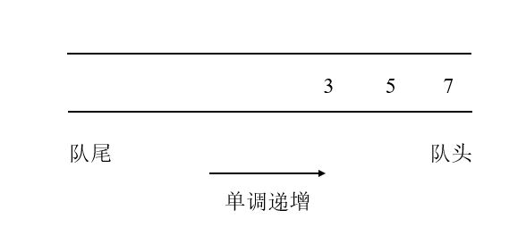

# 单调队列

## 1 概念

单调队列就是在普通队列的基础上，让队列中的元素具有单调性，同时仍然满足普通队列的**先进先出**特性。即：在单调递增队列中，从队尾到队头的元素是(严格)单调递增的；在单调递减队列中，从队尾到队头的元素是(严格)单调递减的。下图为单调递增队列示例：



## 2 构造

单调队列支持3种操作(以单调递增队列为例)：

1. push：将元素按大小(严格)单调递增的顺序push到队列中。具体实现：当需要插入一个元素时，检查当前元素是否**大于(等于)队尾元素**，如果是，则将**队尾**元素删除。如果当前元素**小于(等于)队尾元素**或队列**已空**，则将该元素直接插入到**队尾**；
2. pop：当进行pop操作时，如果队头元素恰好为待删除元素，则**队头**元素出队。否则，说明待删除元素在刚才push其他元素时已经被删除；
3. max：如果队列非空，则返回**队头**元素即为单调队列中的最大值。

由此可见，实现单调队列必须使用一种数据结构支持在头部和尾部进行插入和删除，很明显双向链表满足这个条件。

```
class MonotonicQueue {
    // 双链表，支持头部和尾部增删元素
    private LinkedList<Integer> queue = new LinkedList<>();

    public void push(int n) {
    	// 将前面小于自己的元素都删除
        while (!queue.isEmpty() && n > queue.peekLast()) {
            queue.removeLast();
        }
        
        // 添加到队尾
        queue.addLast(n);
    }
    
    public int max() {
    	// 队头的元素最大
        if (!queue.isEmpty()) {
            return queue.peekFirst();
        }
        
        return -1;
	}
	
	public void pop(int item) {
        if (queue.peekFirst() == item) {
           queue.removeFirst();
        }
	}
}
```

## 3 应用

单调队列的一个典型应用是用于解决**滑动窗口**问题，主要是求解窗口中的**最值**。假设需要维护一个元素数量为k的窗口，当扫描过的元素数量还不到k个时，将元素按单调性添加到单调队列里。如果恰好扫描了k个元素，就开始处理窗口，即移出多余的元素。主要理念就是：维护窗口内的元素始终至多为**k - 1个**("至多"是因为在元素入队时，可能删除队尾元素，使队列中的元素数量小于k)。解题框架如下：

```
public int[] maxSlidingWindow(int[] nums, int k) {
    MonotonicQueue window = new MonotonicQueue();
    
    int[] res = new int[len - k + 1];

    for (int i = 0; i < nums.length; i++) {
        if (i < k - 1) {
            // 先填满窗口的前 k - 1
            window.push(nums[i]);
        } else { 
            // 窗口向前滑动，加入新元素后窗口中恰好有k个元素
            window.push(nums[i]);
            
            // 记录当前窗口的最大值
            res[i - k + 1] = window.max();
            
            // 移出旧元素
            window.pop(nums[i - k + 1]);
        }
    }
    
    return res;
}
```

例如，进行下列几个操作：

push(1) -> push(3) -> push(-1) -> pop(1).

1. .png)

2. .png)

3. .png)

4. .png)

## 4 复杂度分析

1. 时间复杂度：显然，每一个pop操作和每一个max操作只花费O(1)。虽然每一次push操作可能涉及循环，但每个元素入队一次，最多出队一次，因此n个元素共入队n次，最多共出队n次，所以均摊到每一个push操作，也只花费O(1)。故，每个操作的时间复杂度均为**O(1)**。因此，完成整个滑动窗口求最值过程，总时间复杂度为**O(n)**；
2. 空间复杂度：队列中的元素数量为窗口大小，故空间复杂度为**O(k)**。

## 5 题目

| 题目                                                         | 描述         | 解答                                                         |
| ------------------------------------------------------------ | ------------ | ------------------------------------------------------------ |
| [239. 滑动窗口最大值](https://leetcode-cn.com/problems/sliding-window-maximum/) | 单调递增队列 | [239_Sliding_Window_Maximum](https://github.com/YihaoChan/DataStructureAndAlgorithms/blob/main/leetcode/solution/239_Sliding_Window_Maximum.md) |
| [剑指 Offer 59 - I. 滑动窗口的最大值](https://leetcode-cn.com/problems/hua-dong-chuang-kou-de-zui-da-zhi-lcof/) | 单调递增队列 | [J_59_I_239_Sliding_Window_Maximum](https://github.com/YihaoChan/DataStructureAndAlgorithms/blob/main/leetcode/solution/J_59_I_239_Sliding_Window_Maximum.md) |
| [剑指 Offer 59 - II. 队列的最大值](https://leetcode-cn.com/problems/dui-lie-de-zui-da-zhi-lcof/) | 单调递增队列 | [J_59_II_Queue_Maximum](https://github.com/YihaoChan/DataStructureAndAlgorithms/blob/main/leetcode/solution/J_59_II_Queue_Maximum.md) |

