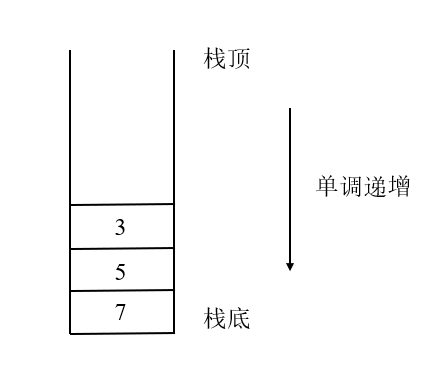

# 单调栈

## 1 概念

单调栈就是在普通栈的基础上，让栈中的元素具有单调性，同时仍然满足普通栈的**先进后出**特性。即：在单调递增栈中，从栈顶到栈底的元素是(严格)单调递增的；在单调递减栈中，从栈顶到栈底的元素是(严格)单调递减的。下图为单调递增栈示例：

## 2 构造

单调栈在将元素压栈时，检查当前元素是否**大于(等于)栈顶元素**，如果是，则将**栈顶**元素弹出。如果当前元素**小于(等于)栈顶元素**或栈**已空**，则将该元素直接压入到**栈顶**。

## 3 应用

单调栈主要解决下列问题：

- 比当前元素更大的后一个元素；
- 比当前元素更大的前一个元素；
- 比当前元素更小的后一个元素；
- 比当前元素更小的前一个元素.

技巧：当要求数组中当前元素更大的**后一个**元素时，就对数组**从后往前**遍历，将元素一个个添加到单调栈中；当要求数组中当前元素更大的**前一个**元素时，就对数组**从前往后**遍历，将元素一个个添加到单调栈中。当要求**更大**相关问题时，就构造**递增**栈。

例如要求数组[2, 1, 2, 4, 3]中每个元素的后一个更大元素，答案为[4, 2, 4, -1, -1]。实现过程如下：

因为题目要求**后一个**更大元素，故对数组**从后往前**遍历：

1. .png)

2. .png)

3. -1.png)

4. .png)

5. -2.png)

## 4 复杂度分析

1. 时间复杂度：虽然push元素的时候可能会经历循环，但是每个元素入栈一次，最多出栈一次，故n个元素共入栈n次，最多出栈n次，因此每个push操作的均摊时间复杂度为O(1)。故扫描整个数组并添加到单调栈中共花费**O(n)**；
2. 空间复杂度：最坏情况下从数组中取出并被压入栈的元素已经满足单调递增，不需要进行弹出操作，因此空间复杂度为**O(n)**。

## 5 题目

| 题目                                                         | 描述                 | 解答                                                         |
| ------------------------------------------------------------ | -------------------- | ------------------------------------------------------------ |
| [496. 下一个更大元素 I](https://leetcode-cn.com/problems/next-greater-element-i/) | 单调递增栈           | [496_Next_Greater_Element_I](https://github.com/YihaoChan/DataStructureAndAlgorithms/blob/main/leetcode/solution/496_Next_Greater_Element_I.md) |
| [503. 下一个更大元素 II](https://leetcode-cn.com/problems/next-greater-element-ii/) | 单调递增栈，循环数组 | [503_Next_Greater_Element_II](https://github.com/YihaoChan/DataStructureAndAlgorithms/blob/main/leetcode/solution/503_Next_Greater_Element_II.md) |
| [739. 每日温度](https://leetcode-cn.com/problems/daily-temperatures/) | 单调递增栈，下标栈   | [739_Daily_Temperatures](https://github.com/YihaoChan/DataStructureAndAlgorithms/blob/main/leetcode/solution/739_Daily_Temperatures.md) |
| [901. 股票价格跨度](https://leetcode-cn.com/problems/online-stock-span/) | 单调递增栈           | [901_Online_Stock_Span](https://github.com/YihaoChan/DataStructureAndAlgorithms/blob/main/leetcode/solution/901_Online_Stock_Span.md) |
| [1019. 链表中的下一个更大节点](https://leetcode-cn.com/problems/next-greater-node-in-linked-list/) | 普通栈；单调递增栈   | [1019_Next_Greater_Node_In_Linked_List](https://github.com/YihaoChan/DataStructureAndAlgorithms/blob/main/leetcode/solution/1019_Next_Greater_Node_In_Linked_List.md) |

