# 反转链表

凡是涉及递归的，都**不要跳进递归**，因为根本记不住很复杂的栈里面的情况。

## 1 反转整个链表

反转下图链表：

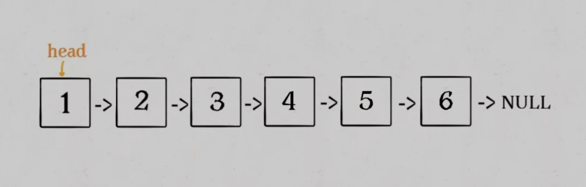

### 1.1 递归

总体上看，可理解为以下过程：

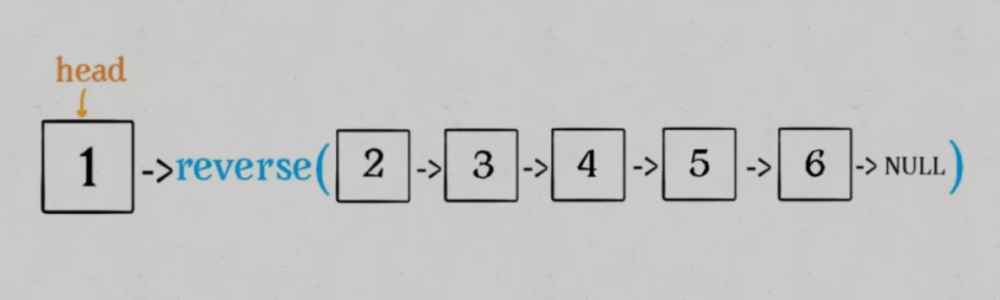

完成括号内部反转之后，应该是如下的状态：

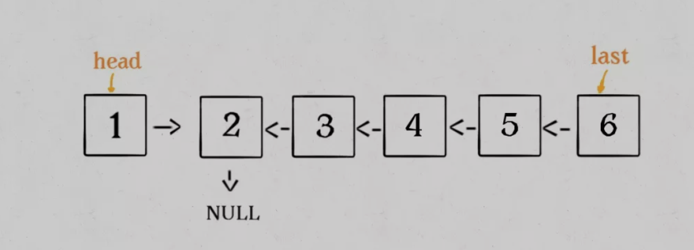

最末尾的结点是反转后链表的头结点，用last接收。

之后将head的指针反转，并将head的next指向null：

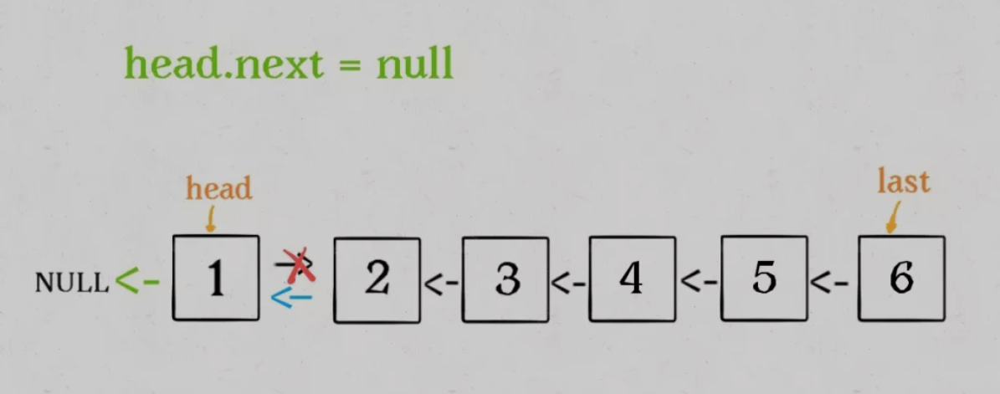

大体过程的理解：

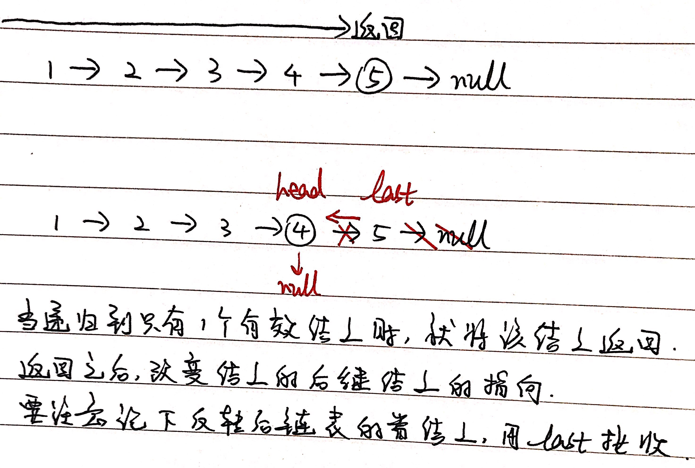

```
class Solution {
    public ListNode reverseList(ListNode head) {
        if (head == null || head.next == null) {
        	return head;
        }

        ListNode last = reverseList(head.next);

        head.next.next = head;
        head.next = null;

        return last;
    }
}
```

注意base case：当链表为空时，不必反转；当链表只有一个有效结点时，也不必反转。

复杂度分析：

1. 时间复杂度：每个结点完成反转操作花费O(1)，n个结点共花费O(n)，故时间复杂度为**O(n)**；
2. 空间复杂度：递归的过程中需要压栈，共压入n层，故空间复杂度为**O(n)**。

### 1.2 迭代

用多个指针完成相互之间的反转关系。

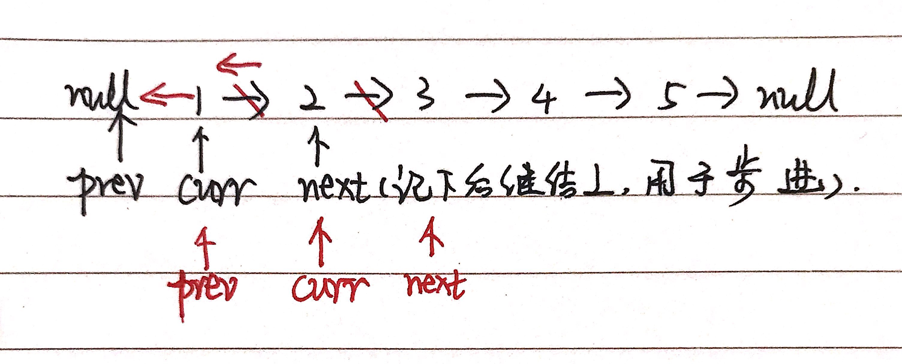

```
class Solution {
    public ListNode reverseList(ListNode head) {
        if (head == null || head.next == null) {
            return head;
        }

        ListNode prev = null;
        ListNode curr = head;

        while (curr != null) {
            ListNode nextNode = curr.next;
            curr.next = prev;
            prev = curr;
            curr = nextNode;
        }

        return prev;
    }
}
```

复杂度分析：

1. 时间复杂度：每个结点完成反转操作花费O(1)，n个结点共花费O(n)，故时间复杂度为**O(n)**；
2. 空间复杂度：仅花费常数个额外空间，故空间复杂度为**O(1)**。

## 2 反转链表前N个结点

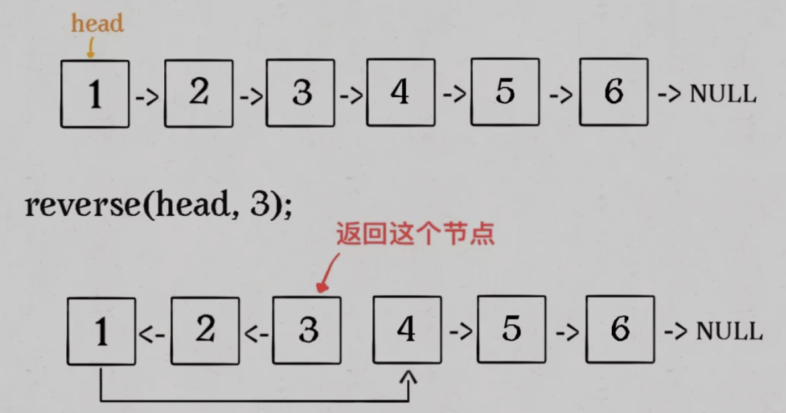

### 2.1 递归

不断向前推进(making progress)，当n被消耗至1时(base case)，说明到达反转的终点。此时记录下"全局"的后驱结点，即反转前N个结点后，每一次都需要重新指向的原来的第N + 1个结点。同时，要将反转后链表的首结点用last接收。

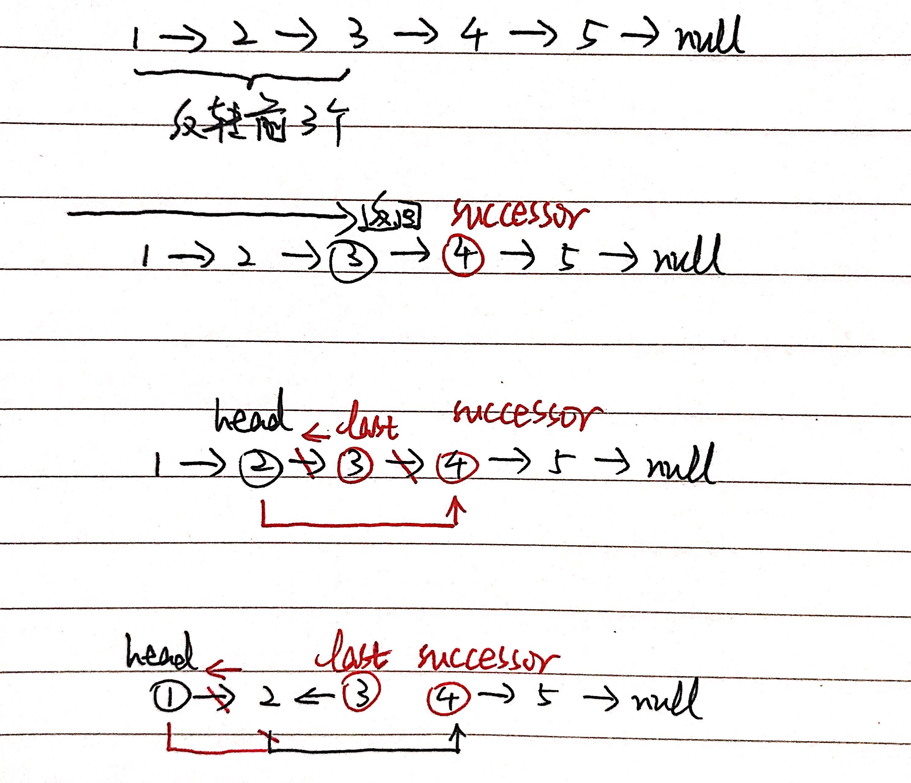

```
class Solution {
	ListNode successor = null;
	
	public ListNode reverseN(ListNode head, int right) {
        if (right == 1) {
            successor = head.next;
            return head;
        }

        ListNode last = reverseN(head.next, right - 1);

        head.next.next = head;
        head.next = successor;

        return last;
    }
}    
```

复杂度分析：

1. 时间复杂度：每个结点完成反转操作花费O(1)，最坏情况下完成n个结点的反转共花费O(n)，故时间复杂度为**O(n)**；
2. 空间复杂度：递归的过程中需要压栈，最坏情况下共压入n层，故空间复杂度为**O(n)**。

## 3 反转链表的第M ~ N个结点

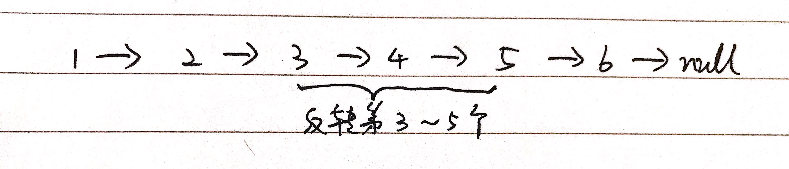

### 3.1 递归

如果M == 1，就相当于反转前N个结点。如果M != 1，就不断步进到M == 1为止，然后调用reverseN反转从这个位置开始的"前N个结点"。步进到触发条件之后，直接将当前结点的next指向反转后的结果即可，中间什么last之类的根本不用管，只管指下去就行了。

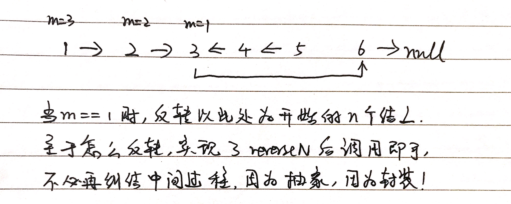

```
class Solution {
    ListNode successor = null;

    public ListNode reverseBetween(ListNode head, int left, int right)
    {
        if (head == null) {
            return head;
        }

        if (left == 1) {
            return reverseN(head, right);
        }

        head.next = reverseBetween(head.next, left - 1, right - 1);

        return head;
    }

    private ListNode reverseN(ListNode head, int right) {
        if (right == 1) {
            successor = head.next;
            return head;
        }

        ListNode last = reverseN(head.next, right - 1);

        head.next.next = head;
        head.next = successor;

        return last;
    }
}
```

复杂度分析：

1. 时间复杂度：步进到left处触发反转花费O(left)，从left到right处的结点完成反转花费O(right - left)，最坏情况下需要遍历整个链表，故总时间复杂度为**O(n)**；
2. 空间复杂度：递归完成从left到right处的结点的反转花费O(right - left)的栈空间，最坏情况下需要反转整个链表，故总空间复杂度为**O(n)**。

### 3.2 迭代

快慢指针，当慢指针指向反转起点的前驱结点时停下，同时快指针当做记录反转起点。之后完成内部反转。最后，调整反转之后反转内部与外部的指针指向。

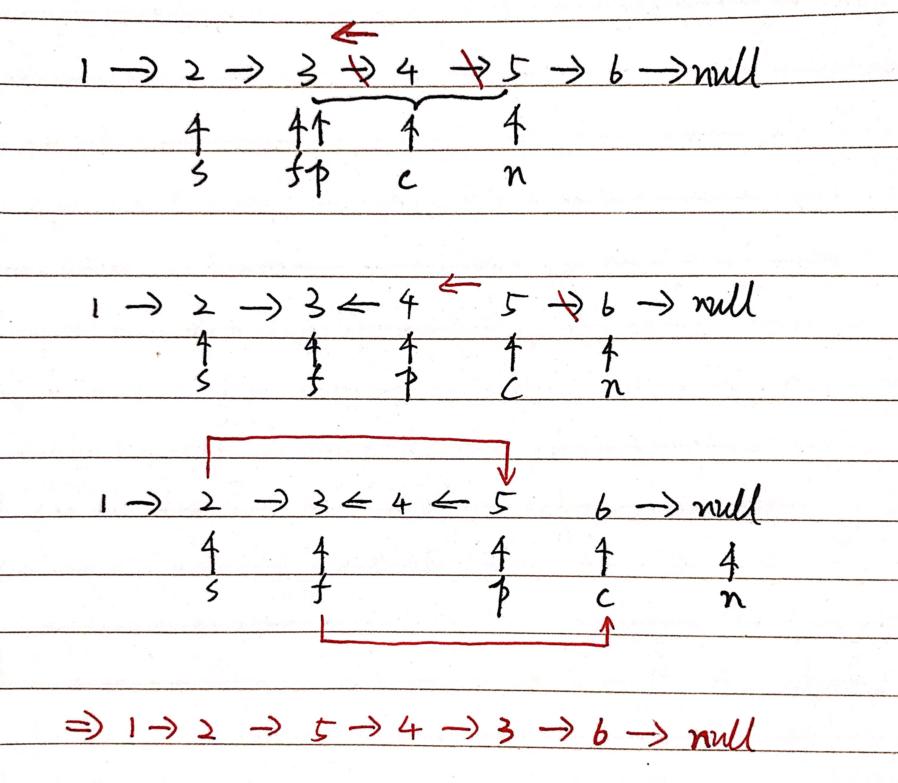

```
class Solution {
    public ListNode reverseBetween(ListNode head, int left, int right)
    {
        if (head == null) {
            return null;
        }

        ListNode sentinel = new ListNode(-501, head);

        ListNode slow = sentinel;
        ListNode fast = head;

        int step = left;

        while (step > 1) {
            slow = slow.next;
            fast = fast.next;
            step--;
        }

        ListNode prev = fast;
        ListNode curr = prev.next;

        int count = 0;

        while (left + count < right) {
            ListNode successor = curr.next;
            curr.next = prev;
            prev = curr;
            curr = successor;
            count++;
        }

        slow.next = prev;
        fast.next = curr;

        return sentinel.next;
    }
}
```

复杂度分析：

1. 时间复杂度：步进到left处触发反转花费O(left)，从left到right处的结点完成反转花费O(right - left)，最坏情况下需要遍历整个链表，故总时间复杂度为**O(n)**；
2. 空间复杂度：只花费了常数个额外空间，故空间复杂度为**O(1)**。

## 4 题目

| 题目                                                         | 描述             | 解答                                                         |
| ------------------------------------------------------------ | ---------------- | ------------------------------------------------------------ |
| [206. 反转链表](https://leetcode-cn.com/problems/reverse-linked-list/) | 反转整个链表     | [206_Reverse_Linked_List](https://github.com/YihaoChan/DataStructureAndAlgorithms/blob/main/leetcode/solution/206_Reverse_Linked_List.md) |
| [剑指 Offer 24. 反转链表](https://leetcode-cn.com/problems/fan-zhuan-lian-biao-lcof/) | 反转整个链表     | [J_24_Reverse_Linked_list](https://github.com/YihaoChan/DataStructureAndAlgorithms/blob/main/leetcode/solution/J_24_Reverse_Linked_list.md) |
| [92. 反转链表 II](https://leetcode-cn.com/problems/reverse-linked-list-ii/) | 反转链表的一部分 | [92_Reverse_Linked_List_II](https://github.com/YihaoChan/DataStructureAndAlgorithms/blob/main/leetcode/solution/92_Reverse_Linked_List_II.md) |
| [剑指 Offer 06. 从尾到头打印链表](https://leetcode-cn.com/problems/cong-wei-dao-tou-da-yin-lian-biao-lcof/) | 反转整个链表     | [J_06_Print_List_From_End_to_Start](https://github.com/YihaoChan/DataStructureAndAlgorithms/blob/main/leetcode/solution/J_06_Print_List_From_End_to_Start.md) |

