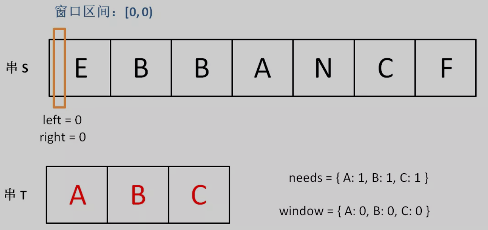
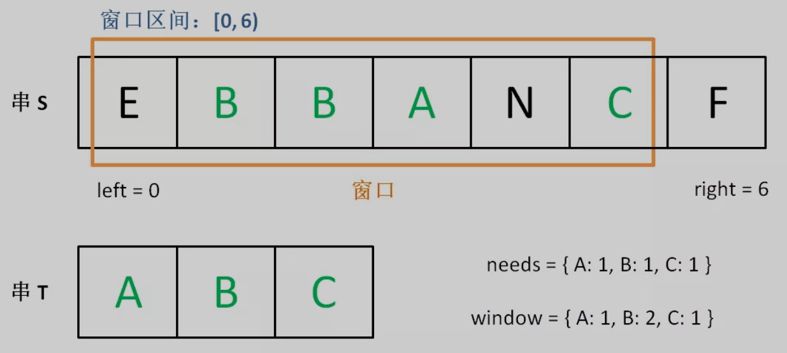
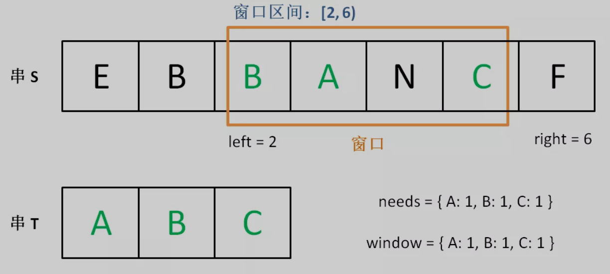
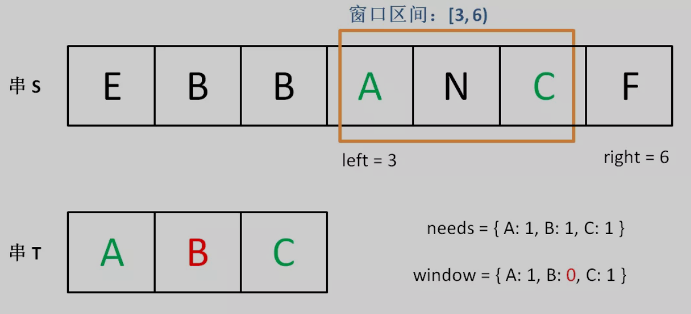

# 滑动窗口

## 1 概念

通过左指针和右指针形成一个窗口，当还没有触碰条件时，通过步进right指针扩张窗口，同时更新窗口内数据的相应信息；当窗口触碰条件时，通过步进left指针并更新窗口内数据的相应信息，达到收缩窗口的效果。即：先找到一个**可行解**，再不断**优化**它。这种做法能大大降低算法的时间复杂度，通常能将暴力搜索优化至线性级别的速度。、

## 2 举例

1. 需求：在主串中找到A、B、C字母各出现一次的最小长度子串；

2. 初始状态下，窗口中A、B、C字母均出现0次：

   

3. 不断步进right指针扩张窗口，当A、B、C都至少出现1次，即达到条件的字母有三个，恰好等于需要统计的字母数量时，需要开始收缩窗口：

   

4. left所指字母E不在需要统计的字母范围内，直接删除，步进left；所指字母B出现两次，删除一次后还有一次，刚好符合需要统计的个数，所以这个多出来的字母B可以删除，步进left；剩下的B字母刚好在窗口里只剩下一次，如果删除的话，窗口内满足条件的字母数量就剩2，不等于3，所以删除之后就要重新继续开始扩张窗口：

   

   

## 3 框架

```
void slidingWindow(string s, string t) {
    Map<Character, Integer> target, window;
    
    // 统计需要出现的字母及其次数
    for (char c : t) {
    	target.put(c, target.getOrDefault(c, 0) + 1);
    }

    int left = 0, right = 0; // 遍历主串s的左右指针
    
    int satisfy = 0; // 满足统计条件的字母个数
    
    // 遍历主串
    for (right = 0; right < s.length(); right++) {
    	// 当前遍历到的字符
        char current = s[right];
        
        // 更新窗口内相应数据
		...
        
        // 满足统计要求时，窗口需要收缩
        while (window needs shrink) {
            // 被移出窗口的字符
            char removeChar = s[left];
            
            // 左移窗口
            left++;
            
            // 更新窗口内相应数据
            ...
        }
    }
}
```

## 4 题目

| 题目                                                         | 描述                 | 解答                                                         |
| ------------------------------------------------------------ | -------------------- | ------------------------------------------------------------ |
| [76. 最小覆盖子串](https://leetcode-cn.com/problems/minimum-window-substring/) | 哈希表统计次数       | [76_Minimum_Window_Substring](https://github.com/YihaoChan/DataStructureAndAlgorithms/blob/main/leetcode/solution/76_Minimum_Window_Substring.md) |
| [567. 字符串的排列](https://leetcode-cn.com/problems/permutation-in-string/) | 哈希表统计次数       | [567_Permutation_in_String](https://github.com/YihaoChan/DataStructureAndAlgorithms/blob/main/leetcode/solution/567_Permutation_in_String.md) |
| [438. 找到字符串中所有字母异位词](https://leetcode-cn.com/problems/find-all-anagrams-in-a-string/) | 哈希表统计次数       | [438_Find_All_Anagrams_in_a_String](https://github.com/YihaoChan/DataStructureAndAlgorithms/blob/main/leetcode/solution/438_Find_All_Anagrams_in_a_String.md) |
| [209. 长度最小的子数组](https://leetcode-cn.com/problems/minimum-size-subarray-sum/) | 快慢指针形成窗口     | [209_Minimum_Size_Subarray_Sum](https://github.com/YihaoChan/DataStructureAndAlgorithms/blob/main/leetcode/solution/209_Minimum_Size_Subarray_Sum.md) |
| [3. 无重复字符的最长子串](https://leetcode-cn.com/problems/longest-substring-without-repeating-characters/) | 哈希表统计次数       | [3_Longest_Substring_Without_Repeating_Characters](https://github.com/YihaoChan/DataStructureAndAlgorithms/blob/main/leetcode/solution/3_Longest_Substring_Without_Repeating_Characters.md) |
| [面试题 17.18. 最短超串](https://leetcode-cn.com/problems/shortest-supersequence-lcci/) | 哈希集合统计出现字母 | [M_17.18_Shortest_Supersequence](https://github.com/YihaoChan/DataStructureAndAlgorithms/blob/main/leetcode/solution/M_17.18_Shortest_Supersequence.md) |
| [1004. 最大连续1的个数 III](https://leetcode-cn.com/problems/max-consecutive-ones-iii/) | 快慢指针形成窗口     | [1004_Max_Consecutive_Ones_III](https://github.com/YihaoChan/DataStructureAndAlgorithms/blob/main/leetcode/solution/1004_Max_Consecutive_Ones_III.md) |

