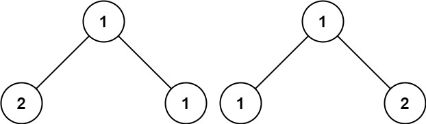

# 第100题 相同的树

## 1 题目

给你两棵二叉树的根节点 p 和 q ，编写一个函数来检验这两棵树是否相同。

如果两个树在结构上相同，并且节点具有相同的值，则认为它们是相同的。

示例 1：


输入：p = [1,2,3], q = [1,2,3]
输出：true
示例 2：


输入：p = [1,2], q = [1,null,2]
输出：false
示例 3：




输入：p = [1,2,1], q = [1,1,2]
输出：false

## 2 解法

### 2.1 递归

```c++
/**
 * Definition for a binary tree node.
 * struct TreeNode {
 *     int val;
 *     TreeNode *left;
 *     TreeNode *right;
 *     TreeNode() : val(0), left(nullptr), right(nullptr) {}
 *     TreeNode(int x) : val(x), left(nullptr), right(nullptr) {}
 *     TreeNode(int x, TreeNode *left, TreeNode *right) : val(x), left(left), right(right) {}
 * };
 */
class Solution {
public:
    bool isSameTree(TreeNode* p, TreeNode* q) {
        if (p == nullptr && q == nullptr) {
            return true;
        }

        if (p == nullptr ^ q == nullptr) {
            return false;
        }

        return p->val == q->val &&
               isSameTree(p->left, q->left) &&
               isSameTree(p->right, q->right);
    }
};
```

复杂度分析：

设树p的结点个数为m，树q的结点个数为n。

1. 时间复杂度：必须要两棵树的结点同时非空时，才能将结点的值相比较，否则直接返回，不进行任何运算或操作。因此，被访问到的结点树不会超过较少结点的二叉树的结点数，故时间复杂度为**O(min(m, n))**；
2. 空间复杂度：递归空间复杂度为递归树深度，故空间复杂度为**O(logmin(m, n))**，最坏情况下树退化为链表，空间复杂度为O(min(m, n))。

### 2.2 迭代

层序遍历。

```c++
/**
 * Definition for a binary tree node.
 * struct TreeNode {
 *     int val;
 *     TreeNode *left;
 *     TreeNode *right;
 *     TreeNode() : val(0), left(nullptr), right(nullptr) {}
 *     TreeNode(int x) : val(x), left(nullptr), right(nullptr) {}
 *     TreeNode(int x, TreeNode *left, TreeNode *right) : val(x), left(left), right(right) {}
 * };
 */
class Solution {
public:
    bool isSameTree(TreeNode* p, TreeNode* q) {
        if (p == nullptr && q == nullptr) {
            return true;
        } else if (p == nullptr) {
            return false;
        } else if (q == nullptr) {
            return false;
        }

        queue<TreeNode*> pQueue;
        queue<TreeNode*> qQueue;
        pQueue.push(p);
        qQueue.push(q);
        
        while (!pQueue.empty() && !qQueue.empty()) {
            TreeNode* pNode = pQueue.front();
            TreeNode* qNode = qQueue.front();

            pQueue.pop();
            qQueue.pop();

            if (pNode == nullptr && qNode == nullptr) {
                continue;
            }
            if (pNode == nullptr ^ qNode == nullptr) {
                return false;
            }
            if (pNode->val != qNode->val) {
                return false;
            }

            pQueue.push(pNode->left);
            pQueue.push(pNode->right);
            qQueue.push(qNode->left);
            qQueue.push(qNode->right);
        }

        return true;
    }
};
```

复杂度分析：

设树p的结点个数为m，树q的结点个数为n。

1. 时间复杂度：必须要两棵树的结点同时非空时，才能将结点的值相比较，否则直接返回，不进行任何运算或操作。因此，被访问到的结点树不会超过较少结点的二叉树的结点数，故时间复杂度为**O(min(m, n))**；
2. 空间复杂度：队列中最多结点数为树的最深层结点数，p树对应队列中的结点最多不超过2<sup>hp-1</sup>个，q树对应队列中的结点最多不超过2<sup>hq-1</sup>个。当发现两者结点较小者即可返回，故空间复杂度为**O(min(2<sup>hp-1</sup>, 2<sup>hq-1</sup>))**。

