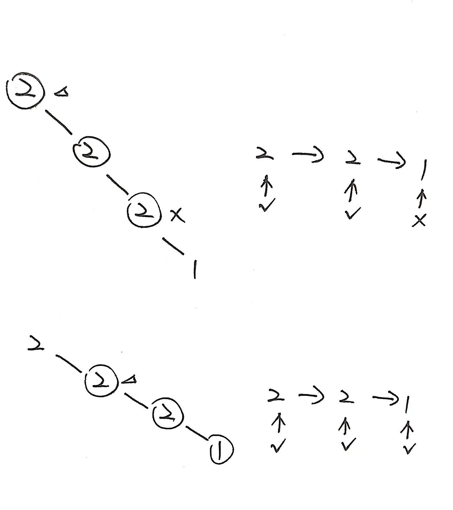

# 第1367题 二叉树中的列表

## 1 题目

给你一棵以 root 为根的二叉树和一个 head 为第一个节点的链表。

如果在二叉树中，存在一条一直向下的路径，且每个点的数值恰好一一对应以 head 为首的链表中每个节点的值，那么请你返回 True ，否则返回 False 。

一直向下的路径的意思是：从树中某个节点开始，一直连续向下的路径。

示例 1：


输入：head = [4,2,8], root = [1,4,4,null,2,2,null,1,null,6,8,null,null,null,null,1,3]
输出：true
解释：树中蓝色的节点构成了与链表对应的子路径。
示例 2：


输入：head = [1,4,2,6], root = [1,4,4,null,2,2,null,1,null,6,8,null,null,null,null,1,3]
输出：true
示例 3：

输入：head = [1,4,2,6,8], root = [1,4,4,null,2,2,null,1,null,6,8,null,null,null,null,1,3]
输出：false
解释：二叉树中不存在一一对应链表的路径。

## 2 解法

每次都要从当前结点检查整个链表，即根据链表结点和从当前结点出发的子结点们判断是否一一匹配成功。如果匹配失败，就根据当前结点的左右结点继续匹配。（不用怀疑，时间复杂度就是有点高...）



```
/**
 * Definition for singly-linked list.
 * public class ListNode {
 *     int val;
 *     ListNode next;
 *     ListNode() {}
 *     ListNode(int val) { this.val = val; }
 *     ListNode(int val, ListNode next) { this.val = val; this.next = next; }
 * }
 */
/**
 * Definition for a binary tree node.
 * public class TreeNode {
 *     int val;
 *     TreeNode left;
 *     TreeNode right;
 *     TreeNode() {}
 *     TreeNode(int val) { this.val = val; }
 *     TreeNode(int val, TreeNode left, TreeNode right) {
 *         this.val = val;
 *         this.left = left;
 *         this.right = right;
 *     }
 * }
 */
class Solution {
    public boolean isSubPath(ListNode head, TreeNode root) {
        if (root == null) {
            return false;
        }

        return dfs(head, root) || // 从当前结点出发和链表结点一一匹配
               isSubPath(head, root.left) || // 判断完当前结点，就判断子结点
               isSubPath(head, root.right);
    }

    private boolean dfs(ListNode head, TreeNode root) {
        if (head == null) {
            return true;
        }

        if (root == null) {
            return false;
        }

        if (head.val != root.val) {
            return false;
        }

        return dfs(head.next, root.left) || dfs(head.next, root.right);
    }
}
```

复杂度分析：

设树有n个结点，链表有m个结点。

1. 时间复杂度：最坏情况下，对于树的每一个结点，在搜索链表时都搜索到链表的最后一个结点处发现不匹配，故时间复杂度为**O(n · m)**；
2. 空间复杂度：递归栈空间为二叉树的深度，故空间复杂度为**O(logn)**，最坏情况下二叉树退化为链表，空间复杂度为O(n)。