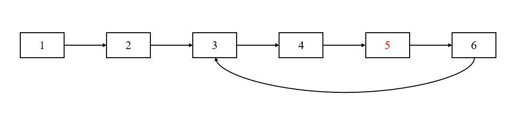

# 第142题 环形链表 II

## 1 题目

给定一个链表，返回链表开始入环的第一个节点。 如果链表无环，则返回 null。

为了表示给定链表中的环，我们使用整数 pos 来表示链表尾连接到链表中的位置（索引从 0 开始）。 如果 pos 是 -1，则在该链表中没有环。注意，pos 仅仅是用于标识环的情况，并不会作为参数传递到函数中。

说明：不允许修改给定的链表。


示例 1：

```
输入：head = [3,2,0,-4], pos = 1
输出：返回索引为 1 的链表节点
解释：链表中有一个环，其尾部连接到第二个节点。
```


示例 2：

```
输入：head = [1,2], pos = 0
输出：返回索引为 0 的链表节点
解释：链表中有一个环，其尾部连接到第一个节点。
```


示例 3：

```
输入：head = [1], pos = -1
输出：返回 null
解释：链表中没有环。
```

## 2 解法

快慢指针。当求出快指针和慢指针相遇的结点时，让一个新指针重新从首结点出发，并和慢指针一样按1单位步进。当新指针和慢指针相遇时，就是环的入口。

原理见：[链表相关知识点](https://github.com/YihaoChan/DataStructureAndAlgorithms/tree/main/basis/src/datastructure/linkedlist)

如下图所示，快慢指针在结点5处相遇，之后新结点从首结点出发，走两步之后在结点3处与慢指针相遇，此时即为环的入口。



```c++
/**
 * Definition for singly-linked list.
 * struct ListNode {
 *     int val;
 *     ListNode *next;
 *     ListNode(int x) : val(x), next(NULL) {}
 * };
 */
class Solution {
public:
    ListNode *detectCycle(ListNode *head) {
        ListNode *slow = head;
        ListNode *fast = head;

        while (fast != nullptr && fast->next != nullptr) {
            slow = slow->next;
            fast = fast->next->next;

            if (slow == fast) {
                break;
            }
        }

        if (fast == nullptr || fast->next == nullptr) {
            return nullptr;
        }

        ListNode *entrance = head;

        while (entrance != slow) {
            entrance = entrance->next;
            slow = slow->next;
        }

        return entrance;
    }
};
```

复杂度分析：

1. 时间复杂度：

   1. 求解相遇点：快慢指针相遇时，慢指针走过的距离不会超过链表长度，而虽然快指针的速度是慢指针的两倍，但由于每次都是“跳着”步进，因此经过的结点数和慢指针一样。因此，求解相遇点阶段的时间复杂度为O(n) + O(n) = O(n)；
   2. 寻找入口点：在寻找入口点阶段，新指针和慢指针走过的距离也不会超过链表的长度，因此，寻找入口点阶段的时间复杂度为O(n) + O(n) = O(n)。

   因此，总时间复杂度为**O(n)**；

2. 空间复杂度：仅用到常数个额外空间，故空间复杂度为**O(1)**。