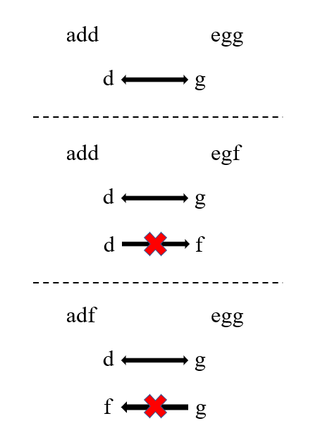

# 第205题 同构字符串

## 1 题目

给定两个字符串 s 和 t，判断它们是否是同构的。

如果 s 中的字符可以按某种映射关系替换得到 t ，那么这两个字符串是同构的。

每个出现的字符都应当映射到另一个字符，同时不改变字符的顺序。不同字符不能映射到同一个字符上，相同字符只能映射到同一个字符上，字符可以映射到自己本身。

示例 1:

```
输入：s = "egg", t = "add"
输出：true
```

示例 2：

```
输入：s = "foo", t = "bar"
输出：false
```

示例 3：

```
输入：s = "paper", t = "title"
输出：true
```


提示：

可以假设 s 和 t 长度相同。

## 2 解法

定义两个哈希表，一个用于映射字符串s的字符到t中的字符的对应关系，一个用于映射字符串t的字符到s中的字符的对应关系，两个关系应该相等，称为**双射**。



```
class Solution {
    public boolean isIsomorphic(String s, String t) {
        if (s == null || t == null) {
            return false;
        }

        int sLen = s.length();
        int tLen = t.length();

        if (sLen != tLen) {
            return false;
        }

        Map<Character, Character> s2t = new HashMap<>(sLen);
        Map<Character, Character> t2s = new HashMap<>(tLen);

        int len = sLen;

        for (int i = 0; i < len; i++) {
            Character sChar = s.charAt(i);
            Character tChar = t.charAt(i);
            Character sChar2tChar = s2t.get(sChar);
            Character tChar2sChar = t2s.get(tChar);

            if (sChar2tChar == null && tChar2sChar == null) {
                s2t.put(sChar, tChar);
                t2s.put(tChar, sChar);
            } else if (
                !sChar.equals(tChar2sChar) || 
                !tChar.equals(sChar2tChar)
            ) {
                return false;
            }
        }

        return true;
    }
}
```

复杂度分析：

1. 时间复杂度：最坏情况下，两个字符串都被完整遍历，故时间复杂度为**O(n)**；
2. 空间复杂度：两个哈希表分别存储的字符个数最大为字符集的个数，故空间复杂度为**O(C)**，C为字符集大小。