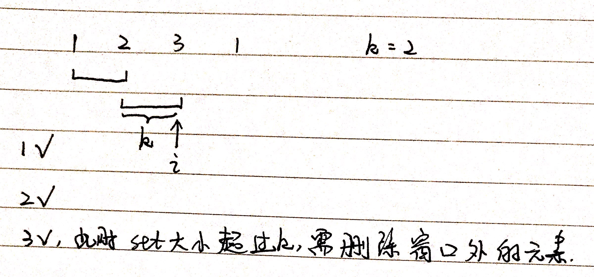

# 第219题 存在重复元素 II

## 1 题目

给定一个整数数组和一个整数 k，判断数组中是否存在两个不同的索引 i 和 j，使得 nums [i] = nums [j]，并且 i 和 j 的差的 绝对值 至多为 k。

示例 1:

```
输入: nums = [1,2,3,1], k = 3
输出: true
```

示例 2:

```
输入: nums = [1,0,1,1], k = 1
输出: true
```

示例 3:

```
输入: nums = [1,2,3,1,2,3], k = 2
输出: false
```

## 2 解法

### 2.1 HashMap

保存元素和索引。注意取出之前相等元素的索引时，如果不满足差的绝对值小于k，别急着返回，有可能在后面还有机会满足这个不等式，因此更新它的value即可。

```
class Solution {
    public boolean containsNearbyDuplicate(int[] nums, int k) {
        Map<Integer, Integer> map = new HashMap<>();

        int len = nums.length;

        for (int i = 0; i < len; i++) {
            int item = nums[i];

            if (!map.containsKey(item)) {
                map.put(item, i);
                continue;
            }

            int j = map.get(item);

            if (Math.abs(i - j) <= k) {
                return true;
            } else {
                map.put(item, i);
            }
        }

        return false;
    }
}
```

复杂度分析：

1. 时间复杂度：顺序扫描花费**O(n)**；
2. 空间复杂度：额外的哈希表空间花费**O(n)**。

### 2.2 HashSet

因为题目要求i和j的差的绝对值不超过k，因此可以维护一个大小不超过k的窗口。意思就是，即使出现相同元素，但它们之间的索引之差大于k，那也没用，所以干脆限制窗口大小为k，只保存k以内的元素即可。如果超过k，就删除窗口外的那个元素。

```
class Solution {
    public boolean containsNearbyDuplicate(int[] nums, int k) {
        int len = nums.length;

        Set<Integer> set = new HashSet<>();

        for (int i = 0; i < len; i++) {
            int item = nums[i];

            // 如果添加失败，说明已有相同元素
            if (!set.add(item)) {
                return true;
            }

            // 如果添加后set大小超过k，就删除窗口外元素
            if (set.size() > k) {
                set.remove(nums[i - k]);
            }
        }

        return false;
    }
}
```



复杂度分析：

1. 时间复杂度：顺序扫描花费**O(n)**；
2. 空间复杂度：开辟的额外空间取决于HashSet中存储的元素的个数，也就是滑动窗口的大小**O(min(n, k))**。

