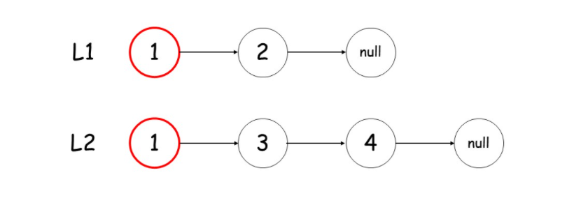
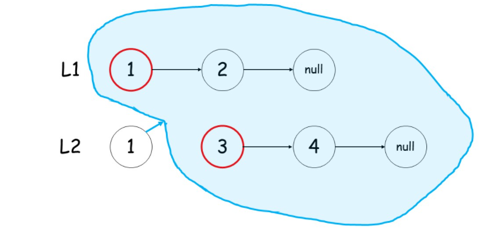

# 第21题 合并两个有序链表

## 1 题目

将两个升序链表合并为一个新的 升序 链表并返回。新链表是通过拼接给定的两个链表的所有节点组成的。 

示例 1：

```
输入：l1 = [1,2,4], l2 = [1,3,4]
输出：[1,1,2,3,4,4]
```

示例 2：

```
输入：l1 = [], l2 = []
输出：[]
```

示例 3：

```
输入：l1 = [], l2 = [0]
输出：[0]
```

**提示：**

- 两个链表的节点数目范围是 `[0, 50]`
- `-100 <= Node.val <= 100`
- `l1` 和 `l2` 均按 **非递减顺序** 排列

## 2 解法

### 2.1 迭代

上下指针分别搜索两个链表。当l1链表的结点值较小时，不必在res链表的后继结点处new一个结点，而是直接将res的指针指向此时的l1结点及其后续链表即可，能够节省一些new的操作。到最后其中一个链表遍历完以后，不必再逐个遍历另一个链表的其余结点，而是直接将指针指向另一个链表即可。

```c++
/**
 * Definition for singly-linked list.
 * struct ListNode {
 *     int val;
 *     ListNode *next;
 *     ListNode() : val(0), next(nullptr) {}
 *     ListNode(int x) : val(x), next(nullptr) {}
 *     ListNode(int x, ListNode *next) : val(x), next(next) {}
 * };
 */
class Solution {
public:
    ListNode* mergeTwoLists(ListNode* l1, ListNode* l2) {
        if (l1 == nullptr) {
            return l2;
        } else if (l2 == nullptr) {
            return l1;
        }

        ListNode* dummy = new ListNode(-1);
        ListNode* newList = dummy;

        while (l1 != nullptr && l2 != nullptr) {
            if (l1->val <= l2->val) {
                newList->next = l1;
                l1 = l1->next;
            } else {
                newList->next = l2;
                l2 = l2->next;
            }
            newList = newList->next;
        }

        newList->next = (l1 == nullptr) ? l2 : l1;
        
        return dummy->next;
    }
};
```

复杂度分析：

1. 时间复杂度：设两个链表的长度为m和n，则最坏情况下需要遍历这两个链表的所有结点，故时间复杂度为**O(m + n)**；
2. 空间复杂度：仅用到常数个额外空间，故空间复杂度为**O(1)**。

### 2.2 递归

判断l1和l2当前结点的值哪个更小，然后较小结点的next指针指向**其余结点的合并结果。**

图解：

1. 

2. 

3. 

4. 

5. 

6. 

7. 

8. 

```c++
/**
 * Definition for singly-linked list.
 * struct ListNode {
 *     int val;
 *     ListNode *next;
 *     ListNode() : val(0), next(nullptr) {}
 *     ListNode(int x) : val(x), next(nullptr) {}
 *     ListNode(int x, ListNode *next) : val(x), next(next) {}
 * };
 */
class Solution {
public:
    ListNode* mergeTwoLists(ListNode* l1, ListNode* l2) {
        if (l1 == nullptr) {
            return l2;
        } else if (l2 == nullptr) {
            return l1;
        }

        if (l1->val <= l2->val) {
            l1->next = mergeTwoLists(l1->next, l2);
            return l1;
        } else {
            l2->next = mergeTwoLists(l1, l2->next);
            return l2;
        }
    }
};
```

复杂度分析：

1. 时间复杂度：给出一个递归算法，其时间复杂度O(T)，通常是递归调用的数量(记作R)和每一次操作的时间复杂度的乘积(表示为O(s))：O(T) = R * O(s)。在本题中，递归调用的数量为m + n，每一次操作仅仅进行了next指针的指向操作，因此总时间复杂度为**(m + n) * O(1) = O(m + n)**；

2. 空间复杂度：递归调用m + n次，使用了m + n个栈帧，因此总空间复杂度为**O(m + n)**。

   