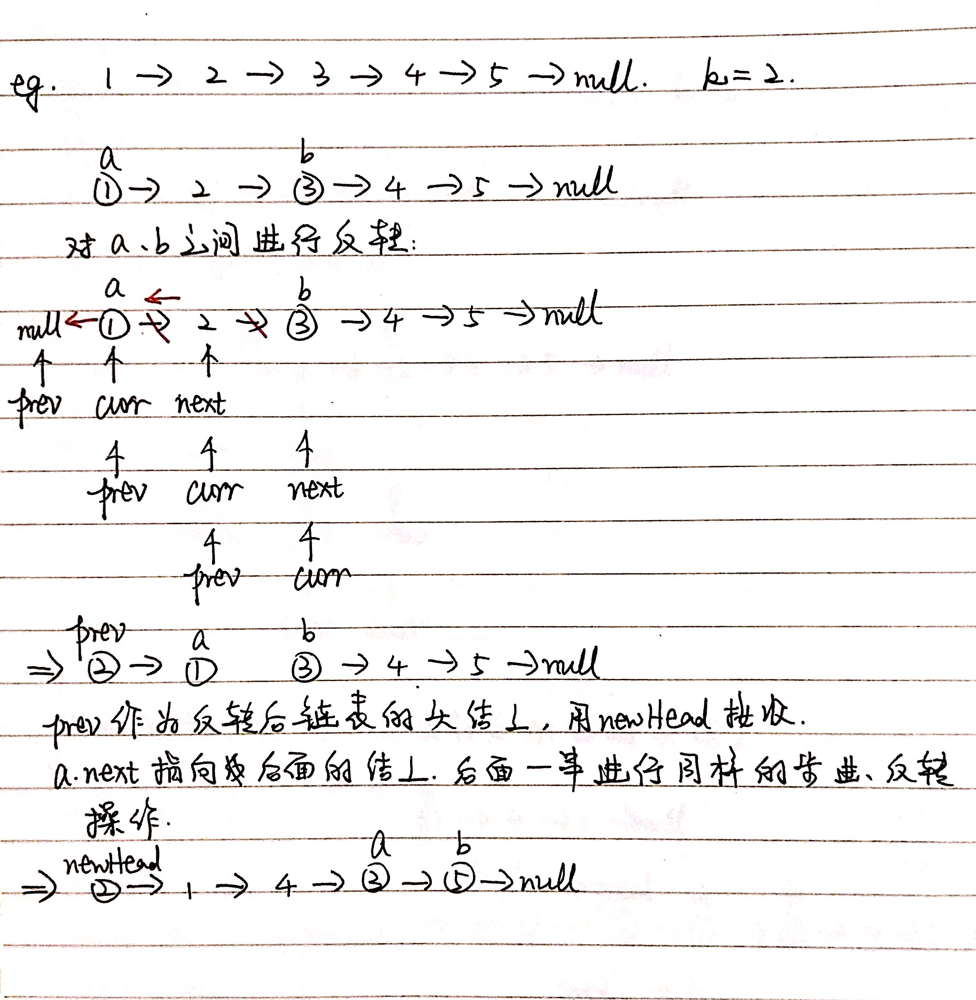
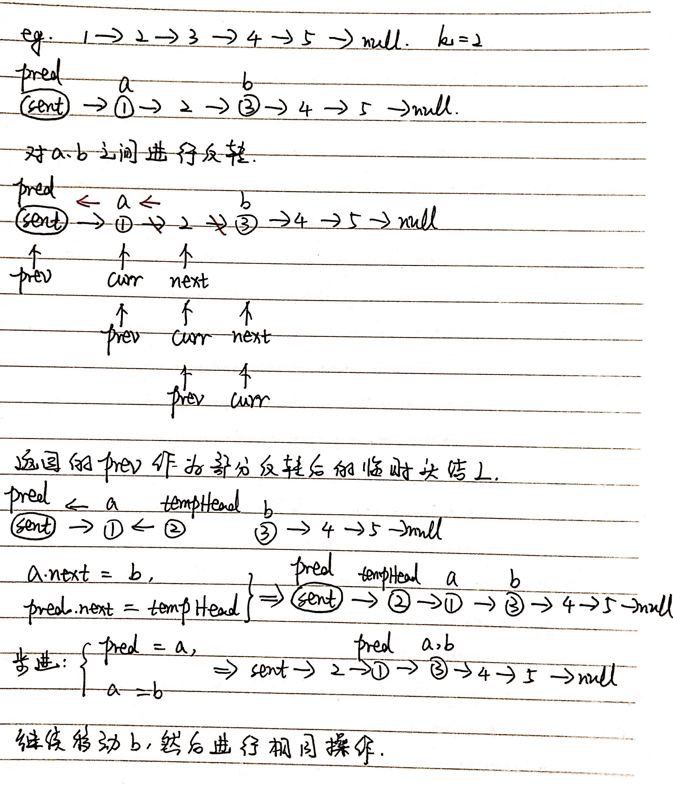

# 第25题 K个一组反转链表

## 1 题目

给你一个链表，每 k 个节点一组进行翻转，请你返回翻转后的链表。

k 是一个正整数，它的值小于或等于链表的长度。

如果节点总数不是 k 的整数倍，那么请将最后剩余的节点保持原有顺序。

示例 1：

```
输入：head = [1,2,3,4,5], k = 2
输出：[2,1,4,3,5]
```

示例 2：

```
输入：head = [1,2,3,4,5], k = 3
输出：[3,2,1,4,5]
```

示例 3：

```
输入：head = [1,2,3,4,5], k = 1
输出：[1,2,3,4,5]
```

示例 4：

```
输入：head = [1], k = 1
输出：[1]
```

## 2 解法

### 2.1 递归



```
/**
 * Definition for singly-linked list.
 * public class ListNode {
 *     int val;
 *     ListNode next;
 *     ListNode() {}
 *     ListNode(int val) { this.val = val; }
 *     ListNode(int val, ListNode next) { 
 *	       this.val = val; 
 *	       this.next = next; 
 *     }
 * }
 */
class Solution {
    public ListNode reverseKGroup(ListNode head, int k) {
        if (head == null) {
            return null;
        }

        ListNode a = head;
        ListNode b = head;

        for (int i = 0; i < k; i++) {
            // 如果不到k个，就不用反转
            if (b == null) {
                return head;
            }

            b = b.next;
        }

        ListNode newHead = reverseA2B(a, b);

        a.next = reverseKGroup(b, k);

        return newHead;
    }

    private ListNode reverseA2B(ListNode a, ListNode b) {
        ListNode prev = null;
        ListNode curr = a;

        while (curr != b) {
            ListNode nextNode = curr.next;
            curr.next = prev;
            prev = curr;
            curr = nextNode;
        }

        return prev;
    }
}
```

复杂度分析：

1. 时间复杂度：所有结点都被遍历了一遍，花费O(n)，最坏情况下有n个结点都完成了反转，而一次反转花费O(1)。具体而言，从起始结点a通过计数k找到结点b花费b - a的长度，再在[a, b)里完成反转也花费b - a的长度。如果在k范围内找不到b，则不需要反转。因此，总时间复杂度为**O(n)**；
2. 空间复杂度：每次递归占用b - a的栈空间，最坏情况下所有结点都参与反转，因此总空间复杂度为**O(n)**。

### 2.2 迭代



```
/**
 * Definition for singly-linked list.
 * public class ListNode {
 *     int val;
 *     ListNode next;
 *     ListNode() {}
 *     ListNode(int val) { this.val = val; }
 *     ListNode(int val, ListNode next) { 
 *	       this.val = val; 
 *	       this.next = next; 
 *     }
 * }
 */
class Solution {
    public ListNode reverseKGroup(ListNode head, int k) {
        ListNode sentinel = new ListNode(-1, head);

        ListNode a = head;
        ListNode b = head;

        ListNode predecessor = sentinel;

        while (b != null) {
            for (int i = 0; i < k; i++) {
                if (b == null) {
                    return sentinel.next;
                }

                b = b.next;
            }
            
            // 部分反转后的临时头结点
            ListNode tempHead = reverseA2B(a, b); 

            // 接上反转后的部分
            a.next = b;
            predecessor.next = tempHead; 

            // 步进
            predecessor = a;
            a = b;
        }

        return sentinel.next;
    }

    private ListNode reverseA2B(ListNode a, ListNode b) {
        ListNode prev = null;
        ListNode curr = a;

        while (curr != b) {
            ListNode nextNode = curr.next;
            curr.next = prev;
            prev = curr;
            curr = nextNode;
        }

        return prev;
    }
}
```

复杂度分析：

1. 时间复杂度：所有结点都被遍历了一遍，花费O(n)，最坏情况下有n个结点都完成了反转，而一次反转花费O(1)。具体而言，从起始结点a通过计数k找到结点b花费b - a的长度，再在[a, b)里完成反转也花费b - a的长度。如果在k范围内找不到b，则不需要反转。因此，总时间复杂度为**O(n)**；
2. 空间复杂度：仅用到常数个额外空间，故空间复杂度为**O(1)**。