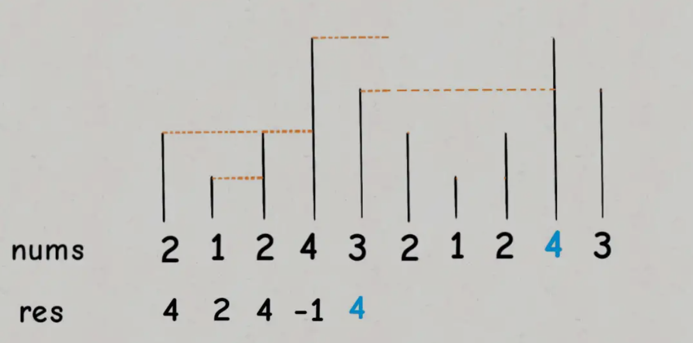

# 第503题 下一个更大元素 II

## 1 题目

给定一个循环数组（最后一个元素的下一个元素是数组的第一个元素），输出每个元素的下一个更大元素。数字 x 的下一个更大的元素是按数组遍历顺序，这个数字之后的第一个比它更大的数，这意味着你应该循环地搜索它的下一个更大的数。如果不存在，则输出 -1。

示例 1:

```
输入: [1,2,1]
输出: [2,-1,2]
解释: 第一个 1 的下一个更大的数是 2；
数字 2 找不到下一个更大的数； 
第二个 1 的下一个最大的数需要循环搜索，结果也是 2。
```

## 2 解法

单调栈。维护一个从栈顶到栈底的元素单调递增的栈。为了实现循环数组，可以"假装"让数组扩容一倍，因为要找**后一个**更大的值，所以**从后往前**遍历，通过mod 长度的操作不断取到数组内真正的元素。其余操作和普通队列+单调栈类似。



```c++
class Solution {
public:
    vector<int> nextGreaterElements(vector<int>& nums) {
        int len = nums.size();

        stack<int> monotonicStack;
        vector<int> res(len);

        for (int i = len * 2 - 1; i >= 0; --i) {
            int num = nums[i % len];
            while (!monotonicStack.empty()) {
                if (num >= monotonicStack.top()) {
                    monotonicStack.pop();
                } else {
                    break;
                }
            }
            int nextGreater = -1;
            if (!monotonicStack.empty()) {
                nextGreater = monotonicStack.top();
            }
            monotonicStack.push(num);
            res[i % len] = nextGreater;
        }

        return res;
    }
};
```

复杂度分析：

1. 时间复杂度：从后往前扫描数组，索引从2n-1开始，因此需要花费O(2n) = O(n)。其中，每个元素入栈1次(push操作花费O(1))，至多出栈1次(pop操作花费O(1))。故总时间复杂度为**O(n)**。

2. 空间复杂度：单调栈花费至多O(n)的空间，故总空间复杂度为**O(n)**。

