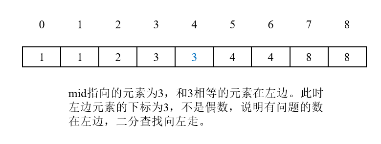
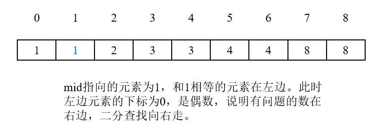
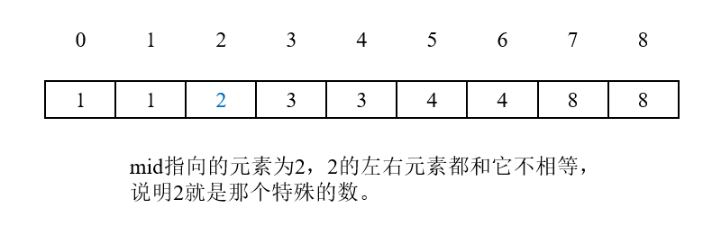
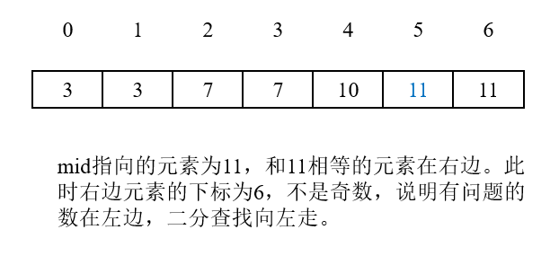
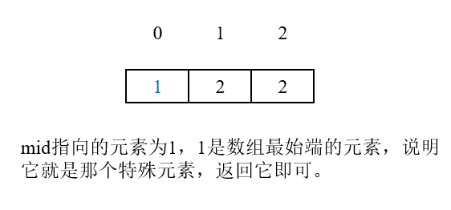
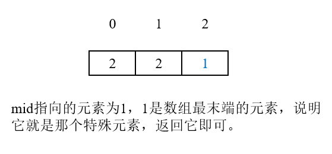

# 第540题 有序数组中的单一元素

## 1 题目

给定一个只包含整数的有序数组，每个元素都会出现两次，唯有一个数只会出现一次，找出这个数。

示例 1:

```
输入: [1,1,2,3,3,4,4,8,8]
输出: 2
```

示例 2:

```
输入: [3,3,7,7,10,11,11]
输出: 10
```

**注意:** 您的方案应该在O(log n)时间复杂度和O(1)空间复杂度中运行。

## 2 解法

要求O(log n)的时间复杂度，并且结合有序这一条件，考虑二分查找。

1. 如果和当前元素相等的元素出现在当前元素的左边，那么正常情况下，左边元素的下标应该为偶数，否则，说明有特殊的数插入；
2. 如果和当前元素相等的元素出现在当前元素的右边，那么正常情况下，右边元素的下标应该为奇数，否则，说明有特殊的数插入；
3. 如果当前元素左边和右边的元素都和它不相等，说明它就是那个只出现了一次的元素；
4. 如果当前元素已经是数组的最左边/最右边的元素，说明二分查找已经查到了尽头，此时当前元素就是那个只出现了一次的元素。

下图为图解：

1. 

2. 

3. 

4. 

5. 

6. 

```
class Solution {
    public int singleNonDuplicate(int[] nums) {
        if (nums == null) {
            return -1;
        }

        int len = nums.length;

        int left = 0;
        int right = len - 1;

        while (left <= right) {
            int mid = left + (right - left) / 2;

            if (mid == 0 || mid == (len - 1)) {
                return nums[mid];
            } 

            if (nums[mid - 1] == nums[mid]) {
                if ((mid - 1) % 2 != 0) {
                    right = mid - 1;
                } else {
                    left = mid + 1;
                }

                continue;
            }

            if (nums[mid] == nums[mid + 1]) {
                if ((mid + 1) % 2 == 0) {
                    right = mid - 1;
                } else {
                    left = mid + 1;
                }

                continue;
            }

            return nums[mid];
        }

        return -1;
    }
}
```

复杂度分析：

1. 时间复杂度：二分查找花费**O(logn)**；
2. 空间复杂度：仅用到常数个额外空间，故空间复杂度为**O(1)**。