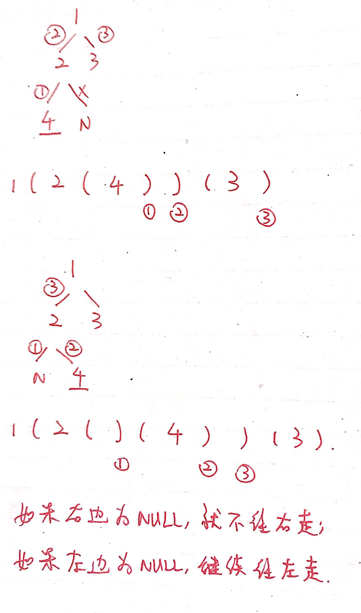

# 第606题 根据二叉树创建字符串

## 1 题目

你需要采用前序遍历的方式，将一个二叉树转换成一个由括号和整数组成的字符串。

空节点则用一对空括号 "()" 表示。而且你需要省略所有不影响字符串与原始二叉树之间的一对一映射关系的空括号对。

示例 1:

输入: 二叉树: [1,2,3,4]

```
     1
   /   \
  2     3
 /    
4     
```

输出: "1(2(4))(3)"

解释: 原本将是“1(2(4)())(3())”，
在你省略所有不必要的空括号对之后，
它将是“1(2(4))(3)”。
示例 2:

输入: 二叉树: [1,2,3,null,4]

```
   1
 /   \
2     3
 \  
  4 
```

输出: "1(2()(4))(3)"

解释: 和第一个示例相似，
除了我们不能省略第一个对括号来中断输入和输出之间的一对一映射关系。

## 2 解法



```c++
/**
 * Definition for a binary tree node.
 * struct TreeNode {
 *     int val;
 *     TreeNode *left;
 *     TreeNode *right;
 *     TreeNode() : val(0), left(nullptr), right(nullptr) {}
 *     TreeNode(int x) : val(x), left(nullptr), right(nullptr) {}
 *     TreeNode(int x, TreeNode *left, TreeNode *right) : val(x), left(left), right(right) {}
 * };
 */
class Solution {
public:
    string tree2str(TreeNode* root) {
        if (root == nullptr) {
            return "";
        }
        if (root->left == nullptr && root->right == nullptr) {
            return to_string(root->val);
        }
        if (root->right == nullptr) {
            return to_string(root->val) + "(" + tree2str(root->left) + ")";
        } else {
            return to_string(root->val) + 
                   "(" + tree2str(root->left) + ")" +
                   "(" + tree2str(root->right) + ")";
        }
    }
};
```

复杂度分析：

1. 时间复杂度：每个结点都被访问一遍，故时间复杂度为**O(n)**；
2. 空间复杂度：递归栈空间为二叉树的深度，故空间复杂度为**O(logn)**，最坏情况下二叉树退化为链表，空间复杂度为O(n)。
