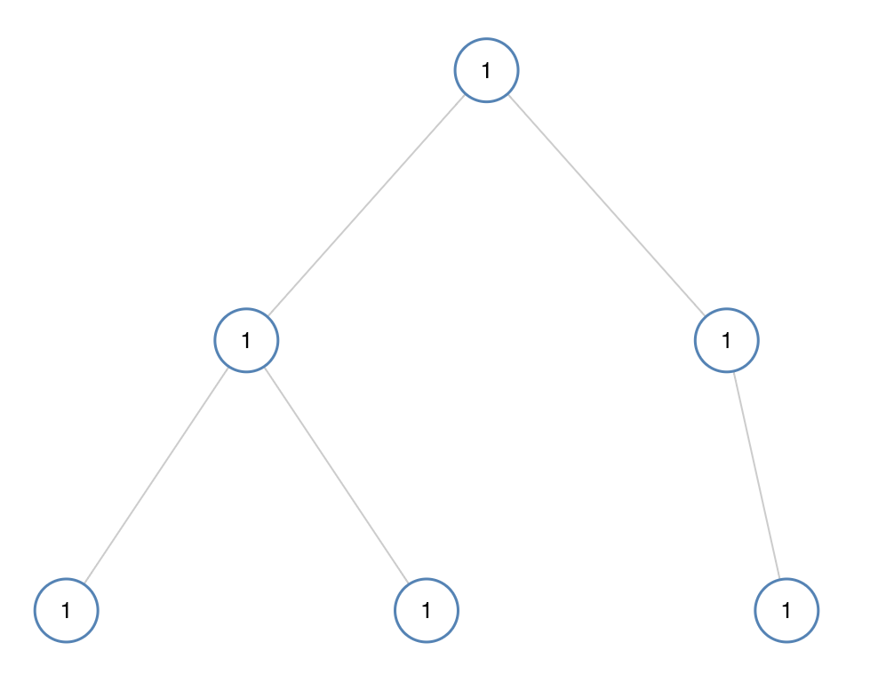
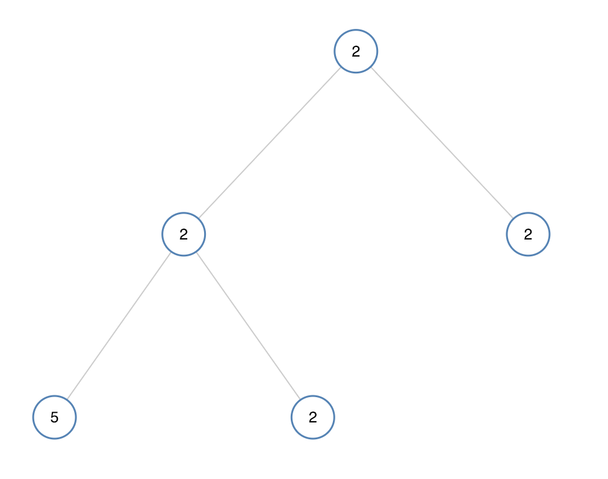

# 第965题 单值二叉树

## 1 题目

如果二叉树每个节点都具有相同的值，那么该二叉树就是单值二叉树。

只有给定的树是单值二叉树时，才返回 true；否则返回 false。

示例 1：



输入：[1,1,1,1,1,null,1]
输出：true
示例 2：



输入：[2,2,2,5,2]
输出：false

## 2 解法

### 2.1 递归

base case：如果左右子树都为null，则直接返回true；

如果左子树为null，则直接递归右子树的情况，否则，先比较当前结点和左子树的值的关系，然后递归左子树；

右子树的情况即相反；

最后，把两部分的结果合并。

```
/**
 * Definition for a binary tree node.
 * public class TreeNode {
 *     int val;
 *     TreeNode left;
 *     TreeNode right;
 *     TreeNode(int x) { val = x; }
 * }
 */
class Solution {
    public boolean isUnivalTree(TreeNode root) {
        if (root.left == null && root.right == null) {
            return true;
        }

        boolean leftRes = (root.left == null) ? 
                isUnivalTree(root.right) : 
                (root.val == root.left.val) && 
                isUnivalTree(root.left); 

        boolean rightRes = (root.right == null) ?
                isUnivalTree(root.left) : 
                (root.val == root.right.val && 
                isUnivalTree(root.right));

        return leftRes && rightRes;            
    }
}
```

复杂度分析：

1. 时间复杂度：每个结点都被递归一次，故时间复杂度为**O(n)**；
2. 空间复杂度：递归空间复杂度为递归树深度，故空间复杂度为**O(logn)**，最坏情况下树退化为链表，空间复杂度为O(n)。其中，n为树的结点总个数。

### 2.2 迭代

层序遍历。

```
/**
 * Definition for a binary tree node.
 * public class TreeNode {
 *     int val;
 *     TreeNode left;
 *     TreeNode right;
 *     TreeNode(int x) { val = x; }
 * }
 */
class Solution {
    public boolean isUnivalTree(TreeNode root) {
        int ref = root.val;

        Queue<TreeNode> queue = new LinkedList<>();

        queue.offer(root);

        while (!queue.isEmpty()) {
            TreeNode dequeNode = queue.poll();

            if (dequeNode.val != ref) {
                return false;
            }

            if (dequeNode.left != null) {
                queue.offer(dequeNode.left);
            }

            if (dequeNode.right != null) {
                queue.offer(dequeNode.right);
            }
        }

        return true;
    }
}
```

复杂度分析：

1. 时间复杂度：每个结点入队、出队一次，故时间复杂度为**O(n)**；
2. 空间复杂度：

