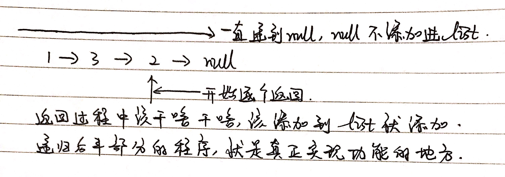

# 剑指 Offer 06. 从尾到头打印链表

## 1 题目

输入一个链表的头节点，从尾到头反过来返回每个节点的值（用数组返回）。

示例：

```
输入：head = [1,3,2]
输出：[2,3,1]
```

## 2 解法



```
/**
 * Definition for singly-linked list.
 * public class ListNode {
 *     int val;
 *     ListNode next;
 *     ListNode(int x) { val = x; }
 * }
 */
class Solution {
    List<Integer> list = new ArrayList<>();

    public int[] reversePrint(ListNode head) {
        if (head == null) {
            return new int[0];
        }

        pushList(head);

        int listSize = list.size();
        int[] res = new int[listSize];

        for (int i = 0; i < listSize; i++) {
            res[i] = list.get(i);
        }

        return res;
    }

    private void pushList(ListNode head) {
        if (head == null) {
            return;
        }

        pushList(head.next);

        list.add(head.val);

        return;
    }
}
```

复杂度分析：

1. 时间复杂度：每个结点完成反转操作花费O(1)，被添加到List中花费O(1)，故完成反转操作共花费O(n)。从List中输出元素至数组中共花费O(n)。故总时间复杂度为**O(n)**；
2. 空间复杂度：List花费O(n)空间，数组花费O(n)空间，故总空间复杂度为**O(n)**。